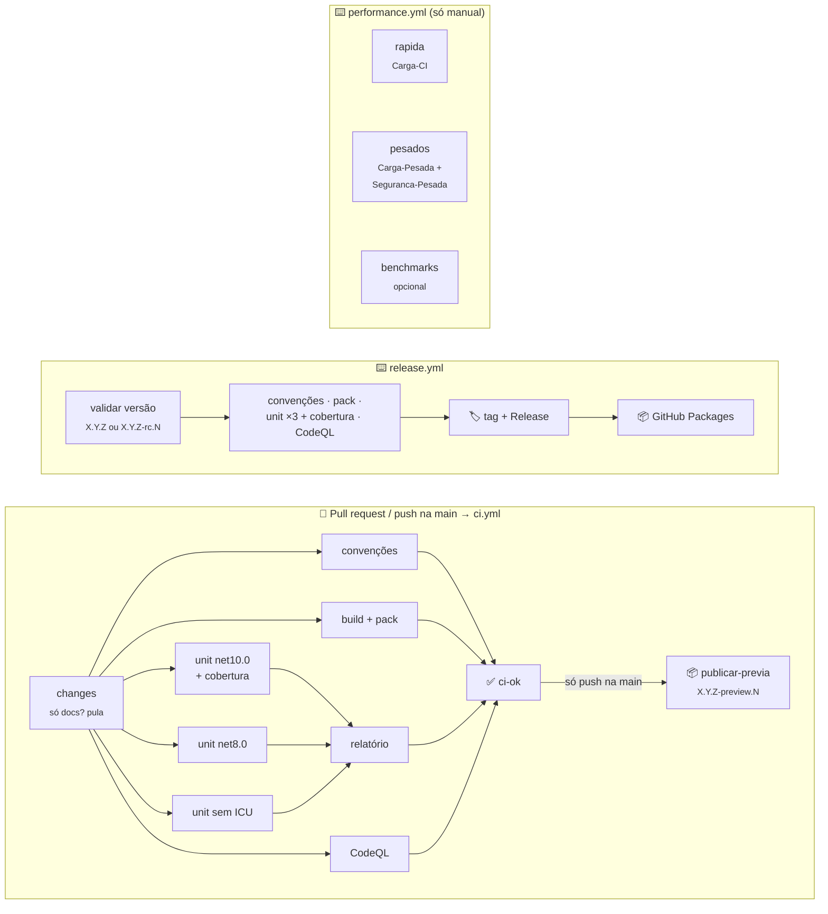

[🏠 TEC.Core](../../README.md) › [📚 Documentação](../../docs/README.md) › CI/CD

# ⚙️ CI/CD e publicação

> Os workflows do TEC.Core são curtos: chamam os workflows reutilizáveis do **[tudoemcodigo/tec-workflows](https://github.com/tudoemcodigo/tec-workflows)** com os parâmetros deste componente. O pacote `TEC.Core` é publicado no GitHub Packages (`https://nuget.pkg.github.com/tudoemcodigo/index.json`) de dois jeitos: a prévia `<Version>-preview.N` sai sozinha a cada push na `main` (CI verde) e as versões estáveis ou `-rc.N` saem pelo workflow **Publicar versão**.

## 📑 Sumário

- [📂 Arquivos](#-arquivos)
- [🗺️ Fluxo](#️-fluxo)
- [🎯 O que roda em cada evento](#-o-que-roda-em-cada-evento)
- [🧱 Jobs do CI](#-jobs-do-ci)
- [🚀 Publicando uma versão](#-publicando-uma-versão)
- [🏎️ Performance (manual)](#️-performance-manual)
- [🔑 Variables e Secrets](#-variables-e-secrets)
- [🤖 Dependabot e auditoria](#-dependabot-e-auditoria)
- [🩺 Solução de problemas](#-solução-de-problemas)
- [✅ Checklist de release](#-checklist-de-release)

---

## 📂 Arquivos

| Arquivo | Nome no Actions | Chama | Função |
|---|---|---|---|
| [`ci.yml`](ci.yml) | **CI** | `dotnet-ci.yml@v1` | Validação de PR, merge queue, push na `main`, semanal e manual. No push na `main`, publica a prévia `<Version>-preview.N` |
| [`release.yml`](release.yml) | **Publicar versão** | `dotnet-release.yml@v1` | Versão estável ou `-rc.N`: convenções, pack, unitários ×3 + cobertura e CodeQL, depois tag, Release e push no feed |
| [`performance.yml`](performance.yml) | **Performance** | `dotnet-test.yml@v1` e `dotnet-benchmark.yml@v1` | Só manual: carga rápida (`Carga-CI`) e/ou suítes pesadas; benchmarks opcionais |
| [`../dependabot.yml`](../dependabot.yml) | — | — | Atualizações semanais de NuGet e actions (canônico) |
| [`../zizmor.yml`](../zizmor.yml) | — | — | Auditoria de segurança dos workflows (canônico) |

Parâmetros deste componente:

| Entrada | `ci.yml` | `release.yml` | Valor |
|---|:---:|:---:|---|
| `solution` | ✅ | ✅ | `TEC.Core.slnx` |
| `unit-tests` | ✅ | ✅ | `TEC.Core.Tests` (sem filtro: os pesados são `[Explicit]` e ficam de fora) |
| `version` | — | ✅ | Digitada no disparo: `X.Y.Z` ou `X.Y.Z-rc.N` |
| `integration-tests`, `private-feed`, `azure-*` | — | — | Não usados: o TEC.Core não tem integração nem depende de outro TEC.* |

Os testes de carga (`TEC.Core.LoadTests`) e os `Seguranca-Pesada` ficam só no `performance.yml` (manual): tempo de parede
em runner compartilhado é ruidoso e não pode bloquear PR nem versão.

---

## 🗺️ Fluxo

Tudo roda **em paralelo** depois do `changes`: a espera é a do job mais lento.

---

## 🎯 O que roda em cada evento

| Evento | Workflow | O que roda | Publica? |
|---|---|---|:---:|
| `pull_request` para `main` | `ci.yml` | Todos os jobs do CI em paralelo | ❌ |
| PR só com `docs/**`, `LICENSE`, `CHANGELOG.md` ou READMEs de `samples/`/`.github/` | `ci.yml` | Só `changes` e `ci-ok` (segundos). O `README.md` da raiz vai no pacote e dispara tudo | ❌ |
| `merge_group` | `ci.yml` | Igual ao PR | ❌ |
| `push` na `main` (merge) | `ci.yml` | CI completo e, com `ci-ok` verde, `publicar-previa` | ✅ `<Version>-preview.N` |
| `schedule` segunda 06:00 UTC | `ci.yml` | CI completo: CodeQL com consultas novas, vulnerabilidades novas em dependências | ❌ |
| `workflow_dispatch` | `ci.yml` | CI completo | ❌ |
| `workflow_dispatch` (**Performance**) | `performance.yml` | Input `suite`: `pesadas` (padrão: `Carga-Pesada` + `Seguranca-Pesada`), `rapida` (`Carga-CI`) ou `todas`; parâmetros e, opcionalmente, benchmarks | ❌ |
| **Publicar versão** (manual) | `release.yml` | Convenções, pack, unitários ×3 + cobertura e CodeQL → tag + Release → feed | ✅ `X.Y.Z` ou `-rc.N` |

Os testes de carga não rodam no PR, no push nem na publicação: só no `performance.yml`, sob demanda. Um push novo no
PR cancela a execução anterior (`concurrency` por ref); fora de PR, cada execução tem o próprio grupo, e nenhum push na `main` perde a prévia. O `release.yml` usa o grupo `publicar-versao` e nunca cancela uma execução em andamento; o `performance.yml` também não cancela.

---

## 🧱 Jobs do CI

| Job | O que faz |
|---|---|
| `changes` | Lista os arquivos do PR; se forem só documentação, os demais jobs são pulados |
| `convenções` | Compara os arquivos canônicos com o `template/` do tec-workflows e valida os csproj (sem `Version`, sem `PackageReference` para TEC.*) |
| `build + pack` | `restore --locked-mode`, build **Release** da solução inteira (avisos como erro; benchmarks e samples continuam compilando) e `dotnet pack` com *package validation* |
| `unit net10.0` | `TEC.Core.Tests` com cobertura |
| `unit net8.0` | `TEC.Core.Tests` no runtime .NET 8 |
| `unit sem ICU` | `TEC.Core.Tests` com `DOTNET_SYSTEM_GLOBALIZATION_INVARIANT=1` |
| `relatório` | Junta os `.trx` (aprovados, falhas, pulados com motivo) e a cobertura no resumo da execução |
| `CodeQL` | C# `security-extended`; alertas de severidade ≥ 7,0 falham o job |
| `ci-ok` | Falha se algum job falhou ou foi cancelado. **Check obrigatório da proteção da `main`** (`ci / ci-ok`) |
| `publicar-previa` | Só no push na `main`, depois do `ci-ok` verde: publica `<Version do Directory.Build.props>-preview.N` (N sequencial por versão, reinicia a cada nova `<Version>`; ex.: `0.0.1-preview.3`) no feed. Se a tag `v<Version>` já existe, é pulado: o `build + pack` avisa com um `::notice::` e nenhuma prévia sai (suba a `<Version>` para voltar a gerar prévias) |

---

## 🚀 Publicando uma versão

Fluxo: PR → merge na `main` → prévia automática (`<Version>-preview.N`, ex.: `0.0.1-preview.3`); versão
estável ou release candidate → **Publicar versão**:

1. GitHub → **Actions** → **Publicar versão** → **Run workflow** (branch `main`).
2. Digite a versão: `0.0.1`/`1.1.0` (estável) ou `1.1.0-rc.1` (release candidate). Prévias não são digitadas aqui:
   saem do CI a cada push na `main`.
3. **Run workflow**.
4. Depois de publicar `X.Y.Z`, suba a `<Version>` do `Directory.Build.props` para a próxima (PR normal) quando quiser
   novas prévias: com a tag `v<Version>` existente, o CI da `main` valida tudo normalmente, mas não gera prévia. O
   TEC.Core pode ficar em `0.0.1` de propósito e ainda receber correções de build e documentação.

O workflow valida a versão (SemVer, a partir da `main`, tag inexistente), roda os portões em paralelo (convenções, pack, unitários ×3 com relatório de cobertura, CodeQL), cria a tag `vX.Y.Z` e o Release (notas automáticas, `.nupkg` e `.snupkg` anexados; `-rc.N` vira *pre-release*) e **só então** publica no feed com o `GITHUB_TOKEN`. Se algo falhar antes, nada é criado. Falha no push do feed: **Re-run failed jobs**. Testes de carga não são portão da publicação (rode o **Performance** antes, se quiser os números).

| Mudança | Exemplo | Incremento |
|---|---|---|
| Quebra de API pública ou de formato de dados cifrados / hash | Remover método, mudar o formato AES-GCM | **MAJOR** |
| Funcionalidade nova compatível | Novo validador de documento | **MINOR** |
| Correção | Bug no cálculo de dia útil | **PATCH** |

Enquanto a versão for `0.x`, mudanças incompatíveis podem sair em MINOR (destacadas no CHANGELOG).

### Primeira publicação (0.0.1)

O TEC.Core é o **primeiro** da ordem de publicação (Core → Vault → Cqrs → Security → Observability → ORM):

1. `packages.lock.json` em modo pacote commitado (no TEC.Core é o mesmo nos dois modos) e `ci-ok` verde na `main`.
2. **Publicar versão** → `0.0.1`.
3. *Packages* → `TEC.Core` → *Package settings*: visibilidade **Public** e acesso dos repositórios da organização (um pacote nasce privado; até lá o CI dos outros componentes recebe `401/403`).
4. `<Version>` do `Directory.Build.props` → `0.0.2` (as próximas prévias saem como `0.0.2-preview.N`).

---

## 🏎️ Performance (manual)

Só sob demanda: *Actions* → **Performance** → *Run workflow*. Não há agendamento, e nada daqui roda no PR ou na
publicação: tempo de parede em runner compartilhado é ruidoso e não pode bloquear PR nem versão.

| Entrada | Padrão | Variável | Efeito |
|---|---|---|---|
| `suite` | `pesadas` | — | `pesadas` (job `pesados`), `rapida` (job `rapida`, `Carga-CI`) ou `todas` |
| `soak_segundos` | `600` | `TEC_CARGA_SOAK_SEGUNDOS` | Duração do soak em processo |
| `api_segundos` | `120` | `TEC_CARGA_API_SEGUNDOS` | Carga sustentada na API de exemplo |
| `csv_linhas` | `2000000` | `TEC_CARGA_CSV_LINHAS` | Linhas do teste de volume de CSV |
| `aes_mb` | `1024` | `TEC_CARGA_AES_MB` | Megabytes do AES-GCM em stream |
| `benchmarks` | `false` | — | Roda também os benchmarks (`net8.0` × `net10.0`) |
| `benchmark_filtro` | `*` | — | Filtro do BenchmarkDotNet (ex.: `*Csv*`) |

| Job | Conteúdo | Limite |
|---|---|---|
| `rapida` | `TEC.Core.LoadTests [Carga-CI]` (concorrência e fumaça da API de exemplo, segundos); artifact `carga` (`suite` = `rapida` ou `todas`) | — |
| `pesados` | `TEC.Core.LoadTests [Carga-Pesada]` + `TEC.Core.Tests [Seguranca-Pesada]`; relatórios `carga.md` no resumo e no artifact `pesados` (`suite` = `pesadas` ou `todas`) | 120 min |
| `benchmarks` | `TEC.Core.Benchmarks` com relatório no resumo (só quando `benchmarks = true`) | — |

Detalhes das suítes em [docs/testes.md](../../docs/testes.md).

---

## 🔑 Variables e Secrets

O TEC.Core **não precisa de nenhuma Variable ou Secret próprio**: não tem integração com Azure nem depende de outro TEC.*. Publicação e leitura usam o `GITHUB_TOKEN` efêmero.

| Nome | Tipo | Onde | Uso |
|---|---|---|---|
| `PACKAGES_READ_TOKEN` | Secret **do Dependabot** | Organização | PAT classic `read:packages` para o Dependabot consultar o feed `tec-interno` (configuração comum a todos os componentes) |

Configuração única do repositório:

| Recurso | Onde |
|---|---|
| Workflows centrais | `tudoemcodigo/tec-workflows` **público** com a tag `v1` |
| Proteção da `main` | *Settings → Rules → Rulesets*: exigir PR, check **`ci / ci-ok`**, branch atualizada (ou merge queue), bloquear push direto e force push |
| Acesso ao pacote | *Packages* → `TEC.Core` → *Package settings* → *Manage Actions access*: **Write** para este repositório (depois que o pacote existe) |

Permissões dos workflows: padrão `contents: read`; `contents: write`/`packages: write` no `release.yml` e `packages: write` no `ci.yml` (usado só pelo `publicar-previa`, no push na `main`); `id-token: write` é exigido pela assinatura do workflow de testes reutilizável (Azure OIDC), mas não é usado aqui.

---

## 🤖 Dependabot e auditoria

| Ecossistema | Frequência | Agrupamento |
|---|---|---|
| NuGet | Semanal (segunda), cooldown de 7 dias | Um PR com todas as minor/patch; major em PRs separados |
| GitHub Actions | Semanal (segunda), cooldown de 7 dias | Workflows centrais num único PR |

Actions de terceiros ficam fixadas por SHA no `tec-workflows`; os workflows da organização usam a tag `v1`. O `zizmor` audita os workflows (`uvx zizmor .`).

---

## 🩺 Solução de problemas

PR travado em "Expected — Waiting for status to be reported" no <code>ci / ci-ok</code>

**Causa:** o check obrigatório tem outro nome ou o `ci.yml` não rodou. **Solução:** confira o nome exato `ci / ci-ok` no ruleset e se o PR é para a `main`.

<code>workflow was not found</code> / <code>Unable to resolve action tudoemcodigo/tec-workflows</code>

**Causa:** o `tec-workflows` está privado (repositório público não usa workflow de privado) ou a tag `v1` não existe. **Solução:** veja [Variables e Secrets](#-variables-e-secrets).

<code>A tag vX.Y.Z já existe</code>

Escolha a próxima versão: versões publicadas não podem ser sobrescritas.

Push na <code>main</code> não gerou prévia

A `<Version>` do `Directory.Build.props` já foi lançada (a tag `v<Version>` existe). O CI não falha: valida tudo
(convenções, build + pack, unitários, CodeQL, `ci-ok`), o `build + pack` emite o aviso *"A versão X já foi publicada
(tag vX): nenhuma prévia gerada..."* e o `publicar-previa` é pulado. É o esperado quando o componente fica numa versão
publicada e recebe só correções. Para voltar a gerar prévias, abra um PR subindo a `<Version>` para a próxima (ex.:
`0.0.1` → `0.0.2`).

<code>NU1004</code> ou <code>NU1901</code>–<code>NU1904</code> no restore

`NU1004`: lock file desatualizado (`dotnet restore TEC.Core.slnx --force-evaluate` e commit). `NU190x`: vulnerabilidade conhecida; atualize o pacote ou aguarde o PR do Dependabot. Veja [docs/desenvolvimento.md](../../docs/desenvolvimento.md#lock-files).

<code>403 Forbidden</code> no push do pacote

Em *Package settings*, dê acesso **Write** ao repositório.

Falha só no job <code>unit sem ICU</code>

Código dependente de cultura: use `BrazilianCulture.Instance` e reproduza com `DOTNET_SYSTEM_GLOBALIZATION_INVARIANT=1 dotnet test --project TEC.Core.Tests -f net10.0`.

---

## ✅ Checklist de release

- [ ] `ci-ok` verde no último PR mesclado.
- [ ] [CHANGELOG](../../CHANGELOG.md) com a seção da versão e as mudanças incompatíveis destacadas.
- [ ] Incremento SemVer coerente com as mudanças.
- [ ] Mudanças de formato (AES-GCM, híbrida, hash PBKDF2) mantêm a leitura de dados antigos ou estão documentadas como incompatíveis.
- [ ] `docs/` atualizado.
- [ ] **Publicar versão** concluído; pacote em *Packages* e anexos no Release.
- [ ] Depois de uma versão `X.Y.Z`, `<Version>` do `Directory.Build.props` subida para a próxima.

---

[🏠 README](../../README.md) · [📚 Documentação](../../docs/README.md) · [⚙️ tec-workflows](https://github.com/tudoemcodigo/tec-workflows)
