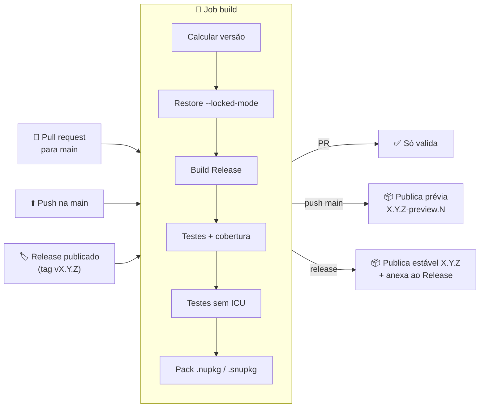
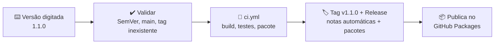

# ⚙️ CI/CD e publicação

[⬅ README](../../README.md) · [Documentação](../../docs/README.md)

Pipeline do GitHub Actions que compila, testa, mede a cobertura e publica o **TEC.Core** no GitHub Packages (`https://nuget.pkg.github.com/tudoemcodigo/index.json`).

---

## 📑 Sumário

- [Arquivos](#-arquivos)
- [Visão geral do fluxo](#-visão-geral-do-fluxo)
- [Gatilhos](#-gatilhos)
- [Versionamento automático](#-versionamento-automático)
- [Jobs e etapas](#-jobs-e-etapas)
- [Lançando uma versão](#-lançando-uma-versão)
- [Cobertura de testes](#-cobertura-de-testes)
- [Dependabot](#-dependabot)
- [Segurança do pipeline](#-segurança-do-pipeline)
- [Solução de problemas](#-solução-de-problemas)
- [Checklist de release](#-checklist-de-release)

---

## 📂 Arquivos

| Arquivo | Função |
|---|---|
| [`ci.yml`](ci.yml) | Build, testes, cobertura, pacote e publicação (prévias e release manual) |
| [`release.yml`](release.yml) | **Publicar versão**: você digita a versão; ele testa, cria a tag e o Release e só então publica |
| [`codeql.yml`](codeql.yml) | Análise estática de segurança (CodeQL, C#) em PRs, na `main` e semanalmente |
| [`../dependabot.yml`](../dependabot.yml) | Atualização semanal de pacotes NuGet e actions |

---

## 🗺️ Visão geral do fluxo



---

## 🎯 Gatilhos

| Evento | Build e testes | Publica? | Versão gerada |
|---|:---:|:---:|---|
| `pull_request` para `main` | ✅ | ❌ | `X.Y.(Z+1)-preview.N`, mesma regra do push (apenas interna, não publicada) |
| `push` na `main` | ✅ | ✅ prévia | `X.Y.(Z+1)-preview.N` |
| `release` publicado | ✅ | ✅ estável | `X.Y.Z` (da tag) |
| `workflow_dispatch` (manual) | ✅ | ❌ | `X.Y.(Z+1)-preview.N` |
| **Publicar versão** (`release.yml`) | ✅ | ✅ estável (pelo próprio `release.yml`, após criar a tag) | A versão digitada |

> [!NOTE]
> Pushes que alteram **apenas** `docs/**` ou `LICENSE` não disparam o pipeline. Alterações no `README.md` disparam, porque ele vai dentro do pacote.

Em pull requests, uma execução nova cancela a anterior do mesmo PR (`concurrency`). Na `main` e em releases nada é cancelado, para não interromper uma publicação.

---

## 🏷️ Versionamento automático

A versão **nunca** é editada à mão para publicar: ela vem das tags Git. O `<Version>` do `.csproj` serve só para builds locais e como base enquanto não existir nenhuma tag.

| Situação | Última tag estável | Execução nº | Versão |
|---|---|:---:|---|
| Release `v1.2.0` | — | — | `1.2.0` |
| Release `v1.3.0-rc.1` | — | — | `1.3.0-rc.1` |
| Push na `main` | `v1.2.0` | 57 | `1.2.1-preview.57` |
| Push na `main` | *(nenhuma)* | 3 | `0.0.1-preview.3` (base = `<Version>` do csproj) |

Regras:

- A tag do Release precisa seguir **`vX.Y.Z`** ou **`vX.Y.Z-sufixo`** (SemVer) e apontar para um commit que já está na `main`; caso contrário o job falha antes de compilar.
- A versão calculada (inclusive a prévia, cuja base vem da última tag) é sempre validada como SemVer e chega aos passos por variável de ambiente, nunca interpolada no texto do script.
- Tags de pré-release (`v1.3.0-rc.1`) são **ignoradas** no cálculo das prévias da `main`.
- `N` é o `github.run_number`, sempre crescente; por isso uma prévia nova sempre é "maior" que a anterior.
- ⚠️ Uma prévia `1.2.1-preview.N` é **menor** que `1.2.1`. Depois de lançar `v1.2.1`, as prévias passam automaticamente para `1.2.2-preview.N`.

---

## 🧱 Jobs e etapas

### Job `build` (sempre executa)

| # | Etapa | Detalhe |
|:-:|---|---|
| 1 | Checkout | `fetch-depth: 0`: histórico e tags completos (versão e SourceLink) |
| 2 | Setup .NET | SDK definido no `global.json` **e** o .NET 8 (`dotnet-version: 8.0.x`, para rodar os testes do alvo `net8.0`), com cache baseado nos `packages.lock.json` |
| 3 | Calcular versão | Regras da seção [Versionamento](#-versionamento-automático); a versão vai para o resumo da execução |
| 4 | Restore | `--locked-mode`: falha se o `packages.lock.json` estiver desatualizado |
| 5 | Build | `Release`, com `-p:Version=<versão>` e `ContinuousIntegrationBuild` (o Actions define `CI=true`) |
| 6 | Testes + cobertura | TUnit (Microsoft.Testing.Platform) em `net8.0` e `net10.0`, com cobertura Cobertura (`--coverage`) e resultados em `.trx` (um arquivo por TFM) |
| 7 | Testes sem ICU | `DOTNET_SYSTEM_GLOBALIZATION_INVARIANT=1`, simulando containers enxutos |
| 8 | Relatório de cobertura | ReportGenerator gera HTML e o resumo em Markdown |
| 9 | Pack | `.nupkg` (`lib/net8.0` e `lib/net10.0`) + `.snupkg` em `./artifacts`, com *package validation* entre os TFMs |
| 10 | Upload | Artifacts `cobertura` e `nuget` (retidos por 14 dias) |

### Job `publish` (só em push na `main` e em release manual; nunca quando chamado pelo `release.yml`)

| # | Etapa | Detalhe |
|:-:|---|---|
| 1 | Download | Baixa o artifact `nuget` gerado pelo job `build` (o pacote publicado é exatamente o que foi testado) |
| 2 | Push | `dotnet nuget push` com `GITHUB_TOKEN`, `--skip-duplicate` e `--no-symbols` |
| 3 | Anexar ao Release | Só em release: `.nupkg` e `.snupkg` anexados via `gh release upload` |
| 4 | Resumo | Versão e feed no resumo da execução |

> [!IMPORTANT]
> O GitHub Packages **não aceita** pacotes de símbolos (`.snupkg`). Por isso eles são publicados apenas como anexo do Release.

---

## 🚀 Lançando uma versão

### Versão estável (recomendado)

Use o workflow [`release.yml`](release.yml): basta digitar a versão.

1. GitHub → **Actions** → **Publicar versão** → **Run workflow**;
2. Mantenha a branch `main` e digite a versão (ex.: `1.1.0`);
3. **Run workflow**.



Se algum teste falhar, **nada** é criado: nem tag, nem Release, nem pacote.

A ordem é proposital: o pacote só é publicado **depois** que a tag e o Release existem. Assim, uma falha na criação da tag nunca deixa um pacote órfão no feed (versão publicada sem tag correspondente, que não poderia ser republicada). Se a falha for na publicação, a tag e o Release já existem: use **Re-run failed jobs**; o push usa `--skip-duplicate` e pode ser repetido com segurança.

**Com a GitHub CLI:**

```bash
gh workflow run release.yml -f versao=1.1.0
```

> [!NOTE]
> Um Release criado pelo `GITHUB_TOKEN` não dispara outros workflows. Por isso o `release.yml` chama o `ci.yml` diretamente (`workflow_call`, que só compila, testa e empacota) e publica ele mesmo, sem duplicidade.

### Primeira publicação na organização `tudoemcodigo`

Todos os pacotes TEC são publicados pela primeira vez nesta organização, e os demais dependem do `TEC.Core` **0.0.1 estável** (uma prévia `0.0.1-preview.N` é menor que `0.0.1` e não satisfaz a dependência). A ordem é:

1. **TEC.Core**: rode o `release.yml` com a versão `0.0.1` logo depois do primeiro push (o push na `main` publica só a prévia).
2. Torne o pacote **público**: organização → *Packages* → `TEC.Core` → *Package settings* → *Change visibility* → **Public**. Um pacote nasce privado mesmo em repositório público; enquanto estiver privado, o CI dos outros repositórios recebe `401/403` no restore.
3. Só então faça o primeiro push de `lib-tec-cqrs` e `lib-tec-cofre` (o CI deles restaura o `TEC.Core` 0.0.1 do feed). O `lib-tec-observability` não depende do `TEC.Core`.
4. Repita o passo 2 para cada pacote novo, depois da primeira publicação dele.

> O GitHub Packages exige autenticação para restaurar pacotes NuGet mesmo quando são públicos: quem consome continua precisando de um token com `read:packages` (veja o README do repositório).

### Release manual (alternativa)

Criar o Release com a sua própria conta, pela interface ou pela CLI, também publica, pelo evento `release`:

```bash
gh release create v1.1.0 --target main --generate-notes
```

### Release candidate

Digite a versão com sufixo (ex.: `1.1.0-rc.1`) no workflow **Publicar versão**; o Release é marcado como *pre-release* automaticamente.

### Prévia

Não exige nenhuma ação: todo merge ou push na `main` publica uma prévia.

```bash
dotnet add package TEC.Core --prerelease   # consome a prévia mais recente
```

### Qual parte da versão incrementar

| Mudança | Exemplo | Incremento |
|---|---|---|
| Quebra de API pública ou de formato de dados cifrados / hash | Remover método, mudar formato AES-GCM | **MAJOR** → `v2.0.0` |
| Funcionalidade nova compatível | Novo validador de documento | **MINOR** → `v1.2.0` |
| Correção | Bug no cálculo de dia útil | **PATCH** → `v1.1.1` |

---

## 📊 Cobertura de testes

| Onde | O que aparece |
|---|---|
| **Resumo da execução** (aba *Summary* do workflow) | Tabela com cobertura de linhas e branches por classe |
| **Artifact `cobertura`** | Relatório HTML completo (`coverage-report/index.html`) e os arquivos `.trx` |

Para gerar o mesmo relatório localmente:

```bash
dotnet test -c Release --coverage --coverage-output-format cobertura --results-directory ./coverage
dotnet tool install -g dotnet-reportgenerator-globaltool
reportgenerator -reports:"coverage/*.cobertura.xml" -targetdir:coverage-report -reporttypes:HtmlInline
```

---

## 🤖 Dependabot

| Ecossistema | Frequência | Agrupamento | Prefixo do commit |
|---|---|---|---|
| NuGet | Semanal (segunda) | `Microsoft.Extensions.*` · testes (`TUnit*`) | `deps` |
| GitHub Actions | Semanal (segunda) | Todas as actions em um único PR | `ci` |

Cada PR do Dependabot passa pelo pipeline completo (build, testes e restore `--locked-mode`) antes do merge. No máximo 5 PRs de NuGet ficam abertos ao mesmo tempo.

---

## 🛡️ Segurança do pipeline

| Controle | Como é aplicado |
|---|---|
| Menor privilégio | Permissão padrão `contents: read`; só os jobs de publicação recebem `packages: write` / `contents: write` (e a chamada ao `ci.yml` no `release.yml`, porque o GitHub exige conceder as permissões declaradas pelo job `publish`, que nesse caso não roda) |
| Sem segredos manuais | Publicação com o `GITHUB_TOKEN` efêmero da execução; nenhum PAT armazenado |
| PRs não publicam | O job `publish` só roda em `push` na `main` e em `release` |
| Actions fixadas por SHA | Toda action é referenciada pelo commit (`@<sha> # vX.Y.Z`): uma tag movida ou comprometida não altera o pipeline. O Dependabot atualiza SHA e comentário juntos |
| Sem pacote órfão | No `release.yml`, a tag e o Release são criados **antes** da publicação no feed |
| Dependências travadas | `restore --locked-mode` (lock file do pacote **e** dos testes) impede troca silenciosa de pacotes |
| Origem dos pacotes | `nuget.config` com *package source mapping*: `TEC.*` só do feed interno, o resto só do nuget.org |
| Auditoria de vulnerabilidades | `NuGetAudit` (inclusive transitivas) roda no restore; `NU1901`–`NU1904` são erros e quebram o build |
| Análise estática | CodeQL (`security-extended`) em PRs, na `main` e semanalmente; analisadores de segurança `CA2xxx/CA3xxx/CA5xxx` como erro no build |
| SDK fixado | `global.json` fixa o SDK `10.0.100` (`rollForward: latestFeature`) |
| Artefato imutável | O pacote publicado é o mesmo gerado e testado no job `build` |
| Build rastreável | `Deterministic` + `ContinuousIntegrationBuild` + SourceLink |

> [!TIP]
> Para exigir aprovação manual antes de publicar versões estáveis, crie um *Environment* (ex.: `producao`) com *required reviewers* e adicione `environment: producao` ao job `publish`.

---

## 🩺 Solução de problemas

| Sintoma | Causa provável | Solução |
|---|---|---|
| `A tag 'x' não segue o padrão vX.Y.Z` | Tag sem `v` ou fora do SemVer | Apague o Release e a tag e recrie como `vX.Y.Z` |
| `NU1004` no restore | `packages.lock.json` desatualizado | Rode `dotnet restore` localmente e faça commit do lock file |
| `NU1901`–`NU1904` (erro) | Vulnerabilidade conhecida em dependência | Atualize o pacote (ou aguarde o PR do Dependabot) |
| **Publicar versão** falhou no job `publicar` | Erro no push para o GitHub Packages (a tag e o Release já foram criados) | Corrija a causa (ex.: permissão) e use **Re-run failed jobs**; não recrie a tag |
| `403 Forbidden` no push | Workflow sem permissão de escrita em pacotes | Confira `permissions: packages: write` e, em *Package settings*, se o repositório tem acesso *Write* ao pacote |
| Push "ignorado" sem erro | Versão já existente (`--skip-duplicate`) | Gere uma nova versão; o GitHub Packages não permite sobrescrever |
| Consumidor recebe `401` | Token sem `read:packages` ou sem acesso ao pacote | Veja [Instalação → GitHub Packages](../../README.md#2-github-packages) |
| Testes passam local e falham só na etapa sem ICU | Código dependente de cultura/ICU | Use `BrazilianCulture` e rode `DOTNET_SYSTEM_GLOBALIZATION_INVARIANT=1 dotnet test` localmente |

---

## ✅ Checklist de release

- [ ] O pipeline da `main` está verde.
- [ ] As notas do Release descrevem as mudanças.
- [ ] O incremento de versão respeita o [SemVer](#qual-parte-da-versão-incrementar).
- [ ] Mudanças de formato (AES-GCM, híbrida, hash PBKDF2) continuam lendo dados antigos.
- [ ] A documentação em `docs/` foi atualizada.
- [ ] O workflow **Publicar versão** foi executado com a versão `X.Y.Z`.
- [ ] O pacote aparece em *Packages* com a versão correta e os anexos estão no Release.

---

Dúvidas sobre o pipeline: **Roberto Oliveira**, [roberto@roberto.inf.br](mailto:roberto@roberto.inf.br).
