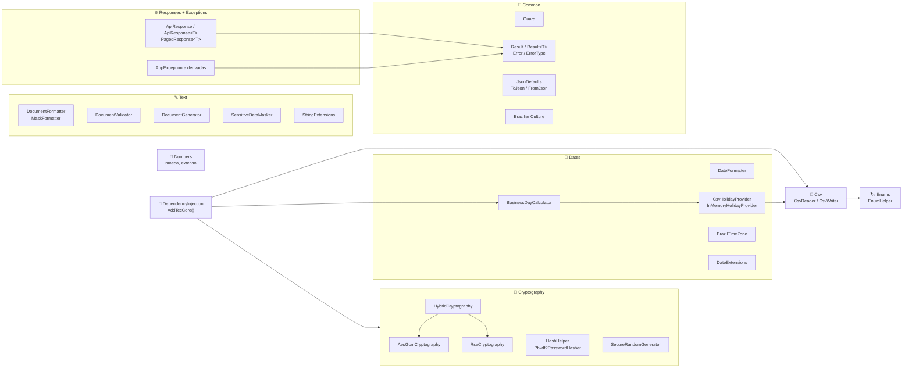
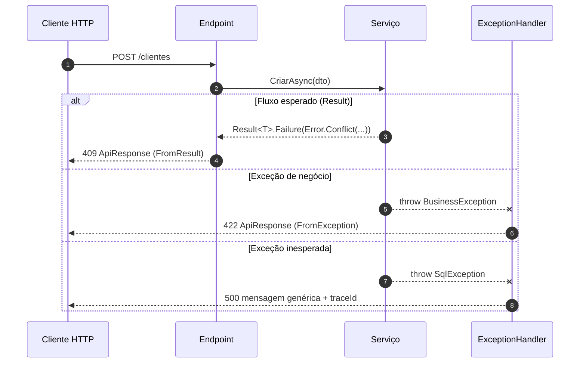

<div align="center">

# 🧰 TEC.Core

**Base dos componentes TEC: funções padronizadas e seguras para .NET 8 e .NET 10, compatíveis com Native AOT**

Criptografia e hash de senha · Documentos brasileiros · Datas e dias úteis · `Result` e respostas de API · Exceções · CSV · Texto, números e enums

[](https://github.com/tudoemcodigo/lib-tec-core/actions/workflows/ci.yml)
[](#️-compatibilidade)
[](#native-aot-e-trimming)
[](https://learn.microsoft.com/dotnet/csharp/)
[](#️-versionamento)
[](LICENSE)
[](#-build-e-testes)
[](docs/seguranca.md)
[](#)

[Instalação](#-instalação) · [Início rápido](#-início-rápido) · [Módulos](#-módulos) · [Documentação completa](docs/README.md) · [Segurança](#️-segurança) · [English](#-english-summary)

</div>

---

## 📑 Sumário

- [Por que usar](#-por-que-usar)
- [Visão geral da arquitetura](#️-visão-geral-da-arquitetura)
- [Instalação](#-instalação)
  - [Feed NuGet interno](#1-feed-nuget-interno)
  - [GitHub Packages](#2-github-packages)
  - [Referência de projeto (código-fonte)](#3-referência-de-projeto-código-fonte)
- [Início rápido](#-início-rápido)
- [Módulos](#-módulos)
- [Exemplos por módulo](#-exemplos-por-módulo)
- [Segurança](#️-segurança)
- [Compatibilidade](#️-compatibilidade)
- [Build e testes](#-build-e-testes)
- [Publicação](#-publicação)
- [Versionamento](#️-versionamento)
- [Contribuição](#-contribuição)
- [Autor](#-autor)
- [Licença](#-licença)
- [English summary](#-english-summary)

---

## ✨ Por que usar

| | |
|---|---|
| 🇧🇷 **Feita para o Brasil** | CPF, CNPJ (inclusive o **alfanumérico** de 2026), PIS, CEP, telefone, moeda em R$, valor por extenso, feriados e horário de Brasília. |
| 🔐 **Segura por padrão** | AES-GCM, RSA-OAEP/PSS, PBKDF2 com 600 mil iterações, anti-injeção de fórmulas em CSV e erros 500 que nunca vazam detalhes. |
| 📦 **Padronização entre times** | Mesmo envelope de resposta (`ApiResponse`), mesmas exceções e o mesmo `Result<T>` em todas as APIs. |
| 🐳 **Pronta para containers** | Funciona com `InvariantGlobalization` e sem `tzdata`, em imagens Docker enxutas. |
| ⚡ **Streaming** | CSV e criptografia de arquivos grandes sem carregar tudo em memória. |
| 🧪 **Testada** | Suíte TUnit com testes de regressão de segurança. |

---

## 🗺️ Visão geral da arquitetura



---

## 📥 Instalação

> **Requisitos:** projeto `net8.0` ou `net10.0` (o pacote traz `lib/net8.0` e `lib/net10.0`); para compilar o código-fonte, o SDK fixado no `global.json` (10.0.100 ou superior). A única dependência externa é `Microsoft.Extensions.DependencyInjection.Abstractions`.

### 1. Feed NuGet interno

**a)** Cadastre o feed no `nuget.config` da solução. Crie o arquivo na raiz, se ainda não existir:

```xml
<?xml version="1.0" encoding="utf-8"?>
<configuration>
  <packageSources>
    <add key="nuget.org" value="https://api.nuget.org/v3/index.json" />
    <add key="tec-interno" value="<URL-DO-FEED-INTERNO>" />
  </packageSources>

  <!-- Recomendado: garante que TEC.* venha SEMPRE do feed interno (evita dependency confusion) -->
  <packageSourceMapping>
    <packageSource key="tec-interno">
      <package pattern="TEC.*" />
    </packageSource>
    <packageSource key="nuget.org">
      <package pattern="*" />
    </packageSource>
  </packageSourceMapping>
</configuration>
```

**b)** Se o feed exigir autenticação, registre a credencial no `NuGet.Config` **do usuário** (nunca no arquivo versionado):

```bash
# Windows: %AppData%\NuGet\NuGet.Config  |  Linux/macOS: ~/.nuget/NuGet/NuGet.Config
dotnet nuget add source "<URL-DO-FEED-INTERNO>" --name tec-interno \
  --username <usuario> --password <token> --store-password-in-clear-text \
  --configfile "<caminho do NuGet.Config do usuário>"
```

> [!TIP]
> No Azure Artifacts, prefira o [Azure Artifacts Credential Provider](https://github.com/microsoft/artifacts-credprovider) em vez de gravar tokens em arquivo.

**c)** Adicione o pacote:

```bash
dotnet add package TEC.Core --version 0.0.1
```

```xml
<!-- ou direto no .csproj -->
<PackageReference Include="TEC.Core" Version="0.0.1" />
```

### 2. GitHub Packages

O pacote é publicado automaticamente em `https://nuget.pkg.github.com/tudoemcodigo/index.json` (veja [Publicação](#-publicação)). O GitHub Packages **sempre exige autenticação**, mesmo para leitura.

**a)** Gere um *Personal Access Token (classic)* com o escopo **`read:packages`** (GitHub → Settings → Developer settings → Personal access tokens).

**b)** Crie o `nuget.config` na raiz da solução consumidora. As credenciais vêm de variáveis de ambiente, então o arquivo pode ser versionado sem expor o token:

```xml
<?xml version="1.0" encoding="utf-8"?>
<configuration>
  <packageSources>
    <add key="nuget.org" value="https://api.nuget.org/v3/index.json" />
    <add key="github-tec" value="https://nuget.pkg.github.com/tudoemcodigo/index.json" />
  </packageSources>

  <!-- TEC.* vem SEMPRE do GitHub Packages (evita dependency confusion) -->
  <packageSourceMapping>
    <packageSource key="github-tec">
      <package pattern="TEC.*" />
    </packageSource>
    <packageSource key="nuget.org">
      <package pattern="*" />
    </packageSource>
  </packageSourceMapping>

  <packageSourceCredentials>
    <github-tec>
      <add key="Username" value="%GITHUB_PACKAGES_USER%" />
      <add key="ClearTextPassword" value="%GITHUB_PACKAGES_TOKEN%" />
    </github-tec>
  </packageSourceCredentials>
</configuration>
```

**c)** Defina as variáveis na sua máquina (uma vez):

```powershell
# Windows (PowerShell)
[Environment]::SetEnvironmentVariable("GITHUB_PACKAGES_USER", "<seu-usuario-github>", "User")
[Environment]::SetEnvironmentVariable("GITHUB_PACKAGES_TOKEN", "<PAT>", "User")
```

```bash
# Linux/macOS (~/.bashrc ou ~/.zshrc)
export GITHUB_PACKAGES_USER=<seu-usuario-github>
export GITHUB_PACKAGES_TOKEN=<PAT>
```

**d)** Instale:

```bash
dotnet add package TEC.Core                             # última versão estável
dotnet add package TEC.Core --prerelease                # última prévia da main
dotnet add package TEC.Core --version 0.0.1             # versão específica
```

| Tipo de versão | Exemplo | Quando é gerada |
|---|---|---|
| Estável | `1.2.0` | Ao publicar um Release `v1.2.0` |
| Prévia | `1.2.1-preview.57` | A cada push na `main` (próximo patch + número da execução) |

<details>
<summary>🤖 Usando no GitHub Actions de outro repositório</summary>

1. No pacote **TEC.Core** (GitHub → perfil → *Packages* → `TEC.Core` → *Package settings*), em **Manage Actions access**, adicione o repositório consumidor com permissão *Read*.
2. No workflow do consumidor, conceda `packages: read` e exporte as variáveis usadas pelo `nuget.config`:

```yaml
permissions:
  contents: read
  packages: read

jobs:
  build:
    runs-on: ubuntu-latest
    env:
      GITHUB_PACKAGES_USER: ${{ github.actor }}
      GITHUB_PACKAGES_TOKEN: ${{ secrets.GITHUB_TOKEN }}
    steps:
      - uses: actions/checkout@v4
      - uses: actions/setup-dotnet@v4
        with:
          dotnet-version: 10.0.x
      - run: dotnet restore
```

> Se preferir não liberar o acesso pelo pacote, crie um secret com um PAT `read:packages` e use-o em `GITHUB_PACKAGES_TOKEN`.

</details>

<details>
<summary>🐳 Usando em Dockerfile</summary>

```dockerfile
# docker build --secret id=gh_token,env=GITHUB_PACKAGES_TOKEN --build-arg GH_USER=<usuario> .
ARG GH_USER
RUN --mount=type=secret,id=gh_token \
    GITHUB_PACKAGES_USER=$GH_USER GITHUB_PACKAGES_TOKEN=$(cat /run/secrets/gh_token) \
    dotnet restore
```

O token fica fora das camadas da imagem.

</details>

### 3. Referência de projeto (código-fonte)

Use esta opção para depurar a biblioteca ou contribuir com ela.

**Clonando ao lado da solução:**

```bash
git clone https://github.com/tudoemcodigo/lib-tec-core.git
dotnet add MeuProjeto/MeuProjeto.csproj reference lib-tec-core/TEC.Core/TEC.Core.csproj
```

**Como submódulo Git** (fixa a versão por commit):

```bash
git submodule add https://github.com/tudoemcodigo/lib-tec-core.git libs/tec-core
git submodule update --init --recursive
dotnet add MeuProjeto/MeuProjeto.csproj reference libs/tec-core/TEC.Core/TEC.Core.csproj
```

```xml
<ItemGroup>
  <ProjectReference Include="..\libs\tec-core\TEC.Core\TEC.Core.csproj" />
</ItemGroup>
```

> [!NOTE]
> O projeto usa `RestorePackagesWithLockFile`. Ao referenciar o código-fonte, o `packages.lock.json` do TEC.Core é respeitado no restore.

---

## 🚀 Início rápido

### Registro no container de DI (ASP.NET Core)

```csharp
using TEC.Core.DependencyInjection;

builder.Services
    .AddTecCore()                                                              // criptografia, hash de senha e CSV
    .AddBusinessDayCalculator(["feriados/2026.csv", "feriados/2027.csv"]);     // dias úteis
```

| Interface registrada | Implementação | Ciclo de vida |
|---|---|---|
| `ISymmetricCryptography` | `AesGcmCryptography` | Singleton |
| `IAsymmetricCryptography` | `RsaCryptography` | Singleton |
| `IHybridCryptography` | `HybridCryptography` | Singleton |
| `IPasswordHasher` | `Pbkdf2PasswordHasher` | Singleton |
| `ICsvReader` / `ICsvWriter` | `CsvReader` / `CsvWriter` | Singleton |
| `IHolidayProvider` | `CsvHolidayProvider` ou o provedor informado | Singleton |
| `IBusinessDayCalculator` | `BusinessDayCalculator` | Singleton |

### Um endpoint completo

```csharp
app.MapPost("/clientes", async (NovoClienteDto dto, IClienteService service) =>
{
    if (!DocumentValidator.IsValidCpf(dto.Cpf))
        throw new RequestValidationException("cpf", "CPF inválido.", "CPF_INVALIDO");

    Result<ClienteDto> result = await service.CriarAsync(dto);
    var response = ApiResponse<ClienteDto>.FromResult(result);   // status HTTP definido pelo ErrorType
    return Results.Json(response, JsonDefaults.Options, statusCode: response.StatusCode);
});
```

### Middleware global de erros

```csharp
app.UseExceptionHandler(e => e.Run(async ctx =>
{
    var ex = ctx.Features.Get<IExceptionHandlerFeature>()!.Error;
    var response = ApiResponse.FromException(ex, ctx.TraceIdentifier);   // exceções desconhecidas → 500 genérico

    ctx.Response.StatusCode = response.StatusCode;
    ctx.Response.ContentType = "application/json; charset=utf-8";
    await ctx.Response.WriteAsync(response.ToJson());
}));
```



---

## 🧩 Módulos

| Módulo | Namespace | Principais tipos | Documentação |
|---|---|---|---|
| 🧱 **Common** | `TEC.Core.Common.*` | `Guard`, `Result`, `Result<T>`, `Error`, `ErrorType`, `JsonDefaults`, `JsonExtensions`, `BrazilianCulture` | [docs/common.md](docs/common.md) |
| 🔐 **Criptografia** | `TEC.Core.Cryptography.*` | `AesGcmCryptography`, `RsaCryptography`, `HybridCryptography`, `HashHelper`, `Pbkdf2PasswordHasher`, `SecureRandomGenerator` | [docs/criptografia.md](docs/criptografia.md) |
| 🔤 **Texto** | `TEC.Core.Text.*` | `DocumentFormatter`, `MaskFormatter`, `DocumentValidator`, `DocumentGenerator`, `SensitiveDataMasker`, `StringExtensions` | [docs/texto.md](docs/texto.md) |
| 🔢 **Números** | `TEC.Core.Numbers.*` | `NumericExtensions`, `NumberToWordsConverter` | [docs/numeros.md](docs/numeros.md) |
| 📅 **Datas** | `TEC.Core.Dates.*` | `DateFormatter`, `DateExtensions`, `BusinessDayCalculator`, `CsvHolidayProvider`, `InMemoryHolidayProvider`, `BrazilTimeZone` | [docs/datas.md](docs/datas.md) |
| 🌐 **Respostas de API** | `TEC.Core.Responses.*` | `ApiResponse`, `ApiResponse<T>`, `PagedResponse<T>`, `ApiError`, `PagedResult<T>`, `PaginationInfo`, `PaginationExtensions` | [docs/respostas-api.md](docs/respostas-api.md) |
| 🚨 **Exceções** | `TEC.Core.Exceptions` | `AppException` e 10 exceções especializadas | [docs/excecoes.md](docs/excecoes.md) |
| 📄 **CSV** | `TEC.Core.Csv.*` | `CsvReader`, `CsvWriter`, `CsvOptions`, `[CsvColumn]`, `[CsvIgnore]`, `CsvException` | [docs/csv.md](docs/csv.md) |
| 🏷️ **Enums** | `TEC.Core.Enums.*` | `EnumHelper`, `EnumExtensions`, `EnumItem<TEnum>` | [docs/enums.md](docs/enums.md) |
| 🧩 **Injeção de dependência** | `TEC.Core.DependencyInjection` | `AddTecCore()`, `AddBusinessDayCalculator()` | [docs/injecao-dependencia.md](docs/injecao-dependencia.md) |
| 🛡️ **Segurança** | — | Garantias e responsabilidades | [docs/seguranca.md](docs/seguranca.md) |

---

## 🧪 Exemplos por módulo

> Todas as saídas abaixo foram obtidas executando o código.

### 🔤 Documentos brasileiros

```csharp
using TEC.Core.Text.Formatting;
using TEC.Core.Text.Validation;
using TEC.Core.Text.Masking;
using TEC.Core.Text.Generation;
```

| Chamada | Resultado |
|---|---|
| `DocumentFormatter.FormatCpf("12345678909")` | `"123.456.789-09"` |
| `DocumentFormatter.FormatCnpj("12abc34501de35")` | `"12.ABC.345/01DE-35"` |
| `DocumentFormatter.FormatPhone("11987654321")` | `"(11) 98765-4321"` |
| `DocumentFormatter.FormatCep("01310100")` | `"01310-100"` |
| `DocumentValidator.IsValidCpf("529.982.247-25")` | `true` |
| `DocumentValidator.IsValidCnpj("12.ABC.345/01DE-35")` | `true` |
| `DocumentValidator.IsValidPhone("(20) 98765-4321")` | `false` (DDD inexistente) |
| `SensitiveDataMasker.MaskCpf("123.456.789-09")` | `"***.456.789-**"` |
| `SensitiveDataMasker.MaskEmail("joao.silva@empresa.com")` | `"jo********@empresa.com"` |
| `DocumentGenerator.GenerateCnpj(formatted: true, alphanumeric: true)` | ex.: `"EW.NB8.AE6/0001-11"` |

### 🔢 Números e moeda

| Chamada | Resultado |
|---|---|
| `1234.5m.ToCurrency()` | `"R$ 1.234,50"` |
| `0.1575m.ToPercentage()` | `"15,75%"` |
| `2.345m.RoundHalfUp()` / `2.345m.RoundBankers()` | `2,35` / `2,34` |
| `1234.56m.ToCurrencyWords()` | `"mil duzentos e trinta e quatro reais e cinquenta e seis centavos"` |
| `1_000_000m.ToCurrencyWords()` | `"um milhão de reais"` |
| `"R$ 1.234,56".TryParseBrazilianDecimal(out var v)` | `true`, `v = 1234.56` |
| `"1.5".TryParseBrazilianDecimal(out _)` | `false` (milhar só em grupos de 3 dígitos) |

### 📅 Datas e dias úteis

```csharp
var feriados = await CsvHolidayProvider.FromFileAsync("feriados-2026.csv");
var calc = new BusinessDayCalculator(feriados);

calc.NextOrSameBusinessDay(new DateOnly(2026, 11, 15));   // 16/11/2026 (15/11 é domingo e feriado)
calc.AddBusinessDays(new DateOnly(2026, 10, 9), 5);       // 19/10/2026 (pula o fim de semana e 12/10)
calc.GetNthBusinessDayOfMonth(2026, 11, 5);               // 09/11/2026: 5º dia útil de novembro
```

| Chamada | Resultado |
|---|---|
| `new DateOnly(2026, 9, 30).ToFullDate()` | `"quarta-feira, 30 de setembro de 2026"` |
| `dt.AddMinutes(-5).ToRelativeTime(dt)` | `"há 5 minutos"` |
| `new DateOnly(1990, 10, 15).CalculateAge(new DateOnly(2026, 9, 30))` | `35` |
| `new DateTime(2026, 9, 30, 15, 0, 0, DateTimeKind.Utc).ToBrasiliaTime()` | `30/09/2026 12:00` (UTC−3) |

### 🔐 Criptografia

```csharp
// Simétrica (AES-256-GCM)
var aes = new AesGcmCryptography();
var chave = aes.GenerateKeyBase64();                        // guarde em um cofre de segredos
var cifrado = aes.Encrypt("Dado sigiloso", chave);
var texto   = aes.Decrypt(cifrado, chave);                  // "Dado sigiloso"

// Assinatura digital (RSA-PSS)
var rsa = new RsaCryptography();
var par = rsa.GenerateKeyPair();                            // 2048 bits, PEM
var assinatura = rsa.SignData("payload", par.PrivateKeyPem);
bool valido = rsa.VerifyData("payload", assinatura, par.PublicKeyPem);   // true

// Senhas (PBKDF2-SHA256, 600 mil iterações)
var hasher = new Pbkdf2PasswordHasher();
string hash = hasher.Hash("Senha@123");     // "PBKDF2-SHA256$600000$<salt>$<hash>"
bool ok = hasher.Verify("Senha@123", hash); // true
bool nao = hasher.Verify("Senha@123", null); // false, com o mesmo custo (usuário inexistente)
```

### 🌐 Respostas de API

```csharp
return ApiResponse<ClienteDto>.Ok(dto);
return ApiResponse<ClienteDto>.Created(dto, "Cliente criado.");
return ApiResponse<ClienteDto>.FromResult(await service.ObterAsync(id));
return PagedResponse<ClienteDto>.Create(pagedResult);   // PagedResult<ClienteDto> vindo do repositório
```

<details>
<summary>📦 JSON gerado</summary>

```json
{
  "success": false,
  "statusCode": 400,
  "message": "Um ou mais erros de validação ocorreram.",
  "errors": [
    { "code": "CPF_INVALIDO", "message": "CPF inválido.", "field": "cpf" },
    { "code": "EMAIL_OBRIGATORIO", "message": "E-mail é obrigatório.", "field": "email" }
  ],
  "timestamp": "2026-09-30T14:00:00+00:00"
}
```

Propriedades nulas (`message`, `data`, `traceId`) são omitidas do JSON.

</details>

### 🚨 Exceções → HTTP

| Exceção | HTTP | Mensagem vai ao cliente? |
|---|:---:|:---:|
| `RequestValidationException` | 400 | ✅ |
| `UnauthenticatedException` | 401 | ✅ (genérica) |
| `ForbiddenException` | 403 | ✅ (genérica) |
| `NotFoundException` | 404 | ✅ (sem o ID) |
| `ConflictException` / `ConcurrencyException` | 409 | ✅ |
| `BusinessException` | 422 | ✅ |
| `RateLimitExceededException` | 429 | ✅ |
| `IntegrationException` | 502 | ❌ só no log |
| `InvalidConfigurationException` | 500 | ❌ só no log |

### 📄 CSV

```csharp
public class Cliente
{
    [CsvColumn("Código", Order = 1)] public int Id { get; set; }
    [CsvColumn("Nome", Order = 2)] public string Nome { get; set; } = "";
    [CsvColumn("Nascimento", Order = 3, Format = "dd/MM/yyyy")] public DateOnly Nascimento { get; set; }
    [CsvColumn("Ativo", Order = 4, Format = "Sim|Não")] public bool Ativo { get; set; }
    [CsvIgnore] public string Interno { get; set; } = "";
}

await new CsvWriter().WriteFileAsync("clientes.csv", clientes);

await foreach (var c in new CsvReader().ReadFileAsync<Cliente>("clientes.csv"))
{
    // processa linha a linha, sem carregar o arquivo inteiro
}
```

```csv
Código;Nome;Nascimento;Ativo
1;João da Silva;20/05/1990;Sim
2;"'=HYPERLINK(""http://mal"")";01/12/1985;Não
```

> A segunda linha mostra a **proteção contra injeção de fórmulas**: o apóstrofo impede que o Excel execute a fórmula e é removido na leitura.

### 🏷️ Enums

```csharp
public enum StatusPedido
{
    [Description("Aguardando pagamento")] AguardandoPagamento = 1,
    [Display(Name = "Pedido enviado")] Enviado = 2,
    Cancelado = 3
}

StatusPedido.AguardandoPagamento.GetDescription();   // "Aguardando pagamento"
"pedido enviado".ToEnum<StatusPedido>();             // Enviado
"2".ToEnum<StatusPedido>();                          // Enviado
EnumHelper.GetItems<StatusPedido>();                 // lista para combos/selects
```

---

## 🛡️ Segurança

O componente segue o princípio **Zero Trust**: toda entrada (parâmetros, arquivos, hashes armazenados, JSON) é tratada como não confiável.

| Área | Proteção |
|---|---|
| AES-GCM | Cifra autenticada; byte de versão de formato; subchave por stream (HKDF); detecta adulteração, truncamento e dados extras; mensagens de erro genéricas |
| RSA | OAEP-SHA256; assinatura PSS por padrão; chaves < 2048 bits recusadas (inclusive na importação); geração limitada a 8192 bits e importação a 16384 bits |
| Híbrida | Byte de versão de formato; cabeçalho com a chave cifrada vinculado ao conteúdo (AAD); falhas geram uma exceção única (sem oráculo de padding) |
| Senhas | PBKDF2-SHA256 com 600 mil iterações; salt aleatório; comparação em tempo constante; verificação fictícia para usuário inexistente (sem enumeração por tempo); normalização determinística; limites contra hash adulterado (DoS) |
| Material sensível | Chaves e textos claros intermediários são zerados na memória; a chave privada fica fora de `ToString()` e do JSON |
| CSV | Anti-injeção de fórmulas ligado por padrão; limites de tamanho de campo, de registro e de colunas; modo estrito opcional; erros sem o conteúdo do arquivo |
| JSON | Escape de caracteres HTML (`< > & '`); opções globais imutáveis; enums numéricos não definidos são recusados |
| API | Erros internos (500/502) nunca expõem mensagem ou detalhes; paginação com tamanho máximo |
| Build | Analisadores de segurança com regras críticas como erro; NuGet Audit com vulnerabilidades como erro; lock file em todos os projetos; package source mapping; SDK fixado; actions fixadas por SHA; CodeQL; build determinístico |

> [!IMPORTANT]
> Nunca coloque chaves no código, no `appsettings` versionado ou em logs. Veja a lista completa de **responsabilidades de quem usa** em [docs/seguranca.md](docs/seguranca.md).

---

## 🖥️ Compatibilidade

| Item | Suporte |
|---|---|
| Target frameworks | `net8.0` (LTS) e `net10.0` (LTS); comportamento idêntico nos dois (os testes rodam nos dois runtimes) |
| Native AOT / trimming | ✅ `IsAotCompatible`, 0 avisos IL2xxx/IL3xxx (tratados como erro no build); exceções listadas abaixo |
| Nullable reference types | ✅ habilitado |
| `InvariantGlobalization=true` | ✅ usa uma cultura pt-BR própria como fallback |
| Container sem `tzdata` | ✅ usa UTC−03:00 fixo como fallback |
| Thread-safety | Os serviços registrados por `AddTecCore()` e `AddBusinessDayCalculator()` não guardam estado mutável próprio e são seguros como Singleton (`Holiday` também é imutável). O que **você** fornece precisa ser thread-safe: provedor de feriados customizado, `CultureInfo` não somente leitura em `CsvOptions.Culture` e o callback `OnInvalidRow` |
| Documentação XML | ✅ `GenerateDocumentationFile` (IntelliSense em português) |

### .NET 8

- APIs do .NET 9+ usadas internamente (`Convert.ToHexStringLower`, `Convert.FromHexString(…, Span<byte>)`, `Base64Url`, `OverloadResolutionPriorityAttribute`) têm equivalentes internos no alvo `net8.0`, com testes que comparam os dois caminhos.
- Os métodos com `params IEnumerable<…>` (ex.: `ApiResponse.ValidationError(...)`, `RequestValidationException(...)`) aceitam argumentos avulsos só com **C# 13+**. Projetos `net8.0` usam C# 12 por padrão: passe uma coleção (`ValidationError([erro1, erro2])`) ou defina `<LangVersion>13</LangVersion>` (ou `latest`) com o SDK 9+.
- `ToListAsync()` sobre `IAsyncEnumerable<T>` (ex.: leitura de CSV) é nativo no .NET 10; no .NET 8, use o pacote `System.Linq.AsyncEnumerable`.

### Native AOT e trimming

| Área | Situação | Alternativa compatível com AOT |
|---|---|---|
| `JsonDefaults.Options`, `IndentedOptions` | ⚠️ `[RequiresUnreferencedCode]` + `[RequiresDynamicCode]` (resolvedor por reflexão) | `JsonDefaults.CreateOptions(IJsonTypeInfoResolver?)` + `JsonSerializerContext` gerado |
| `JsonDefaults.CreateOptions(bool)` | ⚠️ `[RequiresDynamicCode]` (conversor de enums criado em tempo de execução) | `CreateOptions(IJsonTypeInfoResolver?)` + `JsonDefaults.CreateEnumConverter<TEnum>()` |
| `ToJson<T>(bool)`, `FromJson<T>()`, `TryFromJson<T>(out)` | ⚠️ `[RequiresUnreferencedCode]` + `[RequiresDynamicCode]` | Sobrecargas com `JsonTypeInfo<T>` ou `JsonSerializerContext` |
| CSV (`CsvReader`, `CsvWriter`, `ICsvReader`, `ICsvWriter`) | ✅ `T` anotado com `[DynamicallyAccessedMembers(PublicProperties)]` | — |
| Enums (`EnumHelper`, `EnumExtensions`) | ✅ `TEnum`/`Type` anotados com `[DynamicallyAccessedMembers(PublicFields)]` | — |
| Criptografia, texto, datas, números, respostas, DI | ✅ sem reflexão | — |

Exemplo do caminho AOT para JSON em [docs/common.md](docs/common.md#native-aot-e-trimming). A compatibilidade é verificada publicando um app de teste (`PublishAot`, `TrimmerSingleWarn=false`, `TrimmerRootAssembly=TEC.Core`) sem nenhum aviso de trimming/AOT.

---

## 🔧 Build e testes

```bash
# Restaurar, compilar e testar
dotnet restore
dotnet build -c Release
dotnet test

# Recomendado no CI: testar também sem ICU (containers enxutos)
DOTNET_SYSTEM_GLOBALIZATION_INVARIANT=1 dotnet test

# Cobertura
dotnet test --coverage --coverage-output-format cobertura --results-directory ./coverage
```

> [!NOTE]
> Os testes usam [TUnit](https://tunit.dev) sobre o Microsoft.Testing.Platform (habilitado no `dotnet test` pelo `global.json`) e rodam em `net8.0` e `net10.0` (é preciso ter o runtime do .NET 8 instalado além do SDK do `global.json`). Também é possível executar o projeto diretamente: `dotnet run --project TEC.Core.Tests -f net10.0`.

```
TEC.Core/
├── TEC.Core.slnx
├── TEC.Core/                 # biblioteca
│   ├── Common/               # Guard, Result, JSON, cultura pt-BR
│   ├── Cryptography/         # AES, RSA, híbrida, hash, geradores
│   ├── Csv/                  # leitura/escrita em streaming
│   ├── Dates/                # formatação, dias úteis, feriados, fuso
│   ├── DependencyInjection/  # AddTecCore()
│   ├── Enums/                # EnumHelper
│   ├── Exceptions/           # AppException e derivadas
│   ├── Numbers/              # moeda, arredondamento, extenso
│   ├── Polyfills/            # equivalentes internos de APIs do .NET 9+ para o alvo net8.0
│   ├── Responses/            # ApiResponse, paginação
│   └── Text/                 # documentos, máscaras, strings
├── TEC.Core.Tests/           # TUnit
├── docs/                     # documentação detalhada por módulo
├── Directory.Build.props     # configurações comuns: TFMs, analisadores (inclusive AOT), NuGet Audit, lock file, metadados
├── nuget.config              # package source mapping (TEC.* só do feed interno)
├── global.json               # SDK fixado e Microsoft.Testing.Platform
└── CHANGELOG.md              # mudanças por versão (inclusive incompatíveis)
```

---

## 📤 Publicação

<details>
<summary><b>Feed interno</b></summary>

```bash
dotnet pack TEC.Core/TEC.Core.csproj -c Release -o ./artifacts
dotnet nuget push ./artifacts/TEC.Core.0.0.1.nupkg --source tec-interno --api-key <chave>
```

</details>

### GitHub Packages (automático)

A publicação é feita pelo workflow [`.github/workflows/ci.yml`](.github/workflows/ci.yml), sem token manual (usa o `GITHUB_TOKEN` do Actions). Detalhes completos em [⚙️ CI/CD e publicação](.github/workflows/README.md).

| Evento | O que acontece | Versão |
|---|---|---|
| Pull request para `main` | Build, testes (com e sem ICU), cobertura e CodeQL | — (não publica) |
| Push na `main` | Build, testes e publicação de **prévia** | `X.Y.(Z+1)-preview.<nº da execução>` |
| Release publicado | Build, testes, publicação **estável** e `.nupkg`/`.snupkg` anexados ao Release | Tag `vX.Y.Z` → `X.Y.Z` |

`X.Y.Z` é a última tag estável; enquanto não houver tags, a base é o `<Version>` do `.csproj`.

**Lançar uma versão estável:** GitHub → **Actions** → **Publicar versão** → **Run workflow** → digite a versão (ex.: `1.1.0`) → **Run workflow**.

O workflow [`release.yml`](.github/workflows/release.yml) roda build e testes e, só se tudo passar, cria a tag `v1.1.0` e o Release com notas automáticas e **depois** publica o pacote (uma falha na criação da tag nunca deixa pacote órfão no feed).

Com a GitHub CLI: `gh workflow run release.yml -f versao=1.1.0`.

> [!NOTE]
> A versão precisa seguir `X.Y.Z` (ou `X.Y.Z-rc.1` para release candidate) e a tag não pode existir. O `<Version>` do `.csproj` é usado apenas em builds locais.

A cobertura de testes aparece no resumo de cada execução do Actions e o relatório HTML fica disponível no artifact **cobertura**. O Dependabot abre PRs semanais para pacotes NuGet e actions.

<details>
<summary><b>Publicação manual (emergência)</b></summary>

```bash
dotnet pack TEC.Core/TEC.Core.csproj -c Release -p:Version=1.0.1 -o ./artifacts
dotnet nuget push ./artifacts/TEC.Core.1.0.1.nupkg \
  --source "https://nuget.pkg.github.com/tudoemcodigo/index.json" \
  --api-key <PAT com write:packages>
```

</details>

O pacote inclui este README; os símbolos (`.snupkg`) ficam anexados ao Release, pois o GitHub Packages não aceita pacotes de símbolos.

---

## 🏷️ Versionamento

O projeto segue o [Versionamento Semântico](https://semver.org/lang/pt-BR/) (`MAJOR.MINOR.PATCH`):

- **MAJOR**: mudanças incompatíveis na API pública, no formato dos dados cifrados ou no formato do hash de senha;
- **MINOR**: novas funcionalidades compatíveis;
- **PATCH**: correções.

> [!WARNING]
> Os formatos binários do AES-GCM (`[versão][nonce][tag][dados]`), do stream cifrado, da criptografia híbrida (`[versão][tamanho][chave cifrada][dados]`) e do hash PBKDF2 (`PBKDF2-SHA256$iterações$salt$hash`) fazem parte do contrato. Todos os formatos binários começam com um **byte de versão**, para que dados gravados hoje continuem legíveis em versões futuras.

Enquanto a versão for `0.x`, mudanças incompatíveis podem ocorrer em versões MINOR; todas são registradas no [CHANGELOG](CHANGELOG.md).

---

## 🤝 Contribuição

1. Crie uma branch a partir de `main`: `git checkout -b feature/minha-melhoria`;
2. Escreva testes para o novo comportamento (inclusive os casos de entrada inválida);
3. Garanta que `dotnet build` passe **sem warnings de segurança** e que `dotnet test` passe nos dois modos de globalização;
4. Documente os métodos públicos com comentários XML (`///`) e atualize o arquivo correspondente em `docs/`;
5. Abra o Pull Request.

---

## 👤 Autor

Criado e mantido por **Roberto Oliveira**, da equipe **Tudo em Código**.

Dúvidas, sugestões ou relato de problemas: [roberto@roberto.inf.br](mailto:roberto@roberto.inf.br)

---

## 📄 Licença

Distribuído sob a licença **MIT**. Veja [LICENSE](LICENSE).

---

## 🌎 English summary

**TEC.Core** is a .NET 8 / .NET 10 (Native AOT compatible) utility library with standardized building blocks for Brazilian business applications:

- **Cryptography:** AES-256-GCM (in-memory and streaming), RSA (OAEP-SHA256 / PSS), hybrid RSA+AES encryption, SHA/HMAC hashing, PBKDF2 password hashing (600k iterations) and a secure random generator;
- **Brazilian documents:** formatting, validation, generation and masking of CPF, CNPJ (including the new 2026 alphanumeric format), PIS, CEP and phone numbers, plus string helpers (accent removal, slug, casing);
- **Numbers:** BRL currency, percentage and rounding helpers, and amounts written out in Portuguese words;
- **Dates:** Brazilian formatting, relative time, business-day calculator with CSV-based holiday calendars, and the Brasília time zone;
- **API:** a standard response envelope (`ApiResponse<T>`, `PagedResponse<T>`), `Result<T>`/`Error` types and an exception hierarchy mapped to HTTP status codes that never leaks internal details;
- **CSV:** attribute-based streaming reader/writer with formula-injection protection;
- **Enums:** description, display name and flexible parsing;
- **DI:** `services.AddTecCore()` registers cryptography, password hashing and CSV services, and `AddBusinessDayCalculator()` the business-day calculator, all as thread-safe singletons.

Install from the internal feed or GitHub Packages (`dotnet add package TEC.Core`), or reference the project from source. The detailed documentation is written in Portuguese and lives in [`docs/`](docs/README.md). Licensed under MIT.

Maintained by **Roberto Oliveira** (Tudo em Código) · [roberto@roberto.inf.br](mailto:roberto@roberto.inf.br)

---

<div align="center">

Feito com ☕ por **Roberto Oliveira** · equipe **Tudo em Código**

[roberto@roberto.inf.br](mailto:roberto@roberto.inf.br)

</div>
