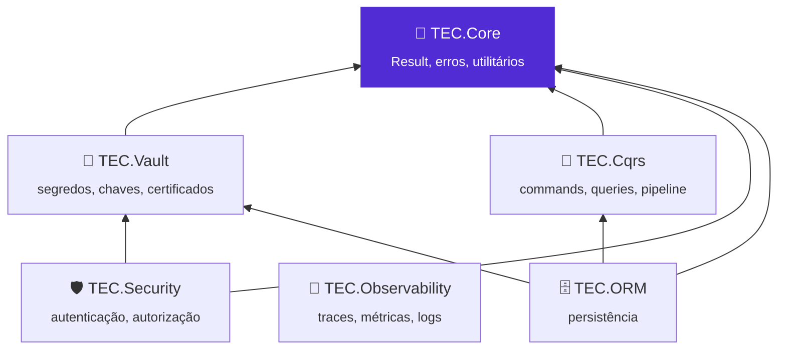
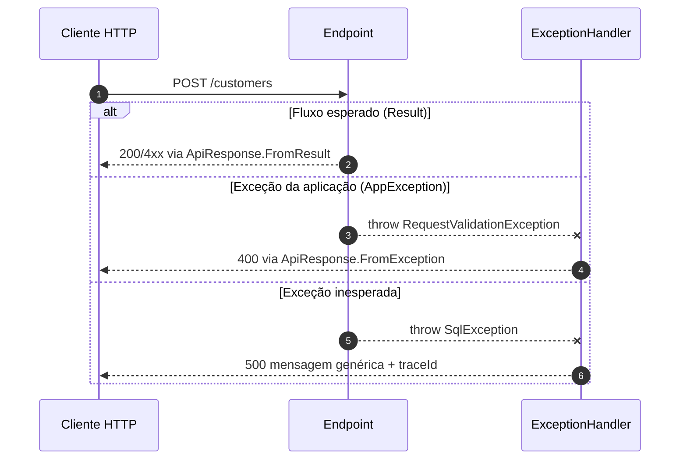

<div align="center">


# 🧰 TEC.Core

**Blocos prontos e seguros para aplicações brasileiras: `Result` e erros padronizados, respostas de API, documentos, datas e dias úteis, criptografia e senhas, CSV.**

A base de todos os componentes TEC · .NET 8 e 10 · Native AOT · sem dependências pesadas

[](https://github.com/tudoemcodigo/lib-tec-core/actions/workflows/ci.yml)
[](https://github.com/tudoemcodigo/lib-tec-core/blob/main/docs/compatibilidade.md)
[](https://github.com/tudoemcodigo/lib-tec-core/blob/main/docs/compatibilidade.md)
[](https://github.com/tudoemcodigo/lib-tec-core/blob/main/CHANGELOG.md)
[](https://github.com/tudoemcodigo/lib-tec-core/blob/main/LICENSE)

[📥 Instalação](#-instalação) · [🚀 Início rápido](#-início-rápido) · [📚 Documentação](https://github.com/tudoemcodigo/lib-tec-core/blob/main/docs/README.md) · [📝 Changelog](https://github.com/tudoemcodigo/lib-tec-core/blob/main/CHANGELOG.md) · [⚙️ CI/CD](https://github.com/tudoemcodigo/lib-tec-core/blob/main/.github/workflows/README.md)

</div>

---

## 📑 Sumário

- [✨ Por que usar](#-por-que-usar)
- [📦 Pacotes](#-pacotes)
- [🧬 Ecossistema TEC](#-ecossistema-tec)
- [📥 Instalação](#-instalação)
- [🚀 Início rápido](#-início-rápido)
- [🧭 O que tem dentro](#-o-que-tem-dentro)
- [📚 Documentação](#-documentação)
- [⚡ Compatibilidade](#-compatibilidade)
- [🛡️ Segurança](#️-segurança)
- [🧪 Testes](#-testes)
- [🤝 Contribuição](#-contribuição)
- [🏷️ Versionamento](#️-versionamento)
- [📄 Licença](#-licença)

---

## ✨ Por que usar

| Sem o TEC.Core | Com o TEC.Core |
|---|---|
| Cada time escreve (e erra) a validação de CPF/CNPJ e recusa o CNPJ alfanumérico | `DocumentValidator`, `DocumentFormatter` e `DocumentGenerator` prontos, com o CNPJ alfanumérico |
| Cada API devolve um formato de erro diferente, às vezes com detalhes internos | Mesmo envelope `ApiResponse` em todas as APIs; erros 500/502 nunca vazam detalhes |
| Senha com hash caseiro e login que revela quais usuários existem | PBKDF2 com 600 mil iterações, comparação em tempo constante e verificação fictícia |
| Vencimento calculado sem feriados e com a data do servidor (UTC) | `BusinessDayCalculator` com feriados nacionais calculados, fontes CSV/JSON/banco/API, calendário por município e `BrazilTimeZone.Today` |
| Exportação de planilha que executa fórmulas do usuário | CSV em streaming com anti-injeção de fórmulas ligada por padrão |
| Aplicação que quebra em container sem ICU ou sem `tzdata` | Fallbacks de cultura pt-BR e de fuso embutidos |

- ✅ **Feito para o Brasil:** CPF, CNPJ (inclusive o alfanumérico), PIS, CEP, telefone, R$, valor por extenso, feriados e horário de Brasília.
- ✅ **Seguro por padrão:** AES-GCM, RSA-OAEP/PSS, PBKDF2 600k, limites contra DoS e mensagens de erro que não vazam dados.
- ✅ **Padrão entre times:** o mesmo `Result<T>`, as mesmas exceções e o mesmo `ApiResponse` em todos os componentes TEC.
- ✅ **Pronto para nuvem:** Native AOT, `InvariantGlobalization`, streaming e relógio injetável (`TimeProvider`).

## 📦 Pacotes

| Pacote | Para que serve | Quando instalar | Depende de |
|---|---|---|---|
| `TEC.Core` | `Result`/`Error`, respostas de API, exceções, criptografia, documentos, datas e dias úteis, números, CSV, enums, JSON e `ICurrentUser` | Em qualquer projeto que use um componente TEC ou precise desses utilitários | Só `Microsoft.Extensions.DependencyInjection.Abstractions` |

O pacote traz `lib/net8.0` e `lib/net10.0`, a documentação XML (IntelliSense em português), este README e o logo; os símbolos (`.snupkg`) ficam anexados a cada Release.

## 🧬 Ecossistema TEC



O TEC.Core é a base: **não depende de nenhum outro componente TEC** e é o primeiro da ordem de publicação. Antes de criar um utilitário genérico (guard, `Result`, comparação em tempo constante, mascaramento, JSON, hash) em outro componente, use o daqui.

| Componente | Usa do TEC.Core |
|---|---|
| 🔐 [TEC.Vault](https://github.com/tudoemcodigo/lib-tec-vault) | `Result`/`Error`, `Guard`, `SecureRandomGenerator`, AES-GCM e HMAC |
| 🧭 [TEC.Cqrs](https://github.com/tudoemcodigo/lib-tec-cqrs) | Handlers retornam `Result`; integração HTTP converte em `ApiResponse`/`PagedResponse` |
| 🛡️ [TEC.Security](https://github.com/tudoemcodigo/lib-tec-security) | Implementa `ICurrentUser`/`PrincipalKind`; usa `Result` e `ApiResponse` |
| 🗄️ [TEC.ORM](https://github.com/tudoemcodigo/lib-tec-orm) | `Result`, `Guard`, `PagedResult<T>` e `ICurrentUser` (auditoria e tenant) |
| 📡 [TEC.Observability](https://github.com/tudoemcodigo/lib-tec-observability) | Nada: é independente. O TEC.Core não emite telemetria própria |

## 📥 Instalação

O pacote está no **GitHub Packages** da organização `tudoemcodigo`, que sempre exige autenticação (mesmo para leitura). Crie um PAT *classic* com o escopo `read:packages` e registre a origem com o nome `tec-interno`:

```bash
dotnet nuget add source https://nuget.pkg.github.com/tudoemcodigo/index.json -n tec-interno -u <usuario> -p <PAT>
dotnet add package TEC.Core --version 0.0.1
```

> [!IMPORTANT]
> Versão atual: **0.0.1** (ainda não publicada). Para evitar *dependency confusion*, mapeie `TEC.*` só para a origem `tec-interno` no `nuget.config` da aplicação. Exemplo completo, uso no GitHub Actions e em Dockerfile: [docs/instalacao.md](https://github.com/tudoemcodigo/lib-tec-core/blob/main/docs/instalacao.md).

## 🚀 Início rápido

Uma API que registra os serviços, valida CPF, devolve o envelope padrão e trata qualquer exceção sem vazar detalhes:

```csharp
using Microsoft.AspNetCore.Diagnostics;
using TEC.Core.Common.Results;
using TEC.Core.Common.Serialization;
using TEC.Core.Dates.Holidays;
using TEC.Core.DependencyInjection;
using TEC.Core.Exceptions;
using TEC.Core.Responses;
using TEC.Core.Text.Validation;

var builder = WebApplication.CreateBuilder(args);

builder.Services
    .AddTecCore()                                                // criptografia, hash de senha e CSV (Singleton)
    .AddBusinessDayCalculator(new BrazilianNationalHolidays());  // dias úteis com os feriados nacionais

var app = builder.Build();

// Tratamento global: AppException vira o status correto; o resto vira 500 genérico com traceId
app.UseExceptionHandler(handler => handler.Run(async context =>
{
    var exception = context.Features.Get<IExceptionHandlerFeature>()!.Error;
    var response = ApiResponse.FromException(exception, context.TraceIdentifier);
    context.Response.StatusCode = response.StatusCode;
    await context.Response.WriteAsJsonAsync(response, JsonDefaults.Options);
}));

app.MapPost("/customers", (CustomerRequest request) =>
{
    if (!DocumentValidator.IsValidCpf(request.Cpf))
        throw new RequestValidationException("cpf", "CPF inválido.", "CPF_INVALIDO");   // 400

    Result<CustomerResponse> result = new CustomerResponse(request.Name, request.Cpf);
    var response = ApiResponse<CustomerResponse>.FromResult(result);   // status HTTP vem do ErrorType
    return Results.Json(response, JsonDefaults.Options, statusCode: response.StatusCode);
});

app.Run();

public sealed record CustomerRequest(string Name, string Cpf);
public sealed record CustomerResponse(string Name, string Cpf);
```

Resposta para `{ "name": "Maria", "cpf": "111.111.111-11" }`:

```json
{
  "success": false,
  "statusCode": 400,
  "message": "CPF inválido.",
  "errors": [ { "code": "CPF_INVALIDO", "message": "CPF inválido.", "field": "cpf" } ],
  "timestamp": "2026-09-30T14:00:00+00:00",
  "traceId": "00-abc-01"
}
```



Para ajustar opções: `AddTecCore(options => { options.PasswordHashIterations = 800_000; options.Csv = new CsvOptions { Delimiter = ',' }; })` — veja [injeção de dependência](https://github.com/tudoemcodigo/lib-tec-core/blob/main/docs/injecao-dependencia.md).

## 🧭 O que tem dentro

```csharp
// Trechos independentes (um por linha), só para dar uma ideia; exemplos completos em docs/
Guard.InRange(installments, 1, 12);                                 // validação de argumentos
return Error.NotFound("CLIENTE_NAO_ENCONTRADO", "Cliente não encontrado.");   // Result<T> sem exceção
DocumentFormatter.FormatCnpj("12abc34501de35");                     // "12.ABC.345/01DE-35"
SensitiveDataMasker.MaskCpf("123.456.789-09");                      // "***.456.789-**"
1234.56m.ToCurrencyWords();                                         // "mil duzentos e trinta e quatro reais e cinquenta e seis centavos"
calculator.AddBusinessDays(new DateOnly(2026, 10, 9), 5);           // 19/10/2026 (pula o fim de semana e 12/10)
BrazilTimeZone.GetToday(timeProvider);                              // "hoje" em Brasília, com relógio testável
hasher.Verify(password, user?.PasswordHash);                        // mesmo custo para usuário inexistente
await foreach (var row in csvReader.ReadFileAsync<OrderRow>(path)) { }   // CSV em streaming
```

| Módulo | Namespace | Principais tipos |
|---|---|---|
| 🧱 Common | `TEC.Core.Common.*` | `Guard`, `Result`, `Result<T>`, `Error`, `ErrorType`, `JsonDefaults`, `JsonExtensions`, `BrazilianCulture` |
| 🌐 Respostas | `TEC.Core.Responses.*` | `ApiResponse`, `ApiResponse<T>`, `PagedResponse<T>`, `ApiError`, `PagedResult<T>`, `PaginationExtensions` |
| 🚨 Exceções | `TEC.Core.Exceptions` | `AppException` e 10 exceções mapeadas para HTTP |
| 🔤 Texto | `TEC.Core.Text.*` | `DocumentValidator`, `DocumentFormatter`, `DocumentGenerator`, `MaskFormatter`, `SensitiveDataMasker`, `StringExtensions`, `Base64UrlEncoder` |
| 🔢 Números | `TEC.Core.Numbers.*` | `NumericExtensions`, `NumberToWordsConverter` |
| 📅 Datas | `TEC.Core.Dates.*` | `DateFormatter`, `DateExtensions`, `BusinessDayCalculator`, `HolidayCalendar`, `BrazilianNationalHolidays`, fontes de feriados, `BrazilTimeZone` |
| 🔐 Criptografia | `TEC.Core.Cryptography.*` | `AesGcmCryptography`, `RsaCryptography`, `HybridCryptography`, `Pbkdf2PasswordHasher`, `HashHelper`, `SecureRandomGenerator` |
| 📄 CSV | `TEC.Core.Csv.*` | `CsvReader`, `CsvWriter`, `CsvOptions`, `[CsvColumn]`, `[CsvIgnore]` |
| 🏷️ Enums | `TEC.Core.Enums.*` | `EnumHelper`, `EnumExtensions`, `EnumItem<TEnum>` |
| 🧩 DI | `TEC.Core.DependencyInjection` | `AddTecCore`, `TecCoreOptions`, `AddBusinessDayCalculator` |
| 🛡️ Identidade | `TEC.Core.Security` | `ICurrentUser`, `PrincipalKind` |

## 📚 Documentação

| Arquivo | O que responde |
|---|---|
| [📥 Instalação](https://github.com/tudoemcodigo/lib-tec-core/blob/main/docs/instalacao.md) | Como configurar o feed, o `nuget.config`, o GitHub Actions e o Docker |
| [🧱 Common](https://github.com/tudoemcodigo/lib-tec-core/blob/main/docs/common.md) | Como validar argumentos, retornar `Result`/`Error` e serializar JSON (inclusive AOT) |
| [🌐 Respostas de API](https://github.com/tudoemcodigo/lib-tec-core/blob/main/docs/respostas-api.md) | Como montar o envelope `ApiResponse` e paginar consultas |
| [🚨 Exceções](https://github.com/tudoemcodigo/lib-tec-core/blob/main/docs/excecoes.md) | Qual exceção lançar, que status HTTP e código ela gera e o que vai ao cliente |
| [🔤 Texto](https://github.com/tudoemcodigo/lib-tec-core/blob/main/docs/texto.md) | Como validar, formatar, gerar e mascarar documentos; extensões de texto; Base64Url |
| [🔢 Números](https://github.com/tudoemcodigo/lib-tec-core/blob/main/docs/numeros.md) | Como formatar moeda, arredondar e escrever valores por extenso |
| [📅 Datas e dias úteis](https://github.com/tudoemcodigo/lib-tec-core/blob/main/docs/datas.md) | Como formatar datas, calcular dias úteis, carregar feriados e usar o horário de Brasília |
| [🔐 Criptografia](https://github.com/tudoemcodigo/lib-tec-core/blob/main/docs/criptografia.md) | Qual algoritmo usar, como cifrar, assinar, guardar senhas e gerar tokens |
| [📄 CSV](https://github.com/tudoemcodigo/lib-tec-core/blob/main/docs/csv.md) | Como importar e exportar planilhas em streaming e com segurança |
| [🏷️ Enums](https://github.com/tudoemcodigo/lib-tec-core/blob/main/docs/enums.md) | Como obter descrições, listas para combos e converter texto em enum |
| [🧩 Injeção de dependência](https://github.com/tudoemcodigo/lib-tec-core/blob/main/docs/injecao-dependencia.md) | O que `AddTecCore` e `AddBusinessDayCalculator` registram e como configurar |
| [⚡ Compatibilidade](https://github.com/tudoemcodigo/lib-tec-core/blob/main/docs/compatibilidade.md) | .NET 8 × 10, Native AOT, containers sem ICU/`tzdata`, thread-safety, observabilidade |
| [🔀 Concorrência](https://github.com/tudoemcodigo/lib-tec-core/blob/main/docs/concorrencia.md) | Como garantir uma única execução por chave (sem *cache stampede*) com `SingleFlight` |
| [🛡️ Segurança](https://github.com/tudoemcodigo/lib-tec-core/blob/main/docs/seguranca.md) | O que o componente garante, o que é responsabilidade sua, `ICurrentUser` |
| [🧪 Testes](https://github.com/tudoemcodigo/lib-tec-core/blob/main/docs/testes.md) | Categorias, como rodar local, variáveis `TEC_CARGA_*`, carga e benchmarks |
| [🛠️ Desenvolvimento](https://github.com/tudoemcodigo/lib-tec-core/blob/main/docs/desenvolvimento.md) | Como compilar, contribuir, lock files e publicar |
| [🧰 Samples](https://github.com/tudoemcodigo/lib-tec-core/blob/main/samples/README.md) | API de exemplo e gerador de carga HTTP |
| [⚙️ CI/CD](https://github.com/tudoemcodigo/lib-tec-core/blob/main/.github/workflows/README.md) | Workflows, gatilhos e como publicar uma versão |

## ⚡ Compatibilidade

| Item | Suporte |
|---|---|
| .NET | `net8.0` e `net10.0` (LTS), mesmo comportamento nos dois (testado nos dois runtimes) |
| Native AOT / trimming | ✅ `IsAotCompatible`; só as sobrecargas de JSON por reflexão avisam (há alternativas com `JsonSerializerContext`) |
| Sem ICU (`InvariantGlobalization`) | ✅ cultura pt-BR própria como fallback (`BrazilianCulture`) |
| Container sem `tzdata` | ✅ fuso de Brasília cai para UTC−03:00 fixo |
| Sistemas | Windows, Linux e macOS |
| Thread-safety | Serviços registrados são Singletons sem estado mutável |

> [!NOTE]
> Em projetos `net8.0` (C# 12), métodos com `params IEnumerable<…>` aceitam argumentos avulsos só com C# 13+. Detalhes em [docs/compatibilidade.md](https://github.com/tudoemcodigo/lib-tec-core/blob/main/docs/compatibilidade.md).

## 🛡️ Segurança

Zero Trust: toda entrada é tratada como não confiável. AES-GCM autenticado e versionado, RSA-OAEP/PSS com chaves ≥ 2048 bits, PBKDF2-SHA256 600k com verificação fictícia, comparação em tempo constante, CSV com anti-injeção de fórmulas e limites, JSON com enums estritos e erros 500/502 que nunca expõem detalhes. As garantias são provadas por fuzzing, testes de DoS, de vazamento de dados e de canais laterais de tempo.

> [!CAUTION]
> Chaves vêm de um cofre (ex.: TEC.Vault), nunca do código. Veja responsabilidades e checklist em [docs/seguranca.md](https://github.com/tudoemcodigo/lib-tec-core/blob/main/docs/seguranca.md). Vulnerabilidades: não abra *issue* pública; escreva para [roberto@roberto.inf.br](mailto:roberto@roberto.inf.br).

## 🧪 Testes

```bash
dotnet test --solution TEC.Core.slnx -c Release                    # unitários + Carga-CI, net8.0 e net10.0
DOTNET_SYSTEM_GLOBALIZATION_INVARIANT=1 dotnet test --solution TEC.Core.slnx -c Release   # sem ICU
```

549 testes por TFM em `TEC.Core.Tests` (TUnit + FsCheck), rodando a cada PR, e carga rápida (`Carga-CI`) em `TEC.Core.LoadTests` e suítes pesadas (`Carga-Pesada`, `Seguranca-Pesada`) só sob demanda, no `performance.yml` manual (tempo em runner compartilhado é ruidoso e não bloqueia PR nem versão). Sem testes de integração: o TEC.Core não acessa recursos externos. Detalhes em [docs/testes.md](https://github.com/tudoemcodigo/lib-tec-core/blob/main/docs/testes.md).

## 🤝 Contribuição

Branch a partir da `main` → código **e** testes (inclusive entradas inválidas) → `dotnet test` nos dois alvos e sem ICU → CHANGELOG e `docs/` atualizados → pull request com o check `ci / ci-ok` verde. Passo a passo em [docs/desenvolvimento.md](https://github.com/tudoemcodigo/lib-tec-core/blob/main/docs/desenvolvimento.md).

## 🏷️ Versionamento

[SemVer](https://semver.org/lang/pt-BR/), uma versão por repositório (`Directory.Build.props`). Enquanto for `0.x`, mudanças incompatíveis podem ocorrer em versões MINOR. Os formatos binários do AES-GCM, da criptografia híbrida e do hash PBKDF2 fazem parte do contrato e começam com um byte de versão. Cada merge na `main` publica a prévia `<Version>-preview.N`; versões estáveis e `-rc.N` saem só pelo workflow **Publicar versão** ([CI/CD](https://github.com/tudoemcodigo/lib-tec-core/blob/main/.github/workflows/README.md)).

## 📄 Licença

[MIT](https://github.com/tudoemcodigo/lib-tec-core/blob/main/LICENSE) · Criado e mantido por **Roberto Oliveira**, equipe **Tudo em Código** · [github.com/tudoemcodigo](https://github.com/tudoemcodigo)
