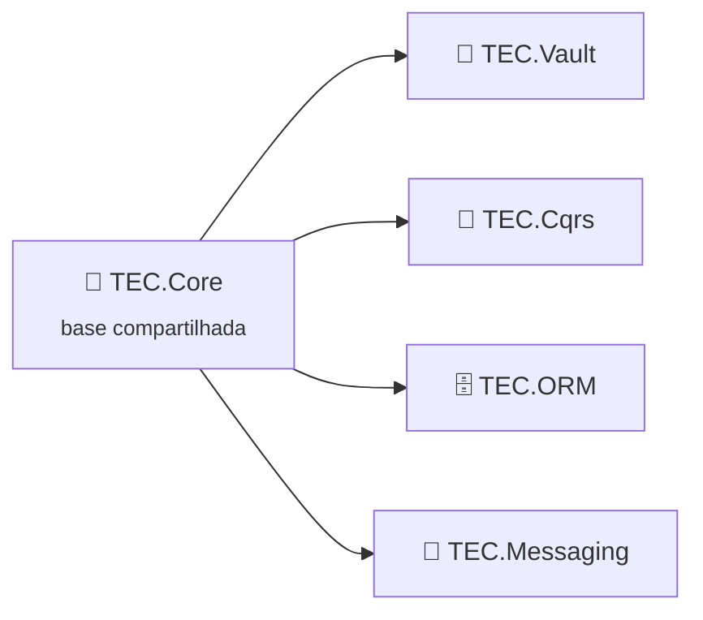

<div align="center">


[🏠 Tudo em Código](https://github.com/tudoemcodigo) › [📦 TEC.Core](https://github.com/tudoemcodigo/lib-tec-core)

# 🧰 TEC.Core

**Primitivas reutilizáveis para aplicações .NET brasileiras:** resultados e erros, respostas de API, documentos, datas e dias úteis, criptografia, CSV e concorrência.

A fundação dos componentes TEC · .NET 8 e 10 · Native AOT · sem dependências pesadas

[](https://github.com/tudoemcodigo/lib-tec-core/actions/workflows/ci.yml)
[](docs/compatibilidade.md)
[](docs/compatibilidade.md)
[](CHANGELOG.md)
[](https://github.com/orgs/tudoemcodigo/packages)
[](.github/workflows/README.md)
[](LICENSE)

[📥 Instalação](docs/instalacao.md) · [🚀 Início rápido](#-início-rápido) · [📚 Documentação](docs/README.md) · [📝 Changelog](CHANGELOG.md) · [⚙️ CI/CD](.github/workflows/README.md)

</div>

## 📑 Sumário

- [✨ Por que usar](#-por-que-usar)
- [📦 Pacote](#-pacote)
- [🧬 Ecossistema TEC](#-ecossistema-tec)
- [📥 Instalação](#-instalação)
- [🚀 Início rápido](#-início-rápido)
- [📚 Documentação](#-documentação)
- [⚡ Compatibilidade](#-compatibilidade)
- [🛡️ Segurança · 🧪 Testes](#️-segurança--testes)
- [🤝 Contribuição · 🏷️ Versionamento · 📄 Licença](#-contribuição--versionamento--licença)

---

## ✨ Por que usar

| Sem TEC.Core | Com TEC.Core |
|---|---|
| Tratamento de erro diferente em cada serviço | `Result`, `Error` e respostas padronizadas |
| Datas, documentos e formatos brasileiros reimplementados | Cultura pt-BR, CPF/CNPJ, feriados, dias úteis e valores por extenso |
| Criptografia e CSV feitos sob medida em cada aplicação | APIs seguras, versionadas e reutilizáveis com limites definidos |
| Utilitários comuns acoplados à infraestrutura | Primitivas .NET sem dependência de ASP.NET Core, banco ou nuvem |

O pacote usa APIs nativas do .NET sempre que possível e não depende de ASP.NET Core, banco de dados ou provedor de nuvem.

## 📦 Pacote

| Pacote | Para que serve | Quando instalar | Depende de |
|---|---|---|---|
| `TEC.Core` | Abstrações e implementações comuns para os componentes TEC e aplicações .NET | Sempre | `Microsoft.Extensions.DependencyInjection.Abstractions` |


```mermaid
flowchart LR
    C["🧰 TEC.Core<br/><sub>base compartilhada</sub>"] --> V["🔐 TEC.Vault"]
    C --> Q["🔀 TEC.Cqrs"]
    C --> O["🗄️ TEC.ORM"]
    C --> M["📨 TEC.Messaging"]
```

## 📥 Instalação

O pacote é distribuído no GitHub Packages. Configure o feed conforme [o guia de instalação](docs/instalacao.md) e autentique o NuGet com uma credencial que tenha leitura dos pacotes da organização.

```bash
dotnet add package TEC.Core --version 0.0.1
```

## 🚀 Início rápido

```csharp
using TEC.Core.Common.Results;

Result<string> result = Result<string>.Success("pronto");
string value = result.Value;
```

Para registrar as implementações suportadas no container de DI:

```csharp
using TEC.Core.DependencyInjection;

services.AddTecCore();
```

Veja exemplos completos e opções em [Common](docs/common.md), [Injeção de dependência](docs/injecao-dependencia.md) e nos demais guias.

## 📚 Documentação

- [Índice completo](docs/README.md)
- [Instalação e configuração do feed](docs/instalacao.md)
- [Compatibilidade, Native AOT e trimming](docs/compatibilidade.md)
- [Segurança e limites de responsabilidade](docs/seguranca.md)
- [Testes, carga e benchmarks](docs/testes.md)
- [Desenvolvimento e publicação](docs/desenvolvimento.md)
- [Decisões de arquitetura](docs/adr/README.md)
- [Samples](samples/README.md)
- [Pipelines e publicação](.github/workflows/README.md)

## ⚡ Compatibilidade

O pacote mira `net8.0` e `net10.0`. Compatibilidade com Native AOT e trimming é documentada e verificada no CI; consulte a [matriz de compatibilidade](docs/compatibilidade.md) para limites e detalhes por módulo.

## 🛡️ Segurança · 🧪 Testes

O TEC.Core implementa mecanismos reutilizáveis; cada aplicação continua responsável por configuração, autorização, gestão de chaves e tratamento de dados. Consulte [Segurança](docs/seguranca.md) antes de selecionar algoritmos ou definir armazenamento de segredos.

Para compilar e executar a suíte:

```powershell
dotnet restore TEC.Core.slnx
dotnet build TEC.Core.slnx -c Release
dotnet test --solution TEC.Core.slnx -c Release
```

## 🤝 Contribuição · 🏷️ Versionamento · 📄 Licença

- **Contribuição**: mudanças devem preservar os contratos públicos e incluir testes de comportamento; consulte [Desenvolvimento](docs/desenvolvimento.md) e [AGENTS.md](AGENTS.md).
- **Versionamento**: SemVer; a versão inicial deste projeto é `0.0.1`.
- **Licença**: [Apache 2.0](LICENSE) — consulte [NOTICE](NOTICE) para informações de atribuição.
