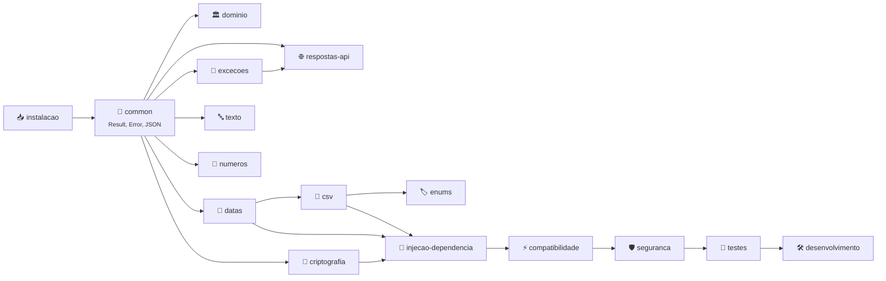
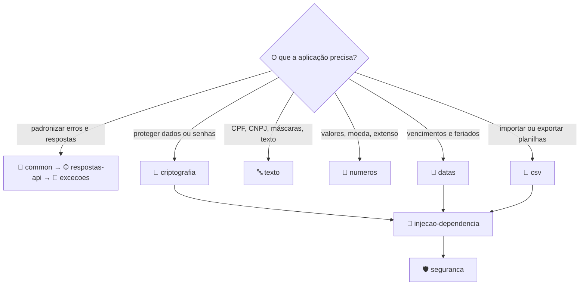

[🏠 TEC.Core](../README.md) › 📚 Documentação

# 📚 Documentação do TEC.Core

> Referência completa do pacote **TEC.Core**, um arquivo por tema: o README dá a visão geral; aqui ficam os detalhes.

## 📑 Sumário

- [🗂️ Temas](#️-temas)
- [🗺️ Mapa dos temas](#️-mapa-dos-temas)
- [🧭 Por onde começar](#-por-onde-começar)
- [📐 Convenções](#-convenções)

---

## 🗂️ Temas

| # | Arquivo | O que responde | Principais tipos |
|:-:|---|---|---|
| 1 | [📥 Instalação](instalacao.md) | Como configurar o feed, o `nuget.config`, o CI e o Docker do consumidor | — |
| 2 | [🧱 Common](common.md) | Como validar argumentos, retornar e compor sucesso/falha sem exceção e serializar JSON | `Guard`, `Result`, `Result<T>`, `Error`, `ErrorType`, `JsonDefaults`, `JsonExtensions`, `BrazilianCulture` |
| 3 | [🏛️ Domínio](dominio.md) | Como modelar agregados e registrar eventos de domínio sem depender da persistência | `DomainEntity<TId>`, `AggregateRoot<TId>`, `IDomainEvent`, `IHasDomainEvents` |
| 4 | [🌐 Respostas de API](respostas-api.md) | Como devolver o envelope padrão e paginar | `ApiResponse`, `ApiResponse<T>`, `PagedResponse<T>`, `ApiError`, `PagedResult<T>`, `PaginationInfo`, `PaginationExtensions` |
| 5 | [🚨 Exceções](excecoes.md) | Qual exceção lançar, que código e status HTTP ela gera | `AppException` e 10 derivadas |
| 6 | [🔤 Texto](texto.md) | Como validar, formatar, gerar e mascarar documentos; texto sem acento; Base64Url | `DocumentValidator`, `DocumentFormatter`, `DocumentGenerator`, `MaskFormatter`, `SensitiveDataMasker`, `StringExtensions`, `Base64UrlEncoder`, `BoundedFileReader` |
| 7 | [🔢 Números](numeros.md) | Como formatar R$ e percentual, arredondar e escrever por extenso | `NumericExtensions`, `NumberToWordsConverter` |
| 8 | [📅 Datas e dias úteis](datas.md) | Como formatar datas, calcular dias úteis, carregar feriados e usar o horário de Brasília | `DateFormatter`, `DateExtensions`, `BusinessDayCalculator`, `HolidayCalendar`, fontes de feriados, `BrazilTimeZone` |
| 9 | [🔐 Criptografia](criptografia.md) | Qual algoritmo usar; como cifrar, assinar, guardar senhas e gerar tokens | `AesGcmCryptography`, `RsaCryptography`, `HybridCryptography`, `Pbkdf2PasswordHasher`, `HashHelper`, `SecureRandomGenerator` |
| 10 | [📄 CSV](csv.md) | Como importar e exportar planilhas em streaming, com segurança | `CsvReader`, `CsvWriter`, `CsvOptions`, `[CsvColumn]`, `[CsvIgnore]`, `CsvException` |
| 11 | [🏷️ Enums](enums.md) | Como obter descrições, listas para combos e converter texto | `EnumHelper`, `EnumExtensions`, `EnumItem<TEnum>` |
| 12 | [🧩 Injeção de dependência](injecao-dependencia.md) | O que é registrado no container e como configurar | `AddTecCore`, `TecCoreOptions`, `AddBusinessDayCalculator` |
| 13 | [⚡ Compatibilidade](compatibilidade.md) | O que muda entre .NET 8 e 10, Native AOT, containers, thread-safety e observabilidade | — |
| 14 | [🔀 Concorrência](concorrencia.md) | Como evitar execuções simultâneas da mesma operação cara (cache stampede) | `SingleFlight<TKey, TValue>` |
| 15 | [🛡️ Segurança](seguranca.md) | O que o componente garante, o que é sua responsabilidade; identidade da operação | `ICurrentUser`, `PrincipalKind` |
| 16 | [🧪 Testes](testes.md) | Categorias, como rodar local e no CI, variáveis `TEC_CARGA_*`, carga e benchmarks | — |
| 17 | [🛠️ Desenvolvimento](desenvolvimento.md) | Como compilar, testar mudanças nos dependentes com o modo local (`-p:TecUseLocalProjects=true`), lock files, contribuição e publicação | — |

Fora de `docs/`: [🧰 Samples](../samples/README.md) (API de exemplo e gerador de carga) · [⚙️ CI/CD](../.github/workflows/README.md) (workflows e publicação) · [📝 Changelog](../CHANGELOG.md).

---

## 🗺️ Mapa dos temas

As setas indicam dependência de leitura: `datas` usa o `csv` para fontes de feriados em arquivo; `csv` usa as regras de `enums`; `respostas-api` converte `Result` e exceções.

---

## 🧭 Por onde começar

---

## 📐 Convenções

| Convenção | Significado |
|---|---|
| Fonte da verdade | O código de `TEC.Core/`: nomes, assinaturas, padrões e mensagens foram conferidos nele |
| Estrutura de cada tema | 🎯 Visão geral · 🚀 Uso (um `###` por tipo público, com tabela de membros e exemplos) · ⚙️ Opções · ❌ Erros · 🛡️ Segurança · ❓ Perguntas frequentes |
| Exemplos | Identificadores em inglês, comentários em português; compilam com a API atual |
| Placeholders | Valores entre `< >` (ex.: `<usuario>`, `<PAT>`) devem ser trocados pelos do seu ambiente |
| Alertas | `[!NOTE]` detalhe · `[!TIP]` boa prática · `[!IMPORTANT]` requisito · `[!WARNING]` armadilha · `[!CAUTION]` risco de segurança ou perda de dados |
| ⚠️ AOT | Membro com `[RequiresUnreferencedCode]`/`[RequiresDynamicCode]`: gera aviso em apps com trimming ou Native AOT |
| `CancellationToken` | Omitido das tabelas quando é o último parâmetro opcional (`cancellationToken = default`) |

---

[🏠 README](../README.md) · [Primeiro tema: Instalação](instalacao.md) ➡️
