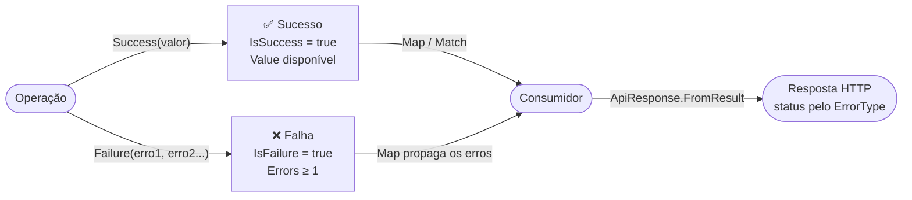

[🏠 TEC.Core](../README.md) › [📚 Documentação](README.md) › Common

# 🧱 Common

> Blocos básicos usados por todo o componente: validação de argumentos, sucesso ou falha sem exceções, categorias de erro com status HTTP, JSON padronizado e cultura pt-BR que funciona em qualquer ambiente.

## 📑 Sumário

- [🎯 Visão geral](#-visão-geral)
- [🚀 Uso](#-uso)
  - [Guard](#guard)
  - [Result e Result&lt;T&gt;](#result-e-resultt)
  - [Error](#error)
  - [ErrorType e ErrorTypeExtensions](#errortype-e-errortypeextensions)
  - [JsonDefaults](#jsondefaults)
  - [JsonExtensions](#jsonextensions)
  - [BrazilianCulture](#brazilianculture)
- [⚙️ Opções](#️-opções)
- [❌ Erros](#-erros)
- [🛡️ Segurança](#️-segurança)
- [❓ Perguntas frequentes](#-perguntas-frequentes)

---

## 🎯 Visão geral

| Namespace | Tipos públicos | Para que serve |
|---|---|---|
| `TEC.Core.Common.Guards` | `Guard` | Validar argumentos e falhar cedo com mensagem clara |
| `TEC.Core.Common.Results` | `Result`, `Result<T>`, `Error`, `ErrorType`, `ErrorTypeExtensions` | Retornar sucesso ou falha sem exceção, com categoria de erro e status HTTP |
| `TEC.Core.Common.Serialization` | `JsonDefaults`, `JsonExtensions` | JSON padronizado (camelCase, enums estritos, nulos omitidos), com caminho compatível com Native AOT |
| `TEC.Core.Common.Globalization` | `BrazilianCulture` | Cultura pt-BR que funciona mesmo sem ICU |



> [!NOTE]
> O conversor estrito de enums (`StrictEnumConverter<TEnum>`) e a validação do separador de milhar (`NumberGrouping`) são `internal`: o primeiro é exposto por [`JsonDefaults.CreateEnumConverter<TEnum>()`](#jsondefaults) e o segundo é usado por [`TryParseBrazilianDecimal`](numeros.md#numericextensions).

---

## 🚀 Uso

### Guard

> `TEC.Core.Common.Guards` · `static class`

Validação padronizada de argumentos, para o início de construtores e métodos públicos. Todos os métodos, exceto `Against`, **retornam o valor validado**, o que permite validar e atribuir na mesma linha.

| Membro | Retorno | Descrição |
|---|---|---|
| `NotNull<T>(T? value, string? paramName = null) where T : class` | `T` | Garante que o valor não seja nulo e o retorna (somente tipos por referência) |
| `NotNullOrWhiteSpace(string? value, string? paramName = null)` | `string` | Garante texto não nulo, não vazio e não composto só de espaços |
| `NotEmpty<T>(IReadOnlyCollection<T>? value, string? paramName = null)` | `IReadOnlyCollection<T>` | Garante coleção não nula e com ao menos um item |
| `InRange<T>(T value, T min, T max, string? paramName = null) where T : IComparable<T>` | `T` | Garante `min ≤ value ≤ max` (inclusive); `min > max` também lança |
| `Positive(int value, string? paramName = null)` | `int` | Garante `value > 0` |
| `Against(bool condition, string message, string? paramName = null)` | `void` | Lança `ArgumentException` se a condição for **verdadeira** |

Em `NotNull`, `NotNullOrWhiteSpace`, `NotEmpty`, `InRange` e `Positive`, o `paramName` é preenchido pelo compilador (`[CallerArgumentExpression]`) com o **texto da expressão** passada: não é preciso `nameof`. Em `Against` **não há preenchimento automático**: passe `nameof(...)` no terceiro argumento para que a exceção indique o parâmetro.

```csharp
using TEC.Core.Common.Guards;

public sealed class TransferService(IAccountRepository accounts)
{
    private readonly IAccountRepository _accounts = Guard.NotNull(accounts);   // valida e atribui

    public void Transfer(string source, string target, decimal amount, int installments, IReadOnlyCollection<string> approvers)
    {
        Guard.NotNullOrWhiteSpace(source);
        Guard.NotNullOrWhiteSpace(target);
        Guard.Against(source == target, "A conta de destino deve ser diferente da origem.", nameof(target));
        Guard.InRange(amount, 0.01m, 50_000m);     // qualquer IComparable<T>
        Guard.InRange(installments, 1, 12);        // ArgumentOutOfRangeException (Parameter 'installments')
        Guard.NotEmpty(approvers);
        // ...
    }
}
```

| Chamada | Resultado |
|---|---|
| `Guard.InRange(age, 1, 10)` com `age = 15` | `ArgumentOutOfRangeException`: *O valor deve estar entre 1 e 10. (Parameter 'age')* — o valor recebido **não** entra na mensagem |
| `Guard.NotEmpty(items)` com lista vazia | `ArgumentException`: *A coleção não pode ser vazia. (Parameter 'items')* |
| `Guard.Against(start > end, "Início maior que fim.", nameof(start))` | `ArgumentException`: *Início maior que fim. (Parameter 'start')* |
| `Guard.Against(start > end, "Início maior que fim.")` | `ArgumentException` com `ParamName = null` |

> [!WARNING]
> O nome automático é o **texto da expressão**. Ao validar uma expressão (ex.: `Guard.NotEmpty(files?.ToList())`), informe o nome: `Guard.NotEmpty(files?.ToList(), nameof(files))`; caso contrário o `ParamName` seria `"files?.ToList()"`.

### Result e Result&lt;T&gt;

> `TEC.Core.Common.Results` · `class` (`Result`) e `sealed class` (`Result<T> : Result`)

Representa o resultado de uma operação **sem lançar exceções**, com um ou mais erros tipados. Indicado para fluxos esperados (validações, regras de negócio, busca sem resultado). Os objetos são imutáveis. O construtor de `Result` é `private protected`: só `Result<T>` deriva dele, e o consumidor cria instâncias pelas fábricas e conversões implícitas.

**`Result`**

| Membro | Retorno | Descrição |
|---|---|---|
| `IsSuccess` / `IsFailure` | `bool` | Sucesso ou falha |
| `Errors` | `IReadOnlyList<Error>` | Erros da falha (vazia em sucesso) |
| `Error` | `Error?` | Primeiro erro, ou `null` em sucesso |
| `static Success()` | `Result` | Sucesso sem valor (instância única) |
| `static Failure(params Error[] errors)` | `Result` | Falha com **ao menos um** erro |
| `static Success<T>(T value)` / `static Failure<T>(params Error[] errors)` | `Result<T>` | Atalhos para `Result<T>.Success` / `Result<T>.Failure` |
| `ToFailure()` | `Result` | Propaga os erros desta falha para um resultado sem valor |
| `ToFailure<TOut>()` | `Result<TOut>` | Propaga os erros desta falha para outro tipo de valor |
| `implicit operator Result(Error error)` | `Result` | Um `Error` pode ser retornado diretamente |

**`Result<T>`** (além dos herdados)

| Membro | Retorno | Descrição |
|---|---|---|
| `Value` | `T` | Valor do sucesso; em falha lança `InvalidOperationException` |
| `static Success(T value)` | `Result<T>` | Sucesso com valor |
| `static new Failure(params Error[] errors)` | `Result<T>` | Falha tipada |
| `Map<TOut>(Func<T, TOut> mapper)` | `Result<TOut>` | Transforma o valor no sucesso; propaga os erros na falha |
| `Match<TOut>(Func<T, TOut> onSuccess, Func<IReadOnlyList<Error>, TOut> onFailure)` | `TOut` | Executa uma das funções conforme o resultado |
| `implicit operator Result<T>(T value)` / `(Error error)` | `Result<T>` | Retorna valor ou erro diretamente |

Regras de consistência: sucesso **não pode** ter erros e falha **deve** ter ao menos um; a lista de erros é copiada (alterações posteriores no array do chamador não afetam o resultado); itens nulos geram `ArgumentException`.

```csharp
using TEC.Core.Common.Results;
using TEC.Core.Responses;

public async Task<Result<CustomerDto>> GetAsync(int id)
{
    var customer = await _repository.GetAsync(id);
    if (customer is null)
        return Error.NotFound("CLIENTE_NAO_ENCONTRADO", "Cliente não encontrado.");   // conversão implícita

    return customer.ToDto();                                                          // conversão implícita
}

// Consumo
var result = await service.GetAsync(42);

Result<string> name = result.Map(c => c.Name);                 // propaga os erros
if (result.IsFailure) return result.ToFailure<OrderDto>();     // mesmos erros, outro tipo de valor

string text = result.Match(
    c => $"Olá, {c.Name}",
    errors => $"falhou: {errors[0].Code}");                    // "falhou: CLIENTE_NAO_ENCONTRADO"

return ApiResponse<CustomerDto>.FromResult(result);            // 404 automaticamente
```

Use `Result` quando o erro faz parte do fluxo esperado e o chamador deve tratá-lo; use [exceções](excecoes.md#exceção-ou-result) para situações excepcionais que sobem até o tratamento global. As duas convergem no mesmo [`ApiResponse`](respostas-api.md#fromresult-e-fromexception).

### Error

> `TEC.Core.Common.Results` · `sealed record`

Erro de negócio ou de validação: `Error(string Code, string Message, ErrorType Type = ErrorType.Failure, string? Field = null)`. `Code` e `Message` são obrigatórios e `Type` precisa ser um valor definido; as validações valem também para cópias com `with` (`error with { Code = "" }` lança `ArgumentException`).

| Membro | Retorno | Descrição |
|---|---|---|
| `Code` | `string` | Código estável do erro |
| `Message` | `string` | Mensagem |
| `Type` | `ErrorType` | Categoria; define o status HTTP |
| `Field` | `string?` | Campo relacionado (validação) |

| Fábrica | `ErrorType` | HTTP |
|---|---|:---:|
| `Error.Validation(code, message, field?)` | `Validation` | 400 |
| `Error.Unauthorized(code, message)` | `Unauthorized` | 401 |
| `Error.Forbidden(code, message)` | `Forbidden` | 403 |
| `Error.NotFound(code, message)` | `NotFound` | 404 |
| `Error.Conflict(code, message)` | `Conflict` | 409 |
| `Error.BusinessRule(code, message)` | `BusinessRule` | 422 |
| `Error.TooManyRequests(code, message)` | `TooManyRequests` | 429 |
| `Error.Failure(code, message)` | `Failure` | 500 (mensagem nunca exposta) |
| `Error.ExternalService(code, message)` | `ExternalService` | 502 (mensagem nunca exposta) |

```csharp
var error = Error.Validation("CPF_INVALIDO", "CPF inválido.", field: "cpf");
```

> [!TIP]
> Convenção sugerida para `Code`: `MAIUSCULAS_COM_UNDERSCORE`, estável e sem dados variáveis. O front-end pode traduzir ou tratar pelo código.

### ErrorType e ErrorTypeExtensions

> `TEC.Core.Common.Results` · `enum` (`ErrorType`) e `static class` (`ErrorTypeExtensions`)

`ErrorType` centraliza **o status HTTP** e **se a mensagem pode ir ao cliente**.

| Membro | Retorno | Descrição |
|---|---|---|
| `ToHttpStatusCode(this ErrorType type)` | `int` | Status HTTP correspondente |
| `IsExposedToClient(this ErrorType type)` | `bool` | `false` para `Failure` e `ExternalService`; `true` para os demais |

| `ErrorType` | Valor | `ToHttpStatusCode()` | `IsExposedToClient()` |
|---|:---:|:---:|:---:|
| `Failure` | 0 | 500 | ❌ |
| `Validation` | 1 | 400 | ✅ |
| `NotFound` | 2 | 404 | ✅ |
| `Conflict` | 3 | 409 | ✅ |
| `Unauthorized` | 4 | 401 | ✅ |
| `Forbidden` | 5 | 403 | ✅ |
| `BusinessRule` | 6 | 422 | ✅ |
| `TooManyRequests` | 7 | 429 | ✅ |
| `ExternalService` | 8 | 502 | ❌ |

```csharp
ErrorType.BusinessRule.ToHttpStatusCode();       // 422
ErrorType.ExternalService.IsExposedToClient();   // false
```

### JsonDefaults

> `TEC.Core.Common.Serialization` · `static class`

Opções padrão do `System.Text.Json` usadas em todo o componente: as mesmas convenções em respostas, logs e integração entre serviços.

| Membro | Retorno | Descrição |
|---|---|---|
| `Options` | `JsonSerializerOptions` | Opções padrão, **somente leitura**, criadas no primeiro uso. Usa reflexão ⚠️ AOT |
| `IndentedOptions` | `JsonSerializerOptions` | Iguais às padrão, com indentação (logs/depuração). Somente leitura. ⚠️ AOT |
| `CreateOptions(bool writeIndented = false)` | `JsonSerializerOptions` | Cópia **editável** para customizações. Conversor de enum não genérico ⚠️ AOT (`[RequiresDynamicCode]`) |
| `CreateOptions(IJsonTypeInfoResolver? typeInfoResolver, bool writeIndented = false)` | `JsonSerializerOptions` | Mesma configuração para um `JsonSerializerContext` gerado (✅ trimming/Native AOT). Sem conversor de enum: registre cada enum com `CreateEnumConverter<TEnum>()` |
| `CreateEnumConverter<TEnum>() where TEnum : struct, Enum` | `JsonConverter<TEnum>` | Conversor de enum em camelCase que só aceita nomes de membros definidos (números, inclusive entre aspas, e combinações em enums sem `[Flags]` são recusados). ✅ AOT |

⚠️ AOT = marcado com `[RequiresUnreferencedCode]`/`[RequiresDynamicCode]`: gera aviso IL2026/IL3050 em apps com trimming ou Native AOT. A configuração aplicada está em [⚙️ Opções](#️-opções).

```csharp
using System.Text.Json;
using System.Text.Json.Serialization;
using TEC.Core.Common.Serialization;

// Customização sem alterar o comportamento global
var options = JsonDefaults.CreateOptions();
options.Converters.Add(new MyConverter());

// ASP.NET Core: mesmo padrão nos endpoints
builder.Services.ConfigureHttpJsonOptions(o =>
{
    o.SerializerOptions.PropertyNamingPolicy = JsonNamingPolicy.CamelCase;
    o.SerializerOptions.DefaultIgnoreCondition = JsonIgnoreCondition.WhenWritingNull;
    // Só nomes definidos: o JsonStringEnumConverter do .NET 8 aceita "999" (número entre aspas) e combinações por vírgula
    o.SerializerOptions.Converters.Add(JsonDefaults.CreateEnumConverter<OrderStatus>());
});
```

### JsonExtensions

> `TEC.Core.Common.Serialization` · `static class` (extensões)

Serialização e desserialização com as convenções de `JsonDefaults`, com sobrecargas por reflexão (⚠️ AOT) e sobrecargas compatíveis com Native AOT (✅).

| Membro | Retorno | Descrição |
|---|---|---|
| `ToJson<T>(this T value, bool indented = false)` | `string` | Serializa com `JsonDefaults` (⚠️ AOT) |
| `ToJson<T>(this T value, JsonTypeInfo<T> typeInfo)` | `string` | ✅ Serializa com metadados gerados |
| `ToJson<T>(this T value, JsonSerializerContext context)` | `string` | ✅ Usa o `JsonTypeInfo<T>` do contexto (opções do contexto) |
| `FromJson<T>(this string json)` | `T?` | Desserializa (⚠️ AOT) |
| `FromJson<T>(this string json, JsonTypeInfo<T> typeInfo)` / `(JsonSerializerContext context)` | `T?` | ✅ Mesmas exceções de `FromJson<T>` |
| `TryFromJson<T>(this string? json, out T? value)` | `bool` | `false` para JSON vazio, inválido, com UTF-16 inválido ou tipo não suportado (`NotSupportedException`), sem lançar (⚠️ AOT) |
| `TryFromJson<T>(this string? json, JsonTypeInfo<T> typeInfo, out T? value)` / `(JsonSerializerContext context, out T? value)` | `bool` | ✅ Mesmo comportamento |

```csharp
using TEC.Core.Common.Results;
using TEC.Core.Common.Serialization;

var obj = new { Name = "José <b>", Type = ErrorType.NotFound, Missing = (string?)null, Amount = 10.5m };

obj.ToJson();
// {"name":"José \u003Cb\u003E","type":"notFound","amount":10.5}   (acento legível; < e > escapados; nulo omitido)

"""{"code":"X","message":"Y","type":"validation"}""".FromJson<Error>();
// Error { Code = X, Message = Y, Type = Validation }

"""{"code":"X","message":"Y","type":1}""".FromJson<Error>();
// JsonException: enum numérico não é aceito

"{oops".TryFromJson<Error>(out var error);   // false, sem exceção
```

**Caminho compatível com Native AOT.** Com um contexto gerado criado sobre `JsonDefaults.CreateOptions(IJsonTypeInfoResolver?)`, o JSON é idêntico ao de `JsonDefaults.Options` (conferido nos testes, inclusive para `ApiResponse<T>` e `Error`):

```csharp
using System.Text.Json.Serialization;
using TEC.Core.Common.Results;
using TEC.Core.Common.Serialization;
using TEC.Core.Responses;

[JsonSerializable(typeof(Order))]
[JsonSerializable(typeof(ApiResponse<Order>))]
[JsonSerializable(typeof(Error))]
internal sealed partial class AppJsonContext : JsonSerializerContext;

// Uma vez (ex.: campo estático): mesmas convenções de JsonDefaults.Options
var options = JsonDefaults.CreateOptions(typeInfoResolver: null);
options.Converters.Add(JsonDefaults.CreateEnumConverter<ErrorType>());
options.Converters.Add(JsonDefaults.CreateEnumConverter<OrderStatus>());
var context = new AppJsonContext(options);   // o contexto se registra como resolvedor

string json = order.ToJson(context.Order);
Order? read = json.FromJson(context.Order);
bool ok = json.TryFromJson<Order>(context, out var parsed);
```

> [!NOTE]
> No ASP.NET Core com Native AOT, registre o contexto nos endpoints: `builder.Services.ConfigureHttpJsonOptions(o => o.SerializerOptions.TypeInfoResolverChain.Insert(0, AppJsonContext.Default));` (e os conversores de enum acima, para manter o padrão do TEC.Core). A matriz completa de AOT/trimming do componente está em [Compatibilidade](compatibilidade.md).

### BrazilianCulture

> `TEC.Core.Common.Globalization` · `static class`

| Membro | Retorno | Descrição |
|---|---|---|
| `Instance` | `CultureInfo` | Cultura pt-BR somente leitura, usada por todo o componente |

Em ambientes com `InvariantGlobalization=true` (comum em imagens Docker enxutas), `CultureInfo.GetCultureInfo("pt-BR")` lança `CultureNotFoundException`. Nesses casos, `Instance` devolve uma cultura equivalente montada manualmente: vírgula decimal, ponto de milhar, `R$ n`, `n%`, nomes de meses e dias em português, `dd/MM/yyyy`, `HH:mm`, domingo como primeiro dia da semana. A aplicação não quebra na inicialização.

```csharp
using TEC.Core.Common.Globalization;

1234.5m.ToString("N2", BrazilianCulture.Instance);   // "1.234,50"
1234.5m.ToString("C", BrazilianCulture.Instance);    // "R$ 1.234,50"
```

---

## ⚙️ Opções

O módulo não tem opções configuráveis em DI; os comportamentos fixos são:

| Item | Valor | Descrição |
|---|---|---|
| Base do `JsonDefaults` | `JsonSerializerDefaults.Web` | Leitura sem diferenciar maiúsculas nos nomes |
| Nomes de propriedade e de chave de dicionário | `camelCase` | |
| Enums | string em camelCase (`"notFound"`) | **Números não são aceitos** na leitura; nomes não definidos também não |
| Nulos | `WhenWritingNull` | Omitidos na escrita |
| Encoder | Basic Latin + Latin-1 + Latin Extended-A | Acentos legíveis; `< > & ' +` escapados |
| `MaxDepth` | 64 | Profundidade máxima do JSON |
| `Options` / `IndentedOptions` | somente leitura (`MakeReadOnly`) | Use `CreateOptions()` para customizar |
| `BrazilianCulture.Instance` | `pt-BR` do sistema ou fallback interno | Criada uma vez (`Lazy`) |

---

## ❌ Erros

| Exceção | Quando ocorre | O que fazer |
|---|---|---|
| `ArgumentNullException` | `Guard.NotNull`/`NotEmpty`/`NotNullOrWhiteSpace` com `null`; `Result` com lista de erros nula; `Map`/`Match` com função nula; `Error` com `Code`/`Message` nulos | Valide a entrada antes |
| `ArgumentException` | `NotNullOrWhiteSpace` com texto vazio; `NotEmpty` com coleção vazia (*A coleção não pode ser vazia.*); `InRange` com `min > max` (*O limite mínimo não pode ser maior que o máximo.*, `ParamName = "min"`); `Against` com condição verdadeira; item nulo nos erros do `Result` (*A lista de erros não pode conter itens nulos.*); `Error` com `Code`/`Message` vazios (inclusive via `with`) | Corrija o argumento indicado em `ParamName` |
| `ArgumentOutOfRangeException` | `InRange` fora do intervalo (*O valor deve estar entre {min} e {max}.*); `Positive` com zero ou negativo; `Error`/`ToHttpStatusCode` com `ErrorType` fora do enum (*Tipo de erro inválido.*) | Use valores dentro da faixa |
| `InvalidOperationException` | `Result.Failure()` sem erros (*Um resultado de falha deve conter ao menos um erro.*); `Value` em falha (*Não é possível acessar o valor de um resultado com falha.*); `ToFailure()` em sucesso (*Não é possível propagar os erros de um resultado de sucesso.*); alterar `JsonDefaults.Options`/`IndentedOptions`; sobrecarga com `JsonSerializerContext` sem `[JsonSerializable(typeof(T))]` | Verifique `IsSuccess` ou use `Match`; use `CreateOptions()`; inclua o tipo no contexto |
| `ArgumentException` (JSON) | `FromJson` com texto nulo, vazio, em branco ou UTF-16 inválido (surrogate isolado) | Use `TryFromJson` para entradas não confiáveis |
| `JsonException` | `FromJson` com JSON inválido ou incompatível; enum por número, nome não definido, combinação sem `[Flags]` ou bit não definido | Use `TryFromJson` para entradas não confiáveis |
| `NotSupportedException` | `FromJson` com tipo não suportado pelo serializador (ex.: abstrato) | `TryFromJson` retorna `false` |

`BrazilianCulture` não lança: na ausência da cultura do sistema, usa o fallback interno.

---

## 🛡️ Segurança

> [!IMPORTANT]
> `Failure` e `ExternalService` nunca expõem a mensagem ao cliente porque podem conter detalhes de infraestrutura (servidor, connection string, URL de terceiros). Veja [Respostas de API](respostas-api.md#fromresult-e-fromexception).

> [!WARNING]
> `Guard.InRange` não inclui o valor recebido na mensagem (ele pode ser dado pessoal ou conteúdo malicioso). Faça o mesmo nas mensagens de `Guard.Against`: descreva a regra, não repita a entrada.

> [!NOTE]
> As instâncias estáticas `JsonDefaults.Options`/`IndentedOptions` são imutáveis: nenhum código consegue alterar o comportamento global por engano. O encoder escapa `< > & ' +`, e enums numéricos ou não definidos são recusados na leitura (sem estados inválidos vindos de fora).

---

## ❓ Perguntas frequentes

<details>
<summary>A aplicação quebra com <code>CultureNotFoundException</code> em container</summary>

**Causa:** imagem com `InvariantGlobalization=true` e código chamando `CultureInfo.GetCultureInfo("pt-BR")`.
**Solução:** use `BrazilianCulture.Instance`, que monta uma cultura pt-BR equivalente quando o ICU não está disponível.

</details>

<details>
<summary>Avisos IL2026/IL3050 ao publicar com Native AOT</summary>

**Causa:** uso de `JsonDefaults.Options`, `IndentedOptions`, `CreateOptions(bool)` ou de `ToJson<T>(bool)`/`FromJson<T>()`/`TryFromJson<T>(out)`, que usam reflexão.
**Solução:** gere um `JsonSerializerContext` e use as sobrecargas com contexto ou `JsonTypeInfo<T>` (veja [JsonExtensions](#jsonextensions) e [Compatibilidade](compatibilidade.md)).

</details>

<details>
<summary>Por que o <code>ParamName</code> do <code>Guard.Against</code> veio nulo?</summary>

`Against` não preenche o nome automaticamente (a "expressão" seria a condição inteira, não um parâmetro). Passe `nameof(parametro)` no terceiro argumento.

</details>

<details>
<summary>Posso criar meu próprio tipo derivado de <code>Result</code>?</summary>

Não: o construtor é `private protected` para impedir subclasses com estado inválido. Use `Result`/`Result<T>` com `Error` e, para metadados extras, devolva-os dentro do valor de `Result<T>`.

</details>

---
⬅️ [Instalação](instalacao.md) · [📚 Índice](README.md) · [Respostas de API](respostas-api.md) ➡️
