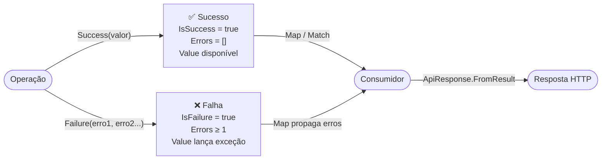

# 🧱 Common

[⬅ Índice](README.md) · [README](../README.md)

Blocos básicos usados por todo o componente: validação de argumentos, retorno de sucesso/falha sem exceções, serialização JSON padronizada e cultura pt-BR.

- [Guard](#guard)
- [Result e Result&lt;T&gt;](#result-e-resultt)
- [Error](#error)
- [ErrorType e ErrorTypeExtensions](#errortype-e-errortypeextensions)
- [JsonDefaults](#jsondefaults)
- [JsonExtensions](#jsonextensions)
- [BrazilianCulture](#brazilianculture)

---

## Guard

`TEC.Core.Common.Guards` · `static class`

Validação padronizada de argumentos. O nome do parâmetro é preenchido **automaticamente** via `[CallerArgumentExpression]`, então não é preciso usar `nameof`.

| Método | Descrição | Exceção |
|---|---|---|
| `T NotNull<T>(T? value) where T : class` | Garante que o valor não seja nulo e o retorna (somente tipos por referência). | `ArgumentNullException` |
| `string NotNullOrWhiteSpace(string? value)` | Garante string não nula, não vazia e não composta só de espaços. | `ArgumentException` / `ArgumentNullException` |
| `IReadOnlyCollection<T> NotEmpty<T>(IReadOnlyCollection<T>? value)` | Garante coleção não nula e com ao menos um item. | `ArgumentNullException` / `ArgumentException` |
| `T InRange<T>(T value, T min, T max)` | Garante `min ≤ value ≤ max`. `min > max` também lança. | `ArgumentOutOfRangeException` |
| `int Positive(int value)` | Garante `value > 0`. | `ArgumentOutOfRangeException` |
| `void Against(bool condition, string message)` | Lança se a condição for **verdadeira**. | `ArgumentException` |

> ⚠️ O nome automático é o **texto da expressão** passada. Ao validar uma expressão (ex.: `Guard.NotEmpty(arquivos?.ToList())`), informe o nome explicitamente: `Guard.NotEmpty(arquivos?.ToList(), nameof(arquivos))`; caso contrário o `ParamName` seria `"arquivos?.ToList()"`.

Todos os métodos, exceto `Against`, **retornam o valor validado**, o que permite validar e atribuir na mesma linha:

```csharp
public class ContaService(IContaRepository repo, ILogger<ContaService> logger)
{
    private readonly IContaRepository _repo = Guard.NotNull(repo);

    public void Transferir(string contaDestino, decimal valor, int parcelas)
    {
        Guard.NotNullOrWhiteSpace(contaDestino);
        Guard.InRange(parcelas, 1, 12);
        Guard.Against(valor <= 0, "O valor deve ser positivo.");
    }
}
```

| Chamada | Resultado |
|---|---|
| `Guard.InRange(idade, 1, 10)` com `idade = 15` | `ArgumentOutOfRangeException`: *O valor deve estar entre 1 e 10. (Parameter 'idade')* |
| `Guard.NotEmpty(itens)` com lista vazia | `ArgumentException`: *A coleção não pode ser vazia. (Parameter 'itens')* |
| `Guard.Against(inicio > fim, "Início maior que fim.")` | `ArgumentException`: *Início maior que fim. (Parameter 'inicio > fim')* |

> ⚠️ Em `Against`, o "nome do parâmetro" é a **expressão** da condição (`inicio > fim`). Para um nome específico, passe o terceiro argumento: `Guard.Against(cond, "msg", nameof(inicio))`.

---

## Result e Result&lt;T&gt;

`TEC.Core.Common.Results` · `class Result` / `sealed class Result<T> : Result`

Representa o resultado de uma operação **sem lançar exceções**. É indicado para fluxos esperados, como validações e regras de negócio. Os objetos são imutáveis.



### Membros de `Result`

| Membro | Descrição |
|---|---|
| `bool IsSuccess` | `true` quando a operação foi bem-sucedida. |
| `bool IsFailure` | Inverso de `IsSuccess`. |
| `IReadOnlyList<Error> Errors` | Erros da falha (vazia em caso de sucesso). |
| `Error? Error` | Primeiro erro, ou `null` em caso de sucesso. |
| `static Result Success()` | Sucesso sem valor (instância única). |
| `static Result Failure(params Error[] errors)` | Falha com **ao menos um** erro. |
| `static Result<T> Success<T>(T value)` | Atalho para `Result<T>.Success`. |
| `static Result<T> Failure<T>(params Error[] errors)` | Atalho para `Result<T>.Failure`. |
| `implicit operator Result(Error error)` | Um `Error` pode ser retornado diretamente como `Result`. |

### Membros adicionais de `Result<T>`

| Membro | Descrição |
|---|---|
| `T Value` | Valor em caso de sucesso. ⚠️ Lança `InvalidOperationException` se acessado em falha. |
| `static Result<T> Success(T value)` | Cria um sucesso com valor. |
| `static Result<T> Failure(params Error[] errors)` | Cria uma falha tipada. |
| `Result<TOut> Map<TOut>(Func<T, TOut> mapper)` | Transforma o valor em caso de sucesso e propaga os erros em caso de falha. |
| `TOut Match<TOut>(Func<T, TOut> onSuccess, Func<IReadOnlyList<Error>, TOut> onFailure)` | Executa uma das funções conforme o resultado. |
| `implicit operator Result<T>(T value)` | Retorna o valor diretamente. |
| `implicit operator Result<T>(Error error)` | Retorna o erro diretamente. |

### Regras de consistência

- Sucesso **não pode** ter erros; falha **deve** ter ao menos um. `Result.Failure()` lança `InvalidOperationException`.
- A lista de erros é copiada, então alterações posteriores no array do chamador não afetam o resultado.
- Itens nulos na lista geram `ArgumentException`.

### Exemplo

```csharp
public async Task<Result<ClienteDto>> ObterAsync(int id)
{
    var cliente = await _repo.ObterAsync(id);
    if (cliente is null)
        return Error.NotFound("CLIENTE_NAO_ENCONTRADO", "Cliente não encontrado.");   // conversão implícita

    return cliente.ToDto();                                                             // conversão implícita
}

// Consumo
var result = await service.ObterAsync(42);

var nome = result.Map(c => c.Nome);                        // Result<string>
if (result.IsFailure) return result.ToFailure<PedidoDto>(); // mesmos erros, outro tipo de valor
var texto = result.Match(
    c => $"Olá, {c.Nome}",
    erros => $"falhou: {erros[0].Code}");                  // "falhou: CLIENTE_NAO_ENCONTRADO"

return ApiResponse<ClienteDto>.FromResult(result);         // 404 automaticamente
```

---

## Error

`TEC.Core.Common.Results` · `sealed record Error(string Code, string Message, ErrorType Type = Failure, string? Field = null)`

Erro de negócio ou de validação. `Code` e `Message` são obrigatórios (não podem ser vazios). Um `Type` fora do enum gera `ArgumentOutOfRangeException`. As mesmas validações valem para cópias com `with` (`erro with { Code = "" }` lança `ArgumentException`).

| Fábrica | `ErrorType` | HTTP |
|---|---|:---:|
| `Error.Failure(code, message)` | `Failure` | 500 |
| `Error.Validation(code, message, field?)` | `Validation` | 400 |
| `Error.NotFound(code, message)` | `NotFound` | 404 |
| `Error.Conflict(code, message)` | `Conflict` | 409 |
| `Error.Unauthorized(code, message)` | `Unauthorized` | 401 |
| `Error.Forbidden(code, message)` | `Forbidden` | 403 |
| `Error.BusinessRule(code, message)` | `BusinessRule` | 422 |
| `Error.TooManyRequests(code, message)` | `TooManyRequests` | 429 |
| `Error.ExternalService(code, message)` | `ExternalService` | 502 |

```csharp
var erro = Error.Validation("CPF_INVALIDO", "CPF inválido.", field: "cpf");
```

> 💡 Convenção sugerida para `Code`: `MAIUSCULAS_COM_UNDERSCORE`, estável e sem dados variáveis. O front-end pode traduzir ou tratar pelo código.

---

## ErrorType e ErrorTypeExtensions

`TEC.Core.Common.Results`

`ErrorType` centraliza **o status HTTP** e **se a mensagem pode ir ao cliente**:

| `ErrorType` | Valor | `ToHttpStatusCode()` | `IsExposedToClient()` |
|---|:---:|:---:|:---:|
| `Failure` | 0 | 500 | ❌ |
| `Validation` | 1 | 400 | ✅ |
| `NotFound` | 2 | 404 | ✅ |
| `Conflict` | 3 | 409 | ✅ |
| `Unauthorized` | 4 | 401 | ✅ |
| `Forbidden` | 5 | 403 | ✅ |
| `BusinessRule` | 6 | 422 | ✅ |
| `TooManyRequests` | 7 | 429 | ✅ |
| `ExternalService` | 8 | 502 | ❌ |

```csharp
ErrorType.BusinessRule.ToHttpStatusCode();       // 422
ErrorType.ExternalService.IsExposedToClient();   // false
```

🔒 `Failure` e `ExternalService` nunca expõem a mensagem porque podem conter detalhes de infraestrutura (servidor, connection string, URL de terceiros).

---

## JsonDefaults

`TEC.Core.Common.Serialization` · `static class`

Opções padrão do `System.Text.Json` usadas em todo o componente.

| Membro | Descrição |
|---|---|
| `JsonSerializerOptions Options` | Opções padrão, **somente leitura**. Usa reflexão ⚠️ AOT. |
| `JsonSerializerOptions IndentedOptions` | Iguais às padrão, com indentação (logs/depuração). Somente leitura. Usa reflexão ⚠️ AOT. |
| `JsonSerializerOptions CreateOptions(bool writeIndented = false)` | Cria uma cópia **editável** para customizações. Conversor de enum não genérico ⚠️ AOT. |
| `JsonSerializerOptions CreateOptions(IJsonTypeInfoResolver? typeInfoResolver, bool writeIndented = false)` | Mesma configuração, para um `JsonSerializerContext` gerado (✅ trimming/Native AOT). Sem conversor de enum: registre cada enum com `CreateEnumConverter<TEnum>()`. |
| `JsonConverter<TEnum> CreateEnumConverter<TEnum>()` | Conversor de enum em camelCase que só aceita nomes de membros definidos (mesma regra de `Options`): números, inclusive entre aspas, e combinações em enums sem `[Flags]` são recusados. Compatível com AOT. |

⚠️ AOT = marcado com `[RequiresUnreferencedCode]`/`[RequiresDynamicCode]`: gera aviso IL2026/IL3050 em apps com trimming ou Native AOT. Veja [Native AOT](#native-aot-e-trimming).

Configuração aplicada:

| Opção | Valor |
|---|---|
| Base | `JsonSerializerDefaults.Web` |
| Nomes de propriedade e de chave de dicionário | `camelCase` |
| Enums | string em camelCase (`"notFound"`); **números não são aceitos** na leitura |
| Nulos | omitidos na escrita (`WhenWritingNull`) |
| Encoder | acentos legíveis (Latin-1 e Latin Extended-A); `< > & ' +` escapados |
| `MaxDepth` | 64 |

```csharp
// Customização sem alterar o comportamento global
var options = JsonDefaults.CreateOptions();
options.Converters.Add(new MeuConverter());

// ASP.NET Core: usar o mesmo padrão nos endpoints
builder.Services.ConfigureHttpJsonOptions(o =>
{
    o.SerializerOptions.PropertyNamingPolicy = JsonNamingPolicy.CamelCase;
    o.SerializerOptions.DefaultIgnoreCondition = JsonIgnoreCondition.WhenWritingNull;
    // Só nomes de membros definidos: o JsonStringEnumConverter do .NET 8 aceita "999" (número entre aspas) e combinações por vírgula
    o.SerializerOptions.Converters.Add(JsonDefaults.CreateEnumConverter<StatusPedido>());
});
```

🔒 As instâncias estáticas são imutáveis (`MakeReadOnly`): nenhum código consegue alterar o comportamento global por engano.

---

## JsonExtensions

`TEC.Core.Common.Serialization` · métodos de extensão

| Método | Descrição |
|---|---|
| `string ToJson<T>(this T value, bool indented = false)` | Serializa com `JsonDefaults`. |
| `T? FromJson<T>(this string json)` | Desserializa. Lança `ArgumentException` (JSON vazio) ou `JsonException` (inválido). |
| `bool TryFromJson<T>(this string? json, out T? value)` | Retorna `false` para JSON vazio, inválido ou para tipo não suportado pelo serializador (`NotSupportedException`, ex.: tipo abstrato), sem lançar. |
| `ToJson<T>(this T value, JsonTypeInfo<T> typeInfo)` / `ToJson<T>(this T value, JsonSerializerContext context)` | ✅ AOT: serializa com metadados gerados (opções do contexto). |
| `FromJson<T>(this string json, JsonTypeInfo<T> typeInfo)` / `FromJson<T>(this string json, JsonSerializerContext context)` | ✅ AOT: mesmas exceções de `FromJson<T>`. |
| `TryFromJson<T>(this string? json, JsonTypeInfo<T> typeInfo, out T? value)` / `TryFromJson<T>(this string? json, JsonSerializerContext context, out T? value)` | ✅ AOT: retorna `false` para JSON vazio, inválido ou incompatível. |

As sobrecargas sem metadados (`ToJson<T>(bool)`, `FromJson<T>()`, `TryFromJson<T>(out)`) usam reflexão (⚠️ AOT). As sobrecargas com `JsonSerializerContext` lançam `InvalidOperationException` se o contexto não tiver `[JsonSerializable(typeof(T))]`.

```csharp
var obj = new { Nome = "José <b>", Tipo = ErrorType.NotFound, Nulo = (string?)null, Valor = 10.5m };

obj.ToJson();
// {"nome":"José <b>","tipo":"notFound","valor":10.5}   (acento legível; < e > escapados)

"""{"code":"X","message":"Y","type":"validation"}""".FromJson<Error>();
// Error { Code = X, Message = Y, Type = Validation }

"""{"code":"X","message":"Y","type":1}""".FromJson<Error>();
// JsonException: enum numérico não é aceito

"{oops".TryFromJson<Error>(out var e);   // false
```

### Native AOT e trimming

Com um contexto gerado criado sobre `JsonDefaults.CreateOptions(IJsonTypeInfoResolver?)`, o JSON é idêntico ao de `JsonDefaults.Options` (conferido nos testes, inclusive para `ApiResponse<T>` e `Error`):

```csharp
[JsonSerializable(typeof(Pedido))]
[JsonSerializable(typeof(ApiResponse<Pedido>))]
[JsonSerializable(typeof(Error))]
internal sealed partial class AppJsonContext : JsonSerializerContext;

// Uma vez (ex.: campo estático): mesmas convenções de JsonDefaults.Options
var options = JsonDefaults.CreateOptions(typeInfoResolver: null);
options.Converters.Add(JsonDefaults.CreateEnumConverter<ErrorType>());
options.Converters.Add(JsonDefaults.CreateEnumConverter<StatusPedido>());
var context = new AppJsonContext(options);   // o contexto se registra como resolvedor

string json = pedido.ToJson(context.Pedido);
Pedido? lido = json.FromJson(context.Pedido);
bool ok = json.TryFromJson<Pedido>(context, out var p);
```

> [!NOTE]
> No ASP.NET Core com Native AOT, registre o contexto nos endpoints: `builder.Services.ConfigureHttpJsonOptions(o => o.SerializerOptions.TypeInfoResolverChain.Insert(0, AppJsonContext.Default));` (e os conversores de enum acima, para manter o padrão do TEC.Core).

---

## BrazilianCulture

`TEC.Core.Common.Globalization` · `static class`

| Membro | Descrição |
|---|---|
| `CultureInfo Instance` | Cultura pt-BR somente leitura, usada por todo o componente. |

Em ambientes com `InvariantGlobalization=true` (comum em imagens Docker enxutas), `CultureInfo.GetCultureInfo("pt-BR")` lança exceção. Nesses casos, `Instance` devolve uma cultura equivalente montada manualmente, com vírgula decimal, `R$`, nomes de meses e dias em português e o padrão `dd/MM/yyyy`. Assim a aplicação não quebra na inicialização.

```csharp
1234.5m.ToString("N2", BrazilianCulture.Instance);   // "1.234,50"
```
