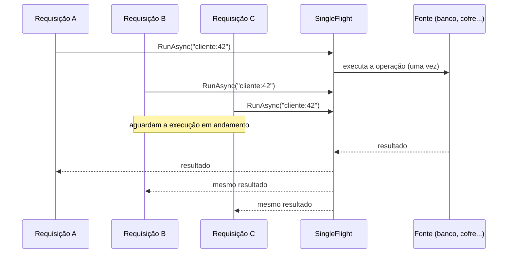

[🏠 TEC.Core](../README.md) › [📚 Documentação](README.md) › Concorrência

# 🔀 Concorrência

> Uma única execução por chave de uma operação assíncrona cara (consulta a banco, cofre, provedor de identidade), mesmo com milhares de requisições simultâneas.

## 📑 Sumário

- [🎯 Visão geral](#-visão-geral)
- [🚀 Uso](#-uso)
- [⚙️ Opções](#️-opções)
- [❌ Erros](#-erros)
- [🛡️ Segurança](#️-segurança)
- [❓ Perguntas frequentes](#-perguntas-frequentes)

---

## 🎯 Visão geral

Quando um cache expira, todas as requisições que chegam juntas vão à fonte ao mesmo tempo (*cache stampede*): o banco ou o provedor recebe uma rajada, fica lento e o problema se agrava. `TEC.Core.Threading.SingleFlight<TKey, TValue>` garante que, para a mesma chave, só **uma** execução esteja em andamento; as demais chamadas aguardam o mesmo resultado.



| Garantia | Detalhe |
|---|---|
| 1️⃣ Uma execução por chave | Chamadas simultâneas com a mesma chave compartilham a execução |
| 🔑 Chaves independentes | Chaves diferentes executam em paralelo, sem disputa |
| 🧹 Nada guardado | Terminada a execução, a próxima chamada executa de novo: combine com um cache |
| 💥 Exceções | Chegam a todos que aguardavam; não ficam guardadas |
| 🛑 Cancelamento justo | Cada chamador desiste da **própria** espera; a operação só é cancelada quando **todos** desistiram |
| 🧵 Thread-safe | Trava curta por chamada, nunca durante a operação |

## 🚀 Uso

Padrão típico: cache na frente, `SingleFlight` entre o cache e a fonte, gravação no cache **dentro** da operação.

```csharp
using Microsoft.Extensions.Caching.Memory;
using TEC.Core.Threading;

public sealed class CustomerReader(ICustomerRepository repository, IMemoryCache cache)
{
    // Uma instância por serviço (singleton): é ela que coordena as chamadas simultâneas
    private readonly SingleFlight<int, Customer> _loading = new();

    public async Task<Customer> GetAsync(int id, CancellationToken cancellationToken)
    {
        if (cache.TryGetValue(id, out Customer? cached) && cached is not null)
            return cached;

        return await _loading.RunAsync(id, async (key, ct) =>
        {
            // ct é cancelado só quando TODAS as requisições que aguardam desistirem
            var customer = await repository.GetAsync(key, ct);
            cache.Set(key, customer, TimeSpan.FromMinutes(5));
            return customer;
        }, cancellationToken);
    }
}
```

> [!IMPORTANT]
> A coordenação vale **dentro da mesma instância** de `SingleFlight`. Registre o serviço que a contém como singleton
> (ou guarde a instância num singleton): uma instância nova por requisição não coordena nada.

> [!TIP]
> Com chaves `string`, passe o comparador: `new SingleFlight<string, Token>(StringComparer.Ordinal)`.

## ⚙️ Opções

| Membro | Descrição |
|---|---|
| `SingleFlight(IEqualityComparer<TKey>? comparer = null)` | Cria a coordenação; `comparer` define a igualdade das chaves |
| `Task<TValue> RunAsync(TKey key, Func<TKey, CancellationToken, Task<TValue>> operation, CancellationToken cancellationToken = default)` | Executa ou aguarda a execução em andamento da chave |
| `int InFlightCount` | Execuções em andamento (diagnóstico e testes) |

## ❌ Erros

| Situação | O que acontece |
|---|---|
| `key` ou `operation` nulos | `ArgumentNullException` |
| O próprio `cancellationToken` cancelado | `OperationCanceledException` só para esse chamador; os demais continuam aguardando |
| Todos os chamadores desistiram | O token da operação é cancelado; a chave fica livre para uma nova execução |
| A operação lança exceção | A mesma exceção chega a todos que aguardavam; a próxima chamada executa de novo |

## 🛡️ Segurança

> [!WARNING]
> A chave decide quem compartilha o resultado. Inclua nela **tudo** que diferencia o resultado (tenant, usuário, papéis,
> escopos): chaves amplas demais entregariam o resultado de uma identidade para outra. Para dados sensíveis, use um hash
> de tamanho fixo das partes (ex.: SHA-256 em Base64Url), como o cache de permissões do TEC.Security.

- A operação roda fora do contexto síncrono de quem chamou e nunca dentro da trava interna.
- Use um tempo limite na própria operação (ex.: `HttpClient.Timeout`): enquanto houver alguém aguardando, ela não é cancelada por quem desistiu.

## ❓ Perguntas frequentes

<details>
<summary>Por que não usar <code>Lazy&lt;Task&gt;</code> num <code>ConcurrentDictionary</code>?</summary>

É o padrão clássico, mas a operação recebe o token de quem chegou primeiro: se essa requisição cancelar, todas as outras recebem o cancelamento. O `SingleFlight` usa um token próprio, cancelado só quando todos desistem, e remove a entrada com segurança mesmo quando outra execução já ocupou a chave.
</details>

<details>
<summary>Ele substitui o cache?</summary>

Não. Ele só evita execuções simultâneas; o resultado não é guardado. Grave no cache dentro da operação, como no exemplo.
</details>

---

⬅️ [Anterior: Compatibilidade](compatibilidade.md) · [📚 Índice](README.md) · [Próximo: Segurança](seguranca.md) ➡️
