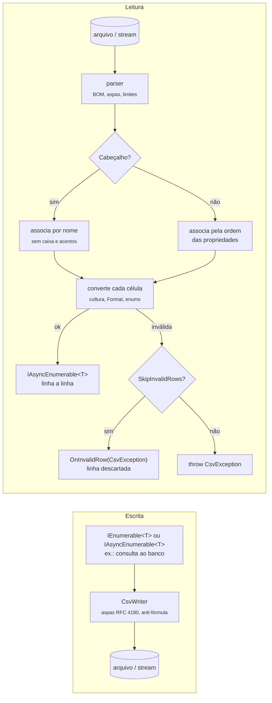

[🏠 TEC.Core](../README.md) › [📚 Documentação](README.md) › CSV

# 📄 CSV

> Lê e escreve planilhas CSV tipadas linha a linha, sem carregar o arquivo inteiro em memória, compatíveis com o Excel em português e protegidas contra injeção de fórmulas.

## 📑 Sumário

- [🎯 Visão geral](#-visão-geral)
  - [Regras de mapeamento](#regras-de-mapeamento)
  - [Tipos suportados](#tipos-suportados)
- [🚀 Uso](#-uso)
  - [CsvColumnAttribute e CsvIgnoreAttribute](#csvcolumnattribute-e-csvignoreattribute)
  - [CsvWriter](#csvwriter)
  - [CsvReader](#csvreader)
  - [ICsvReader e ICsvWriter](#icsvreader-e-icsvwriter)
  - [CsvOptions](#csvoptions)
  - [CsvEnumFormat](#csvenumformat)
  - [CsvException](#csvexception)
  - [Proteção contra injeção de fórmulas](#proteção-contra-injeção-de-fórmulas)
  - [Native AOT e trimming](#native-aot-e-trimming)
- [⚙️ Opções](#️-opções)
- [❌ Erros](#-erros)
- [🛡️ Segurança](#️-segurança)
- [❓ Perguntas frequentes](#-perguntas-frequentes)

---

## 🎯 Visão geral

| Namespace | Tipos públicos | Para que serve |
|---|---|---|
| `TEC.Core.Csv` | `CsvReader`, `CsvWriter`, `CsvOptions`, `CsvEnumFormat`, `CsvException` | Leitura e escrita, configurações e erros com linha/coluna |
| `TEC.Core.Csv.Abstractions` | `ICsvReader`, `ICsvWriter` | Contratos para injeção de dependência e testes |
| `TEC.Core.Csv.Attributes` | `CsvColumnAttribute`, `CsvIgnoreAttribute` | Mapeamento das propriedades em colunas |

`CsvReader` e `CsvWriter` são registrados como Singleton por `AddTecCore()`, com as opções de `TecCoreOptions.Csv` ([injeção de dependência](injecao-dependencia.md#addteccore)).



### Regras de mapeamento

- São consideradas as **propriedades públicas de instância**. A escrita exige getter e a leitura exige setter público (`set` ou `init`). O tipo de destino pode ser classe ou `struct` (precisa de construtor sem parâmetros: `where T : new()`).
- O setter pode validar o valor: se lançar `ArgumentException` (inclusive `ArgumentOutOfRangeException`), `FormatException`, `InvalidCastException`, `OverflowException` ou `NotSupportedException`, a linha vira uma `CsvException` com linha e coluna (*Valor recusado pela propriedade P*) e é descartada com `SkipInvalidRows`, como qualquer valor inválido. Outras exceções do setter são propagadas sem alteração.
- Nomes de coluna duplicados, sem diferenciar maiúsculas e acentos, geram `InvalidOperationException`, assim como um tipo sem propriedades mapeáveis. Propriedade de tipo não suportado gera `NotSupportedException`: marque-a com `[CsvIgnore]`.
- Na leitura com cabeçalho, as colunas são associadas **pelo nome, sem diferenciar maiúsculas e acentos** (`Código` = `CODIGO` = `codigo`), e colunas extras são ignoradas. Sem cabeçalho, a associação segue a ordem das propriedades.
- `[CsvIgnore]` e `[CsvColumn]` declarados na classe base valem também para as propriedades sobrescritas (`override`) nas classes derivadas.

### Tipos suportados

| Tipo | Leitura | Escrita |
|---|---|---|
| `string` | Texto (com `Trim`, exceto entre aspas, e remoção do apóstrofo anti-fórmula) | Texto |
| `int`, `long`, `short`, `byte`... | Cultura das opções (sem separador de milhar) | `Format` + cultura |
| `decimal`, `double`, `float` | Separador de milhar só entre grupos completos (`1.234,56`; `1.5` é erro), desligável com `AllowThousandsSeparator`; `R$` no `decimal`; `double`/`float` recusam `NaN`, infinito e estouro (`1E999`) | `Format` + cultura |
| `bool` | `Format` (`"Sim\|Não"`) ou `true/false`, `1/0`, `sim/não`, `s/n`, `yes/no`, `y/n`, `verdadeiro/falso`, `v/f` | `Format` ou `true`/`false` |
| `DateTime`, `DateOnly`, `TimeOnly`, `DateTimeOffset`, `TimeSpan` | `ParseExact` com `Format`, ou `Parse` com a cultura | `Format` + cultura |
| `Guid` | `Guid.Parse` | `ToString` |
| Enums | Nome, valor numérico, `[Description]` ou `[Display]` | Conforme `EnumFormat` |
| `Nullable<T>` | Célula vazia → `null` | `null` → vazio |
| Outros (`char`, `Uri`, tipos com `TypeConverter`) | `TypeConverter` que aceite `string` (com remoção do apóstrofo anti-fórmula). Como no `string`, o valor entre aspas não é aparado: um `char` espaço ou TAB volta igual | `ToString()` (com neutralização de fórmula) |

> [!NOTE]
> Números, datas, `bool`, enums e `Guid` são sempre aparados, mesmo entre aspas. Células vazias viram `null` em tipos anuláveis (inclusive `string?`) e o valor padrão (`0`, `false`, `""`...) nos demais.

---

## 🚀 Uso

### CsvColumnAttribute e CsvIgnoreAttribute

> `TEC.Core.Csv.Attributes` · `sealed class` (atributos, `AttributeTargets.Property`, `Inherited = true`)

`[CsvColumn]` define como uma propriedade vira uma coluna; `[CsvIgnore]` marca a propriedade para não ser lida nem escrita.

| Membro | Retorno | Descrição |
|---|---|---|
| `CsvColumnAttribute()` | — | Usa o nome da propriedade como cabeçalho. |
| `CsvColumnAttribute(string name)` | — | Nome da coluna no cabeçalho (aparado). Nome vazio ou só espaços → `ArgumentException`. |
| `Name` | `string?` | Nome informado no construtor; `null` = nome da propriedade. Somente leitura. |
| `Order` | `int` | Posição da coluna (menor primeiro). Padrão `int.MaxValue`: sem valor, segue a ordem de declaração (classe base primeiro). |
| `Format` | `string?` | Formato de leitura e escrita: `"dd/MM/yyyy"` (datas), `"N2"` (números) ou `"Sim\|Não"` (booleanos: texto verdadeiro\|texto falso). |
| `CsvIgnoreAttribute` | — | Sem membros próprios. |

```csharp
using TEC.Core.Csv.Attributes;

public enum OrderStatus { AwaitingPayment = 1, Shipped = 2, Canceled = 3 }

public sealed class Customer
{
    [CsvColumn("Código", Order = 1)] public int Id { get; set; }
    [CsvColumn("Nome", Order = 2)] public string Name { get; set; } = "";
    [CsvColumn("Nascimento", Order = 3, Format = "dd/MM/yyyy")] public DateOnly BirthDate { get; set; }
    [CsvColumn("Ativo", Order = 4, Format = "Sim|Não")] public bool Active { get; set; }
    [CsvColumn("Saldo", Order = 5, Format = "N2")] public decimal Balance { get; set; }
    [CsvColumn("Status", Order = 6)] public OrderStatus Status { get; set; }
    [CsvIgnore] public string Internal { get; set; } = "";
}
```

### CsvWriter

> `TEC.Core.Csv` · `sealed class` (`CsvWriter : ICsvWriter`)

Escreve coleções (síncronas ou assíncronas) em stream ou arquivo. **Quando usar:** exportação de dados, inclusive em streaming direto do banco para a resposta HTTP.

| Membro | Retorno | Descrição |
|---|---|---|
| `CsvWriter(CsvOptions? options = null)` | — | Usa as opções informadas ou `CsvOptions.Default`. |
| `WriteAsync<T>(Stream stream, IEnumerable<T> items, CancellationToken cancellationToken = default)` | `Task` | Escreve no stream, **que permanece aberto**. |
| `WriteAsync<T>(Stream stream, IAsyncEnumerable<T> items, CancellationToken cancellationToken = default)` | `Task` | Escreve itens produzidos de forma assíncrona. |
| `WriteFileAsync<T>(string filePath, IEnumerable<T> items, CancellationToken cancellationToken = default)` | `Task` | Escreve em arquivo, **sobrescrevendo** se existir. Cria o diretório, se necessário. |
| `WriteFileAsync<T>(string filePath, IAsyncEnumerable<T> items, CancellationToken cancellationToken = default)` | `Task` | Idem, com itens assíncronos. |

- O cabeçalho é escrito quando `HasHeader = true` (padrão).
- Campos com separador, aspas, quebra de linha ou espaço nas pontas são envolvidos em aspas automaticamente (RFC 4180).
- Itens `null` na coleção são ignorados.

```csharp
using TEC.Core.Csv;

await new CsvWriter().WriteFileAsync("clientes.csv", customers);

// Exportação direta do banco, sem materializar a lista
await new CsvWriter().WriteFileAsync("clientes.csv", db.Customers.AsNoTracking().AsAsyncEnumerable());

// Download em ASP.NET Core
app.MapGet("/clientes.csv", async (HttpResponse response, AppDbContext db, ICsvWriter csv) =>
{
    response.ContentType = "text/csv; charset=utf-8";
    response.Headers.ContentDisposition = "attachment; filename=clientes.csv";
    await csv.WriteAsync(response.Body, db.Customers.AsNoTracking().AsAsyncEnumerable());
});
```

**Saída com as opções padrão** (a segunda linha mostra a [proteção contra injeção de fórmulas](#proteção-contra-injeção-de-fórmulas)):

```csv
Código;Nome;Nascimento;Ativo;Saldo;Status
1;João da Silva;20/05/1990;Sim;1.234,50;AwaitingPayment
2;"'=HYPERLINK(""http://mal"")";01/12/1985;Não;-10,00;Shipped
3;"Maria; ""Mari""";01/01/2000;Sim;0,00;Canceled
```

**Com `Delimiter = ','`, `EnumFormat = Description` e `Culture = InvariantCulture`** (enum com `[Description("Aguardando pagamento")]`):

```csv
Código,Nome,Nascimento,Ativo,Saldo,Status
1,João da Silva,20/05/1990,Sim,"1,234.50",Aguardando pagamento
```

### CsvReader

> `TEC.Core.Csv` · `sealed class` (`CsvReader : ICsvReader`)

Lê o CSV sob demanda e devolve um `IAsyncEnumerable<T>`. **Quando usar:** importação de arquivos de qualquer tamanho.

| Membro | Retorno | Descrição |
|---|---|---|
| `CsvReader(CsvOptions? options = null)` | — | Usa as opções informadas ou `CsvOptions.Default`. |
| `ReadAsync<T>(Stream stream, CancellationToken cancellationToken = default) where T : new()` | `IAsyncEnumerable<T>` | Lê o stream sob demanda. O stream não é fechado. |
| `ReadFileAsync<T>(string filePath, CancellationToken cancellationToken = default) where T : new()` | `IAsyncEnumerable<T>` | Lê o arquivo sob demanda. |

Comportamento:

- A codificação é detectada pelo BOM; sem BOM, é usada `CsvOptions.Encoding`.
- Campos entre aspas podem conter separador, aspas duplicadas (`""`) e quebras de linha. Espaços antes da aspa de abertura e depois da aspa de fechamento são ignorados (`a; "b;c" ;d` tem três campos) e o conteúdo entre aspas é preservado como está. Conteúdo depois da aspa de fechamento (`"ab"cd`, `"a" x`) é malformado e gera `CsvException`. Aspas no meio de campo sem aspas (`5" polegadas`) são aceitas como texto.

```csharp
using TEC.Core.Csv;

await foreach (var customer in new CsvReader().ReadFileAsync<Customer>("clientes.csv", ct))
{
    await repository.InsertAsync(customer, ct);   // processa linha a linha, sem carregar o arquivo inteiro
}

// Lista completa (arquivos pequenos): nativo no .NET 10; no .NET 8, pacote System.Linq.AsyncEnumerable
List<Customer> list = await new CsvReader().ReadFileAsync<Customer>("clientes.csv").ToListAsync();

// Upload em ASP.NET Core
app.MapPost("/importar", async (IFormFile file, ICsvReader csv) =>
{
    await using var stream = file.OpenReadStream();
    int total = 0;
    await foreach (var customer in csv.ReadAsync<Customer>(stream))
        total++;
    return ApiResponse<int>.Ok(total);
});
```

<details>
<summary>📄 Exemplo completo: importação estrita com linhas rejeitadas e exportação em streaming</summary>

```csharp
using Microsoft.Extensions.Logging;
using TEC.Core.Csv;
using TEC.Core.Csv.Abstractions;
using TEC.Core.Csv.Attributes;

public sealed class Order
{
    [CsvColumn("Número", Order = 1)] public int Number { get; set; }
    [CsvColumn("Cliente", Order = 2)] public string Customer { get; set; } = "";
    [CsvColumn("Data", Order = 3, Format = "dd/MM/yyyy")] public DateOnly Date { get; set; }
    [CsvColumn("Valor", Order = 4)] public decimal Amount { get; set; }
}

public sealed class OrderImport(ILogger<OrderImport> logger)
{
    // Arquivo de origem externa: modo estrito, linhas inválidas ignoradas e registradas
    public async Task<(int Imported, int Rejected)> ImportAsync(Stream file, CancellationToken ct)
    {
        int rejected = 0;   // leitor local: o callback não é compartilhado entre threads
        var reader = new CsvReader(new CsvOptions
        {
            StrictColumnCount = true,
            RequireAllColumns = true,
            SkipInvalidRows = true,
            OnInvalidRow = error =>
            {
                rejected++;
                logger.LogWarning("Linha {Line} ignorada (coluna {Column})", error.LineNumber, error.ColumnName);
            },
        });

        int imported = 0;
        await foreach (var order in reader.ReadAsync<Order>(file, ct))
            imported++;   // grava o pedido

        return (imported, rejected);
    }

    // Exportação em streaming direto para a resposta HTTP
    public static Task ExportAsync(Stream destination, IAsyncEnumerable<Order> orders, ICsvWriter writer, CancellationToken ct) =>
        writer.WriteAsync(destination, orders, ct);
}
```

</details>

> [!WARNING]
> Por padrão, colunas do tipo ausentes no cabeçalho e linhas com menos colunas são aceitas: as propriedades sem valor ficam com o valor padrão. Para arquivos de origem externa, prefira o modo estrito (`RequireAllColumns` e `StrictColumnCount`):
>
> ```csharp
> var strict = new CsvOptions
> {
>     RequireAllColumns = true,   // cabeçalho precisa ter todas as colunas mapeadas
>     StrictColumnCount = true,   // cada linha precisa ter a mesma quantidade de colunas do cabeçalho
> };
> // CsvException: "Colunas obrigatórias ausentes no cabeçalho: Saldo, Status (linha 1)"
> // CsvException: "Quantidade de colunas inválida: esperado 6, encontrado 4 (linha 37)"
> ```

### ICsvReader e ICsvWriter

> `TEC.Core.Csv.Abstractions` · `interface`

Contratos implementados por `CsvReader`/`CsvWriter` e registrados por `AddTecCore()`. Injete-os em vez das classes concretas para facilitar testes. Os membros são os mesmos das classes (`ReadAsync<T>`, `ReadFileAsync<T>` com `where T : new()`; `WriteAsync<T>`, `WriteFileAsync<T>` com `IEnumerable<T>` ou `IAsyncEnumerable<T>`), todos com `CancellationToken cancellationToken = default`. Erros: os mesmos das classes.

Em todos, `T` é anotado com `[DynamicallyAccessedMembers(DynamicallyAccessedMemberTypes.PublicProperties)]`: implementações próprias precisam repetir a anotação (aviso IL2095).

```csharp
public sealed class CustomerExporter(ICsvWriter csv)
{
    public Task ExportAsync(Stream destination, IAsyncEnumerable<Customer> customers, CancellationToken ct) =>
        csv.WriteAsync(destination, customers, ct);
}

public sealed class CustomerImporter(ICsvReader csv)
{
    // Lista completa (arquivos pequenos): nativo no .NET 10; no .NET 8, pacote System.Linq.AsyncEnumerable
    public async Task<List<Customer>> LoadAsync(Stream stream, CancellationToken ct) =>
        await csv.ReadAsync<Customer>(stream, ct).ToListAsync(ct);
}
```

### CsvOptions

> `TEC.Core.Csv` · `sealed class`

Configurações de leitura e escrita. As propriedades são **`init`** (definidas na criação, com inicializador de objeto) e cada uma é validada **na atribuição**: configuração inválida falha imediatamente. `CsvOptions.Default` (estático) traz os valores padrão. A tabela completa está em [⚙️ Opções](#️-opções).

```csharp
using System.Globalization;
using System.Text;
using TEC.Core.Csv;

var options = new CsvOptions
{
    Delimiter = ',',
    Culture = CultureInfo.InvariantCulture,
    Encoding = new UTF8Encoding(false),   // sem BOM
    NewLine = "\n",
    EnumFormat = CsvEnumFormat.Code,
};
var writer = new CsvWriter(options);

// No container: as mesmas opções para o ICsvReader e o ICsvWriter registrados
builder.Services.AddTecCore(o => o.Csv = options);
```

### CsvEnumFormat

> `TEC.Core.Csv` · `enum`

Forma de escrita dos enums. Na leitura, os três formatos são aceitos automaticamente.

| Valor | Código | Escrita |
|---|:---:|---|
| `Name` | 0 | Nome do membro (ex.: `Active`). Padrão. |
| `Code` | 1 | Valor numérico (ex.: `1`). |
| `Description` | 2 | Texto de `[Description]`/`[Display]` (ex.: `Cliente ativo`). |

```csharp
var writer = new CsvWriter(new CsvOptions { EnumFormat = CsvEnumFormat.Description });
```

### CsvException

> `TEC.Core.Csv` · `sealed class` (`CsvException : Exception`)

Erro de leitura ou conversão, com linha e coluna. A mensagem final inclui a posição: *Valor inválido para o tipo DateOnly (linha 2, coluna 'Nascimento')*.

| Membro | Retorno | Descrição |
|---|---|---|
| `CsvException(string message, long lineNumber, string? columnName = null, string? rawValue = null, Exception? innerException = null)` | — | A mensagem recebe o sufixo `(linha N[, coluna 'C'])`. |
| `LineNumber` | `long` | Linha no arquivo (começa em 1). |
| `ColumnName` | `string?` | Coluna, quando aplicável. |
| `RawValue` | `string?` | Valor original. 🔒 Só é preenchido (com a exceção interna) quando `IncludeRawValueInErrors = true`. |

```csharp
var rejected = new List<string>();
var options = new CsvOptions
{
    SkipInvalidRows = true,
    OnInvalidRow = e => rejected.Add($"Linha {e.LineNumber}: coluna {e.ColumnName}"),
};

await foreach (var customer in new CsvReader(options).ReadAsync<Customer>(stream))
{
    // apenas as linhas válidas chegam aqui
}
```

Com o arquivo abaixo, apenas a linha do Caio é importada. O cabeçalho `Codigo`/`NOME` é reconhecido mesmo sem acento e em maiúsculas, e a coluna `Extra` é ignorada:

```text
Codigo;NOME;Nascimento;Ativo;Saldo;Status;Extra
1;Ana;99/99/9999;Sim;1,00;Shipped;z          ← data inválida
2;Bia;01/01/2000;Talvez;1,00;Shipped;z       ← booleano inválido
3;Caio;01/01/2000;Não;2,50;2;z               ← ok (Status = Shipped)
```

### Proteção contra injeção de fórmulas

> Controlada por `CsvOptions.SanitizeFormulas` (padrão `true`).

Um CSV aberto em uma planilha pode **executar fórmulas** vindas de dados do usuário (ex.: `=HYPERLINK(...)`, `=cmd|...`). Isso é conhecido como *CSV Injection* (OWASP).

| Etapa | Comportamento |
|---|---|
| Escrita | Textos iniciados por `=`, `+`, `-`, `@`, TAB, CR ou suas variantes de largura total (`＝ ＋ － ＠`) recebem um apóstrofo (`'`) no início. |
| Escrita (apóstrofo já presente) | Textos que já começam com apóstrofo(s) seguido(s) de caractere de fórmula (`'=abc`, `'-5`) recebem um apóstrofo a mais (`''=abc`), para a ida e volta ser exata. `'texto` não é alterado. |
| Leitura | Um único apóstrofo inicial é removido quando o restante (após os apóstrofos) começa com caractere de fórmula, e o valor original é recuperado (`''=abc` → `'=abc`; `'=abc` → `=abc`). |
| Escopo | **Qualquer valor textual** e os **nomes de coluna do cabeçalho** (`[CsvColumn("=Total")]` é gravado como `'=Total` e reconhecido na leitura): `string`, `char`, `Uri` e tipos convertidos por `TypeConverter`/`ToString()`. Números (inclusive negativos), datas, `Guid`, booleanos e enums **não** são alterados. |

```text
Name = "=HYPERLINK(\"http://mal\")"   →   gravado como   '=HYPERLINK("http://mal")
                                      →   lido como      =HYPERLINK("http://mal")
```

### Native AOT e trimming

`CsvReader`/`CsvWriter` são compatíveis com trimming e Native AOT sem avisos: o parâmetro `T` (também em `ICsvReader`/`ICsvWriter`) é anotado com `[DynamicallyAccessedMembers(PublicProperties)]`, então o trimmer preserva as propriedades públicas do tipo informado. Tipos nativos (texto, números, datas, `Guid`, `bool`) e enums são convertidos sem reflexão adicional.

> [!NOTE]
> Tipos fora da lista nativa (ex.: `Uri`, `Version` ou um tipo com `[TypeConverter]` próprio) usam `TypeDescriptor`. Funcionam com trimming (conferido no projeto de verificação), mas em um *wrapper* genérico seu que chame `ReadAsync<T>`/`WriteAsync<T>`, propague a anotação: `void Import<[DynamicallyAccessedMembers(DynamicallyAccessedMemberTypes.PublicProperties)] T>() where T : new()`.

---

## ⚙️ Opções

`CsvOptions` (todas `init`, validadas na atribuição):

| Opção | Padrão | Descrição |
|---|---|---|
| `Delimiter` | `;` | Separador. Não pode ser aspas, quebra de linha, controle (exceto TAB), letra, dígito ou surrogate. |
| `Encoding` | UTF-8 **com BOM** | Faz o Excel reconhecer os acentos. Na leitura, o BOM do arquivo tem prioridade. Não pode ser nulo. |
| `HasHeader` | `true` | Primeira linha é cabeçalho. |
| `Culture` | pt-BR (`BrazilianCulture.Instance`) | Números e datas. Não pode ser nula. |
| `TrimValues` | `true` | Remove espaços nas pontas dos textos (leitura). Campos **entre aspas** nunca são aparados (o `CsvWriter` usa aspas justamente para preservar esses espaços); o mesmo vale para `char` e tipos com `TypeConverter`. |
| `SkipEmptyLines` | `true` | Ignora linhas vazias (leitura). |
| `SkipInvalidRows` | `false` | Ignora linhas inválidas em vez de lançar exceção. |
| `OnInvalidRow` | `null` | `Action<CsvException>` chamado para cada linha ignorada. Precisa ser thread-safe se o leitor for compartilhado (ex.: o Singleton do container). |
| `NewLine` | `\r\n` | Quebra de linha na escrita: `\r\n`, `\n` ou `\r`. |
| `QuoteAllFields` | `false` | Envolve todos os campos em aspas. |
| `EnumFormat` | `CsvEnumFormat.Name` | Escrita de enums. Na leitura, os três formatos são aceitos. |
| `SanitizeFormulas` | `true` | 🔒 Anti-injeção de fórmulas em qualquer valor textual. |
| `MaxFieldLength` | 1.048.576 | 🔒 Tamanho máximo de um campo (1 a 100.000.000 caracteres). |
| `MaxColumns` | 1.024 | 🔒 Máximo de colunas por linha, contando o último campo (1 a 100.000). |
| `MaxRecordLength` | 4.194.304 | 🔒 Tamanho máximo de um registro inteiro, somando campos e separadores (1 a 1.000.000.000 caracteres). Sem ele, uma linha poderia acumular `MaxColumns × MaxFieldLength` caracteres. |
| `StrictColumnCount` | `false` | Exige que cada linha tenha exatamente a quantidade de colunas do cabeçalho (ou, sem cabeçalho, das propriedades mapeadas). Com `false`, linhas curtas deixam as propriedades sem coluna com o valor padrão. |
| `RequireAllColumns` | `false` | Exige no cabeçalho uma coluna para **cada** propriedade gravável (exceto `[CsvIgnore]`); a exceção lista as ausentes. Com `false`, basta uma coluna corresponder. |
| `AllowThousandsSeparator` | `true` | Aceita separador de milhar em `decimal`, `double` e `float`, **somente entre grupos completos** da cultura (`1.234.567,89`). `1.5` ou `1.2.3` geram erro de conversão em vez de virarem `15` e `123`. Com `false`, qualquer separador de milhar é recusado. |
| `IncludeRawValueInErrors` | `false` | 🔒 Inclui o valor original (`RawValue`) e a exceção interna nos erros de conversão. Use só em ambiente controlado. |
| `BufferSize` | 65.536 | Buffer em caracteres (1.024 a 16.777.216). |

Atributos: `CsvColumnAttribute.Order` (padrão `int.MaxValue` = ordem de declaração) e `CsvColumnAttribute.Format` (padrão `null` = cultura das opções).

---

## ❌ Erros

**Configuração e mapeamento**

| Exceção | Quando ocorre | Mensagem / o que fazer |
|---|---|---|
| `ArgumentException` | `Delimiter` inválido | *Separador inválido. Use, por exemplo, ';', ',', '\|' ou TAB.* |
| `ArgumentNullException` | `Encoding` ou `Culture` nulos; `TecCoreOptions.Csv` nulo no `AddTecCore` | Informe um valor |
| `ArgumentException` | `NewLine` diferente de `\r\n`, `\n`, `\r` | *Quebra de linha inválida. Use "\r\n", "\n" ou "\r".* |
| `ArgumentOutOfRangeException` | `MaxFieldLength`, `MaxColumns`, `MaxRecordLength` ou `BufferSize` fora da faixa | *O valor deve estar entre {min} e {max}.* |
| `ArgumentOutOfRangeException` | `EnumFormat` fora do enum | *Formato de enum inválido.* |
| `ArgumentException` | `[CsvColumn("")]` ou só espaços | No construtor do atributo |
| `InvalidOperationException` | Duas colunas com o mesmo nome (sem caixa/acentos), na primeira leitura/escrita do tipo | *O tipo T possui mais de uma propriedade mapeada para a coluna 'C'.* |
| `InvalidOperationException` | Tipo sem propriedades mapeáveis | *O tipo T não possui propriedades públicas mapeáveis para CSV.* |
| `NotSupportedException` | Propriedade de tipo não suportado | *A propriedade T.P (Tipo) não é suportada em CSV. Use [CsvIgnore] ou converta para um tipo simples.* |
| `ArgumentNullException` / `ArgumentException` | `stream` ou `items` nulos; `filePath` nulo, vazio ou só espaços | Valide a entrada |
| `ArgumentException` | Stream sem leitura (reader) / sem escrita (writer) | *O stream não permite leitura.* · *O stream não permite escrita.* |
| `FileNotFoundException` | `ReadFileAsync` com arquivo inexistente | Confira o caminho |
| `OperationCanceledException` | Cancelamento pelo `CancellationToken` | — |

**`CsvException` na leitura** (use `LineNumber`/`ColumnName` para localizar a linha)

| Situação | Mensagem | Ignorada com `SkipInvalidRows`? |
|---|---|:---:|
| Valor não convertível | *Valor inválido para o tipo X (linha N, coluna 'C')* | ✅ |
| Setter da propriedade recusou o valor | *Valor recusado pela propriedade P (linha N, coluna 'C')* | ✅ |
| `StrictColumnCount` violado | *Quantidade de colunas inválida: esperado M, encontrado K (linha N)* | ✅ |
| `RequireAllColumns` violado | *Colunas obrigatórias ausentes no cabeçalho: A, B (linha 1)* | ❌ |
| Nenhuma coluna do cabeçalho corresponde ao tipo | *Nenhuma coluna do cabeçalho corresponde às propriedades do tipo de destino (linha 1)* | ❌ |
| `MaxFieldLength` excedido | *Campo excede o tamanho máximo de N caracteres (linha L)* | ❌ |
| `MaxRecordLength` excedido | *Registro excede o tamanho máximo de N caracteres (linha L)* | ❌ |
| `MaxColumns` excedido | *Linha excede o máximo de N colunas (linha L)* | ❌ |
| Aspas não finalizadas | *Campo entre aspas não foi finalizado (linha L)* | ❌ |
| Conteúdo depois da aspa de fechamento (`"ab"cd`) | *Aspas malformadas na coluna N: só o separador ou a quebra de linha podem vir depois da aspa de fechamento…* | ❌ |

---

## 🛡️ Segurança

| Ameaça | Controle |
|---|---|
| Injeção de fórmulas (CSV Injection) | `SanitizeFormulas` ligado por padrão, inclusive nos nomes de coluna |
| Esgotamento de memória (arquivo hostil) | `MaxFieldLength`, `MaxColumns` e `MaxRecordLength`; leitura em streaming |
| Arquivo malformado/inconsistente | Modo estrito opcional (`StrictColumnCount`, `RequireAllColumns`); aspas malformadas recusadas; números com separador de milhar ambíguo recusados |
| Vazamento de dados pessoais em logs | Mensagens de `CsvException` nunca contêm o conteúdo do arquivo; `RawValue` só com `IncludeRawValueInErrors` |

> [!IMPORTANT]
> 🔒 A mensagem de `CsvException` **nunca** contém o conteúdo do arquivo, para evitar que dados pessoais vazem para os logs. Ligue `IncludeRawValueInErrors` só em ambiente controlado.

> [!WARNING]
> Desative `SanitizeFormulas` somente se o CSV for consumido por outro sistema e **nunca** aberto em planilha.

> [!CAUTION]
> Valide caminhos de arquivo vindos do usuário antes de `ReadFileAsync`/`WriteFileAsync` (*path traversal*): o componente abre o caminho que receber, e `WriteFileAsync` sobrescreve arquivos e cria diretórios.

---

## ❓ Perguntas frequentes

<details>
<summary><code>ToListAsync</code> não existe ao ler CSV no .NET 8</summary>

**Causa:** os operadores LINQ para `IAsyncEnumerable<T>` (`System.Linq.AsyncEnumerable`) são nativos só no .NET 10.
**Solução:** adicione o pacote `System.Linq.AsyncEnumerable` ao projeto `net8.0` ou use `await foreach`.

</details>

<details>
<summary>O Excel mostra os acentos errados</summary>

O padrão é UTF-8 **com BOM**, que o Excel reconhece. Se você trocou `Encoding` por `new UTF8Encoding(false)`, volte ao padrão para arquivos que serão abertos em planilha.

</details>

<details>
<summary>O Excel abre tudo numa coluna só</summary>

O Excel em português espera `;` (o padrão). Para sistemas que esperam vírgula, use `Delimiter = ','` e, normalmente, `Culture = CultureInfo.InvariantCulture` para os números.

</details>

<details>
<summary>Uma coluna obrigatória faltou e mesmo assim a importação passou</summary>

Por padrão, colunas ausentes ficam com o valor padrão. Ligue `RequireAllColumns` (e `StrictColumnCount`) para arquivos de origem externa.

</details>

<details>
<summary>Por que alguns textos foram gravados com apóstrofo no início?</summary>

É a proteção contra injeção de fórmulas: textos que começam com `=`, `+`, `-`, `@`, TAB ou CR recebem `'`. Na leitura pelo `CsvReader`, o apóstrofo é removido e o valor original volta.

</details>

<details>
<summary>O callback <code>OnInvalidRow</code> conta errado em produção</summary>

O `ICsvReader` do container é Singleton: o mesmo `OnInvalidRow` pode ser chamado por leituras paralelas. Use um contador thread-safe (`Interlocked`) ou crie um `CsvReader` local por importação, como no [exemplo completo](#csvreader).

</details>

---

⬅️ [Anterior](criptografia.md) · [📚 Índice](README.md) · [Próximo](enums.md) ➡️
