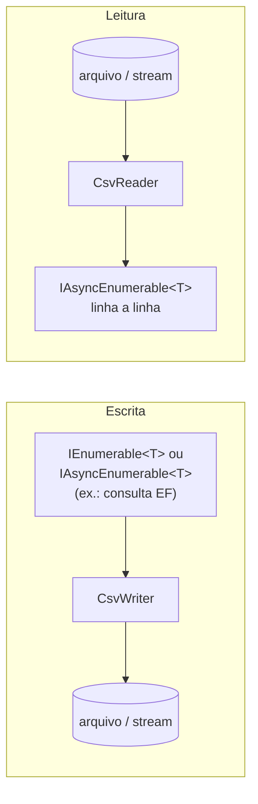

# 📄 CSV

[⬅ Índice](README.md) · [README](../README.md)

Leitura e escrita de CSV tipado em **streaming**, sem carregar o arquivo inteiro em memória. Os padrões são compatíveis com o Excel em pt-BR.

- [Visão geral](#visão-geral)
- [Mapeamento: CsvColumn e CsvIgnore](#mapeamento)
- [CsvWriter](#csvwriter)
- [CsvReader](#csvreader)
- [CsvOptions](#csvoptions)
- [Tipos suportados](#tipos-suportados)
- [Tratamento de erros: CsvException](#tratamento-de-erros)
- [Proteção contra injeção de fórmulas](#proteção-contra-injeção-de-fórmulas)

---

## Visão geral



| Tipo | Namespace | Descrição |
|---|---|---|
| `CsvReader` / `ICsvReader` | `TEC.Core.Csv` / `.Abstractions` | Leitura para objetos tipados. |
| `CsvWriter` / `ICsvWriter` | `TEC.Core.Csv` / `.Abstractions` | Escrita de coleções. |
| `CsvOptions` | `TEC.Core.Csv` | Configurações. |
| `CsvColumnAttribute` / `CsvIgnoreAttribute` | `TEC.Core.Csv.Attributes` | Mapeamento das propriedades. |
| `CsvEnumFormat` | `TEC.Core.Csv` | Forma de escrita dos enums. |
| `CsvException` | `TEC.Core.Csv` | Erro com linha e coluna. |

---

## Mapeamento

### `[CsvColumn]`

| Membro | Descrição |
|---|---|
| `CsvColumnAttribute()` | Usa o nome da propriedade como cabeçalho. |
| `CsvColumnAttribute(string name)` | Nome da coluna no cabeçalho. |
| `int Order` | Posição da coluna (menor primeiro). Sem valor, segue a ordem de declaração. |
| `string? Format` | Formato de leitura e escrita: `"dd/MM/yyyy"` (datas), `"N2"` (números) ou `"Sim\|Não"` (booleanos: texto verdadeiro\|texto falso). |

### `[CsvIgnore]`

A propriedade não é lida nem escrita.

`[CsvIgnore]` e `[CsvColumn]` declarados na classe base valem também para as propriedades sobrescritas (`override`) nas classes derivadas.

### Regras

- São consideradas as **propriedades públicas de instância**. A escrita exige getter e a leitura exige setter público (`set` ou `init`). O tipo de destino pode ser classe ou `struct`.
- Nomes de coluna duplicados, sem diferenciar maiúsculas e acentos, geram erro (`InvalidOperationException`), assim como um tipo sem propriedades mapeáveis. Propriedade de tipo não suportado (ver [Tipos suportados](#tipos-suportados)) gera `NotSupportedException`: marque-a com `[CsvIgnore]`.
- Na leitura com cabeçalho, as colunas são associadas **pelo nome, sem diferenciar maiúsculas e acentos** (`Código` = `CODIGO` = `codigo`), e colunas extras são ignoradas. Sem cabeçalho, a associação segue a ordem das propriedades.

```csharp
public class Cliente
{
    [CsvColumn("Código", Order = 1)] public int Id { get; set; }
    [CsvColumn("Nome", Order = 2)] public string Nome { get; set; } = "";
    [CsvColumn("Nascimento", Order = 3, Format = "dd/MM/yyyy")] public DateOnly Nascimento { get; set; }
    [CsvColumn("Ativo", Order = 4, Format = "Sim|Não")] public bool Ativo { get; set; }
    [CsvColumn("Saldo", Order = 5, Format = "N2")] public decimal Saldo { get; set; }
    [CsvColumn("Status", Order = 6)] public StatusPedido Status { get; set; }
    [CsvIgnore] public string Interno { get; set; } = "";
}
```

---

## CsvWriter

`sealed class CsvWriter : ICsvWriter`

| Método | Descrição |
|---|---|
| `CsvWriter(CsvOptions? options = null)` | Usa as opções informadas ou `CsvOptions.Default`. |
| `Task WriteAsync<T>(Stream stream, IEnumerable<T> items, CancellationToken ct = default)` | Escreve no stream, **que permanece aberto**. |
| `Task WriteAsync<T>(Stream stream, IAsyncEnumerable<T> items, CancellationToken ct = default)` | Escreve itens produzidos de forma assíncrona. |
| `Task WriteFileAsync<T>(string filePath, IEnumerable<T> items, CancellationToken ct = default)` | Escreve em arquivo, **sobrescrevendo** se existir. Cria o diretório, se necessário. |
| `Task WriteFileAsync<T>(string filePath, IAsyncEnumerable<T> items, CancellationToken ct = default)` | Idem, com itens assíncronos. |

- Campos com separador, aspas, quebra de linha ou espaço nas pontas são envolvidos em aspas automaticamente (RFC 4180).
- Itens `null` na coleção são ignorados.

```csharp
await new CsvWriter().WriteFileAsync("clientes.csv", clientes);

// Exportação direta do banco, sem materializar a lista (EF Core)
await new CsvWriter().WriteFileAsync("clientes.csv", db.Clientes.AsNoTracking().AsAsyncEnumerable());

// Download em ASP.NET Core
app.MapGet("/clientes.csv", async (HttpResponse resp, AppDb db, ICsvWriter csv) =>
{
    resp.ContentType = "text/csv; charset=utf-8";
    resp.Headers.ContentDisposition = "attachment; filename=clientes.csv";
    await csv.WriteAsync(resp.Body, db.Clientes.AsNoTracking().AsAsyncEnumerable());
});
```

**Saída com as opções padrão:**

```csv
Código;Nome;Nascimento;Ativo;Saldo;Status
1;João da Silva;20/05/1990;Sim;1.234,50;AguardandoPagamento
2;"'=HYPERLINK(""http://mal"")";01/12/1985;Não;-10,00;Enviado
3;"Maria; ""Mari""";01/01/2000;Sim;0,00;Cancelado
```

**Com `Delimiter = ','`, `EnumFormat = Description` e `Culture = InvariantCulture`:**

```csv
Código,Nome,Nascimento,Ativo,Saldo,Status
1,João da Silva,20/05/1990,Sim,"1,234.50",Aguardando pagamento
```

---

## CsvReader

`sealed class CsvReader : ICsvReader`

| Método | Descrição |
|---|---|
| `CsvReader(CsvOptions? options = null)` | Usa as opções informadas ou `CsvOptions.Default`. |
| `IAsyncEnumerable<T> ReadAsync<T>(Stream stream, CancellationToken ct = default) where T : new()` | Lê o stream sob demanda. O stream não é fechado. |
| `IAsyncEnumerable<T> ReadFileAsync<T>(string filePath, CancellationToken ct = default) where T : new()` | Lê o arquivo sob demanda. |

```csharp
await foreach (var cliente in new CsvReader().ReadFileAsync<Cliente>("clientes.csv", ct))
{
    await repo.InserirAsync(cliente, ct);    // processa linha a linha
}

// Lista completa (arquivos pequenos): nativo no .NET 10; no .NET 8, pacote System.Linq.AsyncEnumerable
var lista = await new CsvReader().ReadFileAsync<Cliente>("clientes.csv").ToListAsync();

// Upload em ASP.NET Core
app.MapPost("/importar", async (IFormFile arquivo, ICsvReader csv) =>
{
    await using var stream = arquivo.OpenReadStream();
    var total = 0;
    await foreach (var c in csv.ReadAsync<Cliente>(stream)) total++;
    return ApiResponse<int>.Ok(total);
});
```

### Native AOT e trimming

`CsvReader`/`CsvWriter` são compatíveis com trimming e Native AOT sem avisos: o parâmetro `T` (também em `ICsvReader`/`ICsvWriter`) é anotado com `[DynamicallyAccessedMembers(PublicProperties)]`, então o trimmer preserva as propriedades públicas do tipo informado. Tipos nativos (texto, números, datas, `Guid`, `bool`) e enums são convertidos sem reflexão adicional.

> [!NOTE]
> Tipos fora da lista nativa (ex.: `Uri`, `Version` ou um tipo com `[TypeConverter]` próprio) usam `TypeDescriptor`. Funcionam com trimming (conferido no projeto de verificação), mas em um *wrapper* genérico seu que chame `ReadAsync<T>`/`WriteAsync<T>`, propague a anotação: `void Importar<[DynamicallyAccessedMembers(DynamicallyAccessedMemberTypes.PublicProperties)] T>() where T : new()`.

- A codificação é detectada pelo BOM; sem BOM, é usada `CsvOptions.Encoding`.
- Campos entre aspas podem conter separador, aspas duplicadas (`""`) e quebras de linha. Espaços antes da aspa de abertura e depois da aspa de fechamento são ignorados (`a; "b;c" ;d` tem três campos) e o conteúdo entre aspas é preservado como está.
- Células vazias viram `null` em tipos anuláveis (inclusive `string?`) e o valor padrão (`0`, `false`, `""`...) nos demais.
- ⚠️ Por padrão, colunas do tipo ausentes no cabeçalho e linhas com menos colunas são aceitas: as propriedades sem valor ficam com o valor padrão. Para arquivos de origem externa, prefira o modo estrito:

```csharp
var estrito = new CsvOptions
{
    RequireAllColumns = true,    // cabeçalho precisa ter todas as colunas mapeadas
    StrictColumnCount = true     // cada linha precisa ter a mesma quantidade de colunas do cabeçalho
};
// CsvException: "Colunas obrigatórias ausentes no cabeçalho: Saldo, Status (linha 1)"
// CsvException: "Quantidade de colunas inválida: esperado 6, encontrado 4 (linha 37)"
```

---

## CsvOptions

`sealed class CsvOptions`: cada propriedade é validada **na atribuição**, então configurações inválidas falham imediatamente.

| Propriedade | Padrão | Descrição |
|---|---|---|
| `static CsvOptions Default` | — | Instância com os valores padrão. |
| `char Delimiter` | `;` | Separador. Não pode ser aspas, quebra de linha, controle (exceto TAB), letra ou dígito. |
| `Encoding Encoding` | UTF-8 **com BOM** | Faz o Excel reconhecer os acentos. |
| `bool HasHeader` | `true` | Primeira linha é cabeçalho. |
| `CultureInfo Culture` | pt-BR | Números e datas. |
| `bool TrimValues` | `true` | Remove espaços nas pontas dos textos (leitura). Campos **entre aspas** nunca são aparados: o `CsvWriter` usa aspas justamente para preservar esses espaços. |
| `bool SkipEmptyLines` | `true` | Ignora linhas vazias (leitura). |
| `bool SkipInvalidRows` | `false` | Ignora linhas inválidas em vez de lançar exceção. |
| `Action<CsvException>? OnInvalidRow` | `null` | Callback para cada linha ignorada. |
| `string NewLine` | `\r\n` | Quebra de linha na escrita: `\r\n`, `\n` ou `\r`. |
| `bool QuoteAllFields` | `false` | Envolve todos os campos em aspas. |
| `CsvEnumFormat EnumFormat` | `Name` | Escrita de enums: `Name`, `Code` ou `Description`. Na leitura, os três são aceitos. |
| `bool SanitizeFormulas` | `true` | 🔒 Anti-injeção de fórmulas, em qualquer valor textual (`string`, `char`, `Uri` e tipos com `TypeConverter`); números, datas, `Guid`, booleanos e enums não são alterados. |
| `int MaxFieldLength` | 1.048.576 | 🔒 Tamanho máximo de um campo (1 a 100.000.000). |
| `int MaxColumns` | 1.024 | 🔒 Máximo de colunas por linha (1 a 100.000). |
| `int MaxRecordLength` | 4.194.304 | 🔒 Tamanho máximo de um registro inteiro, somando campos e separadores (1 a 1.000.000.000 caracteres). Sem ele, uma linha poderia acumular `MaxColumns × MaxFieldLength` caracteres. |
| `bool StrictColumnCount` | `false` | Exige que cada linha tenha exatamente a quantidade de colunas do cabeçalho (ou, sem cabeçalho, das propriedades mapeadas). Com `false`, linhas curtas deixam as propriedades sem coluna com o valor padrão. |
| `bool RequireAllColumns` | `false` | Exige no cabeçalho uma coluna para **cada** propriedade gravável (exceto `[CsvIgnore]`); a exceção lista as ausentes. Com `false`, basta uma coluna corresponder. |
| `bool AllowThousandsSeparator` | `true` | Aceita separador de milhar em `decimal`, `double` e `float`, **somente entre grupos completos** da cultura (`1.234.567,89`). `1.5` ou `1.2.3` geram erro de conversão em vez de virarem `15` e `123`. Com `false`, qualquer separador de milhar é recusado. |
| `bool IncludeRawValueInErrors` | `false` | 🔒 Inclui o valor original (`RawValue`) e a exceção interna nos erros de conversão. |
| `int BufferSize` | 65.536 | Buffer em caracteres (1 KB a 16 MB). |

```csharp
var opcoes = new CsvOptions
{
    Delimiter = ',',
    Culture = CultureInfo.InvariantCulture,
    Encoding = new UTF8Encoding(false),   // sem BOM
    NewLine = "\n",
    EnumFormat = CsvEnumFormat.Code
};
var writer = new CsvWriter(opcoes);
```

---

## Tipos suportados

| Tipo | Leitura | Escrita |
|---|---|---|
| `string` | Texto (com `Trim`, exceto entre aspas, e remoção do apóstrofo anti-fórmula) | Texto |
| `int`, `long`, `short`, `byte`... | Cultura das opções (sem separador de milhar) | `Format` + cultura |
| `decimal`, `double`, `float` | Separador de milhar só entre grupos completos (`1.234,56`; `1.5` é erro), desligável com `AllowThousandsSeparator`; `R$` no `decimal` | `Format` + cultura |
| `bool` | `Format` (`"Sim\|Não"`) ou `true/false`, `1/0`, `sim/não`, `s/n`, `yes/no`, `y/n`, `verdadeiro/falso`, `v/f` | `Format` ou `true`/`false` |
| `DateTime`, `DateOnly`, `TimeOnly`, `DateTimeOffset`, `TimeSpan` | `ParseExact` com `Format`, ou `Parse` com a cultura | `Format` + cultura |
| `Guid` | `Guid.Parse` | `ToString` |
| Enums | Nome, valor numérico, `[Description]` ou `[Display]` | Conforme `EnumFormat` |
| `Nullable<T>` | Célula vazia → `null` | `null` → vazio |
| Outros | `TypeConverter` que aceite `string` | `ToString()` |

---

## Tratamento de erros

`sealed class CsvException : Exception`

| Membro | Descrição |
|---|---|
| `long LineNumber` | Linha no arquivo (começa em 1). |
| `string? ColumnName` | Coluna, quando aplicável. |
| `string? RawValue` | Valor original. 🔒 Só é preenchido com `IncludeRawValueInErrors = true`. |

Mensagem de exemplo: *Valor inválido para o tipo DateOnly (linha 2, coluna 'Nascimento')*

| Situação | Mensagem | Ignorada com `SkipInvalidRows`? |
|---|---|:---:|
| Valor não convertível | *Valor inválido para o tipo X (linha N, coluna 'C')* | ✅ |
| `StrictColumnCount` violado | *Quantidade de colunas inválida: esperado M, encontrado K (linha N)* | ✅ |
| `RequireAllColumns` violado | *Colunas obrigatórias ausentes no cabeçalho: A, B (linha 1)* | ❌ |
| Nenhuma coluna do cabeçalho corresponde ao tipo | *Nenhuma coluna do cabeçalho corresponde às propriedades do tipo de destino (linha 1)* | ❌ |
| Limites `MaxFieldLength` / `MaxRecordLength` / `MaxColumns` | *Campo/Registro/Linha excede…* | ❌ |
| Aspas não finalizadas | *Campo entre aspas não foi finalizado* | ❌ |

🔒 A mensagem **nunca** contém o conteúdo do arquivo, para evitar que dados pessoais vazem para os logs.

### Ignorando linhas inválidas

```csharp
var rejeitadas = new List<string>();
var opcoes = new CsvOptions
{
    SkipInvalidRows = true,
    OnInvalidRow = e => rejeitadas.Add($"Linha {e.LineNumber}: coluna {e.ColumnName}")
};

await foreach (var c in new CsvReader(opcoes).ReadAsync<Cliente>(stream))
{
    // apenas as linhas válidas chegam aqui
}
```

Com o arquivo abaixo, apenas a linha do Caio é importada. O cabeçalho `Codigo`/`NOME` é reconhecido mesmo sem acento e em maiúsculas, e a coluna `Extra` é ignorada:

```csv
Codigo;NOME;Nascimento;Ativo;Saldo;Status;Extra
1;Ana;99/99/9999;Sim;1,00;Enviado;z          ← data inválida
2;Bia;01/01/2000;Talvez;1,00;Enviado;z       ← booleano inválido
3;Caio;01/01/2000;Não;2,50;2;z               ← ok (Status = Enviado)
```

---

## Proteção contra injeção de fórmulas

Um CSV aberto no Excel ou no LibreOffice pode **executar fórmulas** vindas de dados do usuário (ex.: `=HYPERLINK(...)`, `=cmd|...`). Isso é conhecido como *CSV Injection* (OWASP).

Com `SanitizeFormulas = true` (padrão):

| Etapa | Comportamento |
|---|---|
| Escrita | Textos iniciados por `=`, `+`, `-`, `@`, TAB, CR ou suas variantes de largura total recebem um apóstrofo (`'`) no início. |
| Leitura | O apóstrofo adicionado é removido, e o valor original é recuperado. |
| Escopo | **Apenas propriedades `string`**. Números negativos e datas não são alterados. |

```
Nome = "=HYPERLINK(\"http://mal\")"   →   gravado como   '=HYPERLINK("http://mal")
                                      →   lido como      =HYPERLINK("http://mal")
```

> ⚠️ Desative (`SanitizeFormulas = false`) somente se o CSV for consumido por outro sistema e **nunca** aberto em planilha.
