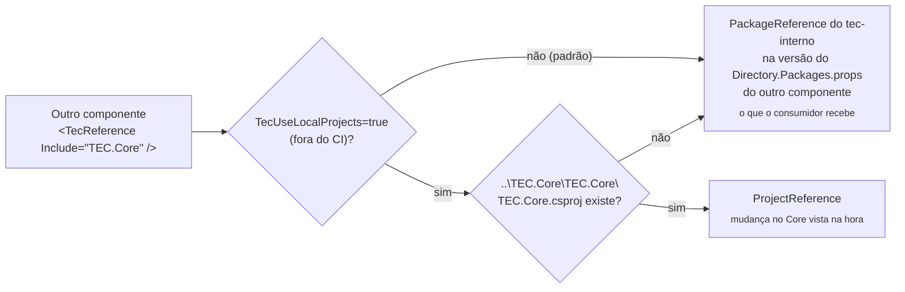
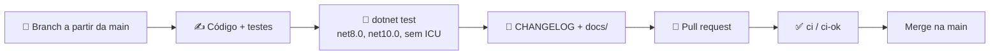

[🏠 TEC.Core](../README.md) › [📚 Documentação](README.md) › Desenvolvimento

# 🛠️ Desenvolvimento

> Como compilar o TEC.Core localmente (sozinho ou junto com os outros componentes), manter os lock files, contribuir e publicar.

## 📑 Sumário

- [🎯 Visão geral](#-visão-geral)
- [🚀 Uso](#-uso)
  - [Compilando](#compilando)
  - [Repositórios vizinhos](#repositórios-vizinhos)
  - [Lock files](#lock-files)
  - [Estrutura do repositório](#estrutura-do-repositório)
  - [Contribuindo](#contribuindo)
  - [Publicando](#publicando)
- [⚙️ Opções](#️-opções)
- [❌ Erros](#-erros)
- [🛡️ Segurança](#️-segurança)
- [❓ Perguntas frequentes](#-perguntas-frequentes)

---

## 🎯 Visão geral

| Item | Valor |
|---|---|
| SDK | `global.json`: `10.0.100` ou superior (`rollForward: latestFeature`), com o Microsoft.Testing.Platform |
| Runtimes extras | .NET 8 e ASP.NET Core 8 (testes no alvo `net8.0`) |
| Solução | `TEC.Core.slnx` |
| Versão | Única, em `Directory.Build.props` (`<Version>0.0.1</Version>`); nunca no csproj |
| Build compartilhado | `build/Tec.Build.props` e `build/Tec.Build.targets` (canônicos, vindos do [tec-workflows](https://github.com/tudoemcodigo/tec-workflows)) |
| Dependências de terceiros | Versões só em `Directory.Packages.props` (Central Package Management) |

Os componentes ficam lado a lado em `D:\Projetos\Componentes\TEC.*`. O TEC.Core é a base: **não referencia nenhum outro componente** (compila sem o feed `tec-interno`), mas é referenciado por todos (exceto o TEC.Observability) via `<TecReference>`. Nos dependentes, o padrão, na máquina e no CI, é o pacote publicado do TEC.Core; o projeto vizinho só entra sob demanda:



---

## 🚀 Uso

### Compilando

```bash
git clone https://github.com/tudoemcodigo/lib-tec-core TEC.Core
cd TEC.Core
dotnet restore TEC.Core.slnx
dotnet build TEC.Core.slnx -c Release          # pacote: todo aviso é erro (CA, IDE, IL de AOT, nullable, CS1591)
dotnet test --solution TEC.Core.slnx -c Release --no-build
dotnet pack TEC.Core/TEC.Core.csproj -c Release -o ./artifacts
```

O `dotnet pack` gera o `.nupkg` com `lib/net8.0`, `lib/net10.0`, a documentação XML, o `README.md` da raiz (o projeto não tem README próprio) e o `Images/Logo.png`.

> [!IMPORTANT]
> O `README.md` da raiz vai dentro do pacote e aparece na página do GitHub Packages: use nele **links absolutos**
> para `https://github.com/tudoemcodigo/lib-tec-core/blob/main/...` (links relativos quebram fora do GitHub). Por
> isso, um PR que altera o README da raiz dispara o CI completo.

### Repositórios vizinhos

Para testar uma mudança do TEC.Core num componente que depende dele (ex.: TEC.Vault) **sem publicar pacote**:

1. Clone os repositórios lado a lado: `D:\Projetos\Componentes\TEC.Core` e `D:\Projetos\Componentes\TEC.Vault`.
2. Compile o dependente com `-p:TecUseLocalProjects=true`: o `<TecReference Include="TEC.Core" />` vira `ProjectReference` para `..\TEC.Core\TEC.Core\TEC.Core.csproj` (sem o vizinho, continua pacote; no CI a opção é ignorada).
3. Sem a opção, o dependente compila como o consumidor real: pacote do feed `tec-interno`, que é o padrão e exige a credencial de leitura do feed na máquina (`dotnet nuget update source tec-interno -u <usuario-github> -p <PAT com read:packages>`).

```bash
# No TEC.Vault, usando o TEC.Core local (modo local, sob demanda)
dotnet build TEC.Vault.slnx -p:TecUseLocalProjects=true
dotnet test --project TEC.Vault.Tests -p:TecUseLocalProjects=true

# No TEC.Vault, usando o pacote publicado (padrão)
dotnet build TEC.Vault.slnx
```

> [!TIP]
> No modo pacote, cada dependente usa a versão do TEC.Core declarada no **próprio** `Directory.Packages.props`
> (`<PackageVersion Include="TEC.Core" Version="0.0.1" />`); o csproj mantém só `<TecReference Include="TEC.Core" />`,
> sem versão, e o Dependabot abre o PR quando sai uma versão nova. Para um dependente adotar outra versão do TEC.Core,
> altere esse `PackageVersion` lá e regenere os locks dele. Os componentes evoluem de forma independente: o TEC.Core
> pode ficar em `0.0.1` enquanto os dependentes sobem a própria `<Version>`.

### Lock files

| Arquivo | Versionado? | Quando é usado |
|---|:---:|---|
| `packages.lock.json` | ✅ | Sempre no modo pacote; restore com `--locked-mode` no CI (`RestoreLockedMode` quando `CI=true`) |
| `packages.local.lock.json` | ❌ (`.gitignore`) | Nos componentes dependentes, no modo local sob demanda (`-p:TecUseLocalProjects=true`: `TecReference` → `ProjectReference`) |

O TEC.Core não tem `TecReference`, então o lock dele é **o mesmo nos dois modos** e nunca gera `packages.local.lock.json`. Nos componentes dependentes, o `packages.lock.json` versionado é o do modo pacote (o padrão) e é regenerado com um restore simples:

```bash
# Depois de mudar uma versão em Directory.Packages.props (no TEC.Core)
dotnet restore TEC.Core.slnx --force-evaluate

# Num componente dependente (exige o TEC.Core já publicado no feed)
dotnet restore TEC.Vault.slnx --force-evaluate
```

Faça commit de todos os `packages.lock.json` alterados (biblioteca, testes, carga, benchmarks e samples).

> [!WARNING]
> Regenerar o lock de um dependente em modo pacote exige que a versão do TEC.Core referenciada **já esteja publicada**.
> O TEC.Core é o primeiro da [ordem de publicação](https://github.com/tudoemcodigo/tec-workflows#-ordem-de-publicação).

### Estrutura do repositório

```text
TEC.Core/
├── .github/workflows/      ci.yml, release.yml, performance.yml (chamam o tec-workflows) + README.md
├── build/                  Tec.Build.props / Tec.Build.targets ⟵ canônicos
├── docs/                   índice + um arquivo por tema
├── Images/Logo.png         ícone do pacote ⟵ canônico
├── samples/                TEC.Core.SampleApi e TEC.Core.LoadGenerator (nunca pacote)
├── TEC.Core/               o pacote (Common, Cryptography, Csv, Dates, DependencyInjection, Enums,
│                           Exceptions, Numbers, Polyfills, Responses, Security, Text)
├── TEC.Core.Tests/         unitários e segurança (TUnit + FsCheck)
├── TEC.Core.LoadTests/     Carga-CI e Carga-Pesada
├── TEC.Core.Benchmarks/    BenchmarkDotNet
├── Directory.Build.props   TecComponent + Version
├── Directory.Packages.props versões de terceiros
├── CHANGELOG.md · README.md · TEC.Core.slnx
└── .editorconfig .gitattributes .gitignore nuget.config global.json LICENSE  ⟵ canônicos
```

> [!CAUTION]
> Nunca edite os arquivos canônicos aqui (`build/`, `.editorconfig`, `nuget.config`, `.github/dependabot.yml`...):
> altere no `tec-workflows/template` e sincronize. O job **Convenções** do CI falha se divergirem.

### Contribuindo



1. Crie uma branch a partir da `main` (`feature/...` ou `fix/...`).
2. Escreva o código **e** os testes, inclusive de entradas inválidas (veja [testes.md](testes.md#escrevendo-novos-testes)).
3. Siga os [padrões](https://github.com/tudoemcodigo/tec-workflows/blob/main/docs/padroes.md): identificadores em inglês; XML docs, mensagens e documentação em português; classes `sealed` por padrão; `TimeProvider` em vez de `DateTime.Now`; `Regex` com `[GeneratedRegex]` e `NonBacktracking` (ou timeout).
4. Rode `dotnet test` nos dois alvos e sem ICU; o build precisa passar sem avisos.
5. Registre a mudança no [CHANGELOG](../CHANGELOG.md) e atualize o tema em `docs/`.
6. Abra o PR: a proteção da `main` exige o check `ci / ci-ok` com a branch atualizada.

### Publicando

Fluxo: PR → merge na `main` → **prévia automática**: o CI do push na `main`, com `ci-ok` verde, publica `<Version>-preview.N` (ex.: `0.0.1-preview.3`, com a `<Version>` do `Directory.Build.props`). Em PR nada é publicado.

Versão estável ou release candidate: workflow **Publicar versão** (`release.yml`): Actions → **Publicar versão** → **Run workflow** → versão (`0.0.1` ou `1.1.0-rc.1`; prévias não são digitadas aqui). Ele roda convenções, pack, unitários ×3 com cobertura e CodeQL, cria a tag e o Release e só então publica no feed. Depois de publicar `X.Y.Z`, suba a `<Version>` do `Directory.Build.props` para a próxima quando quiser novas prévias: enquanto a tag `v<Version>` existir, o CI do push na `main` valida tudo normalmente, mas não gera prévia (emite um `::notice::` e pula o `publicar-previa`). O TEC.Core pode ficar em `0.0.1` e ainda receber correções de build e documentação na `main`. Testes de carga não entram em nenhum dos dois: só no `performance.yml`, manual. Detalhes e checklist em [⚙️ CI/CD](../.github/workflows/README.md).

---

## ⚙️ Opções

| Propriedade MSBuild | Padrão | Efeito |
|---|---|---|
| `TecUseLocalProjects` | `false` (sempre `false` com `CI=true`) | Nos dependentes, `true` faz o `TecReference` virar `ProjectReference` para o TEC.Core vizinho; senão, `PackageReference` |
| `CI` | definida pelo GitHub Actions | Ativa `RestoreLockedMode` e ignora o `TecUseLocalProjects` (sempre modo pacote) |
| `Version` | `0.0.1` (em `Directory.Build.props`) | Versão local e base das prévias do CI (`<Version>-preview.N`); a release usa a versão digitada no workflow. Suba depois de publicar `X.Y.Z` |

---

## ❌ Erros

| Erro | Causa | O que fazer |
|---|---|---|
| `NU1004` | `packages.lock.json` desatualizado | `dotnet restore TEC.Core.slnx --force-evaluate` e commit dos lock files |
| `NU1901`–`NU1904` | Vulnerabilidade conhecida numa dependência (é erro) | Atualize o pacote em `Directory.Packages.props` (ou aguarde o PR do Dependabot) |
| `CS1591` | Membro público sem XML doc | Documente o membro (`<summary>`, `<param>`, `<returns>`, `<exception>`) |
| `IL2026`/`IL3050` no build | Reflexão sem anotação no pacote | Use `[DynamicallyAccessedMembers]` ou uma alternativa sem reflexão |
| Job **Convenções** falhou | Arquivo canônico alterado ou `Version` em csproj | Desfaça a alteração; mude no `tec-workflows/template` |

---

## 🛡️ Segurança

> [!WARNING]
> Nunca faça commit de PAT, chave ou segredo (inclusive em `nuget.config`). A credencial do feed fica no
> `NuGet.Config` do usuário.

---

## ❓ Perguntas frequentes

<details>
<summary>Preciso publicar o TEC.Core para testar uma mudança no TEC.Vault?</summary>

Não. Com os repositórios lado a lado, compile e teste o TEC.Vault com `-p:TecUseLocalProjects=true` e o `TecReference` usa o projeto local. Sem a opção (o padrão), o TEC.Vault usa o pacote publicado; a regeneração do `packages.lock.json` versionado do TEC.Vault também exige a versão publicada.

</details>

<details>
<summary>Publicação manual de emergência é possível?</summary>

Evite: o `release.yml` (estável/rc) e o CI do push na `main` (prévias) garantem os portões, e o `release.yml` cria a tag antes do pacote. Se for inevitável, `dotnet pack -p:Version=X.Y.Z` e `dotnet nuget push` com um PAT `write:packages`, criando a tag e o Release à mão logo em seguida.

</details>

---

⬅️ [Anterior: Testes](testes.md) · [📚 Índice](README.md)
