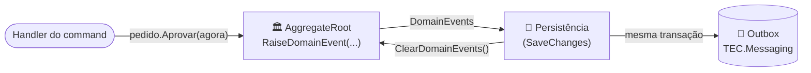

[🏠 TEC.Core](../README.md) › [📚 Documentação](README.md) › Domínio

# 🏛️ Domínio

> Primitivas mínimas de DDD, sem dependência de persistência: entidade com identidade, raiz de agregado e eventos de domínio.

## 📑 Sumário

- [🎯 Visão geral](#-visão-geral)
- [🚀 Uso](#-uso)
  - [DomainEntity&lt;TId&gt;](#domainentitytid)
  - [AggregateRoot&lt;TId&gt;](#aggregateroottid)
  - [IDomainEvent e IHasDomainEvents](#idomainevent-e-ihasdomainevents)
- [⚙️ Opções](#️-opções)
- [❌ Erros](#-erros)
- [🛡️ Segurança](#️-segurança)
- [❓ Perguntas frequentes](#-perguntas-frequentes)

---

## 🎯 Visão geral

| Namespace | Tipos públicos | Para que serve |
|---|---|---|
| `TEC.Core.Domain` | `DomainEntity<TId>`, `AggregateRoot<TId>`, `IDomainEvent`, `IHasDomainEvents` | Modelar agregados que registram fatos de negócio, coletados pela persistência no commit |



O TEC.Core só define os contratos. Quem coleta os eventos é a persistência: o `TEC.Messaging.EntityFrameworkCore` grava cada evento no Outbox, na mesma transação do agregado.

---

## 🚀 Uso

### DomainEntity&lt;TId&gt;

> `TEC.Core.Domain` · `abstract class`

| Membro | Descrição |
|---|---|
| `Id` | Identificador (`protected set`) |
| `Equals` / `==` / `!=` / `GetHashCode` | Iguais quando têm o **mesmo tipo concreto** e o mesmo `Id`. Entidade sem `Id` (valor padrão, "transiente") só é igual a si mesma |

> [!NOTE]
> O nome não é `Entity` para não colidir com `TEC.ORM.Entities.Entity<TKey>`, que traz soft delete e auditoria. Use o do ORM quando quiser esses recursos; use o daqui quando o domínio não deve conhecer a persistência.

### AggregateRoot&lt;TId&gt;

> `TEC.Core.Domain` · `abstract class : DomainEntity<TId>, IHasDomainEvents`

| Membro | Descrição |
|---|---|
| `RaiseDomainEvent(IDomainEvent)` | (`protected`) Registra um evento para o próximo commit |
| `DomainEvents` | Eventos pendentes, na ordem em que ocorreram |
| `ClearDomainEvents()` | Descarta os pendentes (chamado pela persistência) |
| `MaxPendingEvents` | Limite de pendentes por agregado (1000) |

```csharp
using TEC.Core.Common.Results;
using TEC.Core.Domain;

public sealed record PedidoAprovado(Guid PedidoId, DateTimeOffset OccurredAt) : IDomainEvent;

public sealed class Pedido : AggregateRoot<Guid>
{
    public StatusPedido Status { get; private set; }

    public Result Aprovar(DateTimeOffset agora)
    {
        if (Status != StatusPedido.Rascunho)
            return Error.Conflict("TRANSICAO_INVALIDA", "Só pedidos em rascunho podem ser aprovados.");

        Status = StatusPedido.Aprovado;
        RaiseDomainEvent(new PedidoAprovado(Id, agora));
        return Result.Success();
    }
}
```

### IDomainEvent e IHasDomainEvents

> `TEC.Core.Domain` · `interface`

| Contrato | Membros | Quem implementa |
|---|---|---|
| `IDomainEvent` | `OccurredAt` | Os eventos (de preferência `sealed record` imutáveis, com ids e metadados, sem dados pessoais) |
| `IHasDomainEvents` | `DomainEvents`, `ClearDomainEvents()` | `AggregateRoot<TId>` ou uma raiz própria |

Use `OccurredAt` vindo do `TimeProvider` do caso de uso (nunca `DateTime.Now`), para os testes serem determinísticos.

---

## ⚙️ Opções

Não há opções nem registro em DI: são tipos base.

## ❌ Erros

| Exceção | Quando ocorre | O que fazer |
|---|---|---|
| `ArgumentNullException` | `RaiseDomainEvent(null)` | Passe o evento |
| `InvalidOperationException` | Mais de `MaxPendingEvents` eventos sem coleta | Laço registrando eventos sem fim, ou lote grande demais num único agregado: salve antes de continuar |

## 🛡️ Segurança

> [!WARNING]
> Eventos de domínio costumam virar mensagens e linhas de histórico. Coloque neles **identificadores e metadados**, nunca senhas, tokens ou textos livres com dados pessoais.

> [!WARNING]
> Não publique o evento de domínio diretamente como contrato entre serviços: renomear uma propriedade quebraria os consumidores. Mapeie para um **evento de integração** versionado (ver TEC.Messaging).

## ❓ Perguntas frequentes

<details>
<summary><b>Os eventos são publicados automaticamente?</b></summary>

Não pelo TEC.Core. Ele só guarda os eventos. A persistência (por exemplo, o interceptor do `TEC.Messaging.EntityFrameworkCore`) os coleta no `SaveChanges` e chama `ClearDomainEvents()`.
</details>

<details>
<summary><b>É thread-safe?</b></summary>

Não. Um agregado pertence a um único caso de uso (um escopo de DI) por vez, como o `DbContext`.
</details>

---

⬅️ [Common](common.md) · [📚 Índice](README.md) · [Respostas de API](respostas-api.md) ➡️
