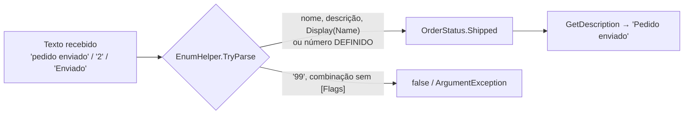

[🏠 TEC.Core](../README.md) › [📚 Documentação](README.md) › Enums

# 🏷️ Enums

> Descrições amigáveis, listas para combos e conversão flexível e segura de texto para enum.

## 📑 Sumário

- [🎯 Visão geral](#-visão-geral)
- [🚀 Uso](#-uso)
  - [EnumHelper](#enumhelper)
  - [EnumExtensions](#enumextensions)
  - [EnumItem&lt;TEnum&gt;](#enumitemtenum)
  - [Enums com [Flags]](#enums-com-flags)
- [⚙️ Opções](#️-opções)
- [❌ Erros](#-erros)
- [🛡️ Segurança](#️-segurança)
- [❓ Perguntas frequentes](#-perguntas-frequentes)

---

## 🎯 Visão geral

| Namespace | Tipos | Para que serve |
|---|---|---|
| `TEC.Core.Enums` | `EnumHelper` | Descrições, listagem e conversão de texto (nome, número, descrição) para enum |
| `TEC.Core.Enums.Extensions` | `EnumExtensions` | Os mesmos recursos como métodos de extensão |
| `TEC.Core.Enums.Models` | `EnumItem<TEnum>` | Item de enum para combos e listas de domínio em APIs |

**Quando usar:** telas com listas de domínio, leitura de valores digitados ou importados (o CSV usa as mesmas regras) e exibição amigável de status. Os metadados são lidos por reflexão **uma única vez** por tipo e mantidos em cache (thread-safe).



Enum usado nos exemplos:

```csharp
using System.ComponentModel;
using System.ComponentModel.DataAnnotations;

public enum OrderStatus
{
    [Description("Aguardando pagamento")] AwaitingPayment = 1,
    [Display(Name = "Pedido enviado")]    Shipped = 2,
    Canceled = 3
}
```

---

## 🚀 Uso

```csharp
using TEC.Core.Enums;
using TEC.Core.Enums.Extensions;

OrderStatus.AwaitingPayment.GetDescription();     // "Aguardando pagamento"
"pedido enviado".ToEnum<OrderStatus>();           // Shipped
"2".ToEnum<OrderStatus>();                        // Shipped

// Combo para o front-end: código e descrição de cada membro
var options = EnumHelper.GetItems<OrderStatus>()
    .Select(i => new { value = i.Code, text = i.Description })   // { 1, "Aguardando pagamento" }, ...
    .ToList();

// Texto digitado: aceita nome, descrição, [Display(Name)] ou número definido
bool ok = EnumHelper.TryParse<OrderStatus>("Aguardando pagamento", out var status);   // true
bool invalid = EnumHelper.TryParse<OrderStatus>("99", out _);                        // false
string display = EnumHelper.GetDisplayName(OrderStatus.Shipped);                      // "Pedido enviado"
```

### EnumHelper

> `TEC.Core.Enums` · `static class`

Leitura de descrições e conversão de texto para enum, aceitando nome, valor numérico, descrição ou nome de exibição, sem diferenciar maiúsculas.

| Membro | Retorno | Descrição |
|---|---|---|
| `GetDescription(Enum value)` | `string` | Prioridade: `[Description]` → `[Display(Description)]` → `[Display(Name)]` → nome do membro. Valor não definido no enum devolve `value.ToString()`. |
| `GetDisplayName(Enum value)` | `string` | Prioridade: `[Display(Name)]` → `[Description]` → nome do membro. |
| `GetCode(Enum value)` | `long` | Valor numérico, sem estouro em enums `ulong`. |
| `GetItems<TEnum>() where TEnum : struct, Enum` | `IReadOnlyList<EnumItem<TEnum>>` | Todos os membros, com código, nome e descrição. |
| `TryParse<TEnum>(string? value, out TEnum result) where TEnum : struct, Enum` | `bool` | Converte texto aceitando nome, valor numérico definido, descrição ou nome de exibição. |
| `Parse<TEnum>(string value) where TEnum : struct, Enum` | `TEnum` | Igual a `TryParse`, mas lança `ArgumentException` se o valor não for reconhecido. |
| `TryParse(Type enumType, string? value, out object? result)` | `bool` | Versão não genérica, para quando o tipo só é conhecido em tempo de execução. |

| Chamada | Resultado |
|---|---|
| `GetDescription(OrderStatus.AwaitingPayment)` | `"Aguardando pagamento"` |
| `GetDescription(OrderStatus.Shipped)` | `"Pedido enviado"` |
| `GetDescription(OrderStatus.Canceled)` | `"Canceled"` |
| `GetCode(OrderStatus.Shipped)` | `2` |
| `Parse<OrderStatus>("aguardando pagamento")` | `AwaitingPayment` |
| `Parse<OrderStatus>("2")` | `Shipped` |
| `Parse<OrderStatus>("pedido enviado")` | `Shipped` |
| `Parse<OrderStatus>("99")` | `ArgumentException` (valor não definido) |

### EnumExtensions

> `TEC.Core.Enums.Extensions` · `static class` (métodos de extensão)

Atalhos de extensão para `EnumHelper`.

| Membro | Retorno | Descrição |
|---|---|---|
| `GetDescription(this Enum value)` | `string` | Atalho para `EnumHelper.GetDescription`. |
| `GetDisplayName(this Enum value)` | `string` | Atalho para `EnumHelper.GetDisplayName`. |
| `GetCode(this Enum value)` | `long` | Atalho para `EnumHelper.GetCode`. Enums `ulong` acima de `long.MaxValue` retornam o mesmo padrão de bits (valor negativo). |
| `ToEnum<TEnum>(this string value) where TEnum : struct, Enum` | `TEnum` | Converte texto ou lança `ArgumentException`. |
| `ToEnumOrDefault<TEnum>(this string? value, TEnum defaultValue = default) where TEnum : struct, Enum` | `TEnum` | Converte texto ou retorna o valor padrão, sem lançar. |

```csharp
OrderStatus.AwaitingPayment.GetDescription();          // "Aguardando pagamento"
"pedido enviado".ToEnum<OrderStatus>();                // Shipped
"xyz".ToEnumOrDefault(OrderStatus.Canceled);           // Canceled
```

### EnumItem&lt;TEnum&gt;

> `TEC.Core.Enums.Models` · `sealed record EnumItem<TEnum>(TEnum Value, long Code, string Name, string Description)`

Ideal para popular *combos*/*selects* e expor listas de domínio em APIs. Criado por `EnumHelper.GetItems<TEnum>()`.

| Membro | Retorno | Descrição |
|---|---|---|
| `Value` | `TEnum` | Membro do enum. |
| `Code` | `long` | Valor numérico. |
| `Name` | `string` | Nome do membro. |
| `Description` | `string` | Descrição (mesma regra de `GetDescription`). |

```csharp
app.MapGet("/domains/order-status", () => EnumHelper.GetItems<OrderStatus>());
```

```json
[
  { "value": "awaitingPayment", "code": 1, "name": "AwaitingPayment", "description": "Aguardando pagamento" },
  { "value": "shipped", "code": 2, "name": "Shipped", "description": "Pedido enviado" },
  { "value": "canceled", "code": 3, "name": "Canceled", "description": "Canceled" }
]
```

> [!NOTE]
> O campo `value` segue o conversor de enum configurado na aplicação: com as opções padrão do ASP.NET Core sai como número; com `JsonDefaults.Options`/`CreateOptions()` (ou `JsonDefaults.CreateEnumConverter<OrderStatus>()` registrado), como string em camelCase, como no JSON acima. Em trimming/Native AOT (`CreateOptions(IJsonTypeInfoResolver?)`), registre o conversor do enum com `JsonDefaults.CreateEnumConverter<OrderStatus>()`. Veja [Common](common.md#jsondefaults).

### Enums com [Flags]

Em enums marcados com `[Flags]`, combinações por vírgula (`"Read, Write"`) são aceitas somente com bits definidos no enum. Em enums sem `[Flags]`, combinações são recusadas.

```csharp
[Flags]
public enum Permission { None = 0, Read = 1, Write = 2, Delete = 4 }

EnumHelper.TryParse<Permission>("Read, Write", out var p);   // true → Read | Write
EnumHelper.TryParse<Permission>("8", out _);                 // false (bit não definido)
```

---

## ⚙️ Opções

O módulo não tem opções. A ordem de prioridade dos atributos é fixa:

| Método | Ordem |
|---|---|
| `GetDescription` / `EnumItem.Description` | `[Description]` → `[Display(Description)]` → `[Display(Name)]` → nome do membro |
| `GetDisplayName` | `[Display(Name)]` → `[Description]` → nome do membro |
| `TryParse` / `Parse` / `ToEnum` | Nome, número definido, descrição ou `[Display(Name)]`, sem diferenciar maiúsculas; combinações só com `[Flags]` |

---

## ❌ Erros

| Exceção | Quando ocorre | O que fazer |
|---|---|---|
| `ArgumentException` | `Parse`/`ToEnum` com valor não reconhecido (inclusive número não definido, bit não definido ou combinação sem `[Flags]`): *O valor informado não corresponde a nenhum membro de {Enum}.* | Use `TryParse`/`ToEnumOrDefault` para entradas não confiáveis. |
| `ArgumentException` | `TryParse(Type, …)` com tipo que não é enum: *O tipo {Nome} não é um enum.* | Passe um `Type` de enum. |
| `ArgumentNullException` | `value` nulo em `GetDescription`/`GetDisplayName`/`GetCode`/`ToEnum`; `enumType` nulo | Informe o argumento. |

`TryParse` com texto nulo, vazio ou em branco retorna `false` (`Parse` lança `ArgumentException`).

---

## 🛡️ Segurança

> [!IMPORTANT]
> 🔒 Valores numéricos só são aceitos se corresponderem a um membro **definido**. O `Enum.Parse` nativo aceitaria `"99"` e criaria um valor inválido que passaria despercebido por `switch` e validações.

> [!NOTE]
> ✅ **Trimming/Native AOT:** compatível sem avisos. Os parâmetros `TEnum` (e o `Type enumType` da versão não genérica) são anotados com `[DynamicallyAccessedMembers(PublicFields)]`; os atributos `[Description]`/`[Display]` são lidos dos campos do enum, que o trimmer preserva. Em métodos genéricos seus que repassem `TEnum` para `EnumHelper`/`ToEnum<TEnum>`, propague a anotação.

---

## ❓ Perguntas frequentes

<details>
<summary>Por que <code>"99"</code> lança exceção se o enum é <code>int</code>?</summary>

Porque `99` não corresponde a nenhum membro definido. Aceitar valores arbitrários criaria estados inválidos; use `TryParse` ou `ToEnumOrDefault` para tratar sem exceção.

</details>

<details>
<summary>O JSON de <code>EnumItem.Value</code> sai como número. Como sair como texto?</summary>

Registre `JsonDefaults.CreateEnumConverter<TEnum>()` nas opções do ASP.NET Core ou use `JsonDefaults.Options`. Veja [Common](common.md#jsondefaults).

</details>

<details>
<summary>A leitura por reflexão é cara?</summary>

Não no uso contínuo: os metadados de cada tipo são lidos uma única vez e ficam em cache thread-safe.

</details>

---
⬅️ [CSV](csv.md) · [📚 Índice](README.md) · [Injeção de dependência](injecao-dependencia.md) ➡️
