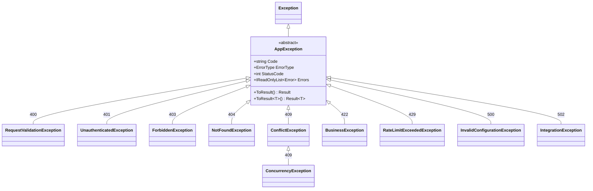
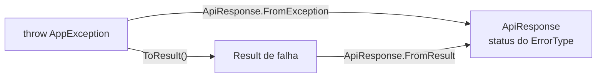

[🏠 TEC.Core](../README.md) › [📚 Documentação](README.md) › Exceções

# 🚨 Exceções

> Exceções da aplicação que já carregam código, categoria (`ErrorType`), status HTTP e lista de erros, convertidas no envelope padrão ou em `Result` sem vazar detalhes internos.

## 📑 Sumário

- [🎯 Visão geral](#-visão-geral)
  - [Exceção ou Result?](#exceção-ou-result)
  - [Referência das exceções](#referência-das-exceções)
- [🚀 Uso](#-uso)
  - [AppException](#appexception)
  - [RequestValidationException](#requestvalidationexception)
  - [UnauthenticatedException](#unauthenticatedexception)
  - [ForbiddenException](#forbiddenexception)
  - [NotFoundException](#notfoundexception)
  - [ConflictException](#conflictexception)
  - [ConcurrencyException](#concurrencyexception)
  - [BusinessException](#businessexception)
  - [RateLimitExceededException](#ratelimitexceededexception)
  - [InvalidConfigurationException](#invalidconfigurationexception)
  - [IntegrationException](#integrationexception)
  - [Tratamento global](#tratamento-global)
- [⚙️ Opções](#️-opções)
- [❌ Erros](#-erros)
- [🛡️ Segurança](#️-segurança)
- [❓ Perguntas frequentes](#-perguntas-frequentes)

---

## 🎯 Visão geral

Todas ficam em `TEC.Core.Exceptions`. Exceto `AppException` (abstrata), são `class` públicas **não seladas**: crie exceções próprias por herança.



### Exceção ou Result?

| Use `Result` / `Result<T>` quando... | Use exceção quando... |
|---|---|
| O "erro" faz parte do fluxo esperado (validação de formulário, busca sem resultado) | A situação é excepcional e o fluxo não pode continuar |
| O chamador **deve** tratar o erro | O erro deve subir até o tratamento global |
| Há muitas chamadas por segundo (exceções custam caro) | Está em código profundo, onde propagar `Result` seria verboso |

As duas abordagens convergem: `AppException.ToResult()` converte exceção em `Result`, e `ApiResponse.FromResult`/`FromException` geram a mesma resposta (veja [Respostas de API](respostas-api.md#fromresult-e-fromexception)).



### Referência das exceções

Os códigos padrão são estáveis e podem ser tratados pelo front-end (`errors[].code`).

| Exceção | HTTP | `ErrorType` | Código padrão (`DefaultCode`) | Mensagem vai ao cliente? |
|---|:---:|---|---|:---:|
| [`RequestValidationException`](#requestvalidationexception) | 400 | `Validation` | `VALIDACAO` | ✅ |
| [`UnauthenticatedException`](#unauthenticatedexception) | 401 | `Unauthorized` | `NAO_AUTENTICADO` | ✅ (genérica) |
| [`ForbiddenException`](#forbiddenexception) | 403 | `Forbidden` | `ACESSO_NEGADO` | ✅ (genérica) |
| [`NotFoundException`](#notfoundexception) | 404 | `NotFound` | `NAO_ENCONTRADO` | ✅ (sem o ID) |
| [`ConflictException`](#conflictexception) | 409 | `Conflict` | `CONFLITO` | ✅ |
| [`ConcurrencyException`](#concurrencyexception) | 409 | `Conflict` | `CONCORRENCIA` | ✅ |
| [`BusinessException`](#businessexception) | 422 | `BusinessRule` | `REGRA_DE_NEGOCIO` | ✅ |
| [`RateLimitExceededException`](#ratelimitexceededexception) | 429 | `TooManyRequests` | `LIMITE_EXCEDIDO` | ✅ |
| [`InvalidConfigurationException`](#invalidconfigurationexception) | 500 | `Failure` | `CONFIGURACAO_INVALIDA` | ❌ só no log |
| [`IntegrationException`](#integrationexception) | 502 | `ExternalService` | `FALHA_INTEGRACAO` | ❌ só no log |

Nas exceções ocultas, o cliente recebe só a mensagem genérica de `ApiResponse.FromException`: *Ocorreu um erro interno. Tente novamente mais tarde.* (500) ou *Serviço externo indisponível. Tente novamente mais tarde.* (502), com `errors` vazio.

---

## 🚀 Uso

### AppException

> `TEC.Core.Exceptions` · `abstract class` (herda `Exception`)

Base de todas as exceções da aplicação.

| Membro | Retorno | Descrição |
|---|---|---|
| `protected AppException(string code, string message, ErrorType errorType, Exception? innerException = null)` | — | Um único erro |
| `protected AppException(string message, IEnumerable<Error> errors, Exception? innerException = null)` | — | Vários erros, **todos da mesma categoria**; a sequência é copiada uma única vez |
| `Code` | `string` | Código do primeiro erro |
| `ErrorType` | `ErrorType` | Categoria do primeiro erro |
| `StatusCode` | `int` | `ErrorType.ToHttpStatusCode()` |
| `Errors` | `IReadOnlyList<Error>` | Lista imutável de erros (≥ 1) |
| `ToResult()` / `ToResult<T>()` | `Result` / `Result<T>` | Converte em `Result` de falha |

```csharp
using TEC.Core.Exceptions;

// Exceção própria por herança
public sealed class OrderAlreadyInvoicedException(int number)
    : ConflictException("PEDIDO_JA_FATURADO", $"O pedido {number} já foi faturado e não pode ser alterado.");

// Conversão para Result
try { Invoice(order); }
catch (AppException ex) { return ex.ToResult(); }
```

### RequestValidationException

> `TEC.Core.Exceptions` · `class` (herda `AppException`)

Dados de entrada inválidos, com um ou mais erros por campo (HTTP 400). O nome difere de `System.ComponentModel.DataAnnotations.ValidationException` para evitar conflito.

| Membro | Retorno | Descrição |
|---|---|---|
| `const DefaultCode` | `string` | `"VALIDACAO"` |
| `const DefaultMessage` | `string` | *Um ou mais erros de validação ocorreram.* |
| `RequestValidationException(string field, string message, string code = DefaultCode)` | — | Um único campo; a mensagem da exceção é `message`; `field` não pode ser vazio |
| `RequestValidationException(Error error, params IEnumerable<Error> additionalErrors)` | — | Um ou mais erros, todos `Validation`. Mensagem: `DefaultMessage`. `new RequestValidationException()` não compila |
| `RequestValidationException(IEnumerable<Error> errors)` | — | Lista já montada (não vazia; todos `Validation`). Enumerada **uma única vez** e copiada: pode ser lazy (`yield`, LINQ) |

```csharp
using TEC.Core.Common.Results;
using TEC.Core.Exceptions;

throw new RequestValidationException("email", "E-mail inválido.");                     // código VALIDACAO
throw new RequestValidationException("cpf", "CPF inválido.", "CPF_INVALIDO");          // código próprio

throw new RequestValidationException(
    Error.Validation("CPF_INVALIDO", "CPF inválido.", "cpf"),
    Error.Validation("EMAIL_OBRIGATORIO", "E-mail é obrigatório.", "email"));
```

> [!WARNING]
> Em projetos `net8.0` com C# 12, passe os erros adicionais como coleção (`[error2, error3]`) ou use C# 13+ (`params IEnumerable<…>`). Veja [Compatibilidade](compatibilidade.md).

### UnauthenticatedException

> `TEC.Core.Exceptions` · `class` (herda `AppException`)

Usuário não autenticado ou credenciais/token inválidos (HTTP 401).

| Membro | Retorno | Descrição |
|---|---|---|
| `const DefaultCode` | `string` | `"NAO_AUTENTICADO"` |
| `const DefaultMessage` | `string` | *Não autenticado.* (mesma de `ApiResponse.DefaultMessages.Unauthorized`) |
| `UnauthenticatedException()` | — | Código e mensagem padrão |
| `UnauthenticatedException(string code, string message, Exception? innerException = null)` | — | Código e mensagem específicos |

```csharp
if (user is null || !passwordValid)
    throw new UnauthenticatedException();   // mesma mensagem nos dois casos
```

### ForbiddenException

> `TEC.Core.Exceptions` · `class` (herda `AppException`)

Usuário autenticado, mas sem permissão para a operação (HTTP 403). Não confunda com `UnauthorizedAccessException` do .NET (permissões de arquivo e sistema).

| Membro | Retorno | Descrição |
|---|---|---|
| `const DefaultCode` | `string` | `"ACESSO_NEGADO"` |
| `const DefaultMessage` | `string` | *Você não tem permissão para realizar esta operação.* |
| `ForbiddenException()` | — | Código e mensagem padrão |
| `ForbiddenException(string code, string message, Exception? innerException = null)` | — | Código e mensagem específicos |

```csharp
if (!user.CanApprove)
    throw new ForbiddenException();
```

### NotFoundException

> `TEC.Core.Exceptions` · `class` (herda `AppException`)

Recurso não encontrado (HTTP 404).

| Membro | Retorno | Descrição |
|---|---|---|
| `const DefaultCode` | `string` | `"NAO_ENCONTRADO"` |
| `NotFoundException(string message)` | — | Código padrão |
| `NotFoundException(string code, string message, Exception? innerException = null)` | — | Código específico |
| `static For(string resourceName)` | `NotFoundException` | `"Cliente"` → *Cliente não encontrado(a).* (nome sem espaços nas pontas) |

```csharp
var customer = await repository.GetAsync(id) ?? throw NotFoundException.For("Cliente");
```

### ConflictException

> `TEC.Core.Exceptions` · `class` (herda `AppException`)

Conflito com o estado atual do recurso (HTTP 409). Ex.: e-mail já cadastrado, pedido já faturado.

| Membro | Retorno | Descrição |
|---|---|---|
| `const DefaultCode` | `string` | `"CONFLITO"` |
| `ConflictException(string message)` | — | Código padrão |
| `ConflictException(string code, string message, Exception? innerException = null)` | — | Código específico |

```csharp
if (await repository.EmailExistsAsync(dto.Email))
    throw new ConflictException("EMAIL_JA_CADASTRADO", "E-mail já cadastrado.");
```

### ConcurrencyException

> `TEC.Core.Exceptions` · `class` (herda `ConflictException`)

O registro foi alterado por outro usuário ou processo desde a leitura (HTTP 409, concorrência otimista).

| Membro | Retorno | Descrição |
|---|---|---|
| `new const DefaultCode` | `string` | `"CONCORRENCIA"` (oculta o de `ConflictException`) |
| `const DefaultMessage` | `string` | *O registro foi alterado por outro usuário. Recarregue os dados e tente novamente.* |
| `ConcurrencyException(Exception? innerException = null)` | — | Código e mensagem padrão. Tem prioridade na resolução de sobrecarga (`[OverloadResolutionPriority(1)]`): `new ConcurrencyException(null)` usa a mensagem padrão |
| `ConcurrencyException(string message, Exception? innerException = null)` | — | Código padrão e mensagem específica |

```csharp
try
{
    await db.SaveChangesAsync(ct);
}
catch (DbUpdateConcurrencyException ex)
{
    throw new ConcurrencyException(ex);
}
```

### BusinessException

> `TEC.Core.Exceptions` · `class` (herda `AppException`)

Os dados são válidos, mas a operação viola uma regra de negócio (HTTP 422).

| Membro | Retorno | Descrição |
|---|---|---|
| `const DefaultCode` | `string` | `"REGRA_DE_NEGOCIO"` |
| `BusinessException(string message)` | — | Código padrão |
| `BusinessException(string code, string message, Exception? innerException = null)` | — | Código específico |

```csharp
if (account.Balance < amount)
    throw new BusinessException("SALDO_INSUFICIENTE", "Saldo insuficiente para a transferência.");
```

### RateLimitExceededException

> `TEC.Core.Exceptions` · `class` (herda `AppException`)

Limite de requisições ou tentativas excedido (HTTP 429). Ex.: muitas tentativas de login ou de envio de código.

| Membro | Retorno | Descrição |
|---|---|---|
| `const DefaultCode` | `string` | `"LIMITE_EXCEDIDO"` |
| `const DefaultMessage` | `string` | *Muitas requisições. Aguarde e tente novamente.* |
| `RateLimitExceededException(TimeSpan? retryAfter = null, string message = DefaultMessage)` | — | `retryAfter` opcional, maior que zero e até 24 horas |
| `RetryAfter` | `TimeSpan?` | Tempo sugerido de espera, para o cabeçalho HTTP `Retry-After` |

```csharp
if (attempts >= 5)
    throw new RateLimitExceededException(TimeSpan.FromMinutes(15));
```

O cabeçalho `Retry-After` não é preenchido automaticamente: veja o [tratamento global](#tratamento-global).

### InvalidConfigurationException

> `TEC.Core.Exceptions` · `class` (herda `AppException`)

Configuração ausente ou inválida (HTTP 500). Ex.: chave de criptografia não configurada, string de conexão vazia. O nome difere de `System.Configuration.ConfigurationException` para evitar conflito.

| Membro | Retorno | Descrição |
|---|---|---|
| `const DefaultCode` | `string` | `"CONFIGURACAO_INVALIDA"` |
| `InvalidConfigurationException(string settingName, Exception? innerException = null)` | — | Mensagem: *A configuração '{settingName}' está ausente ou é inválida.* |
| `SettingName` | `string` | Nome da configuração (para o log) |

```csharp
string key = configuration["Crypto:Key"] ?? throw new InvalidConfigurationException("Crypto:Key");
```

### IntegrationException

> `TEC.Core.Exceptions` · `class` (herda `AppException`)

Falha em serviço externo ou integração (HTTP 502). Ex.: API de terceiros fora do ar, timeout, resposta inválida.

| Membro | Retorno | Descrição |
|---|---|---|
| `const DefaultCode` | `string` | `"FALHA_INTEGRACAO"` |
| `IntegrationException(string serviceName, string message, Exception? innerException = null)` | — | `serviceName` e `message` são usados **só em logs** |
| `ServiceName` | `string` | Nome do serviço externo que falhou |

```csharp
try
{
    return await _http.GetFromJsonAsync<RegistrationStatus>($"cnpj/{cnpj}", ct);
}
catch (HttpRequestException ex)
{
    throw new IntegrationException("ReceitaFederal", "Falha ao consultar situação cadastral.", ex);
}
// O cliente recebe: "Serviço externo indisponível. Tente novamente mais tarde." (HTTP 502)
```

### Tratamento global

Exemplo completo: o serviço lança, o tratamento global converte no envelope e registra os 5xx.

```csharp
using System.Globalization;
using Microsoft.AspNetCore.Diagnostics;
using TEC.Core.Common.Serialization;
using TEC.Core.Exceptions;
using TEC.Core.Responses;

public sealed class WithdrawalService(IAccounts accounts)
{
    public async Task WithdrawAsync(int accountId, decimal amount, string? user)
    {
        if (user is null)
            throw new UnauthenticatedException();                                                          // 401
        if (amount <= 0)
            throw new RequestValidationException("amount", "O valor deve ser positivo.", "VALOR_INVALIDO");  // 400

        var account = await accounts.GetAsync(accountId) ?? throw NotFoundException.For("Conta");          // 404
        if (account.Blocked)
            throw new ForbiddenException();                                                                // 403
        if (account.Balance < amount)
            throw new BusinessException("SALDO_INSUFICIENTE", "Saldo insuficiente para o saque.");         // 422
    }
}

// Program.cs
app.UseExceptionHandler(e => e.Run(async context =>
{
    var exception = context.Features.Get<IExceptionHandlerFeature>()!.Error;
    var response = ApiResponse.FromException(exception, context.TraceIdentifier);
    if (response.StatusCode >= 500)
        logger.LogError(exception, "Erro {TraceId}", context.TraceIdentifier);   // detalhes só no log

    if (exception is RateLimitExceededException { RetryAfter: { } wait })
        context.Response.Headers.RetryAfter = ((int)wait.TotalSeconds).ToString(CultureInfo.InvariantCulture);

    context.Response.StatusCode = response.StatusCode;
    await context.Response.WriteAsJsonAsync(response, JsonDefaults.Options);
}));
```

A versão com `IExceptionHandler` está em [Respostas de API](respostas-api.md#integração-com-aspnet-core).

---

## ⚙️ Opções

| Constante | Valor | Descrição |
|---|---|---|
| `DefaultCode` de cada exceção | Ver [Referência das exceções](#referência-das-exceções) | Usado quando o código não é informado |
| `RateLimitExceededException.RetryAfter` | `null`; faixa `(0, 24 h]` | Tempo sugerido de espera |
| `ConcurrencyException.DefaultMessage` | *O registro foi alterado por outro usuário. Recarregue os dados e tente novamente.* | |
| `UnauthenticatedException.DefaultMessage` | *Não autenticado.* (mesma de `ApiResponse.DefaultMessages.Unauthorized`) | |
| `ForbiddenException.DefaultMessage` | *Você não tem permissão para realizar esta operação.* | |

---

## ❌ Erros

Códigos que o cliente recebe e como resolvê-los:

| Código | `ErrorType` | HTTP | Quando ocorre | Como resolver |
|---|---|:---:|---|---|
| `VALIDACAO` | `Validation` | 400 | `RequestValidationException` sem código específico | Corrija os campos listados em `errors[].field` |
| `NAO_AUTENTICADO` | `Unauthorized` | 401 | `UnauthenticatedException` (credencial inválida ou sessão expirada) | Autentique-se novamente |
| `ACESSO_NEGADO` | `Forbidden` | 403 | `ForbiddenException` | Solicite a permissão necessária |
| `NAO_ENCONTRADO` | `NotFound` | 404 | `NotFoundException` / `NotFoundException.For(...)` | Confira o identificador do recurso |
| `CONFLITO` | `Conflict` | 409 | `ConflictException` (ex.: registro duplicado) | Ajuste os dados para não conflitar |
| `CONCORRENCIA` | `Conflict` | 409 | `ConcurrencyException` (registro alterado por outro usuário) | Recarregue os dados e repita a operação |
| `REGRA_DE_NEGOCIO` | `BusinessRule` | 422 | `BusinessException` | Siga a regra descrita na mensagem |
| `LIMITE_EXCEDIDO` | `TooManyRequests` | 429 | `RateLimitExceededException` | Aguarde o tempo de `RetryAfter` |
| `CONFIGURACAO_INVALIDA` | `Failure` | 500 | `InvalidConfigurationException` (configuração ausente ou inválida) | Corrija a configuração indicada no log (`SettingName`) |
| `FALHA_INTEGRACAO` | `ExternalService` | 502 | `IntegrationException` (serviço externo falhou) | Verifique o serviço indicado no log (`ServiceName`); tente novamente |

Exceções lançadas ao **construir** as exceções acima (uso incorreto):

| Exceção | Quando ocorre | O que fazer |
|---|---|---|
| `ArgumentNullException` / `ArgumentException` | Mensagem, código, `field`, `settingName`, `serviceName` ou nome do recurso (`For`) nulos, vazios ou em branco | Informe valores não vazios |
| `ArgumentNullException` | Lista de erros nula ou `additionalErrors` nulo | Passe uma coleção |
| `ArgumentException` | Lista vazia (*Informe ao menos um erro.*), item nulo (*A lista de erros não pode conter itens nulos.*), categorias diferentes (*Todos os erros devem ser da mesma categoria.*) ou erro que não é `Validation` em `RequestValidationException` (*Todos os erros devem ser do tipo Validation.*) | Agrupe erros da mesma categoria |
| `ArgumentOutOfRangeException` | `retryAfter` ≤ 0 ou > 24 h (*O tempo de espera deve estar entre 0 e 24 horas.*) | Use um tempo dentro da faixa |

---

## 🛡️ Segurança

> [!CAUTION]
> **Nunca** inclua dados pessoais, senhas, tokens ou detalhes de infraestrutura na mensagem de uma exceção cuja mensagem vai ao cliente. Não repita o valor recebido na mensagem de validação (*"CPF 123 inválido"*): ele pode conter dados pessoais ou conteúdo malicioso.

> [!WARNING]
> - `UnauthenticatedException`: use **a mesma mensagem** para usuário inexistente e senha incorreta; mensagens diferentes permitem descobrir quais usuários existem.
> - `ForbiddenException`: não informe qual permissão falta (ajuda a mapear o modelo de autorização).
> - `NotFoundException.For`: a mensagem **não inclui o identificador pesquisado** (pode ser dado pessoal, como CPF, e permitiria enumerar registros).
> - `InvalidConfigurationException`: informe só o **nome** da configuração, nunca o valor.

> [!TIP]
> Guarde a exceção original em `innerException` para o log: ela nunca é serializada na resposta. Registre em log toda resposta com `StatusCode >= 500`, com o `TraceId`.

---

## ❓ Perguntas frequentes

<details>
<summary>Por que minha <code>IntegrationException</code> chega ao cliente sem a mensagem?</summary>

`ExternalService` (502) e `Failure` (500) nunca são expostos: a mensagem pode conter URL, servidor ou detalhes do parceiro. O cliente recebe *Serviço externo indisponível. Tente novamente mais tarde.*; os detalhes ficam no log (`ServiceName`, `innerException`).

</details>

<details>
<summary>Como devolver vários erros de validação de uma vez?</summary>

Use `new RequestValidationException(error1, error2, ...)` ou `new RequestValidationException(errors)` com uma lista de `Error.Validation(...)`. A resposta terá 400, a mensagem *Um ou mais erros de validação ocorreram.* e todos os erros em `errors`.

</details>

<details>
<summary>Posso misturar categorias numa mesma exceção?</summary>

Não: `AppException` exige que todos os erros tenham o mesmo `ErrorType` (o status HTTP seria ambíguo). Para combinar categorias, use `Result.Failure(...)`; o [`FromResult`](respostas-api.md#fromresult-e-fromexception) aplica a regra do primeiro erro.

</details>

---
⬅️ [Respostas de API](respostas-api.md) · [📚 Índice](README.md) · [Texto](texto.md) ➡️
