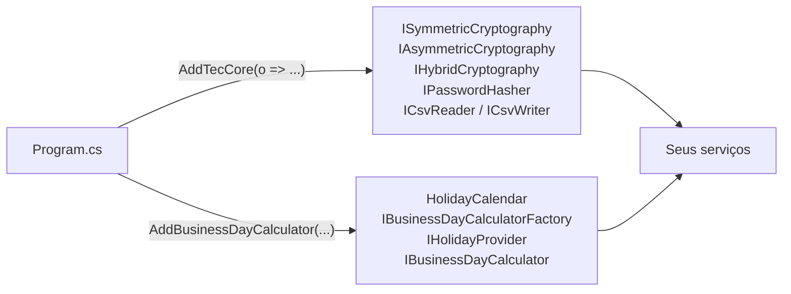

[🏠 TEC.Core](../README.md) › [📚 Documentação](README.md) › Injeção de dependência

# 🧩 Injeção de dependência

> Registra criptografia, hash de senha, CSV e dias úteis no container com uma chamada, validando a configuração na subida.

## 📑 Sumário

- [🎯 Visão geral](#-visão-geral)
- [🚀 Uso](#-uso)
  - [AddTecCore](#addteccore)
  - [TecCoreOptions](#teccoreoptions)
  - [AddBusinessDayCalculator](#addbusinessdaycalculator)
  - [Consumindo os serviços](#consumindo-os-serviços)
  - [Substituindo uma implementação](#substituindo-uma-implementação)
  - [Classes estáticas](#classes-estáticas)
- [⚙️ Opções](#️-opções)
- [❌ Erros](#-erros)
- [🛡️ Segurança](#️-segurança)
- [❓ Perguntas frequentes](#-perguntas-frequentes)

---

## 🎯 Visão geral

| Namespace | Tipos públicos | Para que serve |
|---|---|---|
| `TEC.Core.DependencyInjection` | `ServiceCollectionExtensions` (`AddTecCore`, `AddBusinessDayCalculator`), `TecCoreOptions` | Registro no `Microsoft.Extensions.DependencyInjection` (o pacote depende só das abstrações) |



| Método | Idempotente? | Validação |
|---|:---:|---|
| `AddTecCore` | ✅ `TryAdd*`: chamadas repetidas e registros seus feitos **antes** prevalecem | Opções validadas na chamada (falha na subida, não na primeira requisição) |
| `AddBusinessDayCalculator` | ❌ segundo registro lança `InvalidOperationException` | Dias não úteis validados na chamada; feriados já carregados antes |

O TEC.Core **não lê `IConfiguration`**: a aplicação decide de onde vêm os valores e os repassa em código.

---

## 🚀 Uso

### AddTecCore

> `TEC.Core.DependencyInjection` · método de extensão de `IServiceCollection`

```csharp
IServiceCollection AddTecCore(this IServiceCollection services, Action<TecCoreOptions>? configure = null)
```

Cria as opções com os valores recomendados, aplica `configure` e instancia já na chamada o hasher, o RSA e o leitor/escritor de CSV, cujos construtores validam as opções.

| Interface | Implementação | Ciclo de vida |
|---|---|---|
| `ISymmetricCryptography` | `AesGcmCryptography` | Singleton |
| `IAsymmetricCryptography` | `RsaCryptography(options.RsaSignatureMode)` | Singleton |
| `IHybridCryptography` | `HybridCryptography` (usa as duas registradas acima) | Singleton |
| `IPasswordHasher` | `Pbkdf2PasswordHasher(options.PasswordHashIterations)` | Singleton |
| `ICsvReader` | `CsvReader(options.Csv)` | Singleton |
| `ICsvWriter` | `CsvWriter(options.Csv)` | Singleton |

```csharp
using TEC.Core.Csv;
using TEC.Core.DependencyInjection;

// Padrões recomendados: PBKDF2 600 mil, assinatura PSS, CSV com ';' e UTF-8 com BOM
builder.Services.AddTecCore();

// Ajustes
builder.Services.AddTecCore(options =>
{
    options.PasswordHashIterations = 800_000;
    options.Csv = new CsvOptions { Delimiter = ',' };
});
```

**Opções vindas da configuração da aplicação**

```json
{
  "Csv": { "Delimiter": ";" },
  "Seguranca": { "IteracoesSenha": 600000 }
}
```

```csharp
var delimiter = builder.Configuration["Csv:Delimiter"]?[0] ?? ';';
var iterations = builder.Configuration.GetValue("Seguranca:IteracoesSenha", Pbkdf2PasswordHasher.DefaultIterations);

builder.Services.AddTecCore(options =>
{
    options.Csv = new CsvOptions { Delimiter = delimiter };
    options.PasswordHashIterations = iterations;   // fora de 100.000 a 10.000.000 → falha aqui, na subida
});
```

### TecCoreOptions

> `TEC.Core.DependencyInjection` · `sealed class`

| Propriedade | Tipo | Padrão | Descrição |
|---|---|---|---|
| `Csv` | `CsvOptions` | `CsvOptions.Default` | Opções do `ICsvReader`/`ICsvWriter` registrados (veja [csv.md](csv.md#csvoptions)) |
| `PasswordHashIterations` | `int` | `Pbkdf2PasswordHasher.DefaultIterations` (600.000) | Iterações do PBKDF2; de 100.000 a 10.000.000 |
| `RsaSignatureMode` | `RsaSignatureMode` | `Pss` | Esquema de assinatura do `RsaCryptography`; `Pkcs1` só para sistemas legados |

### AddBusinessDayCalculator

> `TEC.Core.DependencyInjection` · método de extensão de `IServiceCollection`

Registra a calculadora de dias úteis e os feriados. Os feriados são carregados **antes**, com `await` no `Program.cs` (veja [Feriados](datas.md#feriados)): o registro não faz I/O nem bloqueia thread.

| Sobrecarga | Uso |
|---|---|
| `AddBusinessDayCalculator(this IServiceCollection services, HolidayCalendar calendar, HolidayLocation? defaultLocation = null, IEnumerable<DayOfWeek>? nonWorkingDays = null)` | **Várias localidades.** Registra o calendário, a fábrica por localidade e a calculadora da localidade padrão (nacional, se omitida) |
| `AddBusinessDayCalculator(this IServiceCollection services, IHolidayProvider holidayProvider, IEnumerable<DayOfWeek>? nonWorkingDays = null)` | **Uma localidade.** Usa um provedor pronto (ex.: `new BrazilianNationalHolidays()` ou `InMemoryHolidayProvider`) |

| Interface | Implementação | Ciclo de vida |
|---|---|---|
| `HolidayCalendar` | O calendário informado (sobrecarga com calendário) | Singleton |
| `IBusinessDayCalculatorFactory` | `BusinessDayCalculatorFactory` (sobrecarga com calendário) | Singleton |
| `IHolidayProvider` | Feriados da localidade padrão, ou o provedor informado | Singleton |
| `IBusinessDayCalculator` | `BusinessDayCalculator` da localidade padrão | Singleton |

- Tudo é criado **no registro**: `nonWorkingDays` é copiado e validado já no `Program.cs`; alterar a coleção depois não afeta as calculadoras.
- Fontes obrigatórias que falham interrompem `BuildAsync` com `HolidaySourceException`, ainda na inicialização.

**Várias localidades (nacionais calculados + fontes)**

```csharp
using TEC.Core.Dates.Holidays;
using TEC.Core.DependencyInjection;

var calendar = await HolidayCalendar.CreateBuilder()
    .AddBrazilianNational()
    .AddCsvFile("feriados/municipais.csv", optional: true)
    .AddDatabase(() => new SqlConnection(connectionString), "SELECT Data, Descricao, Uf, CodigoIbge FROM Feriados")
    .BuildAsync();

builder.Services.AddBusinessDayCalculator(calendar,
    defaultLocation: new HolidayLocation("SP", 3550308),   // matriz: São Paulo (código IBGE)
    nonWorkingDays: [DayOfWeek.Sunday]);                   // empresa que trabalha aos sábados
```

**Somente feriados nacionais**

```csharp
builder.Services.AddBusinessDayCalculator(new BrazilianNationalHolidays());
```

**Arquivos de feriados listados no `appsettings.json`**

```csharp
var files = builder.Configuration.GetSection("Feriados:Arquivos").Get<string[]>() ?? [];
var calendarBuilder = HolidayCalendar.CreateBuilder().AddBrazilianNational();
foreach (var file in files)
    calendarBuilder.AddCsvFile(file);

builder.Services.AddBusinessDayCalculator(await calendarBuilder.BuildAsync());
```

> [!TIP]
> Para copiar os arquivos de feriados para a saída do build:
> ```xml
> <ItemGroup>
>   <None Update="feriados\*.*" CopyToOutputDirectory="PreserveNewest" />
> </ItemGroup>
> ```

### Consumindo os serviços

Injeção por construtor das interfaces registradas:

```csharp
using TEC.Core.Cryptography.Abstractions;
using TEC.Core.Csv.Abstractions;
using TEC.Core.Dates.BusinessDays;
using TEC.Core.Dates.Holidays;
using TEC.Core.Dates.TimeZones;

public sealed class BillingService(
    IBusinessDayCalculator headOffice,
    IBusinessDayCalculatorFactory calendars,
    ISymmetricCryptography crypto,
    ICsvWriter csv,
    TimeProvider clock)
{
    // "Hoje" em Brasília, com relógio injetável (FakeTimeProvider nos testes)
    public DateOnly HeadOfficeDueDate() =>
        headOffice.NextOrSameBusinessDay(BrazilTimeZone.GetToday(clock).AddDays(30));

    public DateOnly BranchDueDate(int ibgeCode) =>
        calendars.For(HolidayLocation.FromIbgeCode(ibgeCode)).AddBusinessDays(BrazilTimeZone.GetToday(clock), 10);
}
```

> [!NOTE]
> `TimeProvider` não é registrado pelo TEC.Core: registre `builder.Services.AddSingleton(TimeProvider.System);` (e
> `FakeTimeProvider`, do pacote `Microsoft.Extensions.TimeProvider.Testing`, nos testes).

### Substituindo uma implementação

Como `AddTecCore` usa `TryAdd*`, registre a sua implementação **antes**:

```csharp
builder.Services.AddSingleton<IPasswordHasher, Argon2PasswordHasher>();
builder.Services.AddTecCore();   // não sobrescreve o IPasswordHasher acima
```

> [!WARNING]
> Uma implementação própria de `IPasswordHasher` deve seguir o contrato de `Verify` com hash `null` (verificação
> fictícia de mesmo custo). Veja [criptografia.md](criptografia.md#interfaces).

### Classes estáticas

`DocumentValidator`, `DocumentFormatter`, `MaskFormatter`, `DocumentGenerator`, `SensitiveDataMasker`, `Base64UrlEncoder`, `HashHelper`, `SecureRandomGenerator`, `EnumHelper`, `DateFormatter`, `BrazilTimeZone` e as classes de extensão são **estáticas e sem estado**: use-as diretamente, sem registro.

---

## ⚙️ Opções

| Opção | Onde | Padrão | Descrição |
|---|---|---|---|
| `TecCoreOptions.Csv` | `AddTecCore` | `CsvOptions.Default` | Opções de CSV dos serviços registrados |
| `TecCoreOptions.PasswordHashIterations` | `AddTecCore` | `600_000` | Iterações do PBKDF2 (100.000 a 10.000.000) |
| `TecCoreOptions.RsaSignatureMode` | `AddTecCore` | `RsaSignatureMode.Pss` | Esquema de assinatura RSA |
| `calendar` | `AddBusinessDayCalculator` | — | Calendário carregado por `HolidayCalendar.CreateBuilder()...BuildAsync()` |
| `defaultLocation` | `AddBusinessDayCalculator` | `HolidayLocation.National` | Localidade de `IHolidayProvider`/`IBusinessDayCalculator` |
| `holidayProvider` | `AddBusinessDayCalculator` | — | Provedor pronto (uma localidade) |
| `nonWorkingDays` | `AddBusinessDayCalculator` | sábado e domingo | Dias da semana não úteis (ao menos um dia precisa ser útil) |

---

## ❌ Erros

| Exceção | Quando ocorre | O que fazer |
|---|---|---|
| `ArgumentNullException` | `services`, `calendar` ou `holidayProvider` nulo; `TecCoreOptions.Csv` nulo (`ParamName = "Csv"`) | Informe os argumentos; não atribua `null` a `Csv` |
| `ArgumentOutOfRangeException` | `PasswordHashIterations` fora de 100.000 a 10.000.000 (*O valor deve estar entre 100000 e 10000000.*, `ParamName = "iterations"`); `RsaSignatureMode` fora do enum | Corrija a configuração; a falha acontece na subida |
| `InvalidOperationException` | `IHolidayProvider`, `IBusinessDayCalculator`, `IBusinessDayCalculatorFactory` ou `HolidayCalendar` já registrados | Chame `AddBusinessDayCalculator` **uma única vez**; combine as fontes no mesmo `HolidayCalendar.CreateBuilder()` |
| `ArgumentException` | `nonWorkingDays` com os 7 dias (*Ao menos um dia da semana deve ser útil.*) ou valor fora de `DayOfWeek` (*Dia da semana inválido.*) | Deixe ao menos um dia útil |
| `HolidaySourceException` | Fonte obrigatória falhou no `BuildAsync` (antes do registro) | Veja [datas.md](datas.md#feriados); marque a fonte como `optional: true` se ela puder faltar |

---

## 🛡️ Segurança

> [!WARNING]
> Não reduza `PasswordHashIterations` abaixo do padrão sem medir: o mínimo aceito (100.000) existe para testes e
> exemplos. Aumente com o tempo, e `NeedsRehash` atualiza os hashes antigos no próximo login.

> [!CAUTION]
> As chaves do AES e do RSA **não** são opções do registro: são passadas em cada chamada e vêm de um cofre de
> segredos (ex.: TEC.Vault), nunca do `appsettings` versionado.

- Todos os serviços registrados são Singletons thread-safe sem estado mutável. O que **você** fornece precisa ser thread-safe também: provedor de feriados próprio, `CultureInfo` em `CsvOptions.Culture` e o callback `OnInvalidRow` (veja [compatibilidade.md](compatibilidade.md#thread-safety)).

---

## ❓ Perguntas frequentes

<details>
<summary>Posso chamar <code>AddTecCore</code> mais de uma vez?</summary>

Sim. É idempotente: a segunda chamada não duplica nem substitui nada (inclusive as opções da primeira prevalecem).

</details>

<details>
<summary><code>InvalidOperationException</code> ao chamar <code>AddBusinessDayCalculator</code></summary>

**Causa:** os serviços de dias úteis já estavam registrados. O registro duplicado é recusado para que nenhum provedor seja descartado em silêncio.
**Solução:** registre uma única vez e combine todas as fontes de feriados no mesmo `HolidayCalendar.CreateBuilder()`.

</details>

---

⬅️ [Anterior: Enums](enums.md) · [📚 Índice](README.md) · [Próximo: Compatibilidade](compatibilidade.md) ➡️
