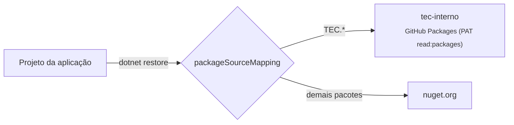

[🏠 TEC.Core](../README.md) › [📚 Documentação](README.md) › Instalação

# 📥 Instalação

> Como obter o pacote `TEC.Core` do feed da organização na máquina, no CI e no Docker, com segurança contra *dependency confusion*.

## 📑 Sumário

- [🎯 Visão geral](#-visão-geral)
- [🚀 Uso](#-uso)
  - [Máquina do desenvolvedor](#máquina-do-desenvolvedor)
  - [nuget.config da aplicação](#nugetconfig-da-aplicação)
  - [GitHub Actions](#github-actions)
  - [Dockerfile](#dockerfile)
  - [Referência de projeto](#referência-de-projeto)
- [⚙️ Opções](#️-opções)
- [❌ Erros](#-erros)
- [🛡️ Segurança](#️-segurança)
- [❓ Perguntas frequentes](#-perguntas-frequentes)

---

## 🎯 Visão geral

O TEC.Core é publicado no **GitHub Packages** da organização `tudoemcodigo` (`https://nuget.pkg.github.com/tudoemcodigo/index.json`). O GitHub Packages **sempre exige autenticação**, mesmo para ler pacotes públicos.



| Requisito | Detalhe |
|---|---|
| Projeto | `net8.0` ou `net10.0` (o pacote traz `lib/net8.0` e `lib/net10.0`) |
| Credencial | PAT *classic* com o escopo `read:packages` (ou o `GITHUB_TOKEN` no Actions) |
| Origem | Nome `tec-interno` (o mesmo usado no `packageSourceMapping` de todos os componentes) |
| Dependência transitiva | Só `Microsoft.Extensions.DependencyInjection.Abstractions` |
| Versão atual | `0.0.1` (ainda não publicada) |

---

## 🚀 Uso

### Máquina do desenvolvedor

```bash
# Uma vez por máquina (a credencial fica no NuGet.Config do usuário, fora do repositório)
dotnet nuget add source https://nuget.pkg.github.com/tudoemcodigo/index.json -n tec-interno -u <usuario> -p <PAT>

# No projeto
dotnet add package TEC.Core --version 0.0.1
```

Ou no `.csproj` (com Central Package Management, a versão vai no `Directory.Packages.props`):

```xml
<ItemGroup>
  <PackageReference Include="TEC.Core" Version="0.0.1" />
</ItemGroup>
```

> [!TIP]
> Se o `nuget.config` do repositório já declara a origem `tec-interno` (sem credencial), use
> `dotnet nuget update source tec-interno -u <usuario> -p <PAT>` em vez de `add source`. Em sistemas sem
> criptografia de credenciais (Linux/macOS), acrescente `--store-password-in-clear-text`.

### nuget.config da aplicação

Pacotes `TEC.*` só podem vir do feed interno; o resto, do nuget.org:

```xml
<configuration>
  <packageSources>
    <clear />
    <add key="nuget.org" value="https://api.nuget.org/v3/index.json" />
    <add key="tec-interno" value="https://nuget.pkg.github.com/tudoemcodigo/index.json" />
  </packageSources>
  <packageSourceMapping>
    <packageSource key="tec-interno"><package pattern="TEC.*" /></packageSource>
    <packageSource key="nuget.org"><package pattern="*" /></packageSource>
  </packageSourceMapping>
</configuration>
```

### GitHub Actions

O `GITHUB_TOKEN` do repositório consumidor lê o pacote quando ele é público na organização (ou quando o repositório tem acesso *Read* em **Package settings → Manage Actions access**). Conceda `packages: read`:

```yaml
permissions:
  contents: read
  packages: read

steps:
  - uses: actions/checkout@<sha> # vX.Y.Z
    with:
      persist-credentials: false
  - uses: actions/setup-dotnet@<sha> # vX.Y.Z
    with:
      global-json-file: global.json
  - name: Credencial do feed interno
    env:
      GH_TOKEN: ${{ secrets.GITHUB_TOKEN }}
    run: |
      dotnet nuget update source tec-interno --username "$GITHUB_ACTOR" --password "$GH_TOKEN" --store-password-in-clear-text
  - run: dotnet restore --locked-mode
```

> [!NOTE]
> Componentes `lib-tec-*` não precisam disso: o workflow central (`tec-workflows`) configura a credencial quando
> `private-feed: true`.

### Dockerfile

```dockerfile
# docker build --secret id=gh_token,env=GITHUB_PACKAGES_TOKEN --build-arg GH_USER=<usuario> .
FROM mcr.microsoft.com/dotnet/sdk:10.0 AS build
WORKDIR /src
COPY . .
ARG GH_USER
RUN --mount=type=secret,id=gh_token \
    dotnet nuget update source tec-interno --username "$GH_USER" \
      --password "$(cat /run/secrets/gh_token)" --store-password-in-clear-text && \
    dotnet restore --locked-mode
```

Faça o restore num estágio de build separado: a credencial gravada fica no `NuGet.Config` desse estágio, nunca na imagem final.

### Referência de projeto

Para depurar a biblioteca, clone ao lado da solução e referencie o projeto:

```bash
git clone https://github.com/tudoemcodigo/lib-tec-core TEC.Core
dotnet add MyApp/MyApp.csproj reference TEC.Core/TEC.Core/TEC.Core.csproj
```

Componentes TEC usam `<TecReference Include="TEC.Core" />`, que faz isso automaticamente quando a pasta vizinha existe (veja [desenvolvimento.md](desenvolvimento.md)).

---

## ⚙️ Opções

| Tipo de versão | Exemplo | Como é gerada |
|---|---|---|
| Estável | `0.0.1`, `1.2.0` | Workflow **Publicar versão** com a versão digitada |
| Release candidate | `1.2.0-rc.1` | Mesmo workflow; vira *pre-release* |
| Prévia | `1.2.0-preview.3` | Automática a cada push na `main` com o CI verde (`<Version>-preview.N`, com N sequencial por versão); menor que `1.2.0` na ordenação SemVer |

```bash
dotnet add package TEC.Core --prerelease   # última prévia ou release candidate
```

---

## ❌ Erros

| Erro | Quando ocorre | O que fazer |
|---|---|---|
| `401 Unauthorized` no restore | Credencial da origem `tec-interno` ausente, expirada ou sem `read:packages` | Recrie o PAT com `read:packages` e atualize a origem |
| `403 Forbidden` no Actions | Pacote privado sem acesso do repositório consumidor | *Package settings → Manage Actions access* → *Read* (ou torne o pacote público na organização) |
| `NU1101` (pacote não encontrado) | Origem `tec-interno` ausente ou `packageSourceMapping` apontando `TEC.*` para outra origem | Confira o `nuget.config` acima |
| `NU1100`/`NU1102` versão não encontrada | A versão ainda não foi publicada | Use uma versão existente (aba *Packages* da organização) |

---

## 🛡️ Segurança

> [!CAUTION]
> Nunca grave o PAT no `nuget.config` versionado, em `Dockerfile` ou em variável de build (`--build-arg`): use o
> `NuGet.Config` do usuário, `--secret` do Docker e o `GITHUB_TOKEN` efêmero no Actions.

> [!WARNING]
> Sem `packageSourceMapping`, um pacote `TEC.*` publicado por terceiros no nuget.org poderia ser restaurado no lugar
> do interno (*dependency confusion*).

---

## ❓ Perguntas frequentes

<details>
<summary>Preciso de PAT para um pacote público?</summary>

Sim. O GitHub Packages exige autenticação até para leitura. Um PAT *classic* só com `read:packages` basta.

</details>

<details>
<summary>Posso usar um PAT <i>fine-grained</i>?</summary>

O feed NuGet do GitHub Packages aceita apenas PAT *classic* (ou o `GITHUB_TOKEN` no Actions).

</details>

---

⬅️ [📚 Índice](README.md) · [Próximo: Common](common.md) ➡️
