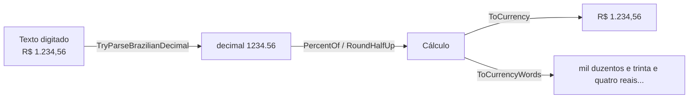

[🏠 TEC.Core](../README.md) › [📚 Documentação](README.md) › Números

# 🔢 Números

> Formata em reais, números e percentuais no padrão brasileiro, arredonda com intenção explícita, escreve valores por extenso e interpreta números digitados pelo usuário.

## 📑 Sumário

- [🎯 Visão geral](#-visão-geral)
- [🚀 Uso](#-uso)
  - [NumericExtensions](#numericextensions)
  - [NumberToWordsConverter](#numbertowordsconverter)
  - [Qual arredondamento usar?](#qual-arredondamento-usar)
- [⚙️ Opções](#️-opções)
- [❌ Erros](#-erros)
- [🛡️ Segurança](#️-segurança)
- [❓ Perguntas frequentes](#-perguntas-frequentes)

---

## 🎯 Visão geral

| Namespace | Tipos | Para que serve |
|---|---|---|
| `TEC.Core.Numbers.Extensions` | `NumericExtensions` | Moeda, número e percentual em pt-BR; arredondamento; extenso; leitura de valores digitados |
| `TEC.Core.Numbers.Words` | `NumberToWordsConverter` | Número inteiro e valor em reais por extenso |

**Quando usar:** boletos, recibos, notas fiscais e formulários com valores digitados. A formatação usa `BrazilianCulture.Instance` (veja [Common](common.md#brazilianculture)) e funciona sem ICU.



---

## 🚀 Uso

Exemplo completo: recibo a partir de um valor digitado.

```csharp
using TEC.Core.Common.Results;
using TEC.Core.Numbers.Extensions;

public static Result<string> Receipt(string typedAmount, string payer)
{
    if (!typedAmount.TryParseBrazilianDecimal(out var amount) || amount <= 0)
        return Error.Validation("VALOR_INVALIDO", "Informe um valor como 1.234,56.", "amount");

    var interest = amount.PercentOf(2.5m).RoundHalfUp();   // 2,5% arredondado para 2 casas
    var total = amount + interest;
    return $"Recebi de {payer} a quantia de {total.ToCurrency()} ({total.ToCurrencyWords()}).";
}

// Receipt("1.000,00", "Maria").Value
// "Recebi de Maria a quantia de R$ 1.025,00 (mil e vinte e cinco reais)."
```

### NumericExtensions

> `TEC.Core.Numbers.Extensions` · `static class` (métodos de extensão)

| Membro | Retorno | Descrição |
|---|---|---|
| `MaxDecimals` (const) | `int` | `28`: maior valor aceito em `decimals`. |
| `ToCurrency(this decimal value)` | `string` | `1234.5m` → `"R$ 1.234,50"`; `-1234.5m` → `"-R$ 1.234,50"`. |
| `ToCurrency(this double value)` | `string` | `99.9` → `"R$ 99,90"`. |
| `ToBrazilianNumber(this decimal value, int decimals = 2)` | `string` | `1234567.891m` → `"1.234.567,89"`; com `0` → `"1.234.568"`. |
| `ToPercentage(this decimal value, int decimals = 2)` | `string` | `0.1575m` → `"15,75%"` (o valor é uma **fração**); `0.5m.ToPercentage(1)` → `"50,0%"`. |
| `RoundHalfUp(this decimal value, int decimals = 2)` | `decimal` | `2.345m` → `2.35` (comercial, meio para longe do zero). |
| `RoundBankers(this decimal value, int decimals = 2)` | `decimal` | `2.345m` → `2.34`; `2.355m` → `2.36` (bancário, meio para o par). |
| `Truncate(this decimal value, int decimals = 2)` | `decimal` | `2.349m` → `2.34` (sem arredondar). |
| `PercentOf(this decimal value, decimal percent)` | `decimal` | `200m.PercentOf(15)` → `30`. |
| `ToCurrencyWords(this decimal value)` | `string` | `1234.56m` → `"mil duzentos e trinta e quatro reais e cinquenta e seis centavos"`. |
| `ToWords(this long value)` / `ToWords(this int value)` | `string` | `21` → `"vinte e um"`. |
| `TryParseBrazilianDecimal(this string? value, out decimal result)` | `bool` | `"R$ 1.234,56"` → `true`, `1234.56`; `"abc"` → `false`; `"1.5"`, `"1.2.3"`, `"12.34"` → `false`. |

- `ToCurrency` troca o espaço não separável (U+00A0) gerado pela cultura por um espaço comum, o que evita problemas em comparações, PDFs e planilhas.
- `TryParseBrazilianDecimal` aceita sinal no início (`-`/`+`), o prefixo `R$` (uma vez, depois do sinal, sem diferenciar maiúsculas) e o espaço não separável, e limita a entrada a 64 caracteres. Símbolo no meio do número, sinal no final e parênteses são recusados.
- O ponto (separador de milhar) só é aceito **entre grupos de 3 dígitos da parte inteira**: `1.234,56`, `1.234.567` e `1234,56` são válidos; `1.5`, `1.2.3` e `12.34` são recusados (o `decimal.TryParse` puro aceitaria o ponto em qualquer posição: `1.5` viraria `15` e `1.2.3`, `123`, corrompendo valores digitados no padrão americano). `1.234` continua sendo mil duzentos e trinta e quatro (padrão brasileiro).

| Chamada | Resultado |
|---|---|
| `1234.5m.ToCurrency()` | `"R$ 1.234,50"` |
| `0.1575m.ToPercentage()` | `"15,75%"` |
| `2.345m.RoundHalfUp()` / `2.345m.RoundBankers()` | `2,35` / `2,34` |
| `1_000_000m.ToCurrencyWords()` | `"um milhão de reais"` |
| `"R$ 1.234,56".TryParseBrazilianDecimal(out var v)` | `true`, `v = 1234.56` |
| `"1.5".TryParseBrazilianDecimal(out _)` | `false` (milhar só em grupos de 3 dígitos) |

```csharp
using TEC.Core.Exceptions;
using TEC.Core.Numbers.Extensions;

// Boleto: valor e extenso na mesma linha
var amount = 1234.56m;
var line = $"{amount.ToCurrency()} ({amount.ToCurrencyWords()})";
// "R$ 1.234,56 (mil duzentos e trinta e quatro reais e cinquenta e seis centavos)"

// Formulário: ler valor digitado pelo usuário
if (!input.TryParseBrazilianDecimal(out var price))
    throw new RequestValidationException("price", "Valor inválido.");
```

### NumberToWordsConverter

> `TEC.Core.Numbers.Words` · `static class`

Converte números para extenso em português do Brasil. Os métodos de extensão acima delegam para esta classe.

| Membro | Retorno | Descrição |
|---|---|---|
| `MaxValue` (const) | `long` | `999_999_999_999_999`: maior valor suportado (novecentos e noventa e nove trilhões...). |
| `ToWords(long number)` | `string` | Inteiro por extenso, inclusive negativos. |
| `ToCurrencyWords(decimal value)` | `string` | Valor em reais por extenso, arredondado para 2 casas (comercial). |

Regras de português aplicadas:

- `100` é "cem"; de `101` a `199` usa "cento";
- `1000` é "mil" (não "um mil");
- vírgula entre classes não finais: "um milhão**,** mil e cem", "um milhão**,** cem mil e um";
- "e" antes do último grupo quando ele é menor que 100 ou uma centena exata: "mil **e** cem", "mil **e** vinte";
- "**de** reais" quando o valor termina em milhão, bilhão ou trilhão exato: "um milhão **de** reais".

| Entrada | `ToWords` |
|---|---|
| `100` | `"cem"` |
| `101` | `"cento e um"` |
| `1100` | `"mil e cem"` |
| `2026` | `"dois mil e vinte e seis"` |
| `-5` | `"menos cinco"` |
| `1_000_001` | `"um milhão e um"` |
| `1_100_000` | `"um milhão e cem mil"` |
| `999_999` | `"novecentos e noventa e nove mil novecentos e noventa e nove"` |
| `1_001_100` | `"um milhão, mil e cem"` |
| `1_001_001` | `"um milhão, mil e um"` |
| `1_100_001` | `"um milhão, cem mil e um"` |
| `1_234_567` | `"um milhão, duzentos e trinta e quatro mil quinhentos e sessenta e sete"` |

| Entrada | `ToCurrencyWords` |
|---|---|
| `0m` | `"zero real"` |
| `0.01m` | `"um centavo"` |
| `1m` | `"um real"` |
| `-10.5m` | `"menos dez reais e cinquenta centavos"` |
| `1_000_000m` | `"um milhão de reais"` |
| `2_500_000m` | `"dois milhões e quinhentos mil reais"` |

### Qual arredondamento usar?

| Situação | Método | Por quê |
|---|---|---|
| Preço, nota fiscal, boleto | `RoundHalfUp` | Regra comercial esperada pelo cliente (0,5 sobe). |
| Somatório de muitos valores (juros, rateio) | `RoundBankers` | Distribui o arredondamento para cima e para baixo, sem viés acumulado. |
| Cálculo que não pode favorecer o cliente | `Truncate` | Descarta as casas excedentes. |

> [!WARNING]
> `Math.Round` do .NET usa arredondamento **bancário** por padrão: `Math.Round(2.345m, 2)` retorna `2.34`, não `2.35`. Deixe a intenção explícita com `RoundHalfUp` ou `RoundBankers`.

---

## ⚙️ Opções

O módulo não tem opções configuráveis; os limites são fixos:

| Constante / parâmetro | Padrão | Descrição |
|---|---|---|
| `decimals` | `2` | Casas decimais de `ToBrazilianNumber`, `ToPercentage`, `RoundHalfUp`, `RoundBankers` e `Truncate`. |
| `NumericExtensions.MaxDecimals` | `28` | Maior valor aceito em `decimals`. |
| `NumberToWordsConverter.MaxValue` | `999_999_999_999_999` | Maior valor absoluto por extenso. |
| Tamanho máximo em `TryParseBrazilianDecimal` | 64 caracteres | Entradas maiores retornam `false`. |

---

## ❌ Erros

| Exceção | Quando ocorre | O que fazer |
|---|---|---|
| `ArgumentOutOfRangeException` | `decimals` fora de 0 a 28: *O valor deve estar entre 0 e 28.* (`ParamName = "decimals"`) | Use de 0 a `MaxDecimals`. |
| `ArgumentOutOfRangeException` | `ToCurrency(double)` com `NaN`, infinito ou fora do intervalo de `decimal`: *O valor deve ser um número finito dentro do intervalo de decimal.* | Valide o `double` ou trabalhe com `decimal`. |
| `ArgumentOutOfRangeException` | `ToWords` fora de ±`MaxValue`: *O valor deve estar entre -999999999999999 e 999999999999999.* | Limite o valor antes de escrever por extenso. |
| `ArgumentOutOfRangeException` | `ToCurrencyWords` com valor absoluto (após arredondar) acima de `MaxValue`: *O valor deve ser no máximo 999999999999999.* | Idem. |
| `OverflowException` | `PercentOf` com resultado fora do intervalo de `decimal` | Valide a ordem de grandeza dos operandos. |

`TryParseBrazilianDecimal` nunca lança: retorna `false`.

---

## 🛡️ Segurança

> [!WARNING]
> Nunca use `decimal.Parse`/`TryParse` puro com cultura pt-BR para valores digitados: o ponto é aceito em qualquer posição e `"1.5"` vira `15`. Use `TryParseBrazilianDecimal`, que valida o agrupamento de milhar e limita o tamanho da entrada.

> [!WARNING]
> Use `decimal` (não `double`) para dinheiro. `ToCurrency(double)` existe por conveniência e recusa `NaN`/infinito.

---

## ❓ Perguntas frequentes

<details>
<summary>Por que <code>"1.5"</code> não é aceito por <code>TryParseBrazilianDecimal</code>?</summary>

No padrão brasileiro o ponto é separador de milhar e só pode aparecer entre grupos de 3 dígitos. Aceitar `"1.5"` como `15` corromperia valores digitados no padrão americano; por isso o método recusa.

</details>

<details>
<summary>Por que <code>ToPercentage</code> de <code>15m</code> mostra <code>"1.500,00%"</code>?</summary>

O valor é uma **fração**: `0.15m.ToPercentage()` → `"15,00%"`. Para calcular o percentual de um valor, use `PercentOf`.

</details>

<details>
<summary>A formatação funciona em container sem ICU?</summary>

Sim. A cultura usada é `BrazilianCulture.Instance`, que monta uma pt-BR equivalente quando o ICU não está disponível. Veja [Compatibilidade](compatibilidade.md).

</details>

---
⬅️ [Texto](texto.md) · [📚 Índice](README.md) · [Datas](datas.md) ➡️
