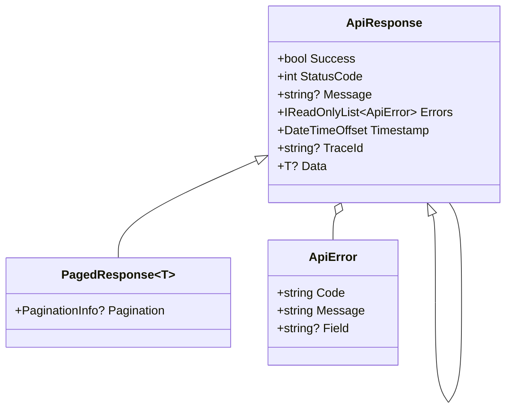
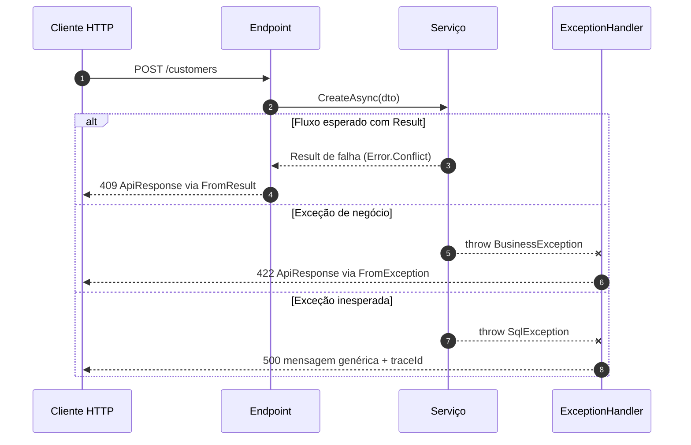
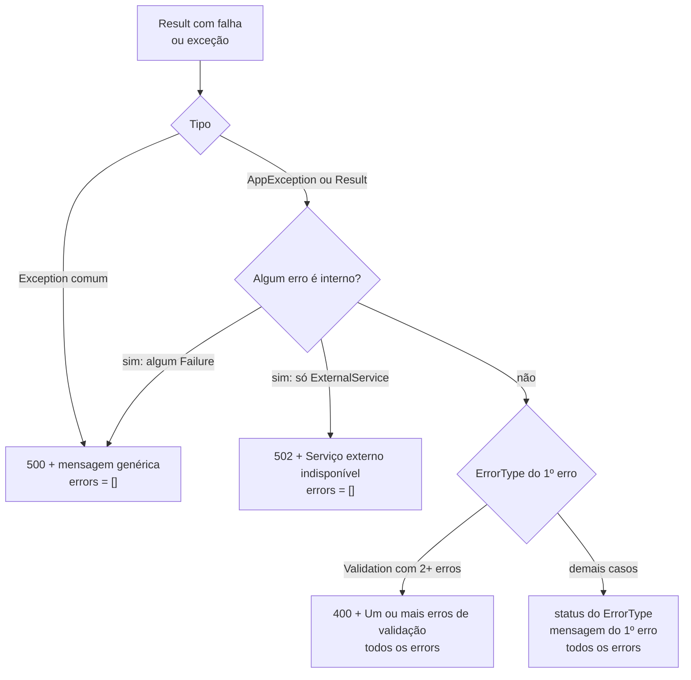
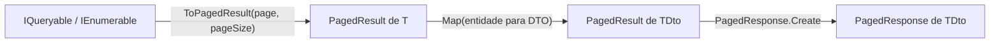

[🏠 TEC.Core](../README.md) › [📚 Documentação](README.md) › Respostas de API

# 🌐 Respostas de API

> Um envelope único para todas as respostas, com status HTTP derivado do `Result` ou da exceção, sem vazar detalhes internos, e paginação validada.

## 📑 Sumário

- [🎯 Visão geral](#-visão-geral)
- [🚀 Uso](#-uso)
  - [ApiResponse](#apiresponse)
  - [FromResult e FromException](#fromresult-e-fromexception)
  - [ApiResponse&lt;T&gt;](#apiresponset)
  - [PagedResponse&lt;T&gt;](#pagedresponset)
  - [ApiError](#apierror)
  - [Paginação](#paginação)
  - [PagedResult&lt;T&gt;](#pagedresultt)
  - [PaginationInfo](#paginationinfo)
  - [PaginationExtensions](#paginationextensions)
  - [Integração com ASP.NET Core](#integração-com-aspnet-core)
- [⚙️ Opções](#️-opções)
- [❌ Erros](#-erros)
- [🛡️ Segurança](#️-segurança)
- [❓ Perguntas frequentes](#-perguntas-frequentes)

---

## 🎯 Visão geral

| Namespace | Tipos públicos | Para que serve |
|---|---|---|
| `TEC.Core.Responses` | `ApiResponse`, `ApiResponse<T>`, `PagedResponse<T>`, `ApiError` | Envelope de resposta e erros expostos ao cliente |
| `TEC.Core.Responses.Pagination` | `PagedResult<T>`, `PaginationInfo`, `PaginationExtensions` | Paginação de consultas e coleções com limite de tamanho |



| Campo JSON | Tipo | Descrição |
|---|---|---|
| `success` | `bool` | `true` nas fábricas de sucesso (`Ok`, `Created`, `Create`) |
| `statusCode` | `int` | Status HTTP (100 a 599) |
| `message` | `string?` | Mensagem para o consumidor ¹ |
| `data` | `T?` | Dados (só em `ApiResponse<T>`) ¹ |
| `pagination` | `object?` | Metadados de paginação (só em `PagedResponse<T>`) |
| `errors` | `ApiError[]` | Lista de erros (vazia em sucesso) |
| `timestamp` | `string` | Data e hora UTC de geração (ISO 8601) |
| `traceId` | `string?` | Rastreamento, para correlacionar com os logs ¹ |

A ordem dos campos é fixa (`[JsonPropertyOrder]`). Os nomes saem em camelCase com `JsonDefaults.Options` e com as opções web padrão do ASP.NET Core. ¹ A omissão de nulos depende das opções: `JsonDefaults.Options` omite; as opções padrão do ASP.NET Core escrevem `null`. Só o `field` de `ApiError` é omitido sempre que nulo, por atributo próprio.

Fluxo típico numa API:



---

## 🚀 Uso

### ApiResponse

> `TEC.Core.Responses` · `record`

Envelope **sem dados**. Imutável; use `with` para ajustes (ex.: `TraceId`).

| Membro | Retorno | Descrição |
|---|---|---|
| `Success` | `bool` | `true` em respostas de sucesso (`init`) |
| `StatusCode` | `int` | Status HTTP; validado entre 100 e 599 (`init`, inclusive via `with`) |
| `Message` | `string?` | Mensagem para o consumidor (`init`) |
| `Errors` | `IReadOnlyList<ApiError>` | Lista de erros, nunca nula; vazia em sucesso (`init`) |
| `Timestamp` | `DateTimeOffset` | Momento de criação (padrão `DateTimeOffset.UtcNow`) |
| `TraceId` | `string?` | Identificador de rastreamento (`init`) |
| `Ok(string? message = null)` | `ApiResponse` | 200 |
| `Fail(int statusCode, string message, params IEnumerable<ApiError> errors)` | `ApiResponse` | 400 a 599; mensagem obrigatória |
| `BadRequest(string message, params IEnumerable<ApiError> errors)` | `ApiResponse` | 400; mensagem obrigatória |
| `ValidationError(params IEnumerable<ApiError> errors)` | `ApiResponse` | 400; *Um ou mais erros de validação ocorreram.* |
| `Unauthorized(string message = "Não autenticado.")` | `ApiResponse` | 401 |
| `Forbidden(string message = "Você não tem permissão para realizar esta operação.")` | `ApiResponse` | 403 |
| `NotFound(string message = "Recurso não encontrado.")` | `ApiResponse` | 404 |
| `Conflict(string message, params IEnumerable<ApiError> errors)` | `ApiResponse` | 409; mensagem obrigatória |
| `InternalError(string message = "Ocorreu um erro interno. Tente novamente mais tarde.")` | `ApiResponse` | 500 |
| `FromResult(Result result, string? successMessage = null)` | `ApiResponse` | 200 ou status pelo `ErrorType` ([fluxo](#fromresult-e-fromexception)) |
| `FromException(Exception exception, string? traceId = null)` | `ApiResponse` | Status pelo tipo da exceção ([fluxo](#fromresult-e-fromexception)) |

**Membros protegidos** (para tipos derivados): `ValidateFailure(int, string, IEnumerable<ApiError>)`, `MapErrors(IReadOnlyList<Error>)` e `MapException(Exception)`.

**`ApiResponse.DefaultMessages`** (pública): constantes `Validation`, `Unauthorized`, `Forbidden`, `NotFound`, `InternalError` e `ExternalService`. É a **fonte única** dos textos genéricos: as exceções do TEC.Core (`UnauthenticatedException`, `ForbiddenException`, `RequestValidationException`) e os demais componentes TEC usam estas constantes, para o cliente receber sempre o mesmo texto para o mesmo status.

```csharp
using TEC.Core.Responses;

var response = ApiResponse.ValidationError(
    new ApiError("CPF_INVALIDO", "CPF inválido.", "cpf"),
    new ApiError("EMAIL_OBRIGATORIO", "E-mail é obrigatório.", "email"));
```

```json
{
  "success": false,
  "statusCode": 400,
  "message": "Um ou mais erros de validação ocorreram.",
  "errors": [
    { "code": "CPF_INVALIDO", "message": "CPF inválido.", "field": "cpf" },
    { "code": "EMAIL_OBRIGATORIO", "message": "E-mail é obrigatório.", "field": "email" }
  ],
  "timestamp": "2026-09-30T14:00:00+00:00"
}
```

> [!NOTE]
> Em projetos `net8.0` (C# 12), os parâmetros `params IEnumerable<ApiError>` só aceitam argumentos avulsos com C# 13+. Passe uma coleção (`ValidationError([error1, error2])`) ou use `<LangVersion>13</LangVersion>`/`latest` com o SDK 9+. Veja [Compatibilidade](compatibilidade.md).

### FromResult e FromException

As duas fábricas aplicam a mesma regra (`MapErrors`): o status vem do `ErrorType` do **primeiro** erro, e qualquer erro interno esconde todos.



| Entrada | Status | `message` | `errors` |
|---|:---:|---|---|
| `Result` de sucesso | 200 | `successMessage` | `[]` |
| `Error.Validation` (1 erro) | 400 | Mensagem do erro | O erro |
| `Error.Validation` (2+ erros, o 1º de validação) | 400 | *Um ou mais erros de validação ocorreram.* | Todos |
| `AppException` exposta (`BusinessException`...) | Do `ErrorType` | Mensagem do 1º erro | Todos |
| Algum `Failure` na lista / `InvalidConfigurationException` | 500 | *Ocorreu um erro interno. Tente novamente mais tarde.* | `[]` |
| Só `ExternalService` oculto / `IntegrationException` | 502 | *Serviço externo indisponível. Tente novamente mais tarde.* | `[]` |
| `Exception` que não é `AppException` | 500 | *Ocorreu um erro interno. Tente novamente mais tarde.* | `[]` |

<details>
<summary><b>Exemplos de JSON: 422, 500 e 502</b></summary>

```csharp
ApiResponse.FromException(new BusinessException("SALDO_INSUFICIENTE", "Saldo insuficiente."), "00-abc-01");
```

```json
{
  "success": false,
  "statusCode": 422,
  "message": "Saldo insuficiente.",
  "errors": [ { "code": "SALDO_INSUFICIENTE", "message": "Saldo insuficiente." } ],
  "timestamp": "2026-09-30T14:00:00+00:00",
  "traceId": "00-abc-01"
}
```

```csharp
ApiResponse.FromException(new InvalidOperationException("detalhe interno"), "00-abc-02");
```

```json
{
  "success": false,
  "statusCode": 500,
  "message": "Ocorreu um erro interno. Tente novamente mais tarde.",
  "errors": [],
  "timestamp": "2026-09-30T14:00:00+00:00",
  "traceId": "00-abc-02"
}
```

```csharp
ApiResponse.FromException(new IntegrationException("ReceitaFederal", "timeout"));
```

```json
{
  "success": false,
  "statusCode": 502,
  "message": "Serviço externo indisponível. Tente novamente mais tarde.",
  "errors": [],
  "timestamp": "2026-09-30T14:00:00+00:00"
}
```

</details>

### ApiResponse&lt;T&gt;

> `TEC.Core.Responses` · `record` (herda `ApiResponse`)

Envelope **com dados**. Tem as mesmas fábricas de `ApiResponse` (redeclaradas com `new`, tipadas) e mais:

| Membro | Retorno | Descrição |
|---|---|---|
| `Data` | `T?` | Dados da resposta (`init`) |
| `Ok(T data, string? message = null)` | `ApiResponse<T>` | 200 |
| `Created(T data, string? message = null)` | `ApiResponse<T>` | 201 |
| `Fail`, `BadRequest`, `ValidationError`, `Unauthorized`, `Forbidden`, `NotFound`, `Conflict`, `InternalError` | `ApiResponse<T>` | Mesmas regras de `ApiResponse` |
| `FromResult(Result<T> result, string? successMessage = null)` | `ApiResponse<T>` | 200 com `Data = result.Value`, ou o status do `ErrorType` |
| `FromException(Exception exception, string? traceId = null)` | `ApiResponse<T>` | Pelo tipo da exceção |

```csharp
using TEC.Core.Common.Serialization;
using TEC.Core.Responses;

app.MapGet("/customers/{id:int}", async (int id, ICustomerService service, HttpContext http) =>
{
    var response = ApiResponse<CustomerDto>.FromResult(await service.GetAsync(id)) with { TraceId = http.TraceIdentifier };
    return Results.Json(response, JsonDefaults.Options, statusCode: response.StatusCode);
});

app.MapPost("/customers", async (CustomerDto dto, ICustomerService service) =>
{
    var result = await service.CreateAsync(dto);
    var response = result.IsSuccess
        ? ApiResponse<CustomerDto>.Created(result.Value, "Cliente criado.")   // 201
        : ApiResponse<CustomerDto>.FromResult(result);                      // 400, 404, 409... pelo ErrorType
    return Results.Json(response, JsonDefaults.Options, statusCode: response.StatusCode);
});

app.MapDelete("/customers/{id:int}", async (int id, ICustomerService service) =>
{
    var response = ApiResponse.FromResult(await service.DeleteAsync(id), "Cliente excluído.");
    return Results.Json(response, JsonDefaults.Options, statusCode: response.StatusCode);
});
```

```json
{
  "success": true,
  "statusCode": 201,
  "message": "Cliente criado.",
  "data": { "id": 7 },
  "errors": [],
  "timestamp": "2026-09-30T14:00:00+00:00"
}
```

> [!WARNING]
> Quando `T` é tipo de valor (ex.: `int`), `data` aparece com o valor padrão nas falhas (`"data": 0`), porque só valores **nulos** são omitidos. Para dados opcionais, prefira tipos por referência ou anuláveis (`ApiResponse<int?>`).

### PagedResponse&lt;T&gt;

> `TEC.Core.Responses` · `sealed record` (herda `ApiResponse<IReadOnlyList<T>>`)

Resposta de sucesso (200) com uma página de itens (`Data`) e os metadados (`Pagination`). As fábricas de falha herdadas (`NotFound`, `FromResult`...) devolvem `ApiResponse<IReadOnlyList<T>>`, sem `pagination`.

| Membro | Retorno | Descrição |
|---|---|---|
| `Pagination` | `PaginationInfo?` | Metadados de paginação (`init`) |
| `Create(IReadOnlyList<T> items, int page, int pageSize, long totalItems, string? message = null)` | `PagedResponse<T>` | Valida faixas e a consistência entre itens e totais |
| `Create(PagedResult<T> result, string? message = null)` | `PagedResponse<T>` | A partir de um `PagedResult<T>` (mesma validação) |

```csharp
PagedResponse<CustomerDto>.Create(items, page: 2, pageSize: 10, totalItems: 42);
PagedResponse<CustomerDto>.Create(customers.ToPagedResult(2, 10));
```

```json
{
  "success": true,
  "statusCode": 200,
  "data": [ { "id": 11 }, { "id": 12 } ],
  "pagination": {
    "page": 2,
    "pageSize": 10,
    "totalItems": 42,
    "totalPages": 5,
    "hasPreviousPage": true,
    "hasNextPage": true
  },
  "errors": [],
  "timestamp": "2026-09-30T14:00:00+00:00"
}
```

### ApiError

> `TEC.Core.Responses` · `sealed record`

Erro exposto ao cliente dentro de `errors`: `ApiError(string Code, string Message, string? Field = null)`. `Code` e `Message` são validados no construtor **e** em cópias com `with`.

| Membro | Retorno | Descrição |
|---|---|---|
| `Code` / `Message` | `string` | Obrigatórios |
| `Field` | `string?` | Campo relacionado (omitido no JSON quando nulo) |
| `FromError(Error error)` | `ApiError` | Converte um [`Error`](common.md#error) de domínio |

```csharp
var apiError = ApiError.FromError(Error.Validation("CPF_INVALIDO", "CPF inválido.", "cpf"));
```

### Paginação

Fluxo típico: o serviço devolve um `PagedResult<T>` e o endpoint o converte em `PagedResponse<T>`.



```csharp
using TEC.Core.Common.Serialization;
using TEC.Core.Responses;
using TEC.Core.Responses.Pagination;

app.MapGet("/customers", (int? page, int? pageSize, AppDbContext db) =>
{
    var result = db.Customers.AsNoTracking()
        .OrderBy(c => c.Name)                                          // ordene antes de paginar
        .ToPagedResult(page ?? 1, pageSize ?? 20, maxPageSize: 100);   // só COUNT + Skip/Take no banco

    var response = PagedResponse<CustomerDto>.Create(result.Map(c => new CustomerDto(c.Id, c.Name)));
    return Results.Json(response, JsonDefaults.Options, statusCode: response.StatusCode);
});
```

> [!WARNING]
> Sempre ordene (`OrderBy`) antes de paginar: sem ordenação, o banco pode devolver itens repetidos ou omitidos entre páginas.

### PagedResult&lt;T&gt;

> `TEC.Core.Responses.Pagination` · `sealed record`

Resultado paginado: `PagedResult<T>(IReadOnlyList<T> Items, int Page, int PageSize, long TotalItems)`. Nulos e faixas são validados na criação **e** em cópias com `with`; a consistência entre itens e totais (itens ≤ tamanho da página e itens ≤ total) é conferida por `PagedResponse<T>.Create`.

| Membro | Retorno | Descrição |
|---|---|---|
| `Items` | `IReadOnlyList<T>` | Itens da página (não nulos) |
| `Page` / `PageSize` | `int` | Página atual (≥ 1) e tamanho (≥ 1) |
| `TotalItems` | `long` | Total de itens (≥ 0) |
| `Pagination` | `PaginationInfo` | Metadados calculados a cada leitura |
| `static Empty(int page = 1, int pageSize = 10)` | `PagedResult<T>` | Resultado vazio |
| `Map<TOut>(Func<T, TOut> mapper)` | `PagedResult<TOut>` | Transforma os itens (ex.: entidade → DTO) mantendo a paginação |

```csharp
var page = new PagedResult<Customer>(customers, page: 1, pageSize: 20, totalItems: 57);
PagedResult<CustomerDto> dtos = page.Map(c => new CustomerDto(c.Id, c.Name));
var empty = PagedResult<CustomerDto>.Empty();
```

### PaginationInfo

> `TEC.Core.Responses.Pagination` · `sealed record`

Metadados retornados em `pagination`.

| Membro | Retorno | Descrição |
|---|---|---|
| `Page` / `PageSize` | `int` | Dados informados (`init`) |
| `TotalItems` | `long` | Dado informado (`init`) |
| `TotalPages` | `int` | `ceil(TotalItems / PageSize)`, limitado a `int.MaxValue` (sem estouro mesmo perto de `long.MaxValue`) |
| `HasPreviousPage` | `bool` | `Page > 1` |
| `HasNextPage` | `bool` | `Page < TotalPages` |
| `static Create(int page, int pageSize, long totalItems)` | `PaginationInfo` | Valida e calcula o total de páginas |

| Chamada | Resultado |
|---|---|
| `PaginationInfo.Create(2, 10, 42)` | `TotalPages 5, HasPreviousPage true, HasNextPage true` |
| `PaginationInfo.Create(1, 10, 0)` | `TotalPages 0, HasPreviousPage false, HasNextPage false` |

> [!NOTE]
> Só `Create` valida: o inicializador de objeto (`new PaginationInfo { ... }`) aceita qualquer valor.

### PaginationExtensions

> `TEC.Core.Responses.Pagination` · `static class`

| Membro | Retorno | Descrição |
|---|---|---|
| `const DefaultMaxPageSize` | `int` | `1000` |
| `Paginate<T>(this IQueryable<T> query, int page, int pageSize, int maxPageSize = DefaultMaxPageSize)` | `IQueryable<T>` | Aplica `Skip`/`Take` (LINQ ou provedor de banco) |
| `ToPagedResult<T>(this IQueryable<T> query, int page, int pageSize, int maxPageSize = DefaultMaxPageSize)` | `PagedResult<T>` | Executa só `LongCount` + `Skip`/`Take` no banco (não materializa a tabela). Síncrono. Página além do total → itens vazios sem buscar a página |
| `ToPagedResult<T>(this IEnumerable<T> source, int page, int pageSize, int maxPageSize = DefaultMaxPageSize)` | `PagedResult<T>` | Pagina uma coleção em memória |
| `CalculateSkip(int page, int pageSize, int maxPageSize = DefaultMaxPageSize)` | `int` | Valida e calcula quantos itens pular, sem estouro aritmético |

| Chamada | Resultado |
|---|---|
| `PaginationExtensions.CalculateSkip(3, 20)` | `40` |
| `PaginationExtensions.CalculateSkip(1, 5000)` | `ArgumentOutOfRangeException` (acima de 1000) |
| `Enumerable.Range(1, 100).AsQueryable().Paginate(3, 5)` | `11, 12, 13, 14, 15` |
| `Enumerable.Range(1, 42).ToPagedResult(2, 10).Pagination` | `Page 2, TotalPages 5, HasPreviousPage true, HasNextPage true` |

Com um provedor de banco assíncrono (ex.: EF Core), combine `Paginate` com as consultas assíncronas do provedor:

```csharp
public async Task<PagedResult<CustomerDto>> ListAsync(int page, int pageSize, CancellationToken ct)
{
    var query = _db.Customers.AsNoTracking().OrderBy(c => c.Name);

    long total = await query.LongCountAsync(ct);
    var items = await query
        .Paginate(page, pageSize, maxPageSize: 100)
        .Select(c => new CustomerDto(c.Id, c.Name))
        .ToListAsync(ct);

    return new PagedResult<CustomerDto>(items, page, pageSize, total);
}

// Endpoint
app.MapGet("/customers", async (int page, int pageSize, ICustomerService service, CancellationToken ct) =>
    PagedResponse<CustomerDto>.Create(await service.ListAsync(page, pageSize, ct)));
```

### Integração com ASP.NET Core

O `TEC.Core` não depende do ASP.NET Core: os trechos abaixo ficam na aplicação. A [API de exemplo](../samples/README.md) usa estes padrões.

**Helper para Minimal APIs**

```csharp
using TEC.Core.Common.Serialization;
using TEC.Core.Responses;

public static class ApiResults
{
    // 'object' faz o serializador usar o tipo real (inclui Data e Pagination)
    public static IResult ToHttp(this ApiResponse response) =>
        Results.Json((object)response, JsonDefaults.Options, statusCode: response.StatusCode);
}

app.MapGet("/customers/{id:int}", async (int id, ICustomerService service) =>
    ApiResponse<CustomerDto>.FromResult(await service.GetAsync(id)).ToHttp());
```

**Controllers**

```csharp
[ApiController, Route("customers")]
public sealed class CustomersController(ICustomerService service) : ControllerBase
{
    [HttpGet("{id:int}")]
    public async Task<ActionResult<ApiResponse<CustomerDto>>> Get(int id)
    {
        var response = ApiResponse<CustomerDto>.FromResult(await service.GetAsync(id))
            with { TraceId = HttpContext.TraceIdentifier };
        return StatusCode(response.StatusCode, response);
    }
}
```

**Tratamento global de exceções (`IExceptionHandler`)**

```csharp
using System.Globalization;
using Microsoft.AspNetCore.Diagnostics;
using TEC.Core.Common.Serialization;
using TEC.Core.Exceptions;
using TEC.Core.Responses;

public sealed class ApiExceptionHandler(ILogger<ApiExceptionHandler> logger) : IExceptionHandler
{
    public async ValueTask<bool> TryHandleAsync(HttpContext context, Exception exception, CancellationToken ct)
    {
        var response = ApiResponse.FromException(exception, context.TraceIdentifier);   // desconhecidas → 500 genérico

        if (response.StatusCode >= 500)
            logger.LogError(exception, "Erro não tratado. TraceId={TraceId}", context.TraceIdentifier);   // detalhes só no log

        if (exception is RateLimitExceededException { RetryAfter: { } retry })
            context.Response.Headers.RetryAfter = ((int)retry.TotalSeconds).ToString(CultureInfo.InvariantCulture);

        context.Response.StatusCode = response.StatusCode;
        await context.Response.WriteAsJsonAsync(response, JsonDefaults.Options, ct);
        return true;
    }
}

// Program.cs
builder.Services.AddExceptionHandler<ApiExceptionHandler>();
builder.Services.AddProblemDetails();
app.UseExceptionHandler();
```

> [!TIP]
> `JsonDefaults.Options` usa reflexão (aviso em trimming/Native AOT). Com Native AOT, use `JsonDefaults.CreateOptions(IJsonTypeInfoResolver?)` com um `JsonSerializerContext` gerado que inclua os tipos de resposta (veja [JsonExtensions](common.md#jsonextensions)).

---

## ⚙️ Opções

| Opção / constante | Padrão | Descrição |
|---|---|---|
| `maxPageSize` (parâmetro das extensões) | `PaginationExtensions.DefaultMaxPageSize` = 1000 | Tamanho máximo aceito; acima disso, `ArgumentOutOfRangeException` |
| `PagedResult<T>.Empty(page, pageSize)` | `1`, `10` | Página e tamanho do resultado vazio |
| `ApiResponse.Timestamp` | `DateTimeOffset.UtcNow` | Pode ser substituído com `with` (ex.: testes) |
| `TraceId` | `null` | `FromException(ex, traceId)` ou `with { TraceId = ... }` |
| Mensagens padrão | `DefaultMessages` | *Um ou mais erros de validação ocorreram.* · *Não autenticado.* · *Você não tem permissão para realizar esta operação.* · *Recurso não encontrado.* · *Ocorreu um erro interno. Tente novamente mais tarde.* · *Serviço externo indisponível. Tente novamente mais tarde.* |

---

## ❌ Erros

| Exceção | Quando ocorre | O que fazer |
|---|---|---|
| `ArgumentOutOfRangeException` | `Fail` com status fora de 400 a 599 (*Respostas de falha devem ter status HTTP entre 400 e 599.*); `StatusCode` fora de 100 a 599, inclusive via `with` (*O status HTTP deve estar entre 100 e 599.*) | Use as fábricas prontas ou um status válido |
| `ArgumentOutOfRangeException` | Página < 1 (*A página deve ser maior ou igual a 1.*), tamanho < 1 (*O tamanho da página deve ser maior que zero.*), total < 0 (*O total de itens não pode ser negativo.*), `pageSize > maxPageSize`, ou `skip` acima de `int.MaxValue` (*Página fora do intervalo permitido.*) | Valide `page`/`pageSize` da query string e devolva 400 |
| `ArgumentException` | Mensagem vazia em `Fail`/`BadRequest`/`Conflict`; item nulo na lista de erros (*A lista de erros não pode conter itens nulos.*); `ApiError` com `Code`/`Message` vazios (inclusive via `with`) | Informe mensagem e erros válidos |
| `ArgumentException` | `PagedResponse.Create` com mais itens que o tamanho da página (*A página contém mais itens que o tamanho da página.*) ou que o total (*A página contém mais itens que o total informado.*) | Confira a consulta que montou a página |
| `ArgumentNullException` | Lista de erros nula; `Errors = null` via `with`; `FromResult(null)`/`FromException(null)`; `ApiError.FromError(null)`; `Items`, `query`, `source`, `result` ou `mapper` nulos | Não passe `null` |

---

## 🛡️ Segurança

> [!IMPORTANT]
> Erros internos (500) e de integração (502) **nunca** expõem mensagem ou detalhes ao cliente. Basta **um** erro interno na lista, mesmo que não seja o primeiro, para a resposta inteira ser tratada como interna, sem expor nenhum erro. Registre o erro original em log com o `TraceId`.

> [!WARNING]
> Página e tamanho normalmente vêm da query string, que é entrada não confiável. Por isso são validados, e o tamanho é limitado (`maxPageSize`, padrão 1000) para impedir consultas que retornem a tabela inteira. Prefira um limite menor (ex.: 100) em APIs públicas.

> [!CAUTION]
> Nunca coloque dados pessoais, senhas ou detalhes de infraestrutura em mensagens que vão ao cliente (`Error.Validation`, `BusinessRule`, `ApiError`...). Veja também [Exceções](excecoes.md#️-segurança).

---

## ❓ Perguntas frequentes

<details>
<summary>Por que <code>FromException</code> devolve 500 com mensagem genérica?</summary>

**Causa:** a exceção não é uma `AppException` (ou é `InvalidConfigurationException`/`IntegrationException`). Mensagens internas podem conter servidor, connection string ou URL.
**Solução:** registre a exceção em log com o `TraceId` e lance uma [`AppException`](excecoes.md) adequada quando a mensagem puder ir ao cliente.

</details>

<details>
<summary><code>ValidationError(error1, error2)</code> não compila em projeto .NET 8</summary>

**Causa:** `params IEnumerable<…>` exige C# 13; projetos `net8.0` usam C# 12 por padrão.
**Solução:** passe uma coleção (`ValidationError([error1, error2])`) ou defina `<LangVersion>latest</LangVersion>` com o SDK 9+.

</details>

<details>
<summary>Como incluir o <code>traceId</code> numa resposta de sucesso?</summary>

Use `with`: `response with { TraceId = HttpContext.TraceIdentifier }`. Em `FromException`, passe-o no segundo argumento.

</details>

<details>
<summary>O JSON sai com <code>"message": null</code> no ASP.NET Core</summary>

As opções padrão do ASP.NET Core escrevem nulos. Serialize com `JsonDefaults.Options` (como nos exemplos) ou configure `DefaultIgnoreCondition = WhenWritingNull` em `ConfigureHttpJsonOptions`.

</details>

<details>
<summary>O cabeçalho <code>Retry-After</code> não aparece no 429</summary>

Ele não é preenchido automaticamente: copie `RateLimitExceededException.RetryAfter` para o cabeçalho no tratamento global (veja [Integração com ASP.NET Core](#integração-com-aspnet-core)).

</details>

---
⬅️ [Common](common.md) · [📚 Índice](README.md) · [Exceções](excecoes.md) ➡️
