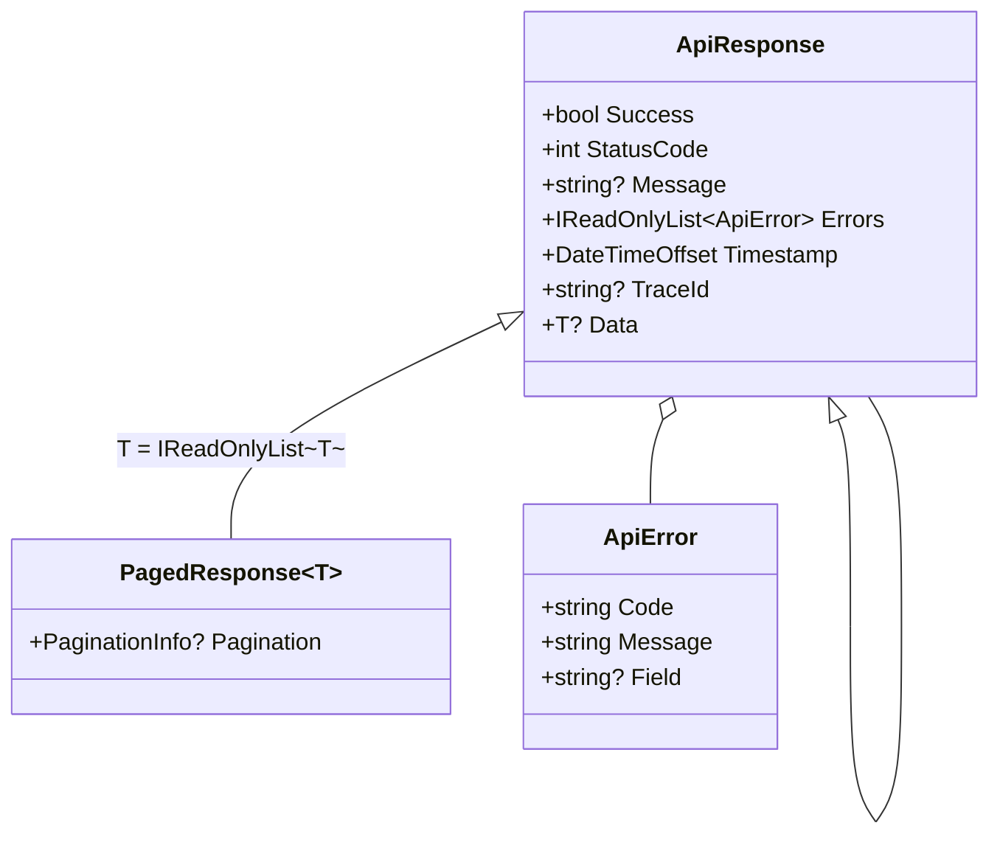

# 🌐 Respostas de API

[⬅ Índice](README.md) · [README](../README.md)

Envelope padrão para todas as respostas REST, com conversão automática de `Result` e de exceções para o status HTTP correto, além de paginação.

- [Estrutura do envelope](#estrutura-do-envelope)
- [ApiResponse](#apiresponse)
- [ApiResponse&lt;T&gt;](#apiresponset)
- [PagedResponse&lt;T&gt;](#pagedresponset)
- [ApiError](#apierror)
- [Paginação: PagedResult, PaginationInfo e PaginationExtensions](#paginação)
- [Integração com ASP.NET Core](#integração-com-aspnet-core)

---

## Estrutura do envelope



| Campo JSON | Tipo | Descrição |
|---|---|---|
| `success` | `bool` | `true` para status 2xx. |
| `statusCode` | `int` | Status HTTP (100 a 599). |
| `message` | `string?` | Mensagem para o consumidor. **Omitida se nula.** |
| `data` | `T?` | Dados (somente em `ApiResponse<T>`). **Omitido se nulo.** |
| `pagination` | `object?` | Metadados de paginação (somente em `PagedResponse<T>`). |
| `errors` | `ApiError[]` | Lista de erros (vazia em caso de sucesso). |
| `timestamp` | `string` | Data e hora UTC de geração (ISO 8601). |
| `traceId` | `string?` | Identificador de rastreamento, para correlacionar com os logs. **Omitido se nulo.** |

---

## ApiResponse

`TEC.Core.Responses` · `record ApiResponse`

Envelope **sem dados**.

| Fábrica | Status | Mensagem padrão |
|---|:---:|---|
| `Ok(string? message = null)` | 200 | — |
| `Fail(int statusCode, string message, params IEnumerable<ApiError> errors)` | 400 a 599 | obrigatória |
| `BadRequest(string message, params IEnumerable<ApiError> errors)` | 400 | obrigatória |
| `ValidationError(params IEnumerable<ApiError> errors)` | 400 | *Um ou mais erros de validação ocorreram.* |
| `Unauthorized(string message = ...)` | 401 | *Não autenticado.* |
| `Forbidden(string message = ...)` | 403 | *Acesso negado.* |
| `NotFound(string message = ...)` | 404 | *Recurso não encontrado.* |
| `Conflict(string message, params IEnumerable<ApiError> errors)` | 409 | obrigatória |
| `InternalError(string message = ...)` | 500 | *Ocorreu um erro interno. Tente novamente mais tarde.* |
| `FromResult(Result result, string? successMessage = null)` | pelo `ErrorType` | veja abaixo |
| `FromException(Exception exception, string? traceId = null)` | pelo tipo da exceção | veja abaixo |

Validações: `Fail` com status fora de 400 a 599, mensagem vazia ou erro nulo na lista gera exceção. A lista de erros é copiada (imutável).

### `FromResult` e `FromException`


🔒 Erros internos (500) e de integração (502) **nunca** expõem mensagem ou detalhes ao cliente. Registre-os em log e deixe a resposta genérica. Basta **um** erro interno na lista, mesmo que não seja o primeiro, para a resposta inteira ser tratada como interna, sem expor nenhum erro.

### JSON gerado

<details open>
<summary><b>Erro de validação (400)</b></summary>

```csharp
ApiResponse.ValidationError(
    new ApiError("CPF_INVALIDO", "CPF inválido.", "cpf"),
    new ApiError("EMAIL_OBRIGATORIO", "E-mail é obrigatório.", "email"));
```

```json
{
  "success": false,
  "statusCode": 400,
  "message": "Um ou mais erros de validação ocorreram.",
  "errors": [
    { "code": "CPF_INVALIDO", "message": "CPF inválido.", "field": "cpf" },
    { "code": "EMAIL_OBRIGATORIO", "message": "E-mail é obrigatório.", "field": "email" }
  ],
  "timestamp": "2026-09-30T14:00:00+00:00"
}
```

</details>

<details>
<summary><b>Regra de negócio via exceção (422)</b></summary>

```csharp
ApiResponse.FromException(new BusinessException("SALDO_INSUFICIENTE", "Saldo insuficiente."), "00-abc-01");
```

```json
{
  "success": false,
  "statusCode": 422,
  "message": "Saldo insuficiente.",
  "errors": [
    { "code": "SALDO_INSUFICIENTE", "message": "Saldo insuficiente." }
  ],
  "timestamp": "2026-09-30T14:00:00+00:00",
  "traceId": "00-abc-01"
}
```

</details>

<details>
<summary><b>Exceção inesperada (500)</b></summary>

```csharp
ApiResponse.FromException(new InvalidOperationException("detalhe interno"), "00-abc-02");
```

```json
{
  "success": false,
  "statusCode": 500,
  "message": "Ocorreu um erro interno. Tente novamente mais tarde.",
  "errors": [],
  "timestamp": "2026-09-30T14:00:00+00:00",
  "traceId": "00-abc-02"
}
```

</details>

<details>
<summary><b>Falha de integração (502)</b></summary>

```csharp
ApiResponse.FromException(new IntegrationException("ReceitaFederal", "timeout"));
```

```json
{
  "success": false,
  "statusCode": 502,
  "message": "Serviço externo indisponível. Tente novamente mais tarde.",
  "errors": [],
  "timestamp": "2026-09-30T14:00:00+00:00"
}
```

</details>

---

## ApiResponse&lt;T&gt;

`TEC.Core.Responses` · `record ApiResponse<T> : ApiResponse`

Envelope **com dados** (`Data`). Tem as mesmas fábricas de `ApiResponse`, tipadas, e mais:

| Fábrica | Status |
|---|:---:|
| `Ok(T data, string? message = null)` | 200 |
| `Created(T data, string? message = null)` | 201 |
| `FromResult(Result<T> result, string? successMessage = null)` | 200 ou o status do `ErrorType` |
| `FromException(Exception exception, string? traceId = null)` | pelo tipo da exceção |

```csharp
ApiResponse<ClienteDto>.Ok(dto);
ApiResponse<ClienteDto>.Created(dto, "Cliente criado.");
ApiResponse<ClienteDto>.NotFound();
ApiResponse<ClienteDto>.FromResult(await service.ObterAsync(id));
```

```json
{
  "success": true,
  "statusCode": 201,
  "message": "Cliente criado.",
  "data": { "id": 7 },
  "errors": [],
  "timestamp": "2026-09-30T14:00:00+00:00"
}
```

> ⚠️ Quando `T` é um tipo de valor (ex.: `int`), `data` aparece com o valor padrão nas falhas (`"data": 0`), porque só valores **nulos** são omitidos. Para dados opcionais, prefira tipos por referência ou anuláveis (`ApiResponse<int?>`).

> 💡 Para acrescentar o identificador de rastreamento, use `with`: `response with { TraceId = HttpContext.TraceIdentifier }`.

---

## PagedResponse&lt;T&gt;

`TEC.Core.Responses` · `sealed record PagedResponse<T> : ApiResponse<IReadOnlyList<T>>`

| Fábrica | Descrição |
|---|---|
| `Create(IReadOnlyList<T> items, int page, int pageSize, long totalItems, string? message = null)` | Cria a resposta de sucesso (200) validando a consistência. |
| `Create(PagedResult<T> result, string? message = null)` | Cria a partir de um `PagedResult<T>`. |

Validações: página ≥ 1, tamanho ≥ 1, total ≥ 0, itens ≤ tamanho da página e itens ≤ total.

```json
{
  "success": true,
  "statusCode": 200,
  "data": [ { "id": 11 }, { "id": 12 } ],
  "pagination": {
    "page": 2,
    "pageSize": 10,
    "totalItems": 42,
    "totalPages": 5,
    "hasPreviousPage": true,
    "hasNextPage": true
  },
  "errors": [],
  "timestamp": "2026-09-30T14:00:00+00:00"
}
```

---

## ApiError

`TEC.Core.Responses` · `sealed record ApiError(string Code, string Message, string? Field = null)`

| Membro | Descrição |
|---|---|
| `Code` | Código do erro (obrigatório). |
| `Message` | Mensagem (obrigatória). |
| `Field` | Campo relacionado (omitido no JSON quando nulo). |
| `static ApiError FromError(Error error)` | Converte um `Error` de domínio. |

`Code` e `Message` são validados no construtor **e** nas cópias com `with` (`erro with { Code = "" }` lança `ArgumentException`).

---

## Paginação

`TEC.Core.Responses.Pagination`

### PagedResult&lt;T&gt;

`sealed record PagedResult<T>(IReadOnlyList<T> Items, int Page, int PageSize, long TotalItems)`: resultado paginado para repositórios e serviços.

| Membro | Descrição |
|---|---|
| `Items`, `Page`, `PageSize`, `TotalItems` | Validados na criação **e** em cópias com `with` (página ≥ 1, tamanho ≥ 1, total ≥ 0, itens não nulos). |
| `PaginationInfo Pagination` | Metadados calculados. |
| `static PagedResult<T> Empty(int page = 1, int pageSize = 10)` | Resultado vazio. |
| `PagedResult<TOut> Map<TOut>(Func<T, TOut> mapper)` | Transforma os itens (ex.: entidade → DTO) mantendo a paginação. |

### PaginationInfo

| Membro | Descrição |
|---|---|
| `int Page` / `int PageSize` / `long TotalItems` | Dados informados. |
| `int TotalPages` | `ceil(TotalItems / PageSize)`, limitado a `int.MaxValue` (sem estouro mesmo com `TotalItems` próximo de `long.MaxValue`). |
| `bool HasPreviousPage` | `Page > 1`. |
| `bool HasNextPage` | `Page < TotalPages`. |
| `static PaginationInfo Create(int page, int pageSize, long totalItems)` | Cria calculando o total de páginas. |

### PaginationExtensions

| Método | Descrição |
|---|---|
| `IQueryable<T> Paginate<T>(this IQueryable<T> query, int page, int pageSize, int maxPageSize = 1000)` | Aplica `Skip`/`Take` (EF Core, LINQ). |
| `PagedResult<T> ToPagedResult<T>(this IQueryable<T> query, int page, int pageSize, int maxPageSize = 1000)` | Pagina uma **consulta** executando só `COUNT` + `Skip`/`Take` no banco (não materializa a tabela). Síncrono; ordene a consulta antes. Página além do total → itens vazios sem buscar a página. |
| `PagedResult<T> ToPagedResult<T>(this IEnumerable<T> source, int page, int pageSize, int maxPageSize = 1000)` | Pagina uma coleção em memória. |
| `int CalculateSkip(int page, int pageSize, int maxPageSize = 1000)` | Valida e calcula quantos itens pular, sem estouro aritmético. |
| `const int DefaultMaxPageSize = 1000` | Tamanho máximo padrão. |

| Chamada | Resultado |
|---|---|
| `CalculateSkip(3, 20)` | `40` |
| `CalculateSkip(1, 5000)` | `ArgumentOutOfRangeException` (acima de 1000) |
| `Enumerable.Range(1, 100).AsQueryable().Paginate(3, 5)` | `11, 12, 13, 14, 15` |
| `Enumerable.Range(1, 42).ToPagedResult(2, 10).Pagination` | `page 2, totalPages 5, hasPrevious true, hasNext true` |

🔒 A página e o tamanho normalmente vêm da query string, que é entrada não confiável. Por isso são validados, e o tamanho é limitado para impedir consultas que retornem a tabela inteira.

### Exemplo com EF Core

```csharp
public async Task<PagedResult<ClienteDto>> ListarAsync(int page, int pageSize, CancellationToken ct)
{
    var query = _db.Clientes.AsNoTracking().OrderBy(c => c.Nome);

    var total = await query.LongCountAsync(ct);
    var itens = await query
        .Paginate(page, pageSize, maxPageSize: 100)
        .Select(c => new ClienteDto(c.Id, c.Nome))
        .ToListAsync(ct);

    return new PagedResult<ClienteDto>(itens, page, pageSize, total);
}

// Endpoint
app.MapGet("/clientes", async (int page, int pageSize, IClienteService s, CancellationToken ct) =>
    PagedResponse<ClienteDto>.Create(await s.ListarAsync(page, pageSize, ct)));
```

> ⚠️ Sempre ordene (`OrderBy`) antes de paginar: sem ordenação, o banco pode devolver itens repetidos ou omitidos entre páginas.

---

## Integração com ASP.NET Core

### Helper para Minimal APIs

```csharp
public static class ApiResults
{
    // 'object' faz o System.Text.Json serializar o tipo real (inclui Data e Pagination)
    public static IResult ToHttp(this ApiResponse response) =>
        Results.Json((object)response, JsonDefaults.Options, statusCode: response.StatusCode);
}

app.MapGet("/clientes/{id:int}", async (int id, IClienteService s) =>
    ApiResponse<ClienteDto>.FromResult(await s.ObterAsync(id)).ToHttp());
```

### Controllers

```csharp
[ApiController, Route("clientes")]
public class ClientesController(IClienteService service) : ControllerBase
{
    [HttpGet("{id:int}")]
    public async Task<ActionResult<ApiResponse<ClienteDto>>> Obter(int id)
    {
        var response = ApiResponse<ClienteDto>.FromResult(await service.ObterAsync(id))
            with { TraceId = HttpContext.TraceIdentifier };
        return StatusCode(response.StatusCode, response);
    }
}
```

### Tratamento global de exceções (`IExceptionHandler`)

```csharp
public sealed class ApiExceptionHandler(ILogger<ApiExceptionHandler> logger) : IExceptionHandler
{
    public async ValueTask<bool> TryHandleAsync(HttpContext ctx, Exception ex, CancellationToken ct)
    {
        var response = ApiResponse.FromException(ex, ctx.TraceIdentifier);

        if (response.StatusCode >= 500)
            logger.LogError(ex, "Erro não tratado. TraceId={TraceId}", ctx.TraceIdentifier);

        if (ex is RateLimitExceededException { RetryAfter: { } retry })
            ctx.Response.Headers.RetryAfter = ((int)retry.TotalSeconds).ToString();

        ctx.Response.StatusCode = response.StatusCode;
        await ctx.Response.WriteAsJsonAsync(response, JsonDefaults.Options, ct);
        return true;
    }
}

// Program.cs
builder.Services.AddExceptionHandler<ApiExceptionHandler>();
builder.Services.AddProblemDetails();
app.UseExceptionHandler();
```
