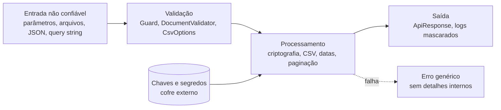

[🏠 TEC.Core](../README.md) › [📚 Documentação](README.md) › Segurança

# 🛡️ Segurança

> O que o TEC.Core garante por conta própria, como isso é provado e o que continua sendo responsabilidade de quem usa.

## 📑 Sumário

- [🎯 Visão geral](#-visão-geral)
- [🚀 Uso](#-uso)
  - [Garantias do componente](#garantias-do-componente)
  - [Verificação contínua](#verificação-contínua)
  - [Responsabilidades de quem usa](#responsabilidades-de-quem-usa)
  - [ICurrentUser](#icurrentuser)
  - [PrincipalKind](#principalkind)
  - [Checklist rápido](#checklist-rápido)
- [⚙️ Opções](#️-opções)
- [❌ Erros](#-erros)
- [🛡️ Segurança](#️-segurança-1)
- [❓ Perguntas frequentes](#-perguntas-frequentes)

---

## 🎯 Visão geral

O componente segue o princípio **Zero Trust**: toda entrada (parâmetros, arquivos, hashes armazenados, JSON, query string, respostas de fontes externas) é tratada como não confiável.



| Ameaça | Mitigação no TEC.Core |
|---|---|
| Adulteração de dados cifrados | Cifra autenticada (AES-GCM); na híbrida, cabeçalho vinculado como dado associado |
| Oráculo de padding / de erro | Mesma exceção genérica para qualquer falha de decifragem (RSA e híbrida) |
| Enumeração de usuários pelo tempo | Verificação fictícia de mesmo custo para hash `null` ou malformado (`Pbkdf2PasswordHasher.Verify`) |
| Negação de serviço (DoS) | Limites de chave RSA e PEM, de iterações PBKDF2, de campos/registros/colunas CSV, do JSON de feriados, de paginação e dos laços de dias úteis; `Regex` com `NonBacktracking` |
| Injeção de fórmulas em planilhas | `CsvOptions.SanitizeFormulas` ligado por padrão |
| Vazamento de detalhes internos ou dados pessoais | Erros 500/502 sem mensagem; `CsvException` sem o conteúdo do arquivo; `Guard.InRange` sem o valor recebido; `RsaKeyPair` sem chave privada em `ToString()`/JSON; nome de fonte HTTP sem credenciais |
| Cadeia de suprimentos | NuGet Audit como erro, lock file, *package source mapping*, actions fixadas por SHA, CodeQL |

---

## 🚀 Uso

### Garantias do componente

| Área | Proteção |
|---|---|
| **AES-GCM** | Cifra autenticada; byte de versão de formato (autenticado); subchave por stream (HKDF-SHA256 + salt de 32 bytes); detecção de adulteração, reordenação, truncamento e dados extras; mensagens de erro genéricas |
| **RSA** | OAEP-SHA256; assinatura PSS por padrão; chaves < 2048 bits recusadas (inclusive na importação); geração limitada a 8192 bits e importação a 16384 bits (PEM acima de 32 KB recusado antes da interpretação); verificação pelo rótulo PEM antes de operações com a chave privada |
| **Híbrida** | Byte de versão de formato; cabeçalho (versão + chave cifrada) vinculado ao conteúdo (AAD); qualquer falha de decifragem gera uma única exceção genérica |
| **Senhas** | PBKDF2-SHA256 com 600 mil iterações por padrão; salt aleatório de 16 bytes; comparação em tempo constante; verificação fictícia de mesmo custo para usuário inexistente; normalização determinística (independente de ICU); hash armazenado validado (tamanho, iterações de 100 mil a 10 milhões, salt e hash de 16 a 64 bytes) contra registro adulterado |
| **Material sensível** | Chaves e textos claros intermediários criados pela biblioteca são zerados (`CryptographicOperations.ZeroMemory`); a `string` recebida do chamador é imutável e fica com ele; a chave privada fica fora de `ToString()` e do JSON |
| **Aleatoriedade** | Tudo usa `RandomNumberGenerator` (CSPRNG), inclusive `DocumentGenerator`; tokens em Base64Url ([`Base64UrlEncoder`](texto.md#base64urlencoder), decodificação estrita) |
| **CSV** | Anti-injeção de fórmulas ligado por padrão (em qualquer valor de texto livre); `NaN`/infinito recusados na leitura; limites de campo, registro e colunas; modo estrito opcional; separador de milhar só em grupos válidos; erros sem o conteúdo do arquivo (salvo `IncludeRawValueInErrors`) |
| **JSON** | Escape de `< > & ' +`; opções globais somente leitura; enums só por nome de membro definido; profundidade máxima 64 |
| **API** | Erros 500/502 nunca expõem mensagem ou detalhes; `NotFoundException.For` sem o identificador; mensagens genéricas de autenticação e autorização; paginação com tamanho máximo |
| **Validação** | Conjuntos de caracteres de máscara únicos para validar e formatar; regex de e-mail ancorada em `\z`, entrada limitada; regex de texto com `NonBacktracking`; `Guard.InRange` não inclui o valor recebido na mensagem |
| **Feriados** | Nome das fontes HTTP sem credenciais da URL, query string nem fragmento; códigos IBGE fracionários recusados; JSON de feriados limitado a 64 MB e profundidade 16 |
| **Identidade** | `ICurrentUser.IsAuthenticated` derivado de `Kind` e não sobrescrevível |
| **Disponibilidade** | Funciona sem ICU e sem `tzdata`; laços de dias úteis limitados (soma de até 26.000 dias úteis, intervalos de até 36.600 dias, busca de até 3.660 dias); texto UTF-16 inválido não derruba as funções de texto |
| **Build** | Analisadores de segurança com regras críticas como **erro**; NuGet Audit (inclusive transitivas) com `NU1901`–`NU1904` como erro; lock file; *package source mapping*; SDK fixado; actions fixadas por SHA; CodeQL `security-extended`; build determinístico |

### Verificação contínua

As garantias são verificadas por testes automatizados, não só por revisão (detalhes em [testes.md](testes.md#testes-de-segurança)):

| Técnica | O que prova | Quando roda |
|---|---|---|
| **Fuzzing** (FsCheck, `FuzzingTests`) | CSV com ida e volta exata e só `CsvException` em entrada inválida; adulteração sempre detectada no AES-GCM e na híbrida; PEM, hash de senha, JSON, documentos, extenso e fontes de feriados arbitrários só falham com a exceção documentada | Todo PR (`ci.yml`) |
| **Negação de serviço** (`DosResistanceTests`) | Streams sem fim param nos limites sem ler tudo; aninhamento profundo, bloco AES forjado, regex no pior caso, textos enormes e calendário impossível falham rápido | Todo PR |
| **Vazamento de dados** (`LeakageTests`) | Marcador secreto injetado nas entradas nunca aparece em mensagens, `ToString()`, `InnerException`, `Data`, nomes de fonte, JSON ou respostas | Todo PR |
| **Canais laterais de tempo** (`ConstantTimeTests`) | PBKDF2 com usuário inexistente custa o mesmo; `FixedTimeEquals`/`FixedTimeEqualsHex` não variam com a posição da diferença (teste t de Welch, com controle positivo) | Medianas do PBKDF2 em todo PR; estatísticos (`Seguranca-Pesada`; as duas classes passam pelo mesmo delegate, com as entradas em 64 cópias de posição sorteada, para diferenças de JIT e de alinhamento não parecerem vazamento) no `performance.yml` (manual) |
| **Concorrência e carga** (`TEC.Core.LoadTests`) | Singletons corretos sob 64 threads; memória e handles estáveis em soak; streaming com memória constante | `Carga-CI` e `Carga-Pesada` no `performance.yml` (manual): tempo em runner compartilhado é ruidoso e não bloqueia PR nem versão |

### Responsabilidades de quem usa

#### 🔑 Chaves

- **Nunca** coloque chaves no código, no `appsettings` versionado ou em logs. Use um cofre (ex.: **[TEC.Vault](https://github.com/tudoemcodigo/lib-tec-vault)**) e faça rotação periódica.
- No AES com nonce aleatório, não ultrapasse **2³² mensagens por chave**.

```csharp
// ✅ Chave vinda do cofre / variável de ambiente
var key = builder.Configuration["Crypto:Key"]
    ?? throw new InvalidConfigurationException("Crypto:Key");

// ❌ Nunca
const string Key = "<chave-em-base64>";
```

#### 📂 Caminhos de arquivo

`CsvReader.ReadFileAsync`, `CsvWriter.WriteFileAsync`, `HashHelper.ComputeFileHashAsync` e as fontes de feriados em arquivo (`CsvHolidaySource`, `JsonHolidaySource`, `AddCsvFile`/`AddJsonFile`) usam o caminho recebido. **Nunca** repasse nomes de arquivo vindos do usuário sem validar (*path traversal*):

```csharp
var baseDirectory = Path.GetFullPath("/dados/importacao");
var path = Path.GetFullPath(Path.Combine(baseDirectory, receivedName));

if (!path.StartsWith(baseDirectory + Path.DirectorySeparatorChar, StringComparison.Ordinal))
    throw new ForbiddenException();
```

#### 🌊 Stream decifrado

Se `AesGcmCryptography.DecryptAsync` lançar exceção, **descarte tudo o que já foi gravado** na saída:

```csharp
var tempFile = Path.GetTempFileName();
try
{
    await using (var output = File.Create(tempFile))
        await aes.DecryptAsync(input, output, key, cancellationToken);
    File.Move(tempFile, destination, overwrite: true);   // só publica depois de verificar tudo
}
catch
{
    File.Delete(tempFile);
    throw;
}
```

#### ✍️ Criptografia híbrida

Garante **sigilo, não autoria**. Para garantir a origem, **assine** também (`RsaCryptography.SignData`) com a chave privada do remetente e verifique com a pública dele (veja [criptografia.md](criptografia.md#hybridcryptography)).

#### 🚨 Erros 500

Registre os detalhes em log **sem dados pessoais** (`SensitiveDataMasker`) e use `ApiResponse.FromException`, que nunca expõe detalhes internos (veja [excecoes.md](excecoes.md#tratamento-global)).

#### 📄 CSV

`CsvOptions.IncludeRawValueInErrors = true` expõe o conteúdo do arquivo nas exceções (`CsvException.RawValue`). Use só em ambiente controlado.

### ICurrentUser

> `TEC.Core.Security` · `interface`

Contrato mínimo de **quem executa a operação**, sem dependência de ASP.NET Core nem de provedor de identidade. Implementado pelo `TEC.Security` (token validado, API key ou identidade de sistema de um worker) e consumido por componentes como o `TEC.ORM` (auditoria e filtro por tenant), que assim não dependem do componente de segurança. O TEC.Core não registra nenhuma implementação.

| Membro | Tipo | Descrição |
|---|---|---|
| `Kind` | `PrincipalKind` | `Anonymous`, `User`, `Application` ou `System`. **Fonte única** do estado de autenticação |
| `IsAuthenticated` | `bool` | `Kind != PrincipalKind.Anonymous`. Membro padrão **selado** da interface: não pode ser implementado de outra forma |
| `Id` | `string?` | Identificador **estável e não reutilizável** (ex.: object id do Entra ID), nunca e-mail ou login. `null` se e somente se `Kind` for `Anonymous` |
| `TenantId` | `string?` | Tenant da identidade, ou `null` quando a aplicação não usa tenants. Sempre `null` para `Anonymous` |

```csharp
using TEC.Core.Security;

internal sealed class AuditInterceptor(ICurrentUser currentUser)
{
    public void StampCreation(IAuditable entity, DateTimeOffset now)
    {
        entity.CreatedBy = currentUser.Id ?? "anonimo";   // Id estável, não é dado pessoal legível
        entity.CreatedAt = now;
    }
}

// Implementação para um worker (identidade de sistema)
public sealed class SystemUser(string id, string? tenantId) : ICurrentUser
{
    public PrincipalKind Kind => PrincipalKind.System;
    public string? Id { get; } = id;
    public string? TenantId { get; } = tenantId;
}
```

> [!IMPORTANT]
> Quem implementa deve manter o estado coerente: `Anonymous` ⇔ `Id` nulo, e anônimo sem `TenantId`. Uma propriedade
> `IsAuthenticated` declarada na classe **não** substitui a da interface: leia a identidade por uma referência
> `ICurrentUser`.

### PrincipalKind

> `TEC.Core.Security` · `enum`

| Membro | Valor | Descrição |
|---|:---:|---|
| `Anonymous` | 0 | Sem identidade autenticada |
| `User` | 1 | Pessoa autenticada (login interativo ou token delegado de usuário) |
| `Application` | 2 | Aplicação autenticada em nome próprio (client credentials, API key), sem usuário |
| `System` | 3 | Processo interno da própria aplicação (job, worker, mensageria), sem token externo |

```csharp
if (currentUser.Kind is PrincipalKind.Application or PrincipalKind.System)
    logger.LogInformation("Operação automática");
```

### Checklist rápido

- [ ] Chaves e segredos vêm de um cofre, nunca do código.
- [ ] Senhas usam `IPasswordHasher` e o login chama `NeedsRehash`.
- [ ] O login chama `IPasswordHasher.Verify` **também** quando o usuário não existe (`Verify(password, user?.PasswordHash)`).
- [ ] Comparações de hash e token usam `HashHelper.FixedTimeEquals` (ordinal) ou `FixedTimeEqualsHex` (hexadecimal em qualquer caixa).
- [ ] CSV de origem externa usa `StrictColumnCount`/`RequireAllColumns` quando colunas ausentes indicariam arquivo errado.
- [ ] CSV exportado para usuários mantém `SanitizeFormulas = true`.
- [ ] Logs usam `SensitiveDataMasker` para CPF, CNPJ, e-mail, telefone e cartão.
- [ ] O tratamento global de exceções usa `ApiResponse.FromException` e registra os erros 5xx.
- [ ] Caminhos de arquivo vindos do usuário são validados.
- [ ] Paginação usa `Paginate`/`ToPagedResult` com `maxPageSize` adequado.
- [ ] Os testes também rodam com `DOTNET_SYSTEM_GLOBALIZATION_INVARIANT=1`.

---

## ⚙️ Opções

Padrões de segurança e onde ajustá-los (detalhes em cada tema):

| Opção | Padrão | Onde |
|---|---|---|
| Iterações do PBKDF2 | 600.000 (100.000 a 10.000.000) | `TecCoreOptions.PasswordHashIterations` / `new Pbkdf2PasswordHasher(iterations)` |
| Assinatura RSA | PSS | `TecCoreOptions.RsaSignatureMode` |
| Tamanho da chave RSA | 2048 bits (2048 a 8192 na geração; até 16384 na importação) | `GenerateKeyPair(keySizeInBits)` |
| Anti-injeção de fórmulas | ligado | `CsvOptions.SanitizeFormulas` |
| Conteúdo do CSV nas exceções | desligado | `CsvOptions.IncludeRawValueInErrors` |
| Tamanho máximo de página | 1000 | `maxPageSize` de `PaginationExtensions` |

---

## ❌ Erros

| Exceção | Quando ocorre | O que fazer |
|---|---|---|
| `CryptographicException` | Chave errada, dado adulterado, truncado ou formato de versão desconhecido (mensagem sempre genérica) | Confira a chave e a origem dos dados; trate como dado inválido, sem detalhar ao cliente |
| `ArgumentOutOfRangeException` | Parâmetro de segurança fora do limite (iterações, tamanho de chave, `pageSize`) | Use valores dentro dos limites documentados |
| `CsvException` | Limite de campo/registro/colunas excedido ou valor inválido | Use `LineNumber`/`ColumnName` para localizar; considere `SkipInvalidRows` |

---

## 🛡️ Segurança

> [!CAUTION]
> **Relatando vulnerabilidades:** não abra *issue* pública. Envie os detalhes diretamente ao mantenedor, **Roberto
> Oliveira** (equipe **Tudo em Código**), pelo e-mail [roberto@roberto.inf.br](mailto:roberto@roberto.inf.br).

> [!WARNING]
> Nunca use criptografia reversível (AES/RSA) para senhas: use `IPasswordHasher`.

---

## ❓ Perguntas frequentes

<details>
<summary>Por que o login verifica a senha mesmo quando o usuário não existe?</summary>

Para que o tempo de resposta seja o mesmo nos dois casos: sem isso, um atacante descobre quais e-mails têm conta medindo o tempo. `Verify(password, null)` faz uma derivação fictícia de mesmo custo e retorna `false`.

</details>

<details>
<summary>Por que <code>FromException</code> devolve 500 com mensagem genérica?</summary>

A exceção não é uma `AppException` (ou é de tipo interno, 500/502). Mensagens internas podem conter servidor, connection string ou URL. Registre a exceção em log com o `TraceId` e lance uma `AppException` adequada quando a mensagem puder ir ao cliente.

</details>

---

⬅️ [Anterior: Concorrência](concorrencia.md) · [📚 Índice](README.md) · [Próximo: Testes](testes.md) ➡️
