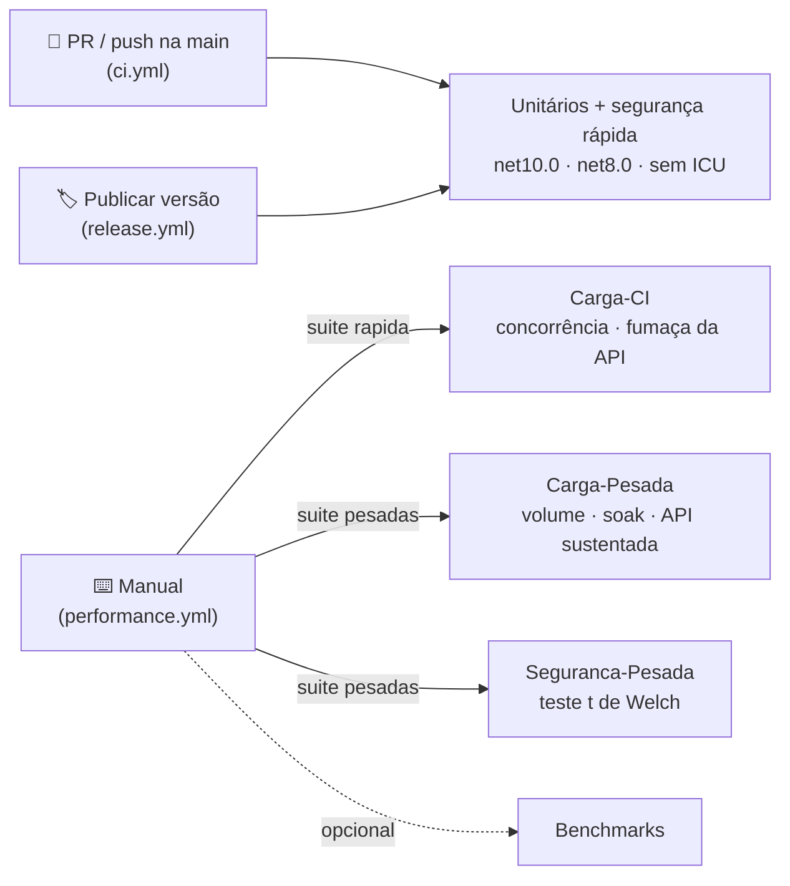

[🏠 TEC.Core](../README.md) › [📚 Documentação](README.md) › Testes

# 🧪 Testes

> Como a qualidade do TEC.Core é verificada (unidade, segurança, carga e benchmarks) e como rodar cada suíte na sua máquina e no CI.

## 📑 Sumário

- [🎯 Visão geral](#-visão-geral)
- [🚀 Uso](#-uso)
  - [Como rodar localmente](#como-rodar-localmente)
  - [Suítes de unidade](#suítes-de-unidade)
  - [Testes de segurança](#testes-de-segurança)
  - [Testes de carga](#testes-de-carga)
  - [Benchmarks](#benchmarks)
  - [Resultados de referência](#resultados-de-referência)
  - [Cobertura](#cobertura)
  - [No CI](#no-ci)
  - [Escrevendo novos testes](#escrevendo-novos-testes)
- [⚙️ Opções](#️-opções)
- [❌ Erros](#-erros)
- [🛡️ Segurança](#️-segurança)
- [❓ Perguntas frequentes](#-perguntas-frequentes)

---

## 🎯 Visão geral

| Projeto | Ferramenta | O que faz |
|---|---|---|
| `TEC.Core.Tests` | [TUnit](https://tunit.dev) + [FsCheck](https://fscheck.github.io/FsCheck/) | **549 testes por TFM**: unidade, regressões de segurança, fuzzing, DoS, vazamento de dados e tempo constante (rápido) |
| `TEC.Core.LoadTests` | TUnit | Concorrência nos singletons e fumaça da API de exemplo (`Carga-CI`); volume, soak e carga sustentada (`Carga-Pesada`) |
| `TEC.Core.Benchmarks` | [BenchmarkDotNet](https://benchmarkdotnet.org) | Tempo e alocação, `net8.0` × `net10.0` |
| `samples/TEC.Core.SampleApi` · `samples/TEC.Core.LoadGenerator` | ASP.NET Core · console | Alvo e gerador da carga HTTP (veja [samples](../samples/README.md)) |

| Categoria (`[Category]`) | Projeto | Onde roda | Conteúdo |
|---|---|---|---|
| *(sem categoria)* | `TEC.Core.Tests` | Todo PR, push na `main` e publicação, matriz `net10.0` (cobertura) · `net8.0` · `net10.0` sem ICU | Unitários, regressão, segurança rápida |
| `Carga-CI` | `TEC.Core.LoadTests` | `performance.yml` (manual, `suite` = `rapida` ou `todas`) | Concorrência e fumaça de carga (segundos) |
| `Carga-Pesada` | `TEC.Core.LoadTests` | `performance.yml` (manual, `suite` = `pesadas` ou `todas`) | Volume, soak e carga HTTP sustentada |
| `Seguranca-Pesada` | `TEC.Core.Tests` | `performance.yml` (manual, `suite` = `pesadas` ou `todas`) | Canais laterais de tempo (teste t de Welch) |
| `Integracao` | — | Não se aplica | O TEC.Core não acessa banco, cofre, rede ou telemetria |

Os testes de carga não rodam no PR nem na publicação: tempo de parede em runner compartilhado é ruidoso e não pode
bloquear PR nem versão. Rodam só sob demanda.



| Item | Valor |
|---|---|
| Framework | TUnit sobre o Microsoft.Testing.Platform (ativado no `dotnet test` pelo `global.json`) |
| Alvos | `net8.0` e `net10.0`: cada teste roda nos dois runtimes |
| Testes pesados | `[Explicit]` + `[NotInParallel]`: o `dotnet test` comum os ignora; rodam só quando selecionados por categoria |
| Recursos externos | Nenhum (a API de exemplo sobe em `127.0.0.1` numa porta livre) |

---

## 🚀 Uso

### Como rodar localmente

Pré-requisitos: SDK do `global.json` (`10.0.100` ou superior, `rollForward: latestFeature`) e os runtimes **.NET 8** e **ASP.NET Core 8** (alvo `net8.0`; a API de exemplo usa ASP.NET Core).

```bash
# Unitários, segurança rápida e Carga-CI (net8.0 e net10.0); o CI roda só o TEC.Core.Tests
dotnet restore TEC.Core.slnx
dotnet build TEC.Core.slnx -c Release
dotnet test --solution TEC.Core.slnx -c Release --no-build

# Sem ICU (simula containers enxutos)
DOTNET_SYSTEM_GLOBALIZATION_INVARIANT=1 dotnet test --solution TEC.Core.slnx -c Release --no-build
```

```powershell
# Windows (PowerShell)
$env:DOTNET_SYSTEM_GLOBALIZATION_INVARIANT = "1"; dotnet test --solution TEC.Core.slnx -c Release --no-build; Remove-Item Env:DOTNET_SYSTEM_GLOBALIZATION_INVARIANT
```

Selecionando alvo, classe ou categoria (filtro de árvore: `/assembly/namespace/classe/teste`):

```bash
# Só net10.0 de um projeto
dotnet test --project TEC.Core.Tests -f net10.0

# Uma classe
dotnet test --project TEC.Core.Tests -f net10.0 --treenode-filter "/*/*/FuzzingTests/*"

# Uma categoria (inclusive as [Explicit])
dotnet test --project TEC.Core.LoadTests -c Release -f net10.0 --treenode-filter "/*/*/*/*[Category=Carga-CI]"
dotnet test --project TEC.Core.LoadTests -c Release -f net10.0 --treenode-filter "/*/*/*/*[Category=Carga-Pesada]"
dotnet test --project TEC.Core.Tests     -c Release -f net10.0 --treenode-filter "/*/*/*/*[Category=Seguranca-Pesada]"
```

> [!WARNING]
> Não passe `-nologo` ao `dotnet test` com o Microsoft.Testing.Platform: a opção é repassada ao executável de testes,
> que não a reconhece, e a execução termina com **0 testes** (código de saída 5).

### Suítes de unidade

| Pasta | Classe | O que cobre |
|---|---|---|
| `Common/` | `CommonTests` | `Guard`, `Result`/`Result<T>`, `Error`, `ErrorType`, JSON padrão e `BrazilianCulture` |
| `Compatibility/` | `CompatibilityTests` | Comportamento idêntico em `net8.0` e `net10.0` (equivalentes internos de APIs do .NET 9+) e caminhos compatíveis com AOT |
| `Cryptography/` | `AesGcmCryptographyTests`, `AsymmetricCryptographyTests`, `HashingTests` | AES-GCM em memória e stream, RSA e híbrida, SHA/HMAC (vetores RFC 4231), PBKDF2 e geradores |
| `Csv/` | `CsvTests` | Leitura e escrita, atributos, tipos, modo estrito, linhas inválidas e anti-injeção de fórmulas |
| `Dates/` | `BusinessDayCalculatorTests`, `HolidayCalendarTests`, `DateFormattingTests` | Dias úteis, Páscoa e feriados nacionais, localidades (UF/IBGE), fontes CSV/JSON/banco/HTTP/função, prioridade e falhas de fonte, fuso de Brasília, relógio injetável, formatação e parse |
| `Enums/` | `EnumHelperTests` | Descrições, nomes de exibição, parse flexível e `[Flags]` |
| `Exceptions/` | `AppExceptionTests` | Hierarquia, códigos padrão, status HTTP e conversão para `Result` |
| `Numbers/` | `NumbersTests` | Moeda, percentual, arredondamentos, extenso e `TryParseBrazilianDecimal` |
| `Responses/` | `ApiResponseTests` | Envelope, `FromResult`/`FromException`, JSON gerado e paginação |
| `Security/` | `SecurityRegressionTests`, `SecurityAuditTests`, `ThirdAuditTests`, `FourthAuditTests`, `CurrentUserTests` | Regressões das auditorias: limites, enums fora do domínio, fórmulas, mascaramento, UTF-16 inválido, formatos versionados, mensagens sem dados; contrato de `ICurrentUser` |
| `Text/` | `DocumentTests`, `StringExtensionsTests`, `Base64UrlEncoderTests` | CPF, CNPJ (inclusive alfanumérico), PIS, CEP, telefone, e-mail, máscaras, extensões de texto e Base64Url estrito |
| `Validation/` | `ParameterValidationTests` | Entradas inválidas falham de forma clara, nunca com resultado errado em silêncio |

### Testes de segurança

Ficam em `TEC.Core.Tests/Security`. Os rápidos rodam em todo PR; os estatísticos de tempo (`Seguranca-Pesada`) só no `performance.yml` (manual).

| Classe | Técnica | O que garante | Todo PR? |
|---|---|---|:---:|
| `Fuzzing/FuzzingTests` | Propriedades FsCheck com centenas de entradas hostis (separadores, aspas, quebras de linha, caracteres de fórmula, espaços Unicode, BOM, NUL, emojis, surrogates isolados) | CSV: ida e volta **exata** de qualquer texto e só `CsvException` em entrada arbitrária. JSON: `TryFromJson` nunca lança. AES-GCM: **qualquer** bit invertido, truncamento ou dado associado diferente é recusado. Híbrida: toda adulteração gera a mesma mensagem. RSA: PEM arbitrário só gera `ArgumentException`/`CryptographicException`. PBKDF2: hash forjado nunca é aceito nem lança. Documentos, máscaras, texto, números, extenso, dias úteis e fontes: sem exceções inesperadas e com invariantes | ✅ |
| `Adversarial/DosResistanceTests` | Streams "infinitos" que registram quanto foi lido | CSV para em `MaxRecordLength`/`MaxFieldLength`/`MaxColumns`; JSON de feriados para em `MaxJsonBytes`; aninhamento recusado; cabeçalho AES forjado não aloca memória gigante; regex sem backtracking catastrófico; textos de 10 MB em tempo linear; calendário sem dia útil falha em vez de travar | ✅ |
| `Adversarial/LeakageTests` | Marcador secreto injetado e procurado em mensagens, `ToString()` (com `InnerException`), `Data`, nomes de fonte, JSON e respostas | Nenhum valor recebido, credencial, chave ou texto claro aparece em erros; `RsaKeyPair` nunca expõe a chave privada; `FromException` nunca expõe detalhes internos | ✅ |
| `Adversarial/ConstantTimeTests` | Rápido: razão entre tempos medidos em pares. Pesado: teste t de Welch estilo [dudect](https://github.com/oreparaz/dudect) (classes sorteadas, 40 mil amostras, corte no percentil 90) | Verificar senha de usuário inexistente ou com hash inválido custa o mesmo; `FixedTimeEquals`/`FixedTimeEqualsHex` não variam com a posição da diferença; um controle prova que o método detecta `string.Equals` | Rápido ✅ · pesados no `performance.yml` |

```bash
# Fuzzing e adversariais rápidos
dotnet test --project TEC.Core.Tests -f net10.0 --treenode-filter "/*/TEC.Core.Tests.Security.*/*/*"

# Estatísticos de tempo (≈ 3 min; feche outros programas)
dotnet test --project TEC.Core.Tests -c Release -f net10.0 --treenode-filter "/*/*/*/*[Category=Seguranca-Pesada]" --output detailed
```

> [!NOTE]
> Uma falha do FsCheck mostra o contraexemplo e a semente (`Falsifiable, after N tests ... seed of (x,y)`). Para
> reproduzir, use `Config.QuickThrowOnFailure.WithReplay(...)` com a semente informada.

> [!IMPORTANT]
> `|t|` de Welch acima de 10 indica diferença de tempo detectável. O teste rápido do PBKDF2 usa limites largos (0,25×
> a 4×) porque o CI roda vários processos em paralelo: ele pega a regressão real (sem a derivação fictícia a razão
> seria ~0,0003×); a medição fina é a do teste pesado.

> [!NOTE]
> No teste t de Welch, as duas classes passam pelo **mesmo** delegate e pelo mesmo laço; só a entrada muda. Um delegate
> por classe é compilado em separado pelo JIT (nível de compilação e alinhamento de código próprios) e dava falso
> vazamento (|t| ≈ 60 num `FixedTimeEquals` correto). Cada entrada também existe em 64 cópias, em posições de memória
> sorteadas e usadas em rodízio, para o alinhamento dos dados não depender da classe.

### Testes de carga

Ficam em `TEC.Core.LoadTests`. Os `Carga-Pesada` têm `[Explicit]` e rodam **um de cada vez** (`[NotInParallel]`), porque medem memória e vazão do processo inteiro.

| Classe | Categoria | O que faz | Critério de aprovação |
|---|---|---|---|
| `Concurrency/ConcurrencyTests` | `Carga-CI` | 64 workers usando ao mesmo tempo os Singletons: `HolidayCalendar`, `BusinessDayCalculatorFactory`, AES/RSA/híbrida/PBKDF2 resolvidos do DI, `CsvReader`/`CsvWriter`, mapa de colunas do CSV, carga de fontes em paralelo | Resultado concorrente **idêntico** ao sequencial; mesma instância; prioridade de fontes determinística |
| `Api/SampleApiLoadTests.SmokeLoad_*` | `Carga-CI` | 3 s com 16 conexões em todos os cenários da API de exemplo | Zero erros; todos os cenários exercitados |
| `Api/SampleApiLoadTests.SustainedLoad_*` | `Carga-Pesada` | Carga sustentada (padrão 60 s, 64 conexões) com a mistura completa, inclusive login | Erro ≤ 0,1%; p99 < 2 s; memória retida cresce < 128 MB |
| `Api/SampleApiLoadTests.PasswordScenario_*` | `Carga-Pesada` | Login com PBKDF2 600 mil disputando CPU com consultas | Zero erros; consultas continuam atendidas |
| `Volume/VolumeTests` | `Carga-Pesada` | CSV de milhões de linhas; AES-GCM em stream de gigabytes (pipe, sem disco); fonte com `MaxHolidaysPerSource` e um a mais; dias úteis nos limites | Memória constante (< 32 MB no CSV, heap < 256 MB no AES); SHA-256 da saída igual ao da entrada; fonte acima do limite recusada |
| `Soak/SoakTests` | `Carga-Pesada` | Carga mista contínua (dias úteis, documentos, AES, HMAC, CSV, JSON, híbrida, PBKDF2) em todos os núcleos | Memória retida, handles e vazão estáveis entre início e fim (após aquecimento) |

```bash
# Rápidos (os mesmos do CI)
dotnet test --project TEC.Core.LoadTests -c Release -f net10.0

# Pesados com os padrões locais (≈ 6 min)
dotnet test --project TEC.Core.LoadTests -c Release -f net10.0 --treenode-filter "/*/*/*/*[Category=Carga-Pesada]"

# Soak de 10 minutos com relatório em Markdown
TEC_CARGA_SOAK_SEGUNDOS=600 TEC_CARGA_RELATORIOS=./relatorios \
  dotnet test --project TEC.Core.LoadTests -c Release -f net10.0 --treenode-filter "/*/*/SoakTests/*"
```

Cada teste pesado escreve um relatório (latência, vazão, memória por amostra) na saída e, com `TEC_CARGA_RELATORIOS`, em `carga.md` na pasta indicada (o CI publica no resumo da execução). Carga contra uma API publicada: veja [samples/README.md](../samples/README.md).

### Benchmarks

`TEC.Core.Benchmarks` não faz parte do `dotnet test`: rode sempre em **Release**.

| Classe | Mede |
|---|---|
| `CsvBenchmarks` | Escrita e leitura de 1 mil e 100 mil linhas, com e sem anti-injeção de fórmulas |
| `SymmetricBenchmarks` | AES-GCM em memória e stream (1 KB e 1 MB), SHA-256, HMAC e `FixedTimeEquals` |
| `AsymmetricBenchmarks` | Assinatura e verificação RSA 2048, cifra e decifra híbrida |
| `PasswordBenchmarks` | PBKDF2 com 100 mil e 600 mil iterações, usuário existente × inexistente (devem empatar) |
| `DateBenchmarks` | Feriados, soma e contagem de dias úteis, Páscoa, com 200 e 5.000 municípios por UF |
| `TextBenchmarks` | Validação, formatação e mascaramento de documentos, slug, acentos, extenso e parse de decimal |
| `JsonBenchmarks` | `ToJson`/`FromJson` de `ApiResponse<Customer[]>` |

```bash
dotnet run -c Release --project TEC.Core.Benchmarks -f net10.0 -- --filter "*"
dotnet run -c Release --project TEC.Core.Benchmarks -f net10.0 -- --filter "*Csv*" --runtimes net8.0 net10.0
dotnet run -c Release --project TEC.Core.Benchmarks -f net10.0 -- --filter "*Date*" --job short   # rápido e menos preciso
```

Os resultados ficam em `BenchmarkDotNet.Artifacts/results`. Compare sempre na mesma máquina.

### Resultados de referência

Medidos em 05/10/2026 numa estação Windows 11 com 32 núcleos lógicos, .NET 10, `Release`. Ordem de grandeza, não meta: os testes só falham em regressões grosseiras.

| Cenário | Resultado |
|---|---|
| API de exemplo, 64 conexões, mistura completa | ~33 mil req/s, p50 0,7 ms, p99 20 ms, zero erros; memória retida 1,5 → 9,5 MB |
| Login (PBKDF2 600 mil) disputando CPU com consultas | ~630 req/s no total; consultas com p99 81 ms |
| Soak em processo, 32 workers | ~31 mil op/s estáveis; memória retida ~8–12 MB; handles estáveis |
| CSV de 200 mil linhas | ~590 mil linhas/s na escrita e ~630 mil na leitura; memória retida 0,2 MB |
| AES-GCM em stream, 128 MB | ~250 MB/s cifrando e decifrando ao mesmo tempo; heap ~1 MB |
| Fonte com 1 milhão de feriados | Carga em 1,6 s; consulta de 30 dias ~5,5 ms; `IsHoliday` ~105 µs |
| Dias úteis nos limites (27 localidades) | 355 ms para todas as contagens, listas e somas máximas |
| PBKDF2 (BenchmarkDotNet) | Usuário existente e inexistente com o mesmo custo (razão 0,98–0,99) |

> [!WARNING]
> **Escala do calendário.** O custo de `IsHoliday`, `GetHolidays` e das contas de dias úteis cresce com o total de
> feriados carregados (de **todas** as localidades). Com ~200 municípios por UF `GetHolidays(ano)` leva ~16 µs; com
> 5.000 por UF (270 mil feriados), ~1 ms. Para volumes muito acima do cadastro nacional, meça antes (`DateBenchmarks`).

### Cobertura

```bash
dotnet test --project TEC.Core.Tests -f net10.0 -c Release --coverage --coverage-output-format cobertura --results-directory ./coverage
dotnet tool install -g dotnet-reportgenerator-globaltool
reportgenerator -reports:"coverage/**/*.cobertura.xml" -targetdir:coverage-report -reporttypes:HtmlInline
```

No CI, o resumo de cobertura aparece no job de relatório e o HTML completo fica no artifact de cobertura.

### No CI

| Workflow | Quando | O que roda |
|---|---|---|
| [`ci.yml`](../.github/workflows/ci.yml) | Todo PR, merge queue, push na `main`, segunda 06:00 UTC e manual | `TEC.Core.Tests` em `net10.0` (cobertura), `net8.0` e `net10.0` sem ICU; build da solução inteira (benchmarks e samples continuam compilando) |
| [`performance.yml`](../.github/workflows/performance.yml) | Só manual | Input `suite`: `pesadas` (padrão: `Carga-Pesada` + `Seguranca-Pesada`, durações e volumes configuráveis), `rapida` (`Carga-CI`) ou `todas`; benchmarks opcionais |
| [`release.yml`](../.github/workflows/release.yml) | Manual (**Publicar versão**) | Unitários ×3 com cobertura (mais convenções, pack e CodeQL) antes da tag; sem carga |

Detalhes em [⚙️ CI/CD](../.github/workflows/README.md).

### Escrevendo novos testes

- Coloque o teste na pasta do módulo e cubra também as **entradas inválidas** (limites, nulos, formatos malformados). O nome descreve o comportamento (`Encrypt_with_tampered_tag_fails`).
- Correções de segurança ganham teste de regressão em `Security/`. Entradas não confiáveis novas ganham uma propriedade em `FuzzingTests` e, se houver limite, um caso em `DosResistanceTests`.
- Não dependa de cultura, fuso ou relógio da máquina: use `BrazilianCulture.Instance`, datas fixas e `FakeTimeProvider` nas sobrecargas com `TimeProvider`.
- Use `DocumentGenerator` para documentos válidos e fictícios.
- Teste que mede tempo, memória ou vazão: rápido e com limites folgados → `Carga-CI`; longo ou sensível à máquina → `[Explicit]`, `Carga-Pesada` (ou `Seguranca-Pesada`) e `[NotInParallel(LoadSettings.Heavy)]`.

```csharp
using FsCheck;
using FsCheck.Fluent;
using TEC.Core.Text.Formatting;
using TEC.Core.Text.Validation;

[Test]
[Arguments("529.982.247-25", true)]
[Arguments("111.111.111-11", false)]
public async Task IsValidCpf_checks_digits(string cpf, bool expected)
{
    await Assert.That(DocumentValidator.IsValidCpf(cpf)).IsEqualTo(expected);
}

// Propriedade (FsCheck): vale para qualquer entrada hostil gerada
[Test]
public void FormatCpf_is_idempotent() =>
    Prop.ForAll(Hostile.AnyText.ToArbitrary(), value =>
        DocumentFormatter.FormatCpf(DocumentFormatter.FormatCpf(value)) == DocumentFormatter.FormatCpf(value))
    .Check(Hostile.Config());
```

---

## ⚙️ Opções

| Variável | Padrão local | Padrão no `performance.yml` | Efeito |
|---|---|---|---|
| `DOTNET_SYSTEM_GLOBALIZATION_INVARIANT` | — | — | `1` roda sem ICU, validando os fallbacks pt-BR |
| `TEC_CARGA_SOAK_SEGUNDOS` | `120` | `600` | Duração do soak em processo |
| `TEC_CARGA_API_SEGUNDOS` | `60` | `120` | Duração da carga sustentada na API de exemplo |
| `TEC_CARGA_API_CONCORRENCIA` | `64` | `64` | Conexões simultâneas na carga sustentada |
| `TEC_CARGA_CSV_LINHAS` | `2000000` | `2000000` | Linhas do teste de volume de CSV |
| `TEC_CARGA_AES_MB` | `1024` | `1024` | Megabytes do volume do AES-GCM em stream |
| `TEC_CARGA_RELATORIOS` | — | definida pelo CI | Pasta onde os testes de carga gravam `carga.md` |

As `TEC_CARGA_*` só afetam os testes pesados; valores inválidos, vazios ou ≤ 0 usam o padrão. Não há variáveis `TEC_TESTES_*`: o TEC.Core não tem testes de integração (os componentes que têm usam `TEC_TESTES_VAULT_URI`, `TEC_TESTES_TENANT_ID` etc.; veja o [TEC.Vault](https://github.com/tudoemcodigo/lib-tec-vault/blob/main/docs/testes.md)).

---

## ❌ Erros

| Sintoma | Causa | O que fazer |
|---|---|---|
| Testes `net8.0` não rodam | Runtime .NET 8 ou ASP.NET Core 8 ausente | Instale os runtimes ou rode `-f net10.0` |
| 0 testes (código 5) | `-nologo` repassado ao executável de testes, ou filtro sem correspondência | Remova `-nologo`; confira o `--treenode-filter` |
| Pesados não rodam | São `[Explicit]` | Selecione a categoria com `--treenode-filter "/*/*/*/*[Category=Carga-Pesada]"` |
| Teste de tempo/memória falhou uma vez | CPU disputada ou economia de energia | Repita com a máquina ociosa, em `Release`; compare com os [resultados de referência](#resultados-de-referência) |
| Passa com ICU e falha sem ICU | Código dependente da cultura do sistema | Use `BrazilianCulture.Instance` e reproduza com `DOTNET_SYSTEM_GLOBALIZATION_INVARIANT=1` |
| `NU1004` no restore | `packages.lock.json` desatualizado | Veja [desenvolvimento.md](desenvolvimento.md#lock-files) |

---

## 🛡️ Segurança

> [!TIP]
> Testes pesados e benchmarks medem a máquina: feche outros programas, use `-c Release` e, em notebooks, a energia
> na tomada.

> [!CAUTION]
> Gere carga HTTP apenas contra ambientes seus ou com autorização: tráfego intenso contra terceiros é ataque de
> negação de serviço.

---

## ❓ Perguntas frequentes

<details>
<summary>Por que não há testes de integração?</summary>

O TEC.Core não acessa recursos externos. A carga HTTP usa a API de exemplo hospedada no próprio processo, em `127.0.0.1`.

</details>

<details>
<summary>Onde vejo os relatórios das suítes pesadas do CI?</summary>

No resumo da execução do `performance.yml`: cada suíte grava `carga.md` em `TEC_CARGA_RELATORIOS`, que o workflow central publica.

</details>

---

⬅️ [Anterior: Segurança](seguranca.md) · [📚 Índice](README.md) · [Próximo: Desenvolvimento](desenvolvimento.md) ➡️
