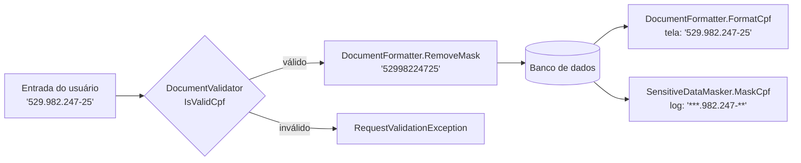

# 🔤 Texto

[⬅ Índice](README.md) · [README](../README.md)

Formatação, validação, geração e mascaramento de documentos brasileiros, além de extensões de manipulação de strings.

- [DocumentFormatter](#documentformatter)
- [MaskFormatter](#maskformatter)
- [DocumentValidator](#documentvalidator)
- [DocumentGenerator](#documentgenerator)
- [SensitiveDataMasker](#sensitivedatamasker)
- [StringExtensions](#stringextensions)
- [CNPJ alfanumérico](#cnpj-alfanumérico)



---

## DocumentFormatter

`TEC.Core.Text.Formatting` · `static class`

Aplica a máscara oficial dos documentos. Aceita valores com ou sem máscara. 💡 **Se a quantidade de caracteres não corresponder ao documento, o valor original é devolvido sem alteração** (nunca lança exceção). `null` → `""`.

| Método | Máscara | Entrada → Saída |
|---|---|---|
| `FormatCpf(string? cpf)` | `000.000.000-00` | `"12345678909"` → `"123.456.789-09"` |
| `FormatCnpj(string? cnpj)` | `AA.AAA.AAA/AAAA-00` | `"11222333000181"` → `"11.222.333/0001-81"` |
| | | `"12abc34501de35"` → `"12.ABC.345/01DE-35"` |
| `FormatCpfOrCnpj(string? document)` | CPF (11) ou CNPJ (14) | `"12345678909"` → `"123.456.789-09"` |
| `FormatCep(string? cep)` | `00000-000` | `"01310100"` → `"01310-100"` |
| `FormatPis(string? pis)` | `000.00000.00-0` | `"12345678919"` → `"123.45678.91-9"` |
| `FormatPhone(string? phone)` | conforme a quantidade de dígitos | veja abaixo |
| `RemoveMask(string? value)` | — | `"12.ABC.345/01DE-35"` → `"12ABC34501DE35"` |
| | | `"123"` (CPF inválido) → `"123"` |

`FormatPhone`:

| Dígitos | Saída |
|:---:|---|
| 8 | `"33334444"` → `"3333-4444"` |
| 9 | `"987654321"` → `"98765-4321"` |
| 10 | `"1133334444"` → `"(11) 3333-4444"` |
| 11 | `"11987654321"` → `"(11) 98765-4321"` |
| 12 (com 55) | `"551133334444"` → `"+55 (11) 3333-4444"` |
| 13 (com 55) | `"5511987654321"` → `"+55 (11) 98765-4321"` |

> `RemoveMask` mantém apenas letras e dígitos, **em maiúsculas**, e é o formato recomendado para gravar no banco.

---

## MaskFormatter

`TEC.Core.Text.Formatting` · `static class`

Máscaras genéricas. Cada `#` (`MaskFormatter.Placeholder`) é substituído pelo próximo caractere do valor; os demais caracteres da máscara são mantidos.

| Método | Descrição |
|---|---|
| `string Apply(string? value, string mask)` | Aplica a máscara. Se o valor for menor que a máscara, a formatação para no último caractere disponível. |

| Chamada | Resultado |
|---|---|
| `MaskFormatter.Apply("12345678", "#####-###")` | `"12345-678"` |
| `MaskFormatter.Apply("ABC1D23", "###-####")` | `"ABC-1D23"` (placa Mercosul) |
| `MaskFormatter.Apply("123", "#####-###")` | `"123"` |
| `MaskFormatter.Apply(null, "###")` | `""` |

---

## DocumentValidator

`TEC.Core.Text.Validation` · `static class`

Validação de documentos e dados brasileiros. Aceita valores **com ou sem máscara**, mas recusa caracteres estranhos (ex.: `"abc529.982.247-25"` → `false`). Nunca lança exceção: entradas nulas ou vazias retornam `false`.

| Método | Regras |
|---|---|
| `IsValidCpf(string? cpf)` | 11 dígitos, dígitos verificadores corretos e sem sequências repetidas (`111.111.111-11`). |
| `IsValidCnpj(string? cnpj)` | 14 caracteres. Os 12 primeiros podem ser **alfanuméricos**; os 2 verificadores são sempre numéricos. |
| `IsValidCpfOrCnpj(string? document)` | Decide pelo tamanho (11 ou 14 caracteres úteis). |
| `IsValidPis(string? pis)` | PIS/PASEP/NIT: 11 dígitos e dígito verificador correto. |
| `IsValidCep(string? cep)` | 8 dígitos, não todos iguais. |
| `IsValidPhone(string? phone)` | DDD existente (lista da Anatel); fixo com 10 dígitos (3º dígito de 2 a 5) ou celular com 11 dígitos (3º dígito = 9). Aceita o prefixo `+55`. |
| `IsValidEmail(string? email)` | Formato RFC 5321: até 254 caracteres, parte local até 64, sem pontos no início, no fim ou consecutivos, e domínio com TLD. |

| Chamada | Resultado |
|---|:---:|
| `IsValidCpf("529.982.247-25")` | `true` |
| `IsValidCpf("111.111.111-11")` | `false` |
| `IsValidCnpj("11.222.333/0001-81")` | `true` |
| `IsValidCnpj("12.ABC.345/01DE-35")` | `true` |
| `IsValidCpfOrCnpj("52998224725")` | `true` |
| `IsValidPis("120.56118.29-9")` | `true` |
| `IsValidCep("01310-100")` | `true` |
| `IsValidCep("00000000")` | `false` |
| `IsValidPhone("(11) 98765-4321")` | `true` |
| `IsValidPhone("+55 11 3333-4444")` | `true` |
| `IsValidPhone("(20) 98765-4321")` | `false` (DDD 20 não existe) |
| `IsValidPhone("(11) 88765-4321")` | `false` (celular deve começar com 9) |
| `IsValidEmail("joao.silva@empresa.com.br")` | `true` |
| `IsValidEmail("joao..silva@empresa.com")` | `false` |
| `IsValidEmail("joao@localhost")` | `false` |

> 💡 `IsValidEmail` valida só o **formato**. Para confirmar que o e-mail existe, envie um código de verificação.

---

## DocumentGenerator

`TEC.Core.Text.Generation` · `static class`

Gera documentos **matematicamente válidos, porém fictícios**, para testes e massa de dados.

> ⚠️ Não use em produção.

| Método | Descrição |
|---|---|
| `string GenerateCpf(bool formatted = false)` | CPF válido. |
| `string GenerateCnpj(bool formatted = false, bool alphanumeric = false)` | CNPJ válido de matriz (ordem `0001`), numérico ou alfanumérico. |
| `string GeneratePis(bool formatted = false)` | PIS/PASEP/NIT válido. |

| Chamada | Exemplo de saída |
|---|---|
| `GenerateCpf()` | `"07584285023"` |
| `GenerateCpf(formatted: true)` | `"123.082.460-06"` |
| `GenerateCnpj(formatted: true)` | `"24.489.831/0001-37"` |
| `GenerateCnpj(formatted: true, alphanumeric: true)` | `"EW.NB8.AE6/0001-11"` |
| `GeneratePis(formatted: true)` | `"779.74802.94-6"` |

```csharp
// TUnit
[Test]
public async Task Deve_aceitar_cpf_valido()
{
    var cpf = DocumentGenerator.GenerateCpf();
    await Assert.That(DocumentValidator.IsValidCpf(cpf)).IsTrue();
}
```

---

## SensitiveDataMasker

`TEC.Core.Text.Masking` · `static class`

Mascara dados pessoais para exibição parcial e para **logs (LGPD)**.

| Método | Descrição |
|---|---|
| `string Mask(string? value, int visibleStart = 0, int visibleEnd = 0, char maskChar = '*')` | Mascara mantendo os primeiros e/ou últimos caracteres. 🔒 Se o valor for curto demais, mascara **tudo**. Nunca deixa meio caractere visível: se a fronteira cair no meio de um par surrogate (emoji), o caractere inteiro é mascarado. `visibleStart`/`visibleEnd` negativos → `ArgumentOutOfRangeException`; `maskChar` de controle ou surrogate → `ArgumentException`. |
| `string MaskCpf(string? cpf)` | Padrão adotado pelo governo. |
| `string MaskCnpj(string? cnpj)` | Mantém o miolo do CNPJ. |
| `string MaskEmail(string? email)` | Mantém os 2 primeiros caracteres (1, se a parte local tiver até 2) e o domínio. |
| `string MaskPhone(string? phone)` | Mantém o DDD e os 4 últimos dígitos. |
| `string MaskCreditCard(string? cardNumber)` | Mantém os 4 últimos dígitos. |

| Chamada | Resultado |
|---|---|
| `Mask("123456789", 2, 2)` | `"12*****89"` |
| `Mask("abc", 2, 2)` | `"***"` |
| `Mask("senha", maskChar: '#')` | `"#####"` |
| `MaskCpf("123.456.789-09")` | `"***.456.789-**"` |
| `MaskCnpj("11.222.333/0001-81")` | `"**.222.333/****-**"` |
| `MaskEmail("joao.silva@empresa.com")` | `"jo********@empresa.com"` |
| `MaskEmail("jo@empresa.com")` | `"j*@empresa.com"` |
| `MaskPhone("(11) 98765-4321")` | `"(11) *****-4321"` |
| `MaskPhone("1133334444")` | `"(11) ****-4444"` |
| `MaskCreditCard("4111 1111 1111 1234")` | `"**** **** **** 1234"` |

```csharp
_logger.LogInformation("Cadastro recebido para {Cpf} / {Email}",
    SensitiveDataMasker.MaskCpf(dto.Cpf),
    SensitiveDataMasker.MaskEmail(dto.Email));
```

---

## StringExtensions

`TEC.Core.Text.Extensions` · métodos de extensão sobre `string?`

Todos aceitam `null` (retornam `""` ou `false`, conforme o caso), exceto quando indicado.

### Verificação e limpeza

| Método | Entrada → Saída |
|---|---|
| `bool HasValue()` | `"  "` → `false` |
| `string? NullIfWhiteSpace()` | `"  abc "` → `"abc"`; `"  "` → `null` |
| `string RemoveAccents()` | `"Ação Pública"` → `"Acao Publica"` |
| `string OnlyDigits()` | `"(11) 98765-4321"` → `"11987654321"` |
| `string OnlyLettersAndDigits()` | `"Olá, mundo! 123"` → `"Olámundo123"` |
| `string CollapseWhitespace()` | `"  a   b \t c  "` → `"a b c"` |

### Corte

| Método | Entrada → Saída |
|---|---|
| `string Truncate(int maxLength, string suffix = "...")` | `"Texto muito longo".Truncate(10)` → `"Texto m..."` |
| | `"Texto muito longo".Truncate(10, "…")` → `"Texto mui…"` |
| `string Left(int length)` | `"abcdef".Left(3)` → `"abc"` |
| `string Right(int length)` | `"abcdef".Right(2)` → `"ef"` |

> 🔒 `Truncate`, `Left` e `Right` **nunca cortam um emoji ao meio** (par surrogate). O sufixo conta dentro de `maxLength`.

### Conversão de caixa e formato

| Método | Entrada → Saída |
|---|---|
| `string ToSlug()` | `"Promoção de Verão 2026!"` → `"promocao-de-verao-2026"` |
| `string ToTitleCase()` | `"MARIA DA SILVA E SOUZA"` → `"Maria da Silva e Souza"` |
| `string ToPascalCase()` | `"nome do cliente"` → `"NomeDoCliente"` |
| `string ToCamelCase()` | `"Nome do Cliente"` → `"nomeDoCliente"` |
| `string ToSnakeCase()` | `"NomeDoCliente"` → `"nome_do_cliente"` |
| | `"HTTPServerError"` → `"http_server_error"` |
| `string ToKebabCase()` | `"NomeDoCliente"` → `"nome-do-cliente"` |

`ToTitleCase` mantém em minúsculo os conectivos do português (`a, à, as, às, o, os, e, de, da, das, do, dos, em, na, nas, no, nos, com, por, para`), exceto na primeira palavra.

### Comparação

| Método | Entrada → Saída |
|---|---|
| `bool EqualsIgnoreCaseAndAccents(string? other)` | `"JOSÉ".EqualsIgnoreCaseAndAccents("jose")` → `true` |
| `bool ContainsIgnoreCaseAndAccents(string? search)` | `"São Paulo".ContainsIgnoreCaseAndAccents("sao")` → `true` |

### Base64

| Método | Entrada → Saída |
|---|---|
| `string ToBase64()` | `"Olá"` → `"T2zDoQ=="` |
| `string FromBase64()` | `"T2zDoQ=="` → `"Olá"`; inválido → `FormatException` |
| `bool TryFromBase64(out string result)` | `"%%%"` → `false` |

> 💡 `RemoveAccents`, `EqualsIgnoreCaseAndAccents` e `ContainsIgnoreCaseAndAccents` não dependem de ICU e funcionam com `InvariantGlobalization`. `FromBase64` usa UTF-8 estrito: bytes inválidos geram erro em vez de `�`.

---

## CNPJ alfanumérico

A partir de **julho de 2026**, a Receita Federal passou a emitir CNPJs com letras nas 12 primeiras posições (ex.: `12.ABC.345/01DE-35`). O TEC.Core já suporta o novo formato em todas as operações:

| Operação | Suporte |
|---|:---:|
| `DocumentValidator.IsValidCnpj` / `IsValidCpfOrCnpj` | ✅ |
| `DocumentFormatter.FormatCnpj` / `FormatCpfOrCnpj` (converte para maiúsculas) | ✅ |
| `DocumentFormatter.RemoveMask` (mantém as letras) | ✅ |
| `SensitiveDataMasker.MaskCnpj` | ✅ |
| `DocumentGenerator.GenerateCnpj(alphanumeric: true)` | ✅ |

> ⚠️ Revise colunas de banco `BIGINT`/`NUMERIC` usadas para CNPJ: o tipo precisa ser `CHAR(14)`/`VARCHAR(14)`. Evite também `OnlyDigits()` para normalizar CNPJ. Use `DocumentFormatter.RemoveMask`.
