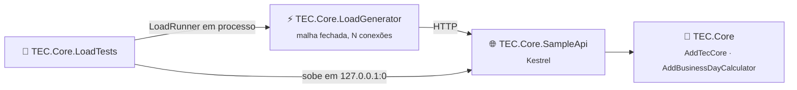

[🏠 TEC.Core](../README.md) › [📚 Documentação](../docs/README.md) › Samples

# 🧰 Samples

> Uma API de exemplo com os usos típicos do TEC.Core e um gerador de carga HTTP próprio, usados pelos testes de carga e pela linha de comando.

Os dois projetos nunca são pacote (`IsPackable=false`) e compilam em todo PR, junto com a solução. Os testes de carga (`TEC.Core.LoadTests`) usam os dois em processo, com a API em Kestrel real em `127.0.0.1`; pela linha de comando, dá para medir a API na sua máquina ou num servidor de homologação.



## 📑 Sumário

- [TEC.Core.SampleApi](#teccoresampleapi)
  - [Endpoints](#endpoints)
  - [Configuração](#configuração)
  - [Como rodar](#como-rodar)
- [TEC.Core.LoadGenerator](#teccoreloadgenerator)
  - [Opções](#opções)
  - [Cenários](#cenários)
  - [Como rodar a carga](#como-rodar-a-carga)
  - [Lendo o relatório](#lendo-o-relatório)

---

## TEC.Core.SampleApi

API ASP.NET Core (`samples/TEC.Core.SampleApi`) com os usos típicos do TEC.Core: feriados por município, vencimento em dias úteis, validação de documentos, criptografia AES-GCM, login com PBKDF2, importação e exportação de CSV e erros no envelope `ApiResponse`. Registra os serviços com `AddTecCore(options => options.PasswordHashIterations = ...)` e `AddBusinessDayCalculator(calendar)`.

### Endpoints

| Método e rota | Usa | Resposta |
|---|---|---|
| `GET /saude` | `ApiResponse.Ok` | 200 |
| `GET /feriados/{ibge}/{year}` | `HolidayCalendar.GetProvider(HolidayLocation.FromIbgeCode(...))` | Feriados nacionais, estaduais e municipais da localidade |
| `GET /dias-uteis/vencimento?ibge=&date=&term=` | `IBusinessDayCalculatorFactory` | Vencimento (`AddBusinessDays`) e dias úteis do mês (`CountBusinessDaysInMonth`) |
| `POST /documentos/validar` `{ "document": "..." }` | `DocumentValidator.IsValidCpfOrCnpj`, `DocumentFormatter.FormatCpfOrCnpj`, `SensitiveDataMasker.Mask` | Válido, formatado e mascarado; 400 sem documento |
| `POST /criptografia/protecao` `{ "text": "..." }` | `ISymmetricCryptography` (AES-GCM) | Tamanho cifrado e conferência da ida e volta; 400 sem texto ou acima de 65.536 caracteres |
| `POST /senhas/verificar` `{ "password": "..." }` | `IPasswordHasher` (PBKDF2) | 200 com a senha do exemplo; 401 nas demais |
| `POST /csv/importar` (corpo `text/csv`) | `CsvReader` com `SkipInvalidRows` e `MaxColumns = 32` | Linhas lidas, inválidas e soma dos valores; 413 acima de 1 MB |
| `GET /csv/exportar?rows=` | `ICsvWriter` em streaming | CSV de 1 a 10.000 linhas; 400 fora da faixa |

Corpos e respostas (JSON em camelCase, `JsonDefaults.Options`):

| Rota | Tipo de entrada | Tipo de saída (`data` do `ApiResponse`) |
|---|---|---|
| `GET /dias-uteis/vencimento` | query `ibge`, `date` (`yyyy-MM-dd`), `term` | `DueDateResponse` → `{ "dueDate", "businessDaysInMonth" }` |
| `POST /documentos/validar` | `DocumentRequest` → `{ "document" }` | `DocumentResponse` → `{ "isValid", "formatted", "masked" }` |
| `POST /criptografia/protecao` | `TextRequest` → `{ "text" }` | `ProtectionResponse` → `{ "encryptedLength", "roundTripMatches" }` |
| `POST /senhas/verificar` | `PasswordRequest` → `{ "password" }` | — (mensagem) |
| `POST /csv/importar` / `GET /csv/exportar` | `OrderCsvRow` com cabeçalho `Numero;Cliente;Data;Valor` / query `rows` | `ImportResponse` → `{ "rows", "invalidRows", "total" }` / CSV |

```bash
curl -s -X POST http://127.0.0.1:5000/documentos/validar -H "Content-Type: application/json" -d '{"document":"529.982.247-25"}'
# 200, com "data": {"isValid":true,"formatted":"529.982.247-25","masked":"529*********25"}
```

Erros passam por um middleware: `AppException` vira o `ApiResponse` correspondente (`FromException`); `ArgumentException`, `FormatException`, `CsvException` e `BadHttpRequestException` viram 400 genérico (corpo acima de 1 MB no import responde com status HTTP 413); o resto vira 500 sem detalhes.

Os dados são sintéticos: os feriados nacionais calculados de 2026 e, por UF, um feriado estadual e dois por município. Os códigos IBGE sintéticos seguem o formato `UF × 100.000 + 10 + índice` (ex.: `3500010` é o primeiro município sintético de SP).

### Configuração

Lida do `appsettings`, de variáveis de ambiente ou da linha de comando (`--Exemplo:IteracoesSenha 600000`).

| Configuração | Padrão | Efeito |
|---|---|---|
| `Exemplo:MunicipiosPorUf` | `200` | Tamanho do calendário de feriados (~10,8 mil feriados com o padrão) |
| `Exemplo:IteracoesSenha` | `100000` | Iterações do PBKDF2 do cenário de login (mínimo aceito pelo TEC.Core: 100.000; padrão de produção: 600.000) |

> [!WARNING]
> A chave AES e o hash da senha do exemplo são gerados na inicialização, apenas para demonstração. Em produção, a chave vem de um cofre de segredos (veja [segurança](../docs/seguranca.md)).

### Como rodar

```bash
# Release, porta fixa
dotnet run -c Release --project samples/TEC.Core.SampleApi -f net10.0 -- --urls http://127.0.0.1:5000

# Login com PBKDF2 de produção
dotnet run -c Release --project samples/TEC.Core.SampleApi -f net10.0 -- --urls http://127.0.0.1:5000 --Exemplo:IteracoesSenha 600000
```

Sem `--urls`, o perfil de `Properties/launchSettings.json` sobe em `https://localhost:64344` e `http://localhost:64345` (ambiente `Development`).

---

## TEC.Core.LoadGenerator

Gerador de carga HTTP próprio (`samples/TEC.Core.LoadGenerator`), sem licença nem binário externo, em malha fechada: cada conexão envia uma requisição, espera a resposta inteira e envia a próxima. Mede RPS, latência (média, p50, p95, p99, máximo) e erros por cenário. Depende só do TEC.Core (`DocumentGenerator`, para gerar CPFs e CNPJs válidos). Os testes de carga usam a classe `LoadRunner` em processo.

### Opções

| Opção | Padrão | Descrição |
|---|---|---|
| `--url <endereço>` | — (obrigatório) | Endereço base da API |
| `--duracao <s>` | `30` | Segundos medidos |
| `--aquecimento <s>` | `5` | Segundos iniciais fora das estatísticas (JIT, pools de conexão, caches) |
| `--concorrencia <n>` | `32` | Conexões simultâneas (workers) |
| `--cenarios <lista>` | mistura padrão | Cenários e pesos: `feriados,documento:50,senha:5` |
| `--semente <n>` | `2026` | Semente dos sorteios (execuções reproduzíveis) |
| `--max-erro <fração>` | `0.01` | Taxa de erro máxima para sair com código `0` |
| `--max-p95 <ms>` | — | Latência p95 máxima para sair com código `0` |
| `--json <arquivo>` | — | Grava o relatório em JSON |
| `--ajuda` | — | Mostra a ajuda e sai com `0` |

Códigos de saída: `0` dentro dos limites, `1` limite violado (taxa de erro, p95 ou nenhuma requisição concluída), `2` argumentos inválidos ou `--url` ausente. Ctrl+C interrompe a carga e imprime o relatório parcial.

### Cenários

| Cenário | Peso padrão | Requisição | Status esperado |
|---|---:|---|:---:|
| `feriados` | 30 | `GET /feriados/{ibge aleatório}/2026` | 200 |
| `vencimento` | 25 | `GET /dias-uteis/vencimento` com `date` e `term` (1 a 59) aleatórios | 200 |
| `documento` | 20 | `POST /documentos/validar` com CPF ou CNPJ (inclusive alfanumérico) válidos | 200 |
| `protecao` | 10 | `POST /criptografia/protecao` com 64 a 2.047 caracteres | 200 |
| `csv-exportar` | 5 | `GET /csv/exportar?rows=500` | 200 |
| `csv-importar` | 5 | `POST /csv/importar` com 200 linhas válidas e 1 inválida | 200 |
| `erro-validacao` | 5 | `POST /documentos/validar` sem documento (caminho de erro) | 400 |
| `senha` | 0 (ligue com `--cenarios`) | `POST /senhas/verificar` com senha errada (PBKDF2, uso intenso de CPU) | 401 |

Em `--cenarios`, um cenário sem peso usa o peso padrão (mínimo 1). Uma resposta com status diferente do esperado, ou uma falha de conexão ou timeout (30 s), conta como erro.

### Como rodar a carga

```bash
# Terminal 1: a API (veja "Como rodar" acima)
dotnet run -c Release --project samples/TEC.Core.SampleApi -f net10.0 -- --urls http://127.0.0.1:5000

# Terminal 2: 60 s com 64 conexões, falhando se a taxa de erro passar de 0,1% ou o p95 de 50 ms
dotnet run -c Release --project samples/TEC.Core.LoadGenerator -f net10.0 -- \
  --url http://127.0.0.1:5000 --duracao 60 --concorrencia 64 --max-erro 0.001 --max-p95 50 --json relatorio.json

# Só login e consultas, por 30 s
dotnet run -c Release --project samples/TEC.Core.LoadGenerator -f net10.0 -- --url http://127.0.0.1:5000 --cenarios "senha,feriados" --duracao 30
```

> [!IMPORTANT]
> Rode o gerador e a API em máquinas diferentes para medir só a API: na mesma máquina, os dois disputam a CPU. Gere carga apenas contra ambientes seus ou com autorização: tráfego intenso contra terceiros é ataque de negação de serviço.

### Lendo o relatório

```text
Duração: 10.0 s · concorrência: 64 · requisições: 336410 · RPS: 33641 · erros: 0 (0.00 %)
Latência (ms): média 1.9 · p50 0.7 · p95 7.3 · p99 19.7 · máx 106.9
| Cenário | Requisições | Erros | p50 (ms) | p95 (ms) | p99 (ms) | máx (ms) |
|---|---:|---:|---:|---:|---:|---:|
| feriados | 99856 | 0 | 1.0 | 6.2 | 16.3 | 105.5 |
...
```

- **RPS** é a vazão na janela medida (sem o aquecimento). Em malha fechada, mais conexões aumentam o RPS até a saturação; depois disso só aumentam a latência.
- **p95/p99** mostram a cauda: é o que o usuário mais lento sente. Compare execuções com a mesma concorrência e duração.
- **Erros** listam a causa (`HTTP 500`, `HttpRequestException`, `TaskCanceledException` para timeout, `IOException`).

---

[⬆ Voltar ao topo](#-samples) · [🏠 README](../README.md) · [📚 Documentação](../docs/README.md) · [🧪 Testes](../docs/testes.md)
